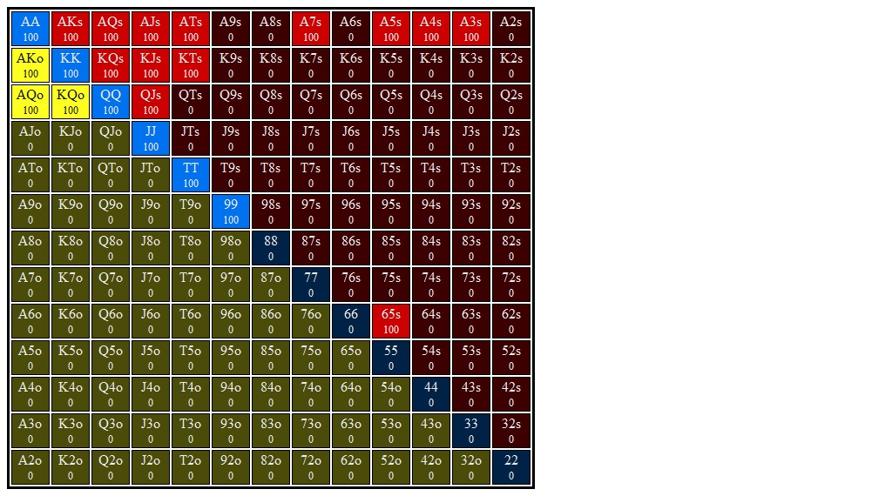

# Section 1: Lojack opens, Bn 3Bets, and Lojack Calls

Blinds are $0.05/$0.10. Effective stacks are $10.00. You're in the LJ and you open for $0.30 (3bb). Action folds to the BN who 3Bets you to $0.90, a 3x raise. SB and BB both fold, and action is back to you. You call from out of position and go to the flop with $9.10 behind and a pot of $1.95. Action is on you.
### Player Ranges

#### Hero's Lojack OOP 3Bet Call Range Range

#### Villain's Button 3Bet Range vs Lojack Open Range

### Flop 1: <b>A&spades;T&diams;5&clubs;</b>
1. **Approximate each player's equity. Who has the equity advantage?**

   The BN has very strong equity advantage. They have double to triple
   our Ax, and must stronger Ax to boot. They also have more strong
   pocket pairs (JJ-KK, plus AA for top set). Our range has a lot
   of KXs and JTs.

   I'd say villain has a 58% equity advantage.

   + **From the solver:** We have about 43% equity vs 57% equity.

2. **What are the weakest hands in your range that could go all in on the flop? Go for three streets of value on blank turns?**

    SPR is 9x, and top pair probably doesn't want to get in here, especially
    since our strongest, AQo, is dominated by a LOT of their range, and might
    just be fighting to split.

    A&clubs;T&clubs; and A&hearts;T&hearts; both are ready to go all in.
    We might be willing to shove (but not call off) with K&spades;Q&spades;
    since we have a backdoor nut flush draw, a gutter, and some fold equity.

    I think that hands like AT and TT play as a x/r, and if villain
    reraises we are happy to get it in. I also think that some KQs and KJs with
    a strong flush draw get it in here as well, as long as we can shove w/
    some fold equity.

    + **From the solver:** We are willing to call a shove with any 2pair and
      and some AQo combos. It looks like we fold a bit more with AxQ&spades;,
      and I assume that one of the main bluffs we want to catch are like
      K&spades;Q&spades; and Q&spades;J&spades;, which we are blocking.

3. **Which player has the nuts advantage?**

    Bn has the clear nut advantage. They have AA, TT, AT, AK.

    + **From the solver:** we actually have more 2pair (9.2% vs 4%) and sets
      (6.9% vs 6%) in our range. However, we have has less top pair (17% vs 36%)
      and villain has full AK which outkicks our AQ. Villain also has AA and we
      do not. Still, we are nuttier than I thought.

4. **How static or dynamic is this flop? What aspects of this flop make it more static or dynamic?  How do these aspects interact with one another?**

    This is a very static flop. Some turn cards make straights, but I think
    that AK can play for stacks on most runouts, as can AT (for the LJ)

5. **What are some hands that prefer to check/fold?**

   Supposing a 1/3 pot bet, KQ, KJ with no backdoor flush draw, and probably
   some with a flush draw, will want to fold.

   + **From the solver:** Some KQ, KJ (mainly hearts) fold, but JJ, 99, and 88
     are all pure folds.

6. **What are some hands that prefer to check/call?**

    Supposing a 1/3 pot bet, I think that KTs with a backdoor flush draw wants
    to call.  Any top pair wants to call. 88-99, JJ probably want to call, but
    we _could_ add 88 as a bluff sometimes.

    + **From the solver:** Pure calls: AQo and AJs are just about pure
      calls, though A&hearts;J&hearts; x/r's about 50%.
      
      KQs mixes calls and folds. K&hearts;Q&hearts; folds most of the time,
      while the other combos (all w/ BDFDs) fold between 20% and 40% of the
      time.

      We also x/c some of our twopair to protect our x/c range.

7. **What are some hands that prefer to check/raise?**

    TT, AT, A5, KQs or KJs w/ a backdoor flush draw (but mixed, not pure).

    + **From the solver:** TT is a pure raise, AT and A5 are both mixed.
      KQs is either a call or a fold, and shouldn't be raising much. KJs
      raises a bit more (fold/call/raise percent is 43/25/32).

      Interestingly, JT and KT both x/r pretty frequently. J&hearts;T&hearts;
      mixes folds and raises while the other two combos (&spades; and &clubs;)
      mix calls and raises. KT works similarly (fewer folds for the &hearts;
      combo)

      I think these should be viewed as semi-bluffs that are nutty on T runouts
      and have some equity on K or J runouts, not to mention the backdoor flush
      equity.

8. **Do any hands ever donk? If so, which ones?**

    We check full range here.

    + **From the solver:** Yes, we should donk 1/2 pot about 22% of the time.
      We want to donk with TT and AT/A5. To balance this out we also donk some
      draws (KQs, KJs, especially w/ BDFD), and some top pair (AQo, AJs).
      
      The only hands that never lead out are 88, 99, JJ. These hands have
      some showdown value so they don't benefit from bluffs or growing the pot.
      They'd prefer to get to showdown cheap, or possibly hit a set on the
      turn.

      + **Value Hands:** Any of our donked Ax are ahead when called, with
        at least 50% pot equity before going to the turn. TT has about 88%
        equity.

      + **Bluffs:** Hands that don't want to be called include KQs, KJs. There
        are some middle/weak pairs that also lead out, including 88 (very
        infrequently), JT, and KT. These also prefer to take the pot down. 

        These weak pairs seem to operate like semi-bluffs. For instance,
        J&clubs;T&clubs; is drawing to trips on a T board, and to a straight or
        flush draw on 8/9/Q/K and club turns respectively. But this hand
        continues firing even on blank turns, say 2, 3, or 4 of diamonds. We
        prefer to bet less on spade turns for some reason, J&clubs;T&clubs;
        still continues at some frequency here. This hand is prepared to triple
        barrel.  For instance, on a 4&diams; turn, J&clubs;T&clubs; is prepared
        to shove on just about any river card, save J&diams; which is a pure
        check.

        One thing I don't get: why does J&clubs;T&clubs; go so hard after
        diamond draws but not spade draws? Even J&spades;T&spades; bets more on
        diamond turns than spade turns. Looking at K&clubs;T&clubs;, it looks
        like we bet more aggresively on spade turns than diamond turns.
        I'm guessing there is some subtle blocking thing happening here. I guess
        we block A&clubs;K&clubs;, which is nice. But JTs blocks AJ as well...

        Looking at a line like donk 1/2 pot flop, bn call, turn: 4&spades;,
        continue 1/3 pot, bn folds out 80% of AJ and calls off with 100% of AK.
        So this makes sense...we are blocking some of their calls and
        unblocking some of their folds.

        I'm still unsure about what the difference is between spade and diamond
        draws here wrt JTs, but I won't worry for now...we aren't in a very
        common node of the game tree.

9. **Suppose you check and villain checks behind. What are the best and worst turn cards for your range? Do any give you an equity advantage? A nuts advantage? Uncap your range?**

    I think maybe a J? We are checking a lot of KQ, KJ, JT. We also
    have 88, which BN doesn't, so seeing an 8 might give us bottom
    set, but I don't think that this is enough to benefit us too too much.

    If they are checkign at all they are probably checking some weaker Ax or
    KT, made hands that don't want to grow the pot. Therefore random low cards
    (7, 5, 4, 3) that connect with their suited aces, as well as K, might be
    bad for our range. They are checking KK and QQ sometimes as well, I assume,
    so any K or Q is probably bad for our range.

    No cards give us an equity or nuts advantage.

    A J uncaps our range somewhat by allowing straights, some 2p, and some sets.

    + **From the solver:**
      + **Best Turns:** Since we are checking back our 88 and 99, these are very
        good for us; any 8 gives us an EV of about $0.94 in a pot of $1.90  (so
        1/2 pot OOP w/ a capped range), and a 9 gives us an EV of about $0.82,
        which is still not bad given our situation. T&spades; is okay for us,
        giving us EV=$0.75

      + **Worst Turns:** We really don't want to see any K, and lower cards (3,
        4, 5, 7) that kinda bad for us as well.

      + **Takeaway:** So the reason an 8 is so good for us is that it ONLY
        helps our range and NEVER helps their range. Since we went x/x ranges
        went to the turn relatively condensed, and the 8 lets us uncap our
        range without letting them uncap their range. This lets us bet a larger
        polarized range (38%) than, say, a blank card like a 2&hearts; (15%)

10. **Suppose you check, villain bets 1/3 pot, and you call. What are the best and worst turn cards for your range? Do any give you an equity advantage? A nuts advantage? Uncap your range?**

    If we call we probably have some showdown value, but we might be calling
    with some stronger draws (so in our case, we might be calling with
    like K&spades;Q&spades; or K&diams;J&diams;, etc...I think we prefer to
    x/r these, but we should be mixing x/c (maybe even 50/50), and maybe even
    some x/f).
    
    Anyway, a Q or a J that brings in the back door flush draw would be very
    nice because this will allow us to be nutty AND to have some natural bluffs.

    WRT showdown value, I think we x/c with most of our Ax and Tx, so an A or
    T should at least serve to uncap our range. villain still has the literal
    nuts (AA) when an A comes and TT when a T comes, but combos are cut down
    significantly.

    + **From the solver:**
        Assuming a $0.64 bet into a pot of $1.95, we got to the turn with
        a pot of **$3.23** Our average EV after a call is $1.72, just over
        half pot. We significantly overrealize our 43% equity here
      + **Best Turns:** Any K is good for us. We also likte to see a 9, even
        though it doesn't connect with our range at all...I'm guessing this is
        because it's a blank, misses both of our ranges, and since we have such
        a strong range we don't mind keeping things static.

        Any 5 is good, but non-spade is preferred.

        After that, we don't mind seeing just about any low card, though we
        prefer non-spade cards.

      + **Worst Turns:** We _really_ don't want to see an A, Q or T

#### Hands for flop A&spades;T&diams;5&clubs;
1. <b>A&hearts;5&hearts;</b>    (Flop: A&spades;T&diams;5&clubs;)

    1. **Do you ever check/fold this hand?**

        No.

    2. **Do you ever check/call this hand?**

        Yes.

    3. **If you check/raise this hand should you expect better hands to fold? If so, which hands?**

        No.

    4. **If you check/raise this hand should you expect worse hands to call? If so, which hands?**

        Yes, AK, AQ, AJ, some draws like KQ, etc

    5. **Does this hand ever donk bet 1/2 pot?**

        Yes.

    6. **Does this hand benefit from protection bet?**

        No.

    7. **Does this hand benefit from growing the pot?**

        Somewhat. It's strong but ranges are narrow and there are sets out
        there. We are comfortable playing a medium sized pot I think, but we
        are strong enough to call down (AK might play for stacks, for
        instance).

    8. **How is this hand doing if you check/raise and get called? What parts of villain's range are you ahead of? Behind?**

        We are doing fine. We are ahead of their AK, AQ, AJ, and draws. We get
        called by AT, TT, AA (do these reraise? maybe)

    9. **How is this hand doing against a bet or raise when you check or bet respectively?**

        If we bet villain shouldn't be raising much. If they do, I expect them
        to be polarized around us (at equilibrium) so we are in a tough spot.
        We might be splitting w/ their A5, so we could be just barely +EV on a
        call. If we check and villain bets, we are happy to raise or call
        and we are doing fine.

    10. **Suppose you check the flop and villain checks behind. What are the best and worst turn cards for this hand?**

        + **Best Turn Cards:** Any A that also brings in some flush draws. We
          are also happy to see a 5 (also bringing in a flush draw)

        + **Worst Turn Cards:** We don't want to see a T, and we don't really
          want to see a K or Q w/ a flush draw suit, since that might open up
          villain's semi-bluffing range and they could possibly get pretty
          aggressive on some rivers and put us in some tough spots. We should
          be ahead of their range and we don't want to see cards that shake
          that up.

        + **From The Solver:**
          + **Best Turns:**
          + **Worst Turns:**

    11. **Suppose you check the flop, villain bets 1/3 pot, and and you call behind. What are the best and worst turn cards for this hand?**

        + **Best turns:**

            Villain should be betting a wide range, but maybe checking  some of
            their marginal showdown hands. They will be betting most of their
            sets and 2pair. AA has us drawing almost dead (save for a 55
            runout), TT has us drawing pretty thin...a 5 gives them a better
            boat, but an A gives us the over-boat; 55 runouts still give us the
            nuts.

            A 5 helps us against AT, their only 2pair. Against their non-nutted
            hands like AK, AQ, AJ, we are _very_ happy to see an A, and this
            more than makes up for the reverse implied odds of the top of their
            range.  AK is probably getting it in by the river on an A turn and
            they are drawing very thin against us.

            A 5 is great for our equity but might scare villain's hands away
            from betting too hard. Still, a 5 bringing in a backdoor flush draw
            is good for our EV, and I put it right behind an A.  Other than
            that, we want to mainly see blank turns. A 3, or 4 are good...they
            mainly don't change equity advantages between ranges, but do
            occasionally set up a cooler against one of Bn's A3s or A4s, etc.

        + **Worst Turns:**

            We don't want to see a K, Q, J. These make straights and better
            2pair for villain. If the suit matches a board card this is extra
            bad for us because they are going to have a lot of flush draws that
            they can play aggressively

            A 9 connects with their 99 and can make a set, but this is a small
            part of their range (like 7% or 8% of their range).

        + **From the solver:**

          Yeah, pretty much what I said. A or 5 are good, low cards are
          good as well. I think I forgot to mention that a 6 might make some
          2pair for villain which we can get paid by.

          T,J,K,Q are bad for us. I didn't mention T, but it gives them trips
          a lot and that's bad for us.

2. <b>J&spades;T&spades;</b>    (Flop: A&spades;T&diams;5&clubs;)

    1. **Do you ever check/fold this hand?**

        No. We have middle pair (so some showdown), and backdoor flush/straight
        draws.

    2. **Do you ever check/call this hand?**

        Yes, though I might hazard a check/raise instead?

    3. **If you check/raise this hand should you expect better hands to fold? If so, which hands?**

        No.

    4. **If you check/raise this hand should you expect worse hands to call? If so, which hands?**

        Some draws, but not really. We don't expect to be ahead.

    5. **Does this hand ever donk bet 1/2 pot?**

        Yes, as a bluff.

    6. **Does this hand benefit from protection bet?**

        In theory, though I dont know if we ever get villain to fold like KQ or
        KJ here.

    7. **Does this hand benefit from growing the pot?**

        No.

    8. **How is this hand doing if you check/raise and get called? What parts of villain's range are you ahead of? Behind?**

        Pretty bad. We are behind most of their range. They are calling with
        top pairs, two pairs, some sets. They should also call with like KQs, KJs
        with BDFD, so we are ahead of a bit of their calling range.

    9. **How is this hand doing against a bet or raise when you check or bet respectively?**

        This hand doesn't want to see any aggression. This hand is going
        to be betting as a bluff or trying to get to showdown for cheap.

    10. **Suppose you check the flop and villain checks behind. What are the best and worst turn cards for this hand?**

        Any T or J are good for us. If we do see a Q or a K we have a gutter
        BUT villain's range has improved drastically so it's a double edge
        sword...most/all of their unpaired hands have improved as well.

        We are probably fine seeing a lower card (not a 9 or 5). We might
        be okay seeing a 5 since that uncaps our range, which will be good
        for bluffing (which is why we have this hand).

        We also pick up some equity/EV w/ a spade. Interesting: if we see,
        say, K&spades; villian makes a lot of pair/2pair which limits our
        

    11. **Suppose you check the flop, villain bets 1/3 pot, and and you call behind. What are the best and worst turn cards for this hand?**

3. <b>K&clubs;T&clubs;</b>    (Flop: A&spades;T&diams;5&clubs;)

    1. **Do you ever check/fold this hand?**

    2. **Do you ever check/call this hand?**

    3. **If you check/raise this hand should you expect better hands to fold? If so, which hands?**

    4. **If you check/raise this hand should you expect worse hands to call? If so, which hands?**

    5. **Does this hand ever donk bet 1/2 pot?**

    6. **Does this hand benefit from protection bet?**

    7. **Does this hand benefit from growing the pot?**

    8. **How is this hand doing if you check/raise and get called? What parts of villain's range are you ahead of? Behind?**

    9. **How is this hand doing against a bet or raise when you check or bet respectively?**

    10. **Suppose you check the flop and villain checks behind. What are the best and worst turn cards for this hand?**

    11. **Suppose you check the flop, villain bets 1/3 pot, and and you call behind. What are the best and worst turn cards for this hand?**

4. <b>A&hearts;Q&spades;</b>    (Flop: A&spades;T&diams;5&clubs;)

    1. **Do you ever check/fold this hand?**

    2. **Do you ever check/call this hand?**

    3. **If you check/raise this hand should you expect better hands to fold? If so, which hands?**

    4. **If you check/raise this hand should you expect worse hands to call? If so, which hands?**

    5. **Does this hand ever donk bet 1/2 pot?**

    6. **Does this hand benefit from protection bet?**

    7. **Does this hand benefit from growing the pot?**

    8. **How is this hand doing if you check/raise and get called? What parts of villain's range are you ahead of? Behind?**

    9. **How is this hand doing against a bet or raise when you check or bet respectively?**

    10. **Suppose you check the flop and villain checks behind. What are the best and worst turn cards for this hand?**

    11. **Suppose you check the flop, villain bets 1/3 pot, and and you call behind. What are the best and worst turn cards for this hand?**

5. <b>A&hearts;T&hearts;</b>    (Flop: A&spades;T&diams;5&clubs;)

    1. **Do you ever check/fold this hand?**

    2. **Do you ever check/call this hand?**

    3. **If you check/raise this hand should you expect better hands to fold? If so, which hands?**

    4. **If you check/raise this hand should you expect worse hands to call? If so, which hands?**

    5. **Does this hand ever donk bet 1/2 pot?**

    6. **Does this hand benefit from protection bet?**

    7. **Does this hand benefit from growing the pot?**

    8. **How is this hand doing if you check/raise and get called? What parts of villain's range are you ahead of? Behind?**

    9. **How is this hand doing against a bet or raise when you check or bet respectively?**

    10. **Suppose you check the flop and villain checks behind. What are the best and worst turn cards for this hand?**

    11. **Suppose you check the flop, villain bets 1/3 pot, and and you call behind. What are the best and worst turn cards for this hand?**

6. <b>A&diams;J&diams;</b>    (Flop: A&spades;T&diams;5&clubs;)

    1. **Do you ever check/fold this hand?**

    2. **Do you ever check/call this hand?**

    3. **If you check/raise this hand should you expect better hands to fold? If so, which hands?**

    4. **If you check/raise this hand should you expect worse hands to call? If so, which hands?**

    5. **Does this hand ever donk bet 1/2 pot?**

    6. **Does this hand benefit from protection bet?**

    7. **Does this hand benefit from growing the pot?**

    8. **How is this hand doing if you check/raise and get called? What parts of villain's range are you ahead of? Behind?**

    9. **How is this hand doing against a bet or raise when you check or bet respectively?**

    10. **Suppose you check the flop and villain checks behind. What are the best and worst turn cards for this hand?**

    11. **Suppose you check the flop, villain bets 1/3 pot, and and you call behind. What are the best and worst turn cards for this hand?**

7. <b>K&hearts;J&hearts;</b>    (Flop: A&spades;T&diams;5&clubs;)

    1. **Do you ever check/fold this hand?**

    2. **Do you ever check/call this hand?**

    3. **If you check/raise this hand should you expect better hands to fold? If so, which hands?**

    4. **If you check/raise this hand should you expect worse hands to call? If so, which hands?**

    5. **Does this hand ever donk bet 1/2 pot?**

    6. **Does this hand benefit from protection bet?**

    7. **Does this hand benefit from growing the pot?**

    8. **How is this hand doing if you check/raise and get called? What parts of villain's range are you ahead of? Behind?**

    9. **How is this hand doing against a bet or raise when you check or bet respectively?**

    10. **Suppose you check the flop and villain checks behind. What are the best and worst turn cards for this hand?**

    11. **Suppose you check the flop, villain bets 1/3 pot, and and you call behind. What are the best and worst turn cards for this hand?**

8. <b>8&spades;8&clubs;</b>    (Flop: A&spades;T&diams;5&clubs;)

    1. **Do you ever check/fold this hand?**

    2. **Do you ever check/call this hand?**

    3. **If you check/raise this hand should you expect better hands to fold? If so, which hands?**

    4. **If you check/raise this hand should you expect worse hands to call? If so, which hands?**

    5. **Does this hand ever donk bet 1/2 pot?**

    6. **Does this hand benefit from protection bet?**

    7. **Does this hand benefit from growing the pot?**

    8. **How is this hand doing if you check/raise and get called? What parts of villain's range are you ahead of? Behind?**

    9. **How is this hand doing against a bet or raise when you check or bet respectively?**

    10. **Suppose you check the flop and villain checks behind. What are the best and worst turn cards for this hand?**

    11. **Suppose you check the flop, villain bets 1/3 pot, and and you call behind. What are the best and worst turn cards for this hand?**

9. <b>K&hearts;Q&hearts;</b>    (Flop: A&spades;T&diams;5&clubs;)

    1. **Do you ever check/fold this hand?**

    2. **Do you ever check/call this hand?**

    3. **If you check/raise this hand should you expect better hands to fold? If so, which hands?**

    4. **If you check/raise this hand should you expect worse hands to call? If so, which hands?**

    5. **Does this hand ever donk bet 1/2 pot?**

    6. **Does this hand benefit from protection bet?**

    7. **Does this hand benefit from growing the pot?**

    8. **How is this hand doing if you check/raise and get called? What parts of villain's range are you ahead of? Behind?**

    9. **How is this hand doing against a bet or raise when you check or bet respectively?**

    10. **Suppose you check the flop and villain checks behind. What are the best and worst turn cards for this hand?**

    11. **Suppose you check the flop, villain bets 1/3 pot, and and you call behind. What are the best and worst turn cards for this hand?**

10. <b>9&hearts;9&diams;</b>    (Flop: A&spades;T&diams;5&clubs;)

    1. **Do you ever check/fold this hand?**

    2. **Do you ever check/call this hand?**

    3. **If you check/raise this hand should you expect better hands to fold? If so, which hands?**

    4. **If you check/raise this hand should you expect worse hands to call? If so, which hands?**

    5. **Does this hand ever donk bet 1/2 pot?**

    6. **Does this hand benefit from protection bet?**

    7. **Does this hand benefit from growing the pot?**

    8. **How is this hand doing if you check/raise and get called? What parts of villain's range are you ahead of? Behind?**

    9. **How is this hand doing against a bet or raise when you check or bet respectively?**

    10. **Suppose you check the flop and villain checks behind. What are the best and worst turn cards for this hand?**

    11. **Suppose you check the flop, villain bets 1/3 pot, and and you call behind. What are the best and worst turn cards for this hand?**

### Flop 2: <b>T&spades;4&spades;2&spades;</b>
1. **Approximate each player's equity. Who has the equity advantage?**

2. **What are the weakest hands in your range that could go all in on the flop? Go for three streets of value on blank turns?**

3. **Which player has the nuts advantage?**

4. **How static or dynamic is this flop? What aspects of this flop make it more static or dynamic?  How do these aspects interact with one another?**

5. **What are some hands that prefer to check/fold?**

6. **What are some hands that prefer to check/call?**

7. **What are some hands that prefer to check/raise?**

8. **Do any hands ever donk? If so, which ones?**

9. **Suppose you check and villain checks behind. What are the best and worst turn cards for your range? Do any give you an equity advantage? A nuts advantage? Uncap your range?**

10. **Suppose you check, villain bets 1/3 pot, and you call. What are the best and worst turn cards for your range? Do any give you an equity advantage? A nuts advantage? Uncap your range?**

#### Hands for flop T&spades;4&spades;2&spades;
1. <b>A&clubs;5&clubs;</b>    (Flop: T&spades;4&spades;2&spades;)

    1. **Do you ever check/fold this hand?**

    2. **Do you ever check/call this hand?**

    3. **If you check/raise this hand should you expect better hands to fold? If so, which hands?**

    4. **If you check/raise this hand should you expect worse hands to call? If so, which hands?**

    5. **Does this hand ever donk bet 1/2 pot?**

    6. **Does this hand benefit from protection bet?**

    7. **Does this hand benefit from growing the pot?**

    8. **How is this hand doing if you check/raise and get called? What parts of villain's range are you ahead of? Behind?**

    9. **How is this hand doing against a bet or raise when you check or bet respectively?**

    10. **Suppose you check the flop and villain checks behind. What are the best and worst turn cards for this hand?**

    11. **Suppose you check the flop, villain bets 1/3 pot, and and you call behind. What are the best and worst turn cards for this hand?**

2. <b>A&diams;J&diams;</b>    (Flop: T&spades;4&spades;2&spades;)

    1. **Do you ever check/fold this hand?**

    2. **Do you ever check/call this hand?**

    3. **If you check/raise this hand should you expect better hands to fold? If so, which hands?**

    4. **If you check/raise this hand should you expect worse hands to call? If so, which hands?**

    5. **Does this hand ever donk bet 1/2 pot?**

    6. **Does this hand benefit from protection bet?**

    7. **Does this hand benefit from growing the pot?**

    8. **How is this hand doing if you check/raise and get called? What parts of villain's range are you ahead of? Behind?**

    9. **How is this hand doing against a bet or raise when you check or bet respectively?**

    10. **Suppose you check the flop and villain checks behind. What are the best and worst turn cards for this hand?**

    11. **Suppose you check the flop, villain bets 1/3 pot, and and you call behind. What are the best and worst turn cards for this hand?**

3. <b>K&diams;T&diams;</b>    (Flop: T&spades;4&spades;2&spades;)

    1. **Do you ever check/fold this hand?**

    2. **Do you ever check/call this hand?**

    3. **If you check/raise this hand should you expect better hands to fold? If so, which hands?**

    4. **If you check/raise this hand should you expect worse hands to call? If so, which hands?**

    5. **Does this hand ever donk bet 1/2 pot?**

    6. **Does this hand benefit from protection bet?**

    7. **Does this hand benefit from growing the pot?**

    8. **How is this hand doing if you check/raise and get called? What parts of villain's range are you ahead of? Behind?**

    9. **How is this hand doing against a bet or raise when you check or bet respectively?**

    10. **Suppose you check the flop and villain checks behind. What are the best and worst turn cards for this hand?**

    11. **Suppose you check the flop, villain bets 1/3 pot, and and you call behind. What are the best and worst turn cards for this hand?**

4. <b>K&hearts;J&hearts;</b>    (Flop: T&spades;4&spades;2&spades;)

    1. **Do you ever check/fold this hand?**

    2. **Do you ever check/call this hand?**

    3. **If you check/raise this hand should you expect better hands to fold? If so, which hands?**

    4. **If you check/raise this hand should you expect worse hands to call? If so, which hands?**

    5. **Does this hand ever donk bet 1/2 pot?**

    6. **Does this hand benefit from protection bet?**

    7. **Does this hand benefit from growing the pot?**

    8. **How is this hand doing if you check/raise and get called? What parts of villain's range are you ahead of? Behind?**

    9. **How is this hand doing against a bet or raise when you check or bet respectively?**

    10. **Suppose you check the flop and villain checks behind. What are the best and worst turn cards for this hand?**

    11. **Suppose you check the flop, villain bets 1/3 pot, and and you call behind. What are the best and worst turn cards for this hand?**

5. <b>8&spades;8&clubs;</b>    (Flop: T&spades;4&spades;2&spades;)

    1. **Do you ever check/fold this hand?**

    2. **Do you ever check/call this hand?**

    3. **If you check/raise this hand should you expect better hands to fold? If so, which hands?**

    4. **If you check/raise this hand should you expect worse hands to call? If so, which hands?**

    5. **Does this hand ever donk bet 1/2 pot?**

    6. **Does this hand benefit from protection bet?**

    7. **Does this hand benefit from growing the pot?**

    8. **How is this hand doing if you check/raise and get called? What parts of villain's range are you ahead of? Behind?**

    9. **How is this hand doing against a bet or raise when you check or bet respectively?**

    10. **Suppose you check the flop and villain checks behind. What are the best and worst turn cards for this hand?**

    11. **Suppose you check the flop, villain bets 1/3 pot, and and you call behind. What are the best and worst turn cards for this hand?**

6. <b>A&diams;T&diams;</b>    (Flop: T&spades;4&spades;2&spades;)

    1. **Do you ever check/fold this hand?**

    2. **Do you ever check/call this hand?**

    3. **If you check/raise this hand should you expect better hands to fold? If so, which hands?**

    4. **If you check/raise this hand should you expect worse hands to call? If so, which hands?**

    5. **Does this hand ever donk bet 1/2 pot?**

    6. **Does this hand benefit from protection bet?**

    7. **Does this hand benefit from growing the pot?**

    8. **How is this hand doing if you check/raise and get called? What parts of villain's range are you ahead of? Behind?**

    9. **How is this hand doing against a bet or raise when you check or bet respectively?**

    10. **Suppose you check the flop and villain checks behind. What are the best and worst turn cards for this hand?**

    11. **Suppose you check the flop, villain bets 1/3 pot, and and you call behind. What are the best and worst turn cards for this hand?**

7. <b>J&clubs;T&clubs;</b>    (Flop: T&spades;4&spades;2&spades;)

    1. **Do you ever check/fold this hand?**

    2. **Do you ever check/call this hand?**

    3. **If you check/raise this hand should you expect better hands to fold? If so, which hands?**

    4. **If you check/raise this hand should you expect worse hands to call? If so, which hands?**

    5. **Does this hand ever donk bet 1/2 pot?**

    6. **Does this hand benefit from protection bet?**

    7. **Does this hand benefit from growing the pot?**

    8. **How is this hand doing if you check/raise and get called? What parts of villain's range are you ahead of? Behind?**

    9. **How is this hand doing against a bet or raise when you check or bet respectively?**

    10. **Suppose you check the flop and villain checks behind. What are the best and worst turn cards for this hand?**

    11. **Suppose you check the flop, villain bets 1/3 pot, and and you call behind. What are the best and worst turn cards for this hand?**

8. <b>A&diams;Q&hearts;</b>    (Flop: T&spades;4&spades;2&spades;)

    1. **Do you ever check/fold this hand?**

    2. **Do you ever check/call this hand?**

    3. **If you check/raise this hand should you expect better hands to fold? If so, which hands?**

    4. **If you check/raise this hand should you expect worse hands to call? If so, which hands?**

    5. **Does this hand ever donk bet 1/2 pot?**

    6. **Does this hand benefit from protection bet?**

    7. **Does this hand benefit from growing the pot?**

    8. **How is this hand doing if you check/raise and get called? What parts of villain's range are you ahead of? Behind?**

    9. **How is this hand doing against a bet or raise when you check or bet respectively?**

    10. **Suppose you check the flop and villain checks behind. What are the best and worst turn cards for this hand?**

    11. **Suppose you check the flop, villain bets 1/3 pot, and and you call behind. What are the best and worst turn cards for this hand?**

9. <b>T&diams;T&clubs;</b>    (Flop: T&spades;4&spades;2&spades;)

    1. **Do you ever check/fold this hand?**

    2. **Do you ever check/call this hand?**

    3. **If you check/raise this hand should you expect better hands to fold? If so, which hands?**

    4. **If you check/raise this hand should you expect worse hands to call? If so, which hands?**

    5. **Does this hand ever donk bet 1/2 pot?**

    6. **Does this hand benefit from protection bet?**

    7. **Does this hand benefit from growing the pot?**

    8. **How is this hand doing if you check/raise and get called? What parts of villain's range are you ahead of? Behind?**

    9. **How is this hand doing against a bet or raise when you check or bet respectively?**

    10. **Suppose you check the flop and villain checks behind. What are the best and worst turn cards for this hand?**

    11. **Suppose you check the flop, villain bets 1/3 pot, and and you call behind. What are the best and worst turn cards for this hand?**

10. <b>9&hearts;9&clubs;</b>    (Flop: T&spades;4&spades;2&spades;)

    1. **Do you ever check/fold this hand?**

    2. **Do you ever check/call this hand?**

    3. **If you check/raise this hand should you expect better hands to fold? If so, which hands?**

    4. **If you check/raise this hand should you expect worse hands to call? If so, which hands?**

    5. **Does this hand ever donk bet 1/2 pot?**

    6. **Does this hand benefit from protection bet?**

    7. **Does this hand benefit from growing the pot?**

    8. **How is this hand doing if you check/raise and get called? What parts of villain's range are you ahead of? Behind?**

    9. **How is this hand doing against a bet or raise when you check or bet respectively?**

    10. **Suppose you check the flop and villain checks behind. What are the best and worst turn cards for this hand?**

    11. **Suppose you check the flop, villain bets 1/3 pot, and and you call behind. What are the best and worst turn cards for this hand?**

### Flop 3: <b>7&spades;6&spades;6&diams;</b>
1. **Approximate each player's equity. Who has the equity advantage?**

2. **What are the weakest hands in your range that could go all in on the flop? Go for three streets of value on blank turns?**

3. **Which player has the nuts advantage?**

4. **How static or dynamic is this flop? What aspects of this flop make it more static or dynamic?  How do these aspects interact with one another?**

5. **What are some hands that prefer to check/fold?**

6. **What are some hands that prefer to check/call?**

7. **What are some hands that prefer to check/raise?**

8. **Do any hands ever donk? If so, which ones?**

9. **Suppose you check and villain checks behind. What are the best and worst turn cards for your range? Do any give you an equity advantage? A nuts advantage? Uncap your range?**

10. **Suppose you check, villain bets 1/3 pot, and you call. What are the best and worst turn cards for your range? Do any give you an equity advantage? A nuts advantage? Uncap your range?**

#### Hands for flop 7&spades;6&spades;6&diams;
1. <b>K&spades;Q&spades;</b>    (Flop: 7&spades;6&spades;6&diams;)

    1. **Do you ever check/fold this hand?**

    2. **Do you ever check/call this hand?**

    3. **If you check/raise this hand should you expect better hands to fold? If so, which hands?**

    4. **If you check/raise this hand should you expect worse hands to call? If so, which hands?**

    5. **Does this hand ever donk bet 1/2 pot?**

    6. **Does this hand benefit from protection bet?**

    7. **Does this hand benefit from growing the pot?**

    8. **How is this hand doing if you check/raise and get called? What parts of villain's range are you ahead of? Behind?**

    9. **How is this hand doing against a bet or raise when you check or bet respectively?**

    10. **Suppose you check the flop and villain checks behind. What are the best and worst turn cards for this hand?**

    11. **Suppose you check the flop, villain bets 1/3 pot, and and you call behind. What are the best and worst turn cards for this hand?**

2. <b>9&spades;9&clubs;</b>    (Flop: 7&spades;6&spades;6&diams;)

    1. **Do you ever check/fold this hand?**

    2. **Do you ever check/call this hand?**

    3. **If you check/raise this hand should you expect better hands to fold? If so, which hands?**

    4. **If you check/raise this hand should you expect worse hands to call? If so, which hands?**

    5. **Does this hand ever donk bet 1/2 pot?**

    6. **Does this hand benefit from protection bet?**

    7. **Does this hand benefit from growing the pot?**

    8. **How is this hand doing if you check/raise and get called? What parts of villain's range are you ahead of? Behind?**

    9. **How is this hand doing against a bet or raise when you check or bet respectively?**

    10. **Suppose you check the flop and villain checks behind. What are the best and worst turn cards for this hand?**

    11. **Suppose you check the flop, villain bets 1/3 pot, and and you call behind. What are the best and worst turn cards for this hand?**

3. <b>T&spades;T&diams;</b>    (Flop: 7&spades;6&spades;6&diams;)

    1. **Do you ever check/fold this hand?**

    2. **Do you ever check/call this hand?**

    3. **If you check/raise this hand should you expect better hands to fold? If so, which hands?**

    4. **If you check/raise this hand should you expect worse hands to call? If so, which hands?**

    5. **Does this hand ever donk bet 1/2 pot?**

    6. **Does this hand benefit from protection bet?**

    7. **Does this hand benefit from growing the pot?**

    8. **How is this hand doing if you check/raise and get called? What parts of villain's range are you ahead of? Behind?**

    9. **How is this hand doing against a bet or raise when you check or bet respectively?**

    10. **Suppose you check the flop and villain checks behind. What are the best and worst turn cards for this hand?**

    11. **Suppose you check the flop, villain bets 1/3 pot, and and you call behind. What are the best and worst turn cards for this hand?**

4. <b>A&diams;Q&spades;</b>    (Flop: 7&spades;6&spades;6&diams;)

    1. **Do you ever check/fold this hand?**

    2. **Do you ever check/call this hand?**

    3. **If you check/raise this hand should you expect better hands to fold? If so, which hands?**

    4. **If you check/raise this hand should you expect worse hands to call? If so, which hands?**

    5. **Does this hand ever donk bet 1/2 pot?**

    6. **Does this hand benefit from protection bet?**

    7. **Does this hand benefit from growing the pot?**

    8. **How is this hand doing if you check/raise and get called? What parts of villain's range are you ahead of? Behind?**

    9. **How is this hand doing against a bet or raise when you check or bet respectively?**

    10. **Suppose you check the flop and villain checks behind. What are the best and worst turn cards for this hand?**

    11. **Suppose you check the flop, villain bets 1/3 pot, and and you call behind. What are the best and worst turn cards for this hand?**

5. <b>A&clubs;T&clubs;</b>    (Flop: 7&spades;6&spades;6&diams;)

    1. **Do you ever check/fold this hand?**

    2. **Do you ever check/call this hand?**

    3. **If you check/raise this hand should you expect better hands to fold? If so, which hands?**

    4. **If you check/raise this hand should you expect worse hands to call? If so, which hands?**

    5. **Does this hand ever donk bet 1/2 pot?**

    6. **Does this hand benefit from protection bet?**

    7. **Does this hand benefit from growing the pot?**

    8. **How is this hand doing if you check/raise and get called? What parts of villain's range are you ahead of? Behind?**

    9. **How is this hand doing against a bet or raise when you check or bet respectively?**

    10. **Suppose you check the flop and villain checks behind. What are the best and worst turn cards for this hand?**

    11. **Suppose you check the flop, villain bets 1/3 pot, and and you call behind. What are the best and worst turn cards for this hand?**

6. <b>A&clubs;J&clubs;</b>    (Flop: 7&spades;6&spades;6&diams;)

    1. **Do you ever check/fold this hand?**

    2. **Do you ever check/call this hand?**

    3. **If you check/raise this hand should you expect better hands to fold? If so, which hands?**

    4. **If you check/raise this hand should you expect worse hands to call? If so, which hands?**

    5. **Does this hand ever donk bet 1/2 pot?**

    6. **Does this hand benefit from protection bet?**

    7. **Does this hand benefit from growing the pot?**

    8. **How is this hand doing if you check/raise and get called? What parts of villain's range are you ahead of? Behind?**

    9. **How is this hand doing against a bet or raise when you check or bet respectively?**

    10. **Suppose you check the flop and villain checks behind. What are the best and worst turn cards for this hand?**

    11. **Suppose you check the flop, villain bets 1/3 pot, and and you call behind. What are the best and worst turn cards for this hand?**

7. <b>K&spades;T&spades;</b>    (Flop: 7&spades;6&spades;6&diams;)

    1. **Do you ever check/fold this hand?**

    2. **Do you ever check/call this hand?**

    3. **If you check/raise this hand should you expect better hands to fold? If so, which hands?**

    4. **If you check/raise this hand should you expect worse hands to call? If so, which hands?**

    5. **Does this hand ever donk bet 1/2 pot?**

    6. **Does this hand benefit from protection bet?**

    7. **Does this hand benefit from growing the pot?**

    8. **How is this hand doing if you check/raise and get called? What parts of villain's range are you ahead of? Behind?**

    9. **How is this hand doing against a bet or raise when you check or bet respectively?**

    10. **Suppose you check the flop and villain checks behind. What are the best and worst turn cards for this hand?**

    11. **Suppose you check the flop, villain bets 1/3 pot, and and you call behind. What are the best and worst turn cards for this hand?**

8. <b>A&spades;5&spades;</b>    (Flop: 7&spades;6&spades;6&diams;)

    1. **Do you ever check/fold this hand?**

    2. **Do you ever check/call this hand?**

    3. **If you check/raise this hand should you expect better hands to fold? If so, which hands?**

    4. **If you check/raise this hand should you expect worse hands to call? If so, which hands?**

    5. **Does this hand ever donk bet 1/2 pot?**

    6. **Does this hand benefit from protection bet?**

    7. **Does this hand benefit from growing the pot?**

    8. **How is this hand doing if you check/raise and get called? What parts of villain's range are you ahead of? Behind?**

    9. **How is this hand doing against a bet or raise when you check or bet respectively?**

    10. **Suppose you check the flop and villain checks behind. What are the best and worst turn cards for this hand?**

    11. **Suppose you check the flop, villain bets 1/3 pot, and and you call behind. What are the best and worst turn cards for this hand?**

9. <b>J&hearts;T&hearts;</b>    (Flop: 7&spades;6&spades;6&diams;)

    1. **Do you ever check/fold this hand?**

    2. **Do you ever check/call this hand?**

    3. **If you check/raise this hand should you expect better hands to fold? If so, which hands?**

    4. **If you check/raise this hand should you expect worse hands to call? If so, which hands?**

    5. **Does this hand ever donk bet 1/2 pot?**

    6. **Does this hand benefit from protection bet?**

    7. **Does this hand benefit from growing the pot?**

    8. **How is this hand doing if you check/raise and get called? What parts of villain's range are you ahead of? Behind?**

    9. **How is this hand doing against a bet or raise when you check or bet respectively?**

    10. **Suppose you check the flop and villain checks behind. What are the best and worst turn cards for this hand?**

    11. **Suppose you check the flop, villain bets 1/3 pot, and and you call behind. What are the best and worst turn cards for this hand?**

10. <b>8&hearts;8&clubs;</b>    (Flop: 7&spades;6&spades;6&diams;)

    1. **Do you ever check/fold this hand?**

    2. **Do you ever check/call this hand?**

    3. **If you check/raise this hand should you expect better hands to fold? If so, which hands?**

    4. **If you check/raise this hand should you expect worse hands to call? If so, which hands?**

    5. **Does this hand ever donk bet 1/2 pot?**

    6. **Does this hand benefit from protection bet?**

    7. **Does this hand benefit from growing the pot?**

    8. **How is this hand doing if you check/raise and get called? What parts of villain's range are you ahead of? Behind?**

    9. **How is this hand doing against a bet or raise when you check or bet respectively?**

    10. **Suppose you check the flop and villain checks behind. What are the best and worst turn cards for this hand?**

    11. **Suppose you check the flop, villain bets 1/3 pot, and and you call behind. What are the best and worst turn cards for this hand?**

### Flop 4: <b>Q&spades;8&diams;6&spades;</b>
1. **Approximate each player's equity. Who has the equity advantage?**

2. **What are the weakest hands in your range that could go all in on the flop? Go for three streets of value on blank turns?**

3. **Which player has the nuts advantage?**

4. **How static or dynamic is this flop? What aspects of this flop make it more static or dynamic?  How do these aspects interact with one another?**

5. **What are some hands that prefer to check/fold?**

6. **What are some hands that prefer to check/call?**

7. **What are some hands that prefer to check/raise?**

8. **Do any hands ever donk? If so, which ones?**

9. **Suppose you check and villain checks behind. What are the best and worst turn cards for your range? Do any give you an equity advantage? A nuts advantage? Uncap your range?**

10. **Suppose you check, villain bets 1/3 pot, and you call. What are the best and worst turn cards for your range? Do any give you an equity advantage? A nuts advantage? Uncap your range?**

#### Hands for flop Q&spades;8&diams;6&spades;
1. <b>A&hearts;T&hearts;</b>    (Flop: Q&spades;8&diams;6&spades;)

    1. **Do you ever check/fold this hand?**

    2. **Do you ever check/call this hand?**

    3. **If you check/raise this hand should you expect better hands to fold? If so, which hands?**

    4. **If you check/raise this hand should you expect worse hands to call? If so, which hands?**

    5. **Does this hand ever donk bet 1/2 pot?**

    6. **Does this hand benefit from protection bet?**

    7. **Does this hand benefit from growing the pot?**

    8. **How is this hand doing if you check/raise and get called? What parts of villain's range are you ahead of? Behind?**

    9. **How is this hand doing against a bet or raise when you check or bet respectively?**

    10. **Suppose you check the flop and villain checks behind. What are the best and worst turn cards for this hand?**

    11. **Suppose you check the flop, villain bets 1/3 pot, and and you call behind. What are the best and worst turn cards for this hand?**

2. <b>9&diams;9&clubs;</b>    (Flop: Q&spades;8&diams;6&spades;)

    1. **Do you ever check/fold this hand?**

    2. **Do you ever check/call this hand?**

    3. **If you check/raise this hand should you expect better hands to fold? If so, which hands?**

    4. **If you check/raise this hand should you expect worse hands to call? If so, which hands?**

    5. **Does this hand ever donk bet 1/2 pot?**

    6. **Does this hand benefit from protection bet?**

    7. **Does this hand benefit from growing the pot?**

    8. **How is this hand doing if you check/raise and get called? What parts of villain's range are you ahead of? Behind?**

    9. **How is this hand doing against a bet or raise when you check or bet respectively?**

    10. **Suppose you check the flop and villain checks behind. What are the best and worst turn cards for this hand?**

    11. **Suppose you check the flop, villain bets 1/3 pot, and and you call behind. What are the best and worst turn cards for this hand?**

3. <b>K&clubs;Q&clubs;</b>    (Flop: Q&spades;8&diams;6&spades;)

    1. **Do you ever check/fold this hand?**

    2. **Do you ever check/call this hand?**

    3. **If you check/raise this hand should you expect better hands to fold? If so, which hands?**

    4. **If you check/raise this hand should you expect worse hands to call? If so, which hands?**

    5. **Does this hand ever donk bet 1/2 pot?**

    6. **Does this hand benefit from protection bet?**

    7. **Does this hand benefit from growing the pot?**

    8. **How is this hand doing if you check/raise and get called? What parts of villain's range are you ahead of? Behind?**

    9. **How is this hand doing against a bet or raise when you check or bet respectively?**

    10. **Suppose you check the flop and villain checks behind. What are the best and worst turn cards for this hand?**

    11. **Suppose you check the flop, villain bets 1/3 pot, and and you call behind. What are the best and worst turn cards for this hand?**

4. <b>J&hearts;J&diams;</b>    (Flop: Q&spades;8&diams;6&spades;)

    1. **Do you ever check/fold this hand?**

    2. **Do you ever check/call this hand?**

    3. **If you check/raise this hand should you expect better hands to fold? If so, which hands?**

    4. **If you check/raise this hand should you expect worse hands to call? If so, which hands?**

    5. **Does this hand ever donk bet 1/2 pot?**

    6. **Does this hand benefit from protection bet?**

    7. **Does this hand benefit from growing the pot?**

    8. **How is this hand doing if you check/raise and get called? What parts of villain's range are you ahead of? Behind?**

    9. **How is this hand doing against a bet or raise when you check or bet respectively?**

    10. **Suppose you check the flop and villain checks behind. What are the best and worst turn cards for this hand?**

    11. **Suppose you check the flop, villain bets 1/3 pot, and and you call behind. What are the best and worst turn cards for this hand?**

5. <b>K&clubs;J&clubs;</b>    (Flop: Q&spades;8&diams;6&spades;)

    1. **Do you ever check/fold this hand?**

    2. **Do you ever check/call this hand?**

    3. **If you check/raise this hand should you expect better hands to fold? If so, which hands?**

    4. **If you check/raise this hand should you expect worse hands to call? If so, which hands?**

    5. **Does this hand ever donk bet 1/2 pot?**

    6. **Does this hand benefit from protection bet?**

    7. **Does this hand benefit from growing the pot?**

    8. **How is this hand doing if you check/raise and get called? What parts of villain's range are you ahead of? Behind?**

    9. **How is this hand doing against a bet or raise when you check or bet respectively?**

    10. **Suppose you check the flop and villain checks behind. What are the best and worst turn cards for this hand?**

    11. **Suppose you check the flop, villain bets 1/3 pot, and and you call behind. What are the best and worst turn cards for this hand?**

6. <b>J&hearts;T&hearts;</b>    (Flop: Q&spades;8&diams;6&spades;)

    1. **Do you ever check/fold this hand?**

    2. **Do you ever check/call this hand?**

    3. **If you check/raise this hand should you expect better hands to fold? If so, which hands?**

    4. **If you check/raise this hand should you expect worse hands to call? If so, which hands?**

    5. **Does this hand ever donk bet 1/2 pot?**

    6. **Does this hand benefit from protection bet?**

    7. **Does this hand benefit from growing the pot?**

    8. **How is this hand doing if you check/raise and get called? What parts of villain's range are you ahead of? Behind?**

    9. **How is this hand doing against a bet or raise when you check or bet respectively?**

    10. **Suppose you check the flop and villain checks behind. What are the best and worst turn cards for this hand?**

    11. **Suppose you check the flop, villain bets 1/3 pot, and and you call behind. What are the best and worst turn cards for this hand?**

7. <b>T&hearts;T&spades;</b>    (Flop: Q&spades;8&diams;6&spades;)

    1. **Do you ever check/fold this hand?**

    2. **Do you ever check/call this hand?**

    3. **If you check/raise this hand should you expect better hands to fold? If so, which hands?**

    4. **If you check/raise this hand should you expect worse hands to call? If so, which hands?**

    5. **Does this hand ever donk bet 1/2 pot?**

    6. **Does this hand benefit from protection bet?**

    7. **Does this hand benefit from growing the pot?**

    8. **How is this hand doing if you check/raise and get called? What parts of villain's range are you ahead of? Behind?**

    9. **How is this hand doing against a bet or raise when you check or bet respectively?**

    10. **Suppose you check the flop and villain checks behind. What are the best and worst turn cards for this hand?**

    11. **Suppose you check the flop, villain bets 1/3 pot, and and you call behind. What are the best and worst turn cards for this hand?**

8. <b>8&spades;8&clubs;</b>    (Flop: Q&spades;8&diams;6&spades;)

    1. **Do you ever check/fold this hand?**

    2. **Do you ever check/call this hand?**

    3. **If you check/raise this hand should you expect better hands to fold? If so, which hands?**

    4. **If you check/raise this hand should you expect worse hands to call? If so, which hands?**

    5. **Does this hand ever donk bet 1/2 pot?**

    6. **Does this hand benefit from protection bet?**

    7. **Does this hand benefit from growing the pot?**

    8. **How is this hand doing if you check/raise and get called? What parts of villain's range are you ahead of? Behind?**

    9. **How is this hand doing against a bet or raise when you check or bet respectively?**

    10. **Suppose you check the flop and villain checks behind. What are the best and worst turn cards for this hand?**

    11. **Suppose you check the flop, villain bets 1/3 pot, and and you call behind. What are the best and worst turn cards for this hand?**

9. <b>A&spades;Q&clubs;</b>    (Flop: Q&spades;8&diams;6&spades;)

    1. **Do you ever check/fold this hand?**

    2. **Do you ever check/call this hand?**

    3. **If you check/raise this hand should you expect better hands to fold? If so, which hands?**

    4. **If you check/raise this hand should you expect worse hands to call? If so, which hands?**

    5. **Does this hand ever donk bet 1/2 pot?**

    6. **Does this hand benefit from protection bet?**

    7. **Does this hand benefit from growing the pot?**

    8. **How is this hand doing if you check/raise and get called? What parts of villain's range are you ahead of? Behind?**

    9. **How is this hand doing against a bet or raise when you check or bet respectively?**

    10. **Suppose you check the flop and villain checks behind. What are the best and worst turn cards for this hand?**

    11. **Suppose you check the flop, villain bets 1/3 pot, and and you call behind. What are the best and worst turn cards for this hand?**

10. <b>K&diams;T&diams;</b>    (Flop: Q&spades;8&diams;6&spades;)

    1. **Do you ever check/fold this hand?**

    2. **Do you ever check/call this hand?**

    3. **If you check/raise this hand should you expect better hands to fold? If so, which hands?**

    4. **If you check/raise this hand should you expect worse hands to call? If so, which hands?**

    5. **Does this hand ever donk bet 1/2 pot?**

    6. **Does this hand benefit from protection bet?**

    7. **Does this hand benefit from growing the pot?**

    8. **How is this hand doing if you check/raise and get called? What parts of villain's range are you ahead of? Behind?**

    9. **How is this hand doing against a bet or raise when you check or bet respectively?**

    10. **Suppose you check the flop and villain checks behind. What are the best and worst turn cards for this hand?**

    11. **Suppose you check the flop, villain bets 1/3 pot, and and you call behind. What are the best and worst turn cards for this hand?**

### Flop 5: <b>8&spades;5&diams;3&diams;</b>
1. **Approximate each player's equity. Who has the equity advantage?**

2. **What are the weakest hands in your range that could go all in on the flop? Go for three streets of value on blank turns?**

3. **Which player has the nuts advantage?**

4. **How static or dynamic is this flop? What aspects of this flop make it more static or dynamic?  How do these aspects interact with one another?**

5. **What are some hands that prefer to check/fold?**

6. **What are some hands that prefer to check/call?**

7. **What are some hands that prefer to check/raise?**

8. **Do any hands ever donk? If so, which ones?**

9. **Suppose you check and villain checks behind. What are the best and worst turn cards for your range? Do any give you an equity advantage? A nuts advantage? Uncap your range?**

10. **Suppose you check, villain bets 1/3 pot, and you call. What are the best and worst turn cards for your range? Do any give you an equity advantage? A nuts advantage? Uncap your range?**

#### Hands for flop 8&spades;5&diams;3&diams;
1. <b>J&hearts;J&diams;</b>    (Flop: 8&spades;5&diams;3&diams;)

    1. **Do you ever check/fold this hand?**

    2. **Do you ever check/call this hand?**

    3. **If you check/raise this hand should you expect better hands to fold? If so, which hands?**

    4. **If you check/raise this hand should you expect worse hands to call? If so, which hands?**

    5. **Does this hand ever donk bet 1/2 pot?**

    6. **Does this hand benefit from protection bet?**

    7. **Does this hand benefit from growing the pot?**

    8. **How is this hand doing if you check/raise and get called? What parts of villain's range are you ahead of? Behind?**

    9. **How is this hand doing against a bet or raise when you check or bet respectively?**

    10. **Suppose you check the flop and villain checks behind. What are the best and worst turn cards for this hand?**

    11. **Suppose you check the flop, villain bets 1/3 pot, and and you call behind. What are the best and worst turn cards for this hand?**

2. <b>K&hearts;J&hearts;</b>    (Flop: 8&spades;5&diams;3&diams;)

    1. **Do you ever check/fold this hand?**

    2. **Do you ever check/call this hand?**

    3. **If you check/raise this hand should you expect better hands to fold? If so, which hands?**

    4. **If you check/raise this hand should you expect worse hands to call? If so, which hands?**

    5. **Does this hand ever donk bet 1/2 pot?**

    6. **Does this hand benefit from protection bet?**

    7. **Does this hand benefit from growing the pot?**

    8. **How is this hand doing if you check/raise and get called? What parts of villain's range are you ahead of? Behind?**

    9. **How is this hand doing against a bet or raise when you check or bet respectively?**

    10. **Suppose you check the flop and villain checks behind. What are the best and worst turn cards for this hand?**

    11. **Suppose you check the flop, villain bets 1/3 pot, and and you call behind. What are the best and worst turn cards for this hand?**

3. <b>9&hearts;9&diams;</b>    (Flop: 8&spades;5&diams;3&diams;)

    1. **Do you ever check/fold this hand?**

    2. **Do you ever check/call this hand?**

    3. **If you check/raise this hand should you expect better hands to fold? If so, which hands?**

    4. **If you check/raise this hand should you expect worse hands to call? If so, which hands?**

    5. **Does this hand ever donk bet 1/2 pot?**

    6. **Does this hand benefit from protection bet?**

    7. **Does this hand benefit from growing the pot?**

    8. **How is this hand doing if you check/raise and get called? What parts of villain's range are you ahead of? Behind?**

    9. **How is this hand doing against a bet or raise when you check or bet respectively?**

    10. **Suppose you check the flop and villain checks behind. What are the best and worst turn cards for this hand?**

    11. **Suppose you check the flop, villain bets 1/3 pot, and and you call behind. What are the best and worst turn cards for this hand?**

4. <b>A&diams;J&diams;</b>    (Flop: 8&spades;5&diams;3&diams;)

    1. **Do you ever check/fold this hand?**

    2. **Do you ever check/call this hand?**

    3. **If you check/raise this hand should you expect better hands to fold? If so, which hands?**

    4. **If you check/raise this hand should you expect worse hands to call? If so, which hands?**

    5. **Does this hand ever donk bet 1/2 pot?**

    6. **Does this hand benefit from protection bet?**

    7. **Does this hand benefit from growing the pot?**

    8. **How is this hand doing if you check/raise and get called? What parts of villain's range are you ahead of? Behind?**

    9. **How is this hand doing against a bet or raise when you check or bet respectively?**

    10. **Suppose you check the flop and villain checks behind. What are the best and worst turn cards for this hand?**

    11. **Suppose you check the flop, villain bets 1/3 pot, and and you call behind. What are the best and worst turn cards for this hand?**

5. <b>T&hearts;T&clubs;</b>    (Flop: 8&spades;5&diams;3&diams;)

    1. **Do you ever check/fold this hand?**

    2. **Do you ever check/call this hand?**

    3. **If you check/raise this hand should you expect better hands to fold? If so, which hands?**

    4. **If you check/raise this hand should you expect worse hands to call? If so, which hands?**

    5. **Does this hand ever donk bet 1/2 pot?**

    6. **Does this hand benefit from protection bet?**

    7. **Does this hand benefit from growing the pot?**

    8. **How is this hand doing if you check/raise and get called? What parts of villain's range are you ahead of? Behind?**

    9. **How is this hand doing against a bet or raise when you check or bet respectively?**

    10. **Suppose you check the flop and villain checks behind. What are the best and worst turn cards for this hand?**

    11. **Suppose you check the flop, villain bets 1/3 pot, and and you call behind. What are the best and worst turn cards for this hand?**

6. <b>J&diams;T&diams;</b>    (Flop: 8&spades;5&diams;3&diams;)

    1. **Do you ever check/fold this hand?**

    2. **Do you ever check/call this hand?**

    3. **If you check/raise this hand should you expect better hands to fold? If so, which hands?**

    4. **If you check/raise this hand should you expect worse hands to call? If so, which hands?**

    5. **Does this hand ever donk bet 1/2 pot?**

    6. **Does this hand benefit from protection bet?**

    7. **Does this hand benefit from growing the pot?**

    8. **How is this hand doing if you check/raise and get called? What parts of villain's range are you ahead of? Behind?**

    9. **How is this hand doing against a bet or raise when you check or bet respectively?**

    10. **Suppose you check the flop and villain checks behind. What are the best and worst turn cards for this hand?**

    11. **Suppose you check the flop, villain bets 1/3 pot, and and you call behind. What are the best and worst turn cards for this hand?**

7. <b>K&clubs;Q&clubs;</b>    (Flop: 8&spades;5&diams;3&diams;)

    1. **Do you ever check/fold this hand?**

    2. **Do you ever check/call this hand?**

    3. **If you check/raise this hand should you expect better hands to fold? If so, which hands?**

    4. **If you check/raise this hand should you expect worse hands to call? If so, which hands?**

    5. **Does this hand ever donk bet 1/2 pot?**

    6. **Does this hand benefit from protection bet?**

    7. **Does this hand benefit from growing the pot?**

    8. **How is this hand doing if you check/raise and get called? What parts of villain's range are you ahead of? Behind?**

    9. **How is this hand doing against a bet or raise when you check or bet respectively?**

    10. **Suppose you check the flop and villain checks behind. What are the best and worst turn cards for this hand?**

    11. **Suppose you check the flop, villain bets 1/3 pot, and and you call behind. What are the best and worst turn cards for this hand?**

8. <b>A&spades;5&spades;</b>    (Flop: 8&spades;5&diams;3&diams;)

    1. **Do you ever check/fold this hand?**

    2. **Do you ever check/call this hand?**

    3. **If you check/raise this hand should you expect better hands to fold? If so, which hands?**

    4. **If you check/raise this hand should you expect worse hands to call? If so, which hands?**

    5. **Does this hand ever donk bet 1/2 pot?**

    6. **Does this hand benefit from protection bet?**

    7. **Does this hand benefit from growing the pot?**

    8. **How is this hand doing if you check/raise and get called? What parts of villain's range are you ahead of? Behind?**

    9. **How is this hand doing against a bet or raise when you check or bet respectively?**

    10. **Suppose you check the flop and villain checks behind. What are the best and worst turn cards for this hand?**

    11. **Suppose you check the flop, villain bets 1/3 pot, and and you call behind. What are the best and worst turn cards for this hand?**

9. <b>A&diams;T&diams;</b>    (Flop: 8&spades;5&diams;3&diams;)

    1. **Do you ever check/fold this hand?**

    2. **Do you ever check/call this hand?**

    3. **If you check/raise this hand should you expect better hands to fold? If so, which hands?**

    4. **If you check/raise this hand should you expect worse hands to call? If so, which hands?**

    5. **Does this hand ever donk bet 1/2 pot?**

    6. **Does this hand benefit from protection bet?**

    7. **Does this hand benefit from growing the pot?**

    8. **How is this hand doing if you check/raise and get called? What parts of villain's range are you ahead of? Behind?**

    9. **How is this hand doing against a bet or raise when you check or bet respectively?**

    10. **Suppose you check the flop and villain checks behind. What are the best and worst turn cards for this hand?**

    11. **Suppose you check the flop, villain bets 1/3 pot, and and you call behind. What are the best and worst turn cards for this hand?**

10. <b>8&diams;8&clubs;</b>    (Flop: 8&spades;5&diams;3&diams;)

    1. **Do you ever check/fold this hand?**

    2. **Do you ever check/call this hand?**

    3. **If you check/raise this hand should you expect better hands to fold? If so, which hands?**

    4. **If you check/raise this hand should you expect worse hands to call? If so, which hands?**

    5. **Does this hand ever donk bet 1/2 pot?**

    6. **Does this hand benefit from protection bet?**

    7. **Does this hand benefit from growing the pot?**

    8. **How is this hand doing if you check/raise and get called? What parts of villain's range are you ahead of? Behind?**

    9. **How is this hand doing against a bet or raise when you check or bet respectively?**

    10. **Suppose you check the flop and villain checks behind. What are the best and worst turn cards for this hand?**

    11. **Suppose you check the flop, villain bets 1/3 pot, and and you call behind. What are the best and worst turn cards for this hand?**

### Flop 6: <b>K&spades;5&diams;2&spades;</b>
1. **Approximate each player's equity. Who has the equity advantage?**

2. **What are the weakest hands in your range that could go all in on the flop? Go for three streets of value on blank turns?**

3. **Which player has the nuts advantage?**

4. **How static or dynamic is this flop? What aspects of this flop make it more static or dynamic?  How do these aspects interact with one another?**

5. **What are some hands that prefer to check/fold?**

6. **What are some hands that prefer to check/call?**

7. **What are some hands that prefer to check/raise?**

8. **Do any hands ever donk? If so, which ones?**

9. **Suppose you check and villain checks behind. What are the best and worst turn cards for your range? Do any give you an equity advantage? A nuts advantage? Uncap your range?**

10. **Suppose you check, villain bets 1/3 pot, and you call. What are the best and worst turn cards for your range? Do any give you an equity advantage? A nuts advantage? Uncap your range?**

#### Hands for flop K&spades;5&diams;2&spades;
1. <b>K&hearts;J&hearts;</b>    (Flop: K&spades;5&diams;2&spades;)

    1. **Do you ever check/fold this hand?**

    2. **Do you ever check/call this hand?**

    3. **If you check/raise this hand should you expect better hands to fold? If so, which hands?**

    4. **If you check/raise this hand should you expect worse hands to call? If so, which hands?**

    5. **Does this hand ever donk bet 1/2 pot?**

    6. **Does this hand benefit from protection bet?**

    7. **Does this hand benefit from growing the pot?**

    8. **How is this hand doing if you check/raise and get called? What parts of villain's range are you ahead of? Behind?**

    9. **How is this hand doing against a bet or raise when you check or bet respectively?**

    10. **Suppose you check the flop and villain checks behind. What are the best and worst turn cards for this hand?**

    11. **Suppose you check the flop, villain bets 1/3 pot, and and you call behind. What are the best and worst turn cards for this hand?**

2. <b>A&diams;J&diams;</b>    (Flop: K&spades;5&diams;2&spades;)

    1. **Do you ever check/fold this hand?**

    2. **Do you ever check/call this hand?**

    3. **If you check/raise this hand should you expect better hands to fold? If so, which hands?**

    4. **If you check/raise this hand should you expect worse hands to call? If so, which hands?**

    5. **Does this hand ever donk bet 1/2 pot?**

    6. **Does this hand benefit from protection bet?**

    7. **Does this hand benefit from growing the pot?**

    8. **How is this hand doing if you check/raise and get called? What parts of villain's range are you ahead of? Behind?**

    9. **How is this hand doing against a bet or raise when you check or bet respectively?**

    10. **Suppose you check the flop and villain checks behind. What are the best and worst turn cards for this hand?**

    11. **Suppose you check the flop, villain bets 1/3 pot, and and you call behind. What are the best and worst turn cards for this hand?**

3. <b>K&diams;T&diams;</b>    (Flop: K&spades;5&diams;2&spades;)

    1. **Do you ever check/fold this hand?**

    2. **Do you ever check/call this hand?**

    3. **If you check/raise this hand should you expect better hands to fold? If so, which hands?**

    4. **If you check/raise this hand should you expect worse hands to call? If so, which hands?**

    5. **Does this hand ever donk bet 1/2 pot?**

    6. **Does this hand benefit from protection bet?**

    7. **Does this hand benefit from growing the pot?**

    8. **How is this hand doing if you check/raise and get called? What parts of villain's range are you ahead of? Behind?**

    9. **How is this hand doing against a bet or raise when you check or bet respectively?**

    10. **Suppose you check the flop and villain checks behind. What are the best and worst turn cards for this hand?**

    11. **Suppose you check the flop, villain bets 1/3 pot, and and you call behind. What are the best and worst turn cards for this hand?**

4. <b>8&spades;8&clubs;</b>    (Flop: K&spades;5&diams;2&spades;)

    1. **Do you ever check/fold this hand?**

    2. **Do you ever check/call this hand?**

    3. **If you check/raise this hand should you expect better hands to fold? If so, which hands?**

    4. **If you check/raise this hand should you expect worse hands to call? If so, which hands?**

    5. **Does this hand ever donk bet 1/2 pot?**

    6. **Does this hand benefit from protection bet?**

    7. **Does this hand benefit from growing the pot?**

    8. **How is this hand doing if you check/raise and get called? What parts of villain's range are you ahead of? Behind?**

    9. **How is this hand doing against a bet or raise when you check or bet respectively?**

    10. **Suppose you check the flop and villain checks behind. What are the best and worst turn cards for this hand?**

    11. **Suppose you check the flop, villain bets 1/3 pot, and and you call behind. What are the best and worst turn cards for this hand?**

5. <b>9&spades;9&diams;</b>    (Flop: K&spades;5&diams;2&spades;)

    1. **Do you ever check/fold this hand?**

    2. **Do you ever check/call this hand?**

    3. **If you check/raise this hand should you expect better hands to fold? If so, which hands?**

    4. **If you check/raise this hand should you expect worse hands to call? If so, which hands?**

    5. **Does this hand ever donk bet 1/2 pot?**

    6. **Does this hand benefit from protection bet?**

    7. **Does this hand benefit from growing the pot?**

    8. **How is this hand doing if you check/raise and get called? What parts of villain's range are you ahead of? Behind?**

    9. **How is this hand doing against a bet or raise when you check or bet respectively?**

    10. **Suppose you check the flop and villain checks behind. What are the best and worst turn cards for this hand?**

    11. **Suppose you check the flop, villain bets 1/3 pot, and and you call behind. What are the best and worst turn cards for this hand?**

6. <b>T&hearts;T&spades;</b>    (Flop: K&spades;5&diams;2&spades;)

    1. **Do you ever check/fold this hand?**

    2. **Do you ever check/call this hand?**

    3. **If you check/raise this hand should you expect better hands to fold? If so, which hands?**

    4. **If you check/raise this hand should you expect worse hands to call? If so, which hands?**

    5. **Does this hand ever donk bet 1/2 pot?**

    6. **Does this hand benefit from protection bet?**

    7. **Does this hand benefit from growing the pot?**

    8. **How is this hand doing if you check/raise and get called? What parts of villain's range are you ahead of? Behind?**

    9. **How is this hand doing against a bet or raise when you check or bet respectively?**

    10. **Suppose you check the flop and villain checks behind. What are the best and worst turn cards for this hand?**

    11. **Suppose you check the flop, villain bets 1/3 pot, and and you call behind. What are the best and worst turn cards for this hand?**

7. <b>J&diams;J&clubs;</b>    (Flop: K&spades;5&diams;2&spades;)

    1. **Do you ever check/fold this hand?**

    2. **Do you ever check/call this hand?**

    3. **If you check/raise this hand should you expect better hands to fold? If so, which hands?**

    4. **If you check/raise this hand should you expect worse hands to call? If so, which hands?**

    5. **Does this hand ever donk bet 1/2 pot?**

    6. **Does this hand benefit from protection bet?**

    7. **Does this hand benefit from growing the pot?**

    8. **How is this hand doing if you check/raise and get called? What parts of villain's range are you ahead of? Behind?**

    9. **How is this hand doing against a bet or raise when you check or bet respectively?**

    10. **Suppose you check the flop and villain checks behind. What are the best and worst turn cards for this hand?**

    11. **Suppose you check the flop, villain bets 1/3 pot, and and you call behind. What are the best and worst turn cards for this hand?**

8. <b>A&hearts;5&hearts;</b>    (Flop: K&spades;5&diams;2&spades;)

    1. **Do you ever check/fold this hand?**

    2. **Do you ever check/call this hand?**

    3. **If you check/raise this hand should you expect better hands to fold? If so, which hands?**

    4. **If you check/raise this hand should you expect worse hands to call? If so, which hands?**

    5. **Does this hand ever donk bet 1/2 pot?**

    6. **Does this hand benefit from protection bet?**

    7. **Does this hand benefit from growing the pot?**

    8. **How is this hand doing if you check/raise and get called? What parts of villain's range are you ahead of? Behind?**

    9. **How is this hand doing against a bet or raise when you check or bet respectively?**

    10. **Suppose you check the flop and villain checks behind. What are the best and worst turn cards for this hand?**

    11. **Suppose you check the flop, villain bets 1/3 pot, and and you call behind. What are the best and worst turn cards for this hand?**

9. <b>A&clubs;T&clubs;</b>    (Flop: K&spades;5&diams;2&spades;)

    1. **Do you ever check/fold this hand?**

    2. **Do you ever check/call this hand?**

    3. **If you check/raise this hand should you expect better hands to fold? If so, which hands?**

    4. **If you check/raise this hand should you expect worse hands to call? If so, which hands?**

    5. **Does this hand ever donk bet 1/2 pot?**

    6. **Does this hand benefit from protection bet?**

    7. **Does this hand benefit from growing the pot?**

    8. **How is this hand doing if you check/raise and get called? What parts of villain's range are you ahead of? Behind?**

    9. **How is this hand doing against a bet or raise when you check or bet respectively?**

    10. **Suppose you check the flop and villain checks behind. What are the best and worst turn cards for this hand?**

    11. **Suppose you check the flop, villain bets 1/3 pot, and and you call behind. What are the best and worst turn cards for this hand?**

10. <b>J&clubs;T&clubs;</b>    (Flop: K&spades;5&diams;2&spades;)

    1. **Do you ever check/fold this hand?**

    2. **Do you ever check/call this hand?**

    3. **If you check/raise this hand should you expect better hands to fold? If so, which hands?**

    4. **If you check/raise this hand should you expect worse hands to call? If so, which hands?**

    5. **Does this hand ever donk bet 1/2 pot?**

    6. **Does this hand benefit from protection bet?**

    7. **Does this hand benefit from growing the pot?**

    8. **How is this hand doing if you check/raise and get called? What parts of villain's range are you ahead of? Behind?**

    9. **How is this hand doing against a bet or raise when you check or bet respectively?**

    10. **Suppose you check the flop and villain checks behind. What are the best and worst turn cards for this hand?**

    11. **Suppose you check the flop, villain bets 1/3 pot, and and you call behind. What are the best and worst turn cards for this hand?**

### Flop 7: <b>Q&spades;Q&diams;J&clubs;</b>
1. **Approximate each player's equity. Who has the equity advantage?**

2. **What are the weakest hands in your range that could go all in on the flop? Go for three streets of value on blank turns?**

3. **Which player has the nuts advantage?**

4. **How static or dynamic is this flop? What aspects of this flop make it more static or dynamic?  How do these aspects interact with one another?**

5. **What are some hands that prefer to check/fold?**

6. **What are some hands that prefer to check/call?**

7. **What are some hands that prefer to check/raise?**

8. **Do any hands ever donk? If so, which ones?**

9. **Suppose you check and villain checks behind. What are the best and worst turn cards for your range? Do any give you an equity advantage? A nuts advantage? Uncap your range?**

10. **Suppose you check, villain bets 1/3 pot, and you call. What are the best and worst turn cards for your range? Do any give you an equity advantage? A nuts advantage? Uncap your range?**

#### Hands for flop Q&spades;Q&diams;J&clubs;
1. <b>J&hearts;J&diams;</b>    (Flop: Q&spades;Q&diams;J&clubs;)

    1. **Do you ever check/fold this hand?**

    2. **Do you ever check/call this hand?**

    3. **If you check/raise this hand should you expect better hands to fold? If so, which hands?**

    4. **If you check/raise this hand should you expect worse hands to call? If so, which hands?**

    5. **Does this hand ever donk bet 1/2 pot?**

    6. **Does this hand benefit from protection bet?**

    7. **Does this hand benefit from growing the pot?**

    8. **How is this hand doing if you check/raise and get called? What parts of villain's range are you ahead of? Behind?**

    9. **How is this hand doing against a bet or raise when you check or bet respectively?**

    10. **Suppose you check the flop and villain checks behind. What are the best and worst turn cards for this hand?**

    11. **Suppose you check the flop, villain bets 1/3 pot, and and you call behind. What are the best and worst turn cards for this hand?**

2. <b>J&diams;T&diams;</b>    (Flop: Q&spades;Q&diams;J&clubs;)

    1. **Do you ever check/fold this hand?**

    2. **Do you ever check/call this hand?**

    3. **If you check/raise this hand should you expect better hands to fold? If so, which hands?**

    4. **If you check/raise this hand should you expect worse hands to call? If so, which hands?**

    5. **Does this hand ever donk bet 1/2 pot?**

    6. **Does this hand benefit from protection bet?**

    7. **Does this hand benefit from growing the pot?**

    8. **How is this hand doing if you check/raise and get called? What parts of villain's range are you ahead of? Behind?**

    9. **How is this hand doing against a bet or raise when you check or bet respectively?**

    10. **Suppose you check the flop and villain checks behind. What are the best and worst turn cards for this hand?**

    11. **Suppose you check the flop, villain bets 1/3 pot, and and you call behind. What are the best and worst turn cards for this hand?**

3. <b>A&diams;J&diams;</b>    (Flop: Q&spades;Q&diams;J&clubs;)

    1. **Do you ever check/fold this hand?**

    2. **Do you ever check/call this hand?**

    3. **If you check/raise this hand should you expect better hands to fold? If so, which hands?**

    4. **If you check/raise this hand should you expect worse hands to call? If so, which hands?**

    5. **Does this hand ever donk bet 1/2 pot?**

    6. **Does this hand benefit from protection bet?**

    7. **Does this hand benefit from growing the pot?**

    8. **How is this hand doing if you check/raise and get called? What parts of villain's range are you ahead of? Behind?**

    9. **How is this hand doing against a bet or raise when you check or bet respectively?**

    10. **Suppose you check the flop and villain checks behind. What are the best and worst turn cards for this hand?**

    11. **Suppose you check the flop, villain bets 1/3 pot, and and you call behind. What are the best and worst turn cards for this hand?**

4. <b>K&hearts;Q&hearts;</b>    (Flop: Q&spades;Q&diams;J&clubs;)

    1. **Do you ever check/fold this hand?**

    2. **Do you ever check/call this hand?**

    3. **If you check/raise this hand should you expect better hands to fold? If so, which hands?**

    4. **If you check/raise this hand should you expect worse hands to call? If so, which hands?**

    5. **Does this hand ever donk bet 1/2 pot?**

    6. **Does this hand benefit from protection bet?**

    7. **Does this hand benefit from growing the pot?**

    8. **How is this hand doing if you check/raise and get called? What parts of villain's range are you ahead of? Behind?**

    9. **How is this hand doing against a bet or raise when you check or bet respectively?**

    10. **Suppose you check the flop and villain checks behind. What are the best and worst turn cards for this hand?**

    11. **Suppose you check the flop, villain bets 1/3 pot, and and you call behind. What are the best and worst turn cards for this hand?**

5. <b>A&hearts;T&hearts;</b>    (Flop: Q&spades;Q&diams;J&clubs;)

    1. **Do you ever check/fold this hand?**

    2. **Do you ever check/call this hand?**

    3. **If you check/raise this hand should you expect better hands to fold? If so, which hands?**

    4. **If you check/raise this hand should you expect worse hands to call? If so, which hands?**

    5. **Does this hand ever donk bet 1/2 pot?**

    6. **Does this hand benefit from protection bet?**

    7. **Does this hand benefit from growing the pot?**

    8. **How is this hand doing if you check/raise and get called? What parts of villain's range are you ahead of? Behind?**

    9. **How is this hand doing against a bet or raise when you check or bet respectively?**

    10. **Suppose you check the flop and villain checks behind. What are the best and worst turn cards for this hand?**

    11. **Suppose you check the flop, villain bets 1/3 pot, and and you call behind. What are the best and worst turn cards for this hand?**

6. <b>A&hearts;Q&clubs;</b>    (Flop: Q&spades;Q&diams;J&clubs;)

    1. **Do you ever check/fold this hand?**

    2. **Do you ever check/call this hand?**

    3. **If you check/raise this hand should you expect better hands to fold? If so, which hands?**

    4. **If you check/raise this hand should you expect worse hands to call? If so, which hands?**

    5. **Does this hand ever donk bet 1/2 pot?**

    6. **Does this hand benefit from protection bet?**

    7. **Does this hand benefit from growing the pot?**

    8. **How is this hand doing if you check/raise and get called? What parts of villain's range are you ahead of? Behind?**

    9. **How is this hand doing against a bet or raise when you check or bet respectively?**

    10. **Suppose you check the flop and villain checks behind. What are the best and worst turn cards for this hand?**

    11. **Suppose you check the flop, villain bets 1/3 pot, and and you call behind. What are the best and worst turn cards for this hand?**

7. <b>9&spades;9&clubs;</b>    (Flop: Q&spades;Q&diams;J&clubs;)

    1. **Do you ever check/fold this hand?**

    2. **Do you ever check/call this hand?**

    3. **If you check/raise this hand should you expect better hands to fold? If so, which hands?**

    4. **If you check/raise this hand should you expect worse hands to call? If so, which hands?**

    5. **Does this hand ever donk bet 1/2 pot?**

    6. **Does this hand benefit from protection bet?**

    7. **Does this hand benefit from growing the pot?**

    8. **How is this hand doing if you check/raise and get called? What parts of villain's range are you ahead of? Behind?**

    9. **How is this hand doing against a bet or raise when you check or bet respectively?**

    10. **Suppose you check the flop and villain checks behind. What are the best and worst turn cards for this hand?**

    11. **Suppose you check the flop, villain bets 1/3 pot, and and you call behind. What are the best and worst turn cards for this hand?**

8. <b>T&hearts;T&clubs;</b>    (Flop: Q&spades;Q&diams;J&clubs;)

    1. **Do you ever check/fold this hand?**

    2. **Do you ever check/call this hand?**

    3. **If you check/raise this hand should you expect better hands to fold? If so, which hands?**

    4. **If you check/raise this hand should you expect worse hands to call? If so, which hands?**

    5. **Does this hand ever donk bet 1/2 pot?**

    6. **Does this hand benefit from protection bet?**

    7. **Does this hand benefit from growing the pot?**

    8. **How is this hand doing if you check/raise and get called? What parts of villain's range are you ahead of? Behind?**

    9. **How is this hand doing against a bet or raise when you check or bet respectively?**

    10. **Suppose you check the flop and villain checks behind. What are the best and worst turn cards for this hand?**

    11. **Suppose you check the flop, villain bets 1/3 pot, and and you call behind. What are the best and worst turn cards for this hand?**

9. <b>K&clubs;T&clubs;</b>    (Flop: Q&spades;Q&diams;J&clubs;)

    1. **Do you ever check/fold this hand?**

    2. **Do you ever check/call this hand?**

    3. **If you check/raise this hand should you expect better hands to fold? If so, which hands?**

    4. **If you check/raise this hand should you expect worse hands to call? If so, which hands?**

    5. **Does this hand ever donk bet 1/2 pot?**

    6. **Does this hand benefit from protection bet?**

    7. **Does this hand benefit from growing the pot?**

    8. **How is this hand doing if you check/raise and get called? What parts of villain's range are you ahead of? Behind?**

    9. **How is this hand doing against a bet or raise when you check or bet respectively?**

    10. **Suppose you check the flop and villain checks behind. What are the best and worst turn cards for this hand?**

    11. **Suppose you check the flop, villain bets 1/3 pot, and and you call behind. What are the best and worst turn cards for this hand?**

10. <b>A&spades;5&spades;</b>    (Flop: Q&spades;Q&diams;J&clubs;)

    1. **Do you ever check/fold this hand?**

    2. **Do you ever check/call this hand?**

    3. **If you check/raise this hand should you expect better hands to fold? If so, which hands?**

    4. **If you check/raise this hand should you expect worse hands to call? If so, which hands?**

    5. **Does this hand ever donk bet 1/2 pot?**

    6. **Does this hand benefit from protection bet?**

    7. **Does this hand benefit from growing the pot?**

    8. **How is this hand doing if you check/raise and get called? What parts of villain's range are you ahead of? Behind?**

    9. **How is this hand doing against a bet or raise when you check or bet respectively?**

    10. **Suppose you check the flop and villain checks behind. What are the best and worst turn cards for this hand?**

    11. **Suppose you check the flop, villain bets 1/3 pot, and and you call behind. What are the best and worst turn cards for this hand?**

### Flop 8: <b>J&spades;3&diams;2&clubs;</b>
1. **Approximate each player's equity. Who has the equity advantage?**

2. **What are the weakest hands in your range that could go all in on the flop? Go for three streets of value on blank turns?**

3. **Which player has the nuts advantage?**

4. **How static or dynamic is this flop? What aspects of this flop make it more static or dynamic?  How do these aspects interact with one another?**

5. **What are some hands that prefer to check/fold?**

6. **What are some hands that prefer to check/call?**

7. **What are some hands that prefer to check/raise?**

8. **Do any hands ever donk? If so, which ones?**

9. **Suppose you check and villain checks behind. What are the best and worst turn cards for your range? Do any give you an equity advantage? A nuts advantage? Uncap your range?**

10. **Suppose you check, villain bets 1/3 pot, and you call. What are the best and worst turn cards for your range? Do any give you an equity advantage? A nuts advantage? Uncap your range?**

#### Hands for flop J&spades;3&diams;2&clubs;
1. <b>T&spades;T&clubs;</b>    (Flop: J&spades;3&diams;2&clubs;)

    1. **Do you ever check/fold this hand?**

    2. **Do you ever check/call this hand?**

    3. **If you check/raise this hand should you expect better hands to fold? If so, which hands?**

    4. **If you check/raise this hand should you expect worse hands to call? If so, which hands?**

    5. **Does this hand ever donk bet 1/2 pot?**

    6. **Does this hand benefit from protection bet?**

    7. **Does this hand benefit from growing the pot?**

    8. **How is this hand doing if you check/raise and get called? What parts of villain's range are you ahead of? Behind?**

    9. **How is this hand doing against a bet or raise when you check or bet respectively?**

    10. **Suppose you check the flop and villain checks behind. What are the best and worst turn cards for this hand?**

    11. **Suppose you check the flop, villain bets 1/3 pot, and and you call behind. What are the best and worst turn cards for this hand?**

2. <b>9&spades;9&diams;</b>    (Flop: J&spades;3&diams;2&clubs;)

    1. **Do you ever check/fold this hand?**

    2. **Do you ever check/call this hand?**

    3. **If you check/raise this hand should you expect better hands to fold? If so, which hands?**

    4. **If you check/raise this hand should you expect worse hands to call? If so, which hands?**

    5. **Does this hand ever donk bet 1/2 pot?**

    6. **Does this hand benefit from protection bet?**

    7. **Does this hand benefit from growing the pot?**

    8. **How is this hand doing if you check/raise and get called? What parts of villain's range are you ahead of? Behind?**

    9. **How is this hand doing against a bet or raise when you check or bet respectively?**

    10. **Suppose you check the flop and villain checks behind. What are the best and worst turn cards for this hand?**

    11. **Suppose you check the flop, villain bets 1/3 pot, and and you call behind. What are the best and worst turn cards for this hand?**

3. <b>A&diams;J&diams;</b>    (Flop: J&spades;3&diams;2&clubs;)

    1. **Do you ever check/fold this hand?**

    2. **Do you ever check/call this hand?**

    3. **If you check/raise this hand should you expect better hands to fold? If so, which hands?**

    4. **If you check/raise this hand should you expect worse hands to call? If so, which hands?**

    5. **Does this hand ever donk bet 1/2 pot?**

    6. **Does this hand benefit from protection bet?**

    7. **Does this hand benefit from growing the pot?**

    8. **How is this hand doing if you check/raise and get called? What parts of villain's range are you ahead of? Behind?**

    9. **How is this hand doing against a bet or raise when you check or bet respectively?**

    10. **Suppose you check the flop and villain checks behind. What are the best and worst turn cards for this hand?**

    11. **Suppose you check the flop, villain bets 1/3 pot, and and you call behind. What are the best and worst turn cards for this hand?**

4. <b>J&hearts;J&clubs;</b>    (Flop: J&spades;3&diams;2&clubs;)

    1. **Do you ever check/fold this hand?**

    2. **Do you ever check/call this hand?**

    3. **If you check/raise this hand should you expect better hands to fold? If so, which hands?**

    4. **If you check/raise this hand should you expect worse hands to call? If so, which hands?**

    5. **Does this hand ever donk bet 1/2 pot?**

    6. **Does this hand benefit from protection bet?**

    7. **Does this hand benefit from growing the pot?**

    8. **How is this hand doing if you check/raise and get called? What parts of villain's range are you ahead of? Behind?**

    9. **How is this hand doing against a bet or raise when you check or bet respectively?**

    10. **Suppose you check the flop and villain checks behind. What are the best and worst turn cards for this hand?**

    11. **Suppose you check the flop, villain bets 1/3 pot, and and you call behind. What are the best and worst turn cards for this hand?**

5. <b>K&hearts;Q&hearts;</b>    (Flop: J&spades;3&diams;2&clubs;)

    1. **Do you ever check/fold this hand?**

    2. **Do you ever check/call this hand?**

    3. **If you check/raise this hand should you expect better hands to fold? If so, which hands?**

    4. **If you check/raise this hand should you expect worse hands to call? If so, which hands?**

    5. **Does this hand ever donk bet 1/2 pot?**

    6. **Does this hand benefit from protection bet?**

    7. **Does this hand benefit from growing the pot?**

    8. **How is this hand doing if you check/raise and get called? What parts of villain's range are you ahead of? Behind?**

    9. **How is this hand doing against a bet or raise when you check or bet respectively?**

    10. **Suppose you check the flop and villain checks behind. What are the best and worst turn cards for this hand?**

    11. **Suppose you check the flop, villain bets 1/3 pot, and and you call behind. What are the best and worst turn cards for this hand?**

6. <b>K&clubs;J&clubs;</b>    (Flop: J&spades;3&diams;2&clubs;)

    1. **Do you ever check/fold this hand?**

    2. **Do you ever check/call this hand?**

    3. **If you check/raise this hand should you expect better hands to fold? If so, which hands?**

    4. **If you check/raise this hand should you expect worse hands to call? If so, which hands?**

    5. **Does this hand ever donk bet 1/2 pot?**

    6. **Does this hand benefit from protection bet?**

    7. **Does this hand benefit from growing the pot?**

    8. **How is this hand doing if you check/raise and get called? What parts of villain's range are you ahead of? Behind?**

    9. **How is this hand doing against a bet or raise when you check or bet respectively?**

    10. **Suppose you check the flop and villain checks behind. What are the best and worst turn cards for this hand?**

    11. **Suppose you check the flop, villain bets 1/3 pot, and and you call behind. What are the best and worst turn cards for this hand?**

7. <b>K&clubs;T&clubs;</b>    (Flop: J&spades;3&diams;2&clubs;)

    1. **Do you ever check/fold this hand?**

    2. **Do you ever check/call this hand?**

    3. **If you check/raise this hand should you expect better hands to fold? If so, which hands?**

    4. **If you check/raise this hand should you expect worse hands to call? If so, which hands?**

    5. **Does this hand ever donk bet 1/2 pot?**

    6. **Does this hand benefit from protection bet?**

    7. **Does this hand benefit from growing the pot?**

    8. **How is this hand doing if you check/raise and get called? What parts of villain's range are you ahead of? Behind?**

    9. **How is this hand doing against a bet or raise when you check or bet respectively?**

    10. **Suppose you check the flop and villain checks behind. What are the best and worst turn cards for this hand?**

    11. **Suppose you check the flop, villain bets 1/3 pot, and and you call behind. What are the best and worst turn cards for this hand?**

8. <b>A&diams;Q&hearts;</b>    (Flop: J&spades;3&diams;2&clubs;)

    1. **Do you ever check/fold this hand?**

    2. **Do you ever check/call this hand?**

    3. **If you check/raise this hand should you expect better hands to fold? If so, which hands?**

    4. **If you check/raise this hand should you expect worse hands to call? If so, which hands?**

    5. **Does this hand ever donk bet 1/2 pot?**

    6. **Does this hand benefit from protection bet?**

    7. **Does this hand benefit from growing the pot?**

    8. **How is this hand doing if you check/raise and get called? What parts of villain's range are you ahead of? Behind?**

    9. **How is this hand doing against a bet or raise when you check or bet respectively?**

    10. **Suppose you check the flop and villain checks behind. What are the best and worst turn cards for this hand?**

    11. **Suppose you check the flop, villain bets 1/3 pot, and and you call behind. What are the best and worst turn cards for this hand?**

9. <b>J&clubs;T&clubs;</b>    (Flop: J&spades;3&diams;2&clubs;)

    1. **Do you ever check/fold this hand?**

    2. **Do you ever check/call this hand?**

    3. **If you check/raise this hand should you expect better hands to fold? If so, which hands?**

    4. **If you check/raise this hand should you expect worse hands to call? If so, which hands?**

    5. **Does this hand ever donk bet 1/2 pot?**

    6. **Does this hand benefit from protection bet?**

    7. **Does this hand benefit from growing the pot?**

    8. **How is this hand doing if you check/raise and get called? What parts of villain's range are you ahead of? Behind?**

    9. **How is this hand doing against a bet or raise when you check or bet respectively?**

    10. **Suppose you check the flop and villain checks behind. What are the best and worst turn cards for this hand?**

    11. **Suppose you check the flop, villain bets 1/3 pot, and and you call behind. What are the best and worst turn cards for this hand?**

10. <b>A&clubs;5&clubs;</b>    (Flop: J&spades;3&diams;2&clubs;)

    1. **Do you ever check/fold this hand?**

    2. **Do you ever check/call this hand?**

    3. **If you check/raise this hand should you expect better hands to fold? If so, which hands?**

    4. **If you check/raise this hand should you expect worse hands to call? If so, which hands?**

    5. **Does this hand ever donk bet 1/2 pot?**

    6. **Does this hand benefit from protection bet?**

    7. **Does this hand benefit from growing the pot?**

    8. **How is this hand doing if you check/raise and get called? What parts of villain's range are you ahead of? Behind?**

    9. **How is this hand doing against a bet or raise when you check or bet respectively?**

    10. **Suppose you check the flop and villain checks behind. What are the best and worst turn cards for this hand?**

    11. **Suppose you check the flop, villain bets 1/3 pot, and and you call behind. What are the best and worst turn cards for this hand?**

### Flop 9: <b>Q&spades;T&diams;7&spades;</b>
1. **Approximate each player's equity. Who has the equity advantage?**

2. **What are the weakest hands in your range that could go all in on the flop? Go for three streets of value on blank turns?**

3. **Which player has the nuts advantage?**

4. **How static or dynamic is this flop? What aspects of this flop make it more static or dynamic?  How do these aspects interact with one another?**

5. **What are some hands that prefer to check/fold?**

6. **What are some hands that prefer to check/call?**

7. **What are some hands that prefer to check/raise?**

8. **Do any hands ever donk? If so, which ones?**

9. **Suppose you check and villain checks behind. What are the best and worst turn cards for your range? Do any give you an equity advantage? A nuts advantage? Uncap your range?**

10. **Suppose you check, villain bets 1/3 pot, and you call. What are the best and worst turn cards for your range? Do any give you an equity advantage? A nuts advantage? Uncap your range?**

#### Hands for flop Q&spades;T&diams;7&spades;
1. <b>K&diams;Q&diams;</b>    (Flop: Q&spades;T&diams;7&spades;)

    1. **Do you ever check/fold this hand?**

    2. **Do you ever check/call this hand?**

    3. **If you check/raise this hand should you expect better hands to fold? If so, which hands?**

    4. **If you check/raise this hand should you expect worse hands to call? If so, which hands?**

    5. **Does this hand ever donk bet 1/2 pot?**

    6. **Does this hand benefit from protection bet?**

    7. **Does this hand benefit from growing the pot?**

    8. **How is this hand doing if you check/raise and get called? What parts of villain's range are you ahead of? Behind?**

    9. **How is this hand doing against a bet or raise when you check or bet respectively?**

    10. **Suppose you check the flop and villain checks behind. What are the best and worst turn cards for this hand?**

    11. **Suppose you check the flop, villain bets 1/3 pot, and and you call behind. What are the best and worst turn cards for this hand?**

2. <b>8&hearts;8&spades;</b>    (Flop: Q&spades;T&diams;7&spades;)

    1. **Do you ever check/fold this hand?**

    2. **Do you ever check/call this hand?**

    3. **If you check/raise this hand should you expect better hands to fold? If so, which hands?**

    4. **If you check/raise this hand should you expect worse hands to call? If so, which hands?**

    5. **Does this hand ever donk bet 1/2 pot?**

    6. **Does this hand benefit from protection bet?**

    7. **Does this hand benefit from growing the pot?**

    8. **How is this hand doing if you check/raise and get called? What parts of villain's range are you ahead of? Behind?**

    9. **How is this hand doing against a bet or raise when you check or bet respectively?**

    10. **Suppose you check the flop and villain checks behind. What are the best and worst turn cards for this hand?**

    11. **Suppose you check the flop, villain bets 1/3 pot, and and you call behind. What are the best and worst turn cards for this hand?**

3. <b>A&spades;T&spades;</b>    (Flop: Q&spades;T&diams;7&spades;)

    1. **Do you ever check/fold this hand?**

    2. **Do you ever check/call this hand?**

    3. **If you check/raise this hand should you expect better hands to fold? If so, which hands?**

    4. **If you check/raise this hand should you expect worse hands to call? If so, which hands?**

    5. **Does this hand ever donk bet 1/2 pot?**

    6. **Does this hand benefit from protection bet?**

    7. **Does this hand benefit from growing the pot?**

    8. **How is this hand doing if you check/raise and get called? What parts of villain's range are you ahead of? Behind?**

    9. **How is this hand doing against a bet or raise when you check or bet respectively?**

    10. **Suppose you check the flop and villain checks behind. What are the best and worst turn cards for this hand?**

    11. **Suppose you check the flop, villain bets 1/3 pot, and and you call behind. What are the best and worst turn cards for this hand?**

4. <b>A&diams;5&diams;</b>    (Flop: Q&spades;T&diams;7&spades;)

    1. **Do you ever check/fold this hand?**

    2. **Do you ever check/call this hand?**

    3. **If you check/raise this hand should you expect better hands to fold? If so, which hands?**

    4. **If you check/raise this hand should you expect worse hands to call? If so, which hands?**

    5. **Does this hand ever donk bet 1/2 pot?**

    6. **Does this hand benefit from protection bet?**

    7. **Does this hand benefit from growing the pot?**

    8. **How is this hand doing if you check/raise and get called? What parts of villain's range are you ahead of? Behind?**

    9. **How is this hand doing against a bet or raise when you check or bet respectively?**

    10. **Suppose you check the flop and villain checks behind. What are the best and worst turn cards for this hand?**

    11. **Suppose you check the flop, villain bets 1/3 pot, and and you call behind. What are the best and worst turn cards for this hand?**

5. <b>T&hearts;T&clubs;</b>    (Flop: Q&spades;T&diams;7&spades;)

    1. **Do you ever check/fold this hand?**

    2. **Do you ever check/call this hand?**

    3. **If you check/raise this hand should you expect better hands to fold? If so, which hands?**

    4. **If you check/raise this hand should you expect worse hands to call? If so, which hands?**

    5. **Does this hand ever donk bet 1/2 pot?**

    6. **Does this hand benefit from protection bet?**

    7. **Does this hand benefit from growing the pot?**

    8. **How is this hand doing if you check/raise and get called? What parts of villain's range are you ahead of? Behind?**

    9. **How is this hand doing against a bet or raise when you check or bet respectively?**

    10. **Suppose you check the flop and villain checks behind. What are the best and worst turn cards for this hand?**

    11. **Suppose you check the flop, villain bets 1/3 pot, and and you call behind. What are the best and worst turn cards for this hand?**

6. <b>K&spades;T&spades;</b>    (Flop: Q&spades;T&diams;7&spades;)

    1. **Do you ever check/fold this hand?**

    2. **Do you ever check/call this hand?**

    3. **If you check/raise this hand should you expect better hands to fold? If so, which hands?**

    4. **If you check/raise this hand should you expect worse hands to call? If so, which hands?**

    5. **Does this hand ever donk bet 1/2 pot?**

    6. **Does this hand benefit from protection bet?**

    7. **Does this hand benefit from growing the pot?**

    8. **How is this hand doing if you check/raise and get called? What parts of villain's range are you ahead of? Behind?**

    9. **How is this hand doing against a bet or raise when you check or bet respectively?**

    10. **Suppose you check the flop and villain checks behind. What are the best and worst turn cards for this hand?**

    11. **Suppose you check the flop, villain bets 1/3 pot, and and you call behind. What are the best and worst turn cards for this hand?**

7. <b>K&hearts;J&hearts;</b>    (Flop: Q&spades;T&diams;7&spades;)

    1. **Do you ever check/fold this hand?**

    2. **Do you ever check/call this hand?**

    3. **If you check/raise this hand should you expect better hands to fold? If so, which hands?**

    4. **If you check/raise this hand should you expect worse hands to call? If so, which hands?**

    5. **Does this hand ever donk bet 1/2 pot?**

    6. **Does this hand benefit from protection bet?**

    7. **Does this hand benefit from growing the pot?**

    8. **How is this hand doing if you check/raise and get called? What parts of villain's range are you ahead of? Behind?**

    9. **How is this hand doing against a bet or raise when you check or bet respectively?**

    10. **Suppose you check the flop and villain checks behind. What are the best and worst turn cards for this hand?**

    11. **Suppose you check the flop, villain bets 1/3 pot, and and you call behind. What are the best and worst turn cards for this hand?**

8. <b>A&diams;J&diams;</b>    (Flop: Q&spades;T&diams;7&spades;)

    1. **Do you ever check/fold this hand?**

    2. **Do you ever check/call this hand?**

    3. **If you check/raise this hand should you expect better hands to fold? If so, which hands?**

    4. **If you check/raise this hand should you expect worse hands to call? If so, which hands?**

    5. **Does this hand ever donk bet 1/2 pot?**

    6. **Does this hand benefit from protection bet?**

    7. **Does this hand benefit from growing the pot?**

    8. **How is this hand doing if you check/raise and get called? What parts of villain's range are you ahead of? Behind?**

    9. **How is this hand doing against a bet or raise when you check or bet respectively?**

    10. **Suppose you check the flop and villain checks behind. What are the best and worst turn cards for this hand?**

    11. **Suppose you check the flop, villain bets 1/3 pot, and and you call behind. What are the best and worst turn cards for this hand?**

9. <b>J&clubs;T&clubs;</b>    (Flop: Q&spades;T&diams;7&spades;)

    1. **Do you ever check/fold this hand?**

    2. **Do you ever check/call this hand?**

    3. **If you check/raise this hand should you expect better hands to fold? If so, which hands?**

    4. **If you check/raise this hand should you expect worse hands to call? If so, which hands?**

    5. **Does this hand ever donk bet 1/2 pot?**

    6. **Does this hand benefit from protection bet?**

    7. **Does this hand benefit from growing the pot?**

    8. **How is this hand doing if you check/raise and get called? What parts of villain's range are you ahead of? Behind?**

    9. **How is this hand doing against a bet or raise when you check or bet respectively?**

    10. **Suppose you check the flop and villain checks behind. What are the best and worst turn cards for this hand?**

    11. **Suppose you check the flop, villain bets 1/3 pot, and and you call behind. What are the best and worst turn cards for this hand?**

10. <b>9&spades;9&clubs;</b>    (Flop: Q&spades;T&diams;7&spades;)

    1. **Do you ever check/fold this hand?**

    2. **Do you ever check/call this hand?**

    3. **If you check/raise this hand should you expect better hands to fold? If so, which hands?**

    4. **If you check/raise this hand should you expect worse hands to call? If so, which hands?**

    5. **Does this hand ever donk bet 1/2 pot?**

    6. **Does this hand benefit from protection bet?**

    7. **Does this hand benefit from growing the pot?**

    8. **How is this hand doing if you check/raise and get called? What parts of villain's range are you ahead of? Behind?**

    9. **How is this hand doing against a bet or raise when you check or bet respectively?**

    10. **Suppose you check the flop and villain checks behind. What are the best and worst turn cards for this hand?**

    11. **Suppose you check the flop, villain bets 1/3 pot, and and you call behind. What are the best and worst turn cards for this hand?**

### Flop 10: <b>T&spades;9&diams;6&diams;</b>
1. **Approximate each player's equity. Who has the equity advantage?**

2. **What are the weakest hands in your range that could go all in on the flop? Go for three streets of value on blank turns?**

3. **Which player has the nuts advantage?**

4. **How static or dynamic is this flop? What aspects of this flop make it more static or dynamic?  How do these aspects interact with one another?**

5. **What are some hands that prefer to check/fold?**

6. **What are some hands that prefer to check/call?**

7. **What are some hands that prefer to check/raise?**

8. **Do any hands ever donk? If so, which ones?**

9. **Suppose you check and villain checks behind. What are the best and worst turn cards for your range? Do any give you an equity advantage? A nuts advantage? Uncap your range?**

10. **Suppose you check, villain bets 1/3 pot, and you call. What are the best and worst turn cards for your range? Do any give you an equity advantage? A nuts advantage? Uncap your range?**

#### Hands for flop T&spades;9&diams;6&diams;
1. <b>A&hearts;J&hearts;</b>    (Flop: T&spades;9&diams;6&diams;)

    1. **Do you ever check/fold this hand?**

    2. **Do you ever check/call this hand?**

    3. **If you check/raise this hand should you expect better hands to fold? If so, which hands?**

    4. **If you check/raise this hand should you expect worse hands to call? If so, which hands?**

    5. **Does this hand ever donk bet 1/2 pot?**

    6. **Does this hand benefit from protection bet?**

    7. **Does this hand benefit from growing the pot?**

    8. **How is this hand doing if you check/raise and get called? What parts of villain's range are you ahead of? Behind?**

    9. **How is this hand doing against a bet or raise when you check or bet respectively?**

    10. **Suppose you check the flop and villain checks behind. What are the best and worst turn cards for this hand?**

    11. **Suppose you check the flop, villain bets 1/3 pot, and and you call behind. What are the best and worst turn cards for this hand?**

2. <b>J&spades;J&diams;</b>    (Flop: T&spades;9&diams;6&diams;)

    1. **Do you ever check/fold this hand?**

    2. **Do you ever check/call this hand?**

    3. **If you check/raise this hand should you expect better hands to fold? If so, which hands?**

    4. **If you check/raise this hand should you expect worse hands to call? If so, which hands?**

    5. **Does this hand ever donk bet 1/2 pot?**

    6. **Does this hand benefit from protection bet?**

    7. **Does this hand benefit from growing the pot?**

    8. **How is this hand doing if you check/raise and get called? What parts of villain's range are you ahead of? Behind?**

    9. **How is this hand doing against a bet or raise when you check or bet respectively?**

    10. **Suppose you check the flop and villain checks behind. What are the best and worst turn cards for this hand?**

    11. **Suppose you check the flop, villain bets 1/3 pot, and and you call behind. What are the best and worst turn cards for this hand?**

3. <b>9&hearts;9&spades;</b>    (Flop: T&spades;9&diams;6&diams;)

    1. **Do you ever check/fold this hand?**

    2. **Do you ever check/call this hand?**

    3. **If you check/raise this hand should you expect better hands to fold? If so, which hands?**

    4. **If you check/raise this hand should you expect worse hands to call? If so, which hands?**

    5. **Does this hand ever donk bet 1/2 pot?**

    6. **Does this hand benefit from protection bet?**

    7. **Does this hand benefit from growing the pot?**

    8. **How is this hand doing if you check/raise and get called? What parts of villain's range are you ahead of? Behind?**

    9. **How is this hand doing against a bet or raise when you check or bet respectively?**

    10. **Suppose you check the flop and villain checks behind. What are the best and worst turn cards for this hand?**

    11. **Suppose you check the flop, villain bets 1/3 pot, and and you call behind. What are the best and worst turn cards for this hand?**

4. <b>K&hearts;T&hearts;</b>    (Flop: T&spades;9&diams;6&diams;)

    1. **Do you ever check/fold this hand?**

    2. **Do you ever check/call this hand?**

    3. **If you check/raise this hand should you expect better hands to fold? If so, which hands?**

    4. **If you check/raise this hand should you expect worse hands to call? If so, which hands?**

    5. **Does this hand ever donk bet 1/2 pot?**

    6. **Does this hand benefit from protection bet?**

    7. **Does this hand benefit from growing the pot?**

    8. **How is this hand doing if you check/raise and get called? What parts of villain's range are you ahead of? Behind?**

    9. **How is this hand doing against a bet or raise when you check or bet respectively?**

    10. **Suppose you check the flop and villain checks behind. What are the best and worst turn cards for this hand?**

    11. **Suppose you check the flop, villain bets 1/3 pot, and and you call behind. What are the best and worst turn cards for this hand?**

5. <b>A&clubs;T&clubs;</b>    (Flop: T&spades;9&diams;6&diams;)

    1. **Do you ever check/fold this hand?**

    2. **Do you ever check/call this hand?**

    3. **If you check/raise this hand should you expect better hands to fold? If so, which hands?**

    4. **If you check/raise this hand should you expect worse hands to call? If so, which hands?**

    5. **Does this hand ever donk bet 1/2 pot?**

    6. **Does this hand benefit from protection bet?**

    7. **Does this hand benefit from growing the pot?**

    8. **How is this hand doing if you check/raise and get called? What parts of villain's range are you ahead of? Behind?**

    9. **How is this hand doing against a bet or raise when you check or bet respectively?**

    10. **Suppose you check the flop and villain checks behind. What are the best and worst turn cards for this hand?**

    11. **Suppose you check the flop, villain bets 1/3 pot, and and you call behind. What are the best and worst turn cards for this hand?**

6. <b>A&spades;Q&clubs;</b>    (Flop: T&spades;9&diams;6&diams;)

    1. **Do you ever check/fold this hand?**

    2. **Do you ever check/call this hand?**

    3. **If you check/raise this hand should you expect better hands to fold? If so, which hands?**

    4. **If you check/raise this hand should you expect worse hands to call? If so, which hands?**

    5. **Does this hand ever donk bet 1/2 pot?**

    6. **Does this hand benefit from protection bet?**

    7. **Does this hand benefit from growing the pot?**

    8. **How is this hand doing if you check/raise and get called? What parts of villain's range are you ahead of? Behind?**

    9. **How is this hand doing against a bet or raise when you check or bet respectively?**

    10. **Suppose you check the flop and villain checks behind. What are the best and worst turn cards for this hand?**

    11. **Suppose you check the flop, villain bets 1/3 pot, and and you call behind. What are the best and worst turn cards for this hand?**

7. <b>K&clubs;Q&clubs;</b>    (Flop: T&spades;9&diams;6&diams;)

    1. **Do you ever check/fold this hand?**

    2. **Do you ever check/call this hand?**

    3. **If you check/raise this hand should you expect better hands to fold? If so, which hands?**

    4. **If you check/raise this hand should you expect worse hands to call? If so, which hands?**

    5. **Does this hand ever donk bet 1/2 pot?**

    6. **Does this hand benefit from protection bet?**

    7. **Does this hand benefit from growing the pot?**

    8. **How is this hand doing if you check/raise and get called? What parts of villain's range are you ahead of? Behind?**

    9. **How is this hand doing against a bet or raise when you check or bet respectively?**

    10. **Suppose you check the flop and villain checks behind. What are the best and worst turn cards for this hand?**

    11. **Suppose you check the flop, villain bets 1/3 pot, and and you call behind. What are the best and worst turn cards for this hand?**

8. <b>T&hearts;T&clubs;</b>    (Flop: T&spades;9&diams;6&diams;)

    1. **Do you ever check/fold this hand?**

    2. **Do you ever check/call this hand?**

    3. **If you check/raise this hand should you expect better hands to fold? If so, which hands?**

    4. **If you check/raise this hand should you expect worse hands to call? If so, which hands?**

    5. **Does this hand ever donk bet 1/2 pot?**

    6. **Does this hand benefit from protection bet?**

    7. **Does this hand benefit from growing the pot?**

    8. **How is this hand doing if you check/raise and get called? What parts of villain's range are you ahead of? Behind?**

    9. **How is this hand doing against a bet or raise when you check or bet respectively?**

    10. **Suppose you check the flop and villain checks behind. What are the best and worst turn cards for this hand?**

    11. **Suppose you check the flop, villain bets 1/3 pot, and and you call behind. What are the best and worst turn cards for this hand?**

9. <b>K&hearts;J&hearts;</b>    (Flop: T&spades;9&diams;6&diams;)

    1. **Do you ever check/fold this hand?**

    2. **Do you ever check/call this hand?**

    3. **If you check/raise this hand should you expect better hands to fold? If so, which hands?**

    4. **If you check/raise this hand should you expect worse hands to call? If so, which hands?**

    5. **Does this hand ever donk bet 1/2 pot?**

    6. **Does this hand benefit from protection bet?**

    7. **Does this hand benefit from growing the pot?**

    8. **How is this hand doing if you check/raise and get called? What parts of villain's range are you ahead of? Behind?**

    9. **How is this hand doing against a bet or raise when you check or bet respectively?**

    10. **Suppose you check the flop and villain checks behind. What are the best and worst turn cards for this hand?**

    11. **Suppose you check the flop, villain bets 1/3 pot, and and you call behind. What are the best and worst turn cards for this hand?**

10. <b>8&hearts;8&spades;</b>    (Flop: T&spades;9&diams;6&diams;)

    1. **Do you ever check/fold this hand?**

    2. **Do you ever check/call this hand?**

    3. **If you check/raise this hand should you expect better hands to fold? If so, which hands?**

    4. **If you check/raise this hand should you expect worse hands to call? If so, which hands?**

    5. **Does this hand ever donk bet 1/2 pot?**

    6. **Does this hand benefit from protection bet?**

    7. **Does this hand benefit from growing the pot?**

    8. **How is this hand doing if you check/raise and get called? What parts of villain's range are you ahead of? Behind?**

    9. **How is this hand doing against a bet or raise when you check or bet respectively?**

    10. **Suppose you check the flop and villain checks behind. What are the best and worst turn cards for this hand?**

    11. **Suppose you check the flop, villain bets 1/3 pot, and and you call behind. What are the best and worst turn cards for this hand?**

### Flop 11: <b>A&spades;8&diams;4&spades;</b>
1. **Approximate each player's equity. Who has the equity advantage?**

2. **What are the weakest hands in your range that could go all in on the flop? Go for three streets of value on blank turns?**

3. **Which player has the nuts advantage?**

4. **How static or dynamic is this flop? What aspects of this flop make it more static or dynamic?  How do these aspects interact with one another?**

5. **What are some hands that prefer to check/fold?**

6. **What are some hands that prefer to check/call?**

7. **What are some hands that prefer to check/raise?**

8. **Do any hands ever donk? If so, which ones?**

9. **Suppose you check and villain checks behind. What are the best and worst turn cards for your range? Do any give you an equity advantage? A nuts advantage? Uncap your range?**

10. **Suppose you check, villain bets 1/3 pot, and you call. What are the best and worst turn cards for your range? Do any give you an equity advantage? A nuts advantage? Uncap your range?**

#### Hands for flop A&spades;8&diams;4&spades;
1. <b>A&clubs;Q&diams;</b>    (Flop: A&spades;8&diams;4&spades;)

    1. **Do you ever check/fold this hand?**

    2. **Do you ever check/call this hand?**

    3. **If you check/raise this hand should you expect better hands to fold? If so, which hands?**

    4. **If you check/raise this hand should you expect worse hands to call? If so, which hands?**

    5. **Does this hand ever donk bet 1/2 pot?**

    6. **Does this hand benefit from protection bet?**

    7. **Does this hand benefit from growing the pot?**

    8. **How is this hand doing if you check/raise and get called? What parts of villain's range are you ahead of? Behind?**

    9. **How is this hand doing against a bet or raise when you check or bet respectively?**

    10. **Suppose you check the flop and villain checks behind. What are the best and worst turn cards for this hand?**

    11. **Suppose you check the flop, villain bets 1/3 pot, and and you call behind. What are the best and worst turn cards for this hand?**

2. <b>J&hearts;T&hearts;</b>    (Flop: A&spades;8&diams;4&spades;)

    1. **Do you ever check/fold this hand?**

    2. **Do you ever check/call this hand?**

    3. **If you check/raise this hand should you expect better hands to fold? If so, which hands?**

    4. **If you check/raise this hand should you expect worse hands to call? If so, which hands?**

    5. **Does this hand ever donk bet 1/2 pot?**

    6. **Does this hand benefit from protection bet?**

    7. **Does this hand benefit from growing the pot?**

    8. **How is this hand doing if you check/raise and get called? What parts of villain's range are you ahead of? Behind?**

    9. **How is this hand doing against a bet or raise when you check or bet respectively?**

    10. **Suppose you check the flop and villain checks behind. What are the best and worst turn cards for this hand?**

    11. **Suppose you check the flop, villain bets 1/3 pot, and and you call behind. What are the best and worst turn cards for this hand?**

3. <b>9&spades;9&diams;</b>    (Flop: A&spades;8&diams;4&spades;)

    1. **Do you ever check/fold this hand?**

    2. **Do you ever check/call this hand?**

    3. **If you check/raise this hand should you expect better hands to fold? If so, which hands?**

    4. **If you check/raise this hand should you expect worse hands to call? If so, which hands?**

    5. **Does this hand ever donk bet 1/2 pot?**

    6. **Does this hand benefit from protection bet?**

    7. **Does this hand benefit from growing the pot?**

    8. **How is this hand doing if you check/raise and get called? What parts of villain's range are you ahead of? Behind?**

    9. **How is this hand doing against a bet or raise when you check or bet respectively?**

    10. **Suppose you check the flop and villain checks behind. What are the best and worst turn cards for this hand?**

    11. **Suppose you check the flop, villain bets 1/3 pot, and and you call behind. What are the best and worst turn cards for this hand?**

4. <b>K&spades;T&spades;</b>    (Flop: A&spades;8&diams;4&spades;)

    1. **Do you ever check/fold this hand?**

    2. **Do you ever check/call this hand?**

    3. **If you check/raise this hand should you expect better hands to fold? If so, which hands?**

    4. **If you check/raise this hand should you expect worse hands to call? If so, which hands?**

    5. **Does this hand ever donk bet 1/2 pot?**

    6. **Does this hand benefit from protection bet?**

    7. **Does this hand benefit from growing the pot?**

    8. **How is this hand doing if you check/raise and get called? What parts of villain's range are you ahead of? Behind?**

    9. **How is this hand doing against a bet or raise when you check or bet respectively?**

    10. **Suppose you check the flop and villain checks behind. What are the best and worst turn cards for this hand?**

    11. **Suppose you check the flop, villain bets 1/3 pot, and and you call behind. What are the best and worst turn cards for this hand?**

5. <b>A&hearts;J&hearts;</b>    (Flop: A&spades;8&diams;4&spades;)

    1. **Do you ever check/fold this hand?**

    2. **Do you ever check/call this hand?**

    3. **If you check/raise this hand should you expect better hands to fold? If so, which hands?**

    4. **If you check/raise this hand should you expect worse hands to call? If so, which hands?**

    5. **Does this hand ever donk bet 1/2 pot?**

    6. **Does this hand benefit from protection bet?**

    7. **Does this hand benefit from growing the pot?**

    8. **How is this hand doing if you check/raise and get called? What parts of villain's range are you ahead of? Behind?**

    9. **How is this hand doing against a bet or raise when you check or bet respectively?**

    10. **Suppose you check the flop and villain checks behind. What are the best and worst turn cards for this hand?**

    11. **Suppose you check the flop, villain bets 1/3 pot, and and you call behind. What are the best and worst turn cards for this hand?**

6. <b>A&hearts;T&hearts;</b>    (Flop: A&spades;8&diams;4&spades;)

    1. **Do you ever check/fold this hand?**

    2. **Do you ever check/call this hand?**

    3. **If you check/raise this hand should you expect better hands to fold? If so, which hands?**

    4. **If you check/raise this hand should you expect worse hands to call? If so, which hands?**

    5. **Does this hand ever donk bet 1/2 pot?**

    6. **Does this hand benefit from protection bet?**

    7. **Does this hand benefit from growing the pot?**

    8. **How is this hand doing if you check/raise and get called? What parts of villain's range are you ahead of? Behind?**

    9. **How is this hand doing against a bet or raise when you check or bet respectively?**

    10. **Suppose you check the flop and villain checks behind. What are the best and worst turn cards for this hand?**

    11. **Suppose you check the flop, villain bets 1/3 pot, and and you call behind. What are the best and worst turn cards for this hand?**

7. <b>J&spades;J&clubs;</b>    (Flop: A&spades;8&diams;4&spades;)

    1. **Do you ever check/fold this hand?**

    2. **Do you ever check/call this hand?**

    3. **If you check/raise this hand should you expect better hands to fold? If so, which hands?**

    4. **If you check/raise this hand should you expect worse hands to call? If so, which hands?**

    5. **Does this hand ever donk bet 1/2 pot?**

    6. **Does this hand benefit from protection bet?**

    7. **Does this hand benefit from growing the pot?**

    8. **How is this hand doing if you check/raise and get called? What parts of villain's range are you ahead of? Behind?**

    9. **How is this hand doing against a bet or raise when you check or bet respectively?**

    10. **Suppose you check the flop and villain checks behind. What are the best and worst turn cards for this hand?**

    11. **Suppose you check the flop, villain bets 1/3 pot, and and you call behind. What are the best and worst turn cards for this hand?**

8. <b>T&hearts;T&diams;</b>    (Flop: A&spades;8&diams;4&spades;)

    1. **Do you ever check/fold this hand?**

    2. **Do you ever check/call this hand?**

    3. **If you check/raise this hand should you expect better hands to fold? If so, which hands?**

    4. **If you check/raise this hand should you expect worse hands to call? If so, which hands?**

    5. **Does this hand ever donk bet 1/2 pot?**

    6. **Does this hand benefit from protection bet?**

    7. **Does this hand benefit from growing the pot?**

    8. **How is this hand doing if you check/raise and get called? What parts of villain's range are you ahead of? Behind?**

    9. **How is this hand doing against a bet or raise when you check or bet respectively?**

    10. **Suppose you check the flop and villain checks behind. What are the best and worst turn cards for this hand?**

    11. **Suppose you check the flop, villain bets 1/3 pot, and and you call behind. What are the best and worst turn cards for this hand?**

9. <b>K&clubs;Q&clubs;</b>    (Flop: A&spades;8&diams;4&spades;)

    1. **Do you ever check/fold this hand?**

    2. **Do you ever check/call this hand?**

    3. **If you check/raise this hand should you expect better hands to fold? If so, which hands?**

    4. **If you check/raise this hand should you expect worse hands to call? If so, which hands?**

    5. **Does this hand ever donk bet 1/2 pot?**

    6. **Does this hand benefit from protection bet?**

    7. **Does this hand benefit from growing the pot?**

    8. **How is this hand doing if you check/raise and get called? What parts of villain's range are you ahead of? Behind?**

    9. **How is this hand doing against a bet or raise when you check or bet respectively?**

    10. **Suppose you check the flop and villain checks behind. What are the best and worst turn cards for this hand?**

    11. **Suppose you check the flop, villain bets 1/3 pot, and and you call behind. What are the best and worst turn cards for this hand?**

10. <b>A&clubs;5&clubs;</b>    (Flop: A&spades;8&diams;4&spades;)

    1. **Do you ever check/fold this hand?**

    2. **Do you ever check/call this hand?**

    3. **If you check/raise this hand should you expect better hands to fold? If so, which hands?**

    4. **If you check/raise this hand should you expect worse hands to call? If so, which hands?**

    5. **Does this hand ever donk bet 1/2 pot?**

    6. **Does this hand benefit from protection bet?**

    7. **Does this hand benefit from growing the pot?**

    8. **How is this hand doing if you check/raise and get called? What parts of villain's range are you ahead of? Behind?**

    9. **How is this hand doing against a bet or raise when you check or bet respectively?**

    10. **Suppose you check the flop and villain checks behind. What are the best and worst turn cards for this hand?**

    11. **Suppose you check the flop, villain bets 1/3 pot, and and you call behind. What are the best and worst turn cards for this hand?**

### Flop 12: <b>K&spades;J&diams;4&diams;</b>
1. **Approximate each player's equity. Who has the equity advantage?**

2. **What are the weakest hands in your range that could go all in on the flop? Go for three streets of value on blank turns?**

3. **Which player has the nuts advantage?**

4. **How static or dynamic is this flop? What aspects of this flop make it more static or dynamic?  How do these aspects interact with one another?**

5. **What are some hands that prefer to check/fold?**

6. **What are some hands that prefer to check/call?**

7. **What are some hands that prefer to check/raise?**

8. **Do any hands ever donk? If so, which ones?**

9. **Suppose you check and villain checks behind. What are the best and worst turn cards for your range? Do any give you an equity advantage? A nuts advantage? Uncap your range?**

10. **Suppose you check, villain bets 1/3 pot, and you call. What are the best and worst turn cards for your range? Do any give you an equity advantage? A nuts advantage? Uncap your range?**

#### Hands for flop K&spades;J&diams;4&diams;
1. <b>K&hearts;T&hearts;</b>    (Flop: K&spades;J&diams;4&diams;)

    1. **Do you ever check/fold this hand?**

    2. **Do you ever check/call this hand?**

    3. **If you check/raise this hand should you expect better hands to fold? If so, which hands?**

    4. **If you check/raise this hand should you expect worse hands to call? If so, which hands?**

    5. **Does this hand ever donk bet 1/2 pot?**

    6. **Does this hand benefit from protection bet?**

    7. **Does this hand benefit from growing the pot?**

    8. **How is this hand doing if you check/raise and get called? What parts of villain's range are you ahead of? Behind?**

    9. **How is this hand doing against a bet or raise when you check or bet respectively?**

    10. **Suppose you check the flop and villain checks behind. What are the best and worst turn cards for this hand?**

    11. **Suppose you check the flop, villain bets 1/3 pot, and and you call behind. What are the best and worst turn cards for this hand?**

2. <b>J&hearts;T&hearts;</b>    (Flop: K&spades;J&diams;4&diams;)

    1. **Do you ever check/fold this hand?**

    2. **Do you ever check/call this hand?**

    3. **If you check/raise this hand should you expect better hands to fold? If so, which hands?**

    4. **If you check/raise this hand should you expect worse hands to call? If so, which hands?**

    5. **Does this hand ever donk bet 1/2 pot?**

    6. **Does this hand benefit from protection bet?**

    7. **Does this hand benefit from growing the pot?**

    8. **How is this hand doing if you check/raise and get called? What parts of villain's range are you ahead of? Behind?**

    9. **How is this hand doing against a bet or raise when you check or bet respectively?**

    10. **Suppose you check the flop and villain checks behind. What are the best and worst turn cards for this hand?**

    11. **Suppose you check the flop, villain bets 1/3 pot, and and you call behind. What are the best and worst turn cards for this hand?**

3. <b>A&clubs;J&clubs;</b>    (Flop: K&spades;J&diams;4&diams;)

    1. **Do you ever check/fold this hand?**

    2. **Do you ever check/call this hand?**

    3. **If you check/raise this hand should you expect better hands to fold? If so, which hands?**

    4. **If you check/raise this hand should you expect worse hands to call? If so, which hands?**

    5. **Does this hand ever donk bet 1/2 pot?**

    6. **Does this hand benefit from protection bet?**

    7. **Does this hand benefit from growing the pot?**

    8. **How is this hand doing if you check/raise and get called? What parts of villain's range are you ahead of? Behind?**

    9. **How is this hand doing against a bet or raise when you check or bet respectively?**

    10. **Suppose you check the flop and villain checks behind. What are the best and worst turn cards for this hand?**

    11. **Suppose you check the flop, villain bets 1/3 pot, and and you call behind. What are the best and worst turn cards for this hand?**

4. <b>A&spades;Q&clubs;</b>    (Flop: K&spades;J&diams;4&diams;)

    1. **Do you ever check/fold this hand?**

    2. **Do you ever check/call this hand?**

    3. **If you check/raise this hand should you expect better hands to fold? If so, which hands?**

    4. **If you check/raise this hand should you expect worse hands to call? If so, which hands?**

    5. **Does this hand ever donk bet 1/2 pot?**

    6. **Does this hand benefit from protection bet?**

    7. **Does this hand benefit from growing the pot?**

    8. **How is this hand doing if you check/raise and get called? What parts of villain's range are you ahead of? Behind?**

    9. **How is this hand doing against a bet or raise when you check or bet respectively?**

    10. **Suppose you check the flop and villain checks behind. What are the best and worst turn cards for this hand?**

    11. **Suppose you check the flop, villain bets 1/3 pot, and and you call behind. What are the best and worst turn cards for this hand?**

5. <b>T&hearts;T&spades;</b>    (Flop: K&spades;J&diams;4&diams;)

    1. **Do you ever check/fold this hand?**

    2. **Do you ever check/call this hand?**

    3. **If you check/raise this hand should you expect better hands to fold? If so, which hands?**

    4. **If you check/raise this hand should you expect worse hands to call? If so, which hands?**

    5. **Does this hand ever donk bet 1/2 pot?**

    6. **Does this hand benefit from protection bet?**

    7. **Does this hand benefit from growing the pot?**

    8. **How is this hand doing if you check/raise and get called? What parts of villain's range are you ahead of? Behind?**

    9. **How is this hand doing against a bet or raise when you check or bet respectively?**

    10. **Suppose you check the flop and villain checks behind. What are the best and worst turn cards for this hand?**

    11. **Suppose you check the flop, villain bets 1/3 pot, and and you call behind. What are the best and worst turn cards for this hand?**

6. <b>J&spades;J&clubs;</b>    (Flop: K&spades;J&diams;4&diams;)

    1. **Do you ever check/fold this hand?**

    2. **Do you ever check/call this hand?**

    3. **If you check/raise this hand should you expect better hands to fold? If so, which hands?**

    4. **If you check/raise this hand should you expect worse hands to call? If so, which hands?**

    5. **Does this hand ever donk bet 1/2 pot?**

    6. **Does this hand benefit from protection bet?**

    7. **Does this hand benefit from growing the pot?**

    8. **How is this hand doing if you check/raise and get called? What parts of villain's range are you ahead of? Behind?**

    9. **How is this hand doing against a bet or raise when you check or bet respectively?**

    10. **Suppose you check the flop and villain checks behind. What are the best and worst turn cards for this hand?**

    11. **Suppose you check the flop, villain bets 1/3 pot, and and you call behind. What are the best and worst turn cards for this hand?**

7. <b>A&spades;5&spades;</b>    (Flop: K&spades;J&diams;4&diams;)

    1. **Do you ever check/fold this hand?**

    2. **Do you ever check/call this hand?**

    3. **If you check/raise this hand should you expect better hands to fold? If so, which hands?**

    4. **If you check/raise this hand should you expect worse hands to call? If so, which hands?**

    5. **Does this hand ever donk bet 1/2 pot?**

    6. **Does this hand benefit from protection bet?**

    7. **Does this hand benefit from growing the pot?**

    8. **How is this hand doing if you check/raise and get called? What parts of villain's range are you ahead of? Behind?**

    9. **How is this hand doing against a bet or raise when you check or bet respectively?**

    10. **Suppose you check the flop and villain checks behind. What are the best and worst turn cards for this hand?**

    11. **Suppose you check the flop, villain bets 1/3 pot, and and you call behind. What are the best and worst turn cards for this hand?**

8. <b>A&spades;T&spades;</b>    (Flop: K&spades;J&diams;4&diams;)

    1. **Do you ever check/fold this hand?**

    2. **Do you ever check/call this hand?**

    3. **If you check/raise this hand should you expect better hands to fold? If so, which hands?**

    4. **If you check/raise this hand should you expect worse hands to call? If so, which hands?**

    5. **Does this hand ever donk bet 1/2 pot?**

    6. **Does this hand benefit from protection bet?**

    7. **Does this hand benefit from growing the pot?**

    8. **How is this hand doing if you check/raise and get called? What parts of villain's range are you ahead of? Behind?**

    9. **How is this hand doing against a bet or raise when you check or bet respectively?**

    10. **Suppose you check the flop and villain checks behind. What are the best and worst turn cards for this hand?**

    11. **Suppose you check the flop, villain bets 1/3 pot, and and you call behind. What are the best and worst turn cards for this hand?**

9. <b>9&diams;9&clubs;</b>    (Flop: K&spades;J&diams;4&diams;)

    1. **Do you ever check/fold this hand?**

    2. **Do you ever check/call this hand?**

    3. **If you check/raise this hand should you expect better hands to fold? If so, which hands?**

    4. **If you check/raise this hand should you expect worse hands to call? If so, which hands?**

    5. **Does this hand ever donk bet 1/2 pot?**

    6. **Does this hand benefit from protection bet?**

    7. **Does this hand benefit from growing the pot?**

    8. **How is this hand doing if you check/raise and get called? What parts of villain's range are you ahead of? Behind?**

    9. **How is this hand doing against a bet or raise when you check or bet respectively?**

    10. **Suppose you check the flop and villain checks behind. What are the best and worst turn cards for this hand?**

    11. **Suppose you check the flop, villain bets 1/3 pot, and and you call behind. What are the best and worst turn cards for this hand?**

10. <b>8&hearts;8&clubs;</b>    (Flop: K&spades;J&diams;4&diams;)

    1. **Do you ever check/fold this hand?**

    2. **Do you ever check/call this hand?**

    3. **If you check/raise this hand should you expect better hands to fold? If so, which hands?**

    4. **If you check/raise this hand should you expect worse hands to call? If so, which hands?**

    5. **Does this hand ever donk bet 1/2 pot?**

    6. **Does this hand benefit from protection bet?**

    7. **Does this hand benefit from growing the pot?**

    8. **How is this hand doing if you check/raise and get called? What parts of villain's range are you ahead of? Behind?**

    9. **How is this hand doing against a bet or raise when you check or bet respectively?**

    10. **Suppose you check the flop and villain checks behind. What are the best and worst turn cards for this hand?**

    11. **Suppose you check the flop, villain bets 1/3 pot, and and you call behind. What are the best and worst turn cards for this hand?**

### Flop 13: <b>A&spades;7&spades;2&diams;</b>
1. **Approximate each player's equity. Who has the equity advantage?**

2. **What are the weakest hands in your range that could go all in on the flop? Go for three streets of value on blank turns?**

3. **Which player has the nuts advantage?**

4. **How static or dynamic is this flop? What aspects of this flop make it more static or dynamic?  How do these aspects interact with one another?**

5. **What are some hands that prefer to check/fold?**

6. **What are some hands that prefer to check/call?**

7. **What are some hands that prefer to check/raise?**

8. **Do any hands ever donk? If so, which ones?**

9. **Suppose you check and villain checks behind. What are the best and worst turn cards for your range? Do any give you an equity advantage? A nuts advantage? Uncap your range?**

10. **Suppose you check, villain bets 1/3 pot, and you call. What are the best and worst turn cards for your range? Do any give you an equity advantage? A nuts advantage? Uncap your range?**

#### Hands for flop A&spades;7&spades;2&diams;
1. <b>K&hearts;J&hearts;</b>    (Flop: A&spades;7&spades;2&diams;)

    1. **Do you ever check/fold this hand?**

    2. **Do you ever check/call this hand?**

    3. **If you check/raise this hand should you expect better hands to fold? If so, which hands?**

    4. **If you check/raise this hand should you expect worse hands to call? If so, which hands?**

    5. **Does this hand ever donk bet 1/2 pot?**

    6. **Does this hand benefit from protection bet?**

    7. **Does this hand benefit from growing the pot?**

    8. **How is this hand doing if you check/raise and get called? What parts of villain's range are you ahead of? Behind?**

    9. **How is this hand doing against a bet or raise when you check or bet respectively?**

    10. **Suppose you check the flop and villain checks behind. What are the best and worst turn cards for this hand?**

    11. **Suppose you check the flop, villain bets 1/3 pot, and and you call behind. What are the best and worst turn cards for this hand?**

2. <b>A&hearts;Q&diams;</b>    (Flop: A&spades;7&spades;2&diams;)

    1. **Do you ever check/fold this hand?**

    2. **Do you ever check/call this hand?**

    3. **If you check/raise this hand should you expect better hands to fold? If so, which hands?**

    4. **If you check/raise this hand should you expect worse hands to call? If so, which hands?**

    5. **Does this hand ever donk bet 1/2 pot?**

    6. **Does this hand benefit from protection bet?**

    7. **Does this hand benefit from growing the pot?**

    8. **How is this hand doing if you check/raise and get called? What parts of villain's range are you ahead of? Behind?**

    9. **How is this hand doing against a bet or raise when you check or bet respectively?**

    10. **Suppose you check the flop and villain checks behind. What are the best and worst turn cards for this hand?**

    11. **Suppose you check the flop, villain bets 1/3 pot, and and you call behind. What are the best and worst turn cards for this hand?**

3. <b>J&spades;T&spades;</b>    (Flop: A&spades;7&spades;2&diams;)

    1. **Do you ever check/fold this hand?**

    2. **Do you ever check/call this hand?**

    3. **If you check/raise this hand should you expect better hands to fold? If so, which hands?**

    4. **If you check/raise this hand should you expect worse hands to call? If so, which hands?**

    5. **Does this hand ever donk bet 1/2 pot?**

    6. **Does this hand benefit from protection bet?**

    7. **Does this hand benefit from growing the pot?**

    8. **How is this hand doing if you check/raise and get called? What parts of villain's range are you ahead of? Behind?**

    9. **How is this hand doing against a bet or raise when you check or bet respectively?**

    10. **Suppose you check the flop and villain checks behind. What are the best and worst turn cards for this hand?**

    11. **Suppose you check the flop, villain bets 1/3 pot, and and you call behind. What are the best and worst turn cards for this hand?**

4. <b>A&diams;J&diams;</b>    (Flop: A&spades;7&spades;2&diams;)

    1. **Do you ever check/fold this hand?**

    2. **Do you ever check/call this hand?**

    3. **If you check/raise this hand should you expect better hands to fold? If so, which hands?**

    4. **If you check/raise this hand should you expect worse hands to call? If so, which hands?**

    5. **Does this hand ever donk bet 1/2 pot?**

    6. **Does this hand benefit from protection bet?**

    7. **Does this hand benefit from growing the pot?**

    8. **How is this hand doing if you check/raise and get called? What parts of villain's range are you ahead of? Behind?**

    9. **How is this hand doing against a bet or raise when you check or bet respectively?**

    10. **Suppose you check the flop and villain checks behind. What are the best and worst turn cards for this hand?**

    11. **Suppose you check the flop, villain bets 1/3 pot, and and you call behind. What are the best and worst turn cards for this hand?**

5. <b>A&clubs;T&clubs;</b>    (Flop: A&spades;7&spades;2&diams;)

    1. **Do you ever check/fold this hand?**

    2. **Do you ever check/call this hand?**

    3. **If you check/raise this hand should you expect better hands to fold? If so, which hands?**

    4. **If you check/raise this hand should you expect worse hands to call? If so, which hands?**

    5. **Does this hand ever donk bet 1/2 pot?**

    6. **Does this hand benefit from protection bet?**

    7. **Does this hand benefit from growing the pot?**

    8. **How is this hand doing if you check/raise and get called? What parts of villain's range are you ahead of? Behind?**

    9. **How is this hand doing against a bet or raise when you check or bet respectively?**

    10. **Suppose you check the flop and villain checks behind. What are the best and worst turn cards for this hand?**

    11. **Suppose you check the flop, villain bets 1/3 pot, and and you call behind. What are the best and worst turn cards for this hand?**

6. <b>K&spades;T&spades;</b>    (Flop: A&spades;7&spades;2&diams;)

    1. **Do you ever check/fold this hand?**

    2. **Do you ever check/call this hand?**

    3. **If you check/raise this hand should you expect better hands to fold? If so, which hands?**

    4. **If you check/raise this hand should you expect worse hands to call? If so, which hands?**

    5. **Does this hand ever donk bet 1/2 pot?**

    6. **Does this hand benefit from protection bet?**

    7. **Does this hand benefit from growing the pot?**

    8. **How is this hand doing if you check/raise and get called? What parts of villain's range are you ahead of? Behind?**

    9. **How is this hand doing against a bet or raise when you check or bet respectively?**

    10. **Suppose you check the flop and villain checks behind. What are the best and worst turn cards for this hand?**

    11. **Suppose you check the flop, villain bets 1/3 pot, and and you call behind. What are the best and worst turn cards for this hand?**

7. <b>T&spades;T&diams;</b>    (Flop: A&spades;7&spades;2&diams;)

    1. **Do you ever check/fold this hand?**

    2. **Do you ever check/call this hand?**

    3. **If you check/raise this hand should you expect better hands to fold? If so, which hands?**

    4. **If you check/raise this hand should you expect worse hands to call? If so, which hands?**

    5. **Does this hand ever donk bet 1/2 pot?**

    6. **Does this hand benefit from protection bet?**

    7. **Does this hand benefit from growing the pot?**

    8. **How is this hand doing if you check/raise and get called? What parts of villain's range are you ahead of? Behind?**

    9. **How is this hand doing against a bet or raise when you check or bet respectively?**

    10. **Suppose you check the flop and villain checks behind. What are the best and worst turn cards for this hand?**

    11. **Suppose you check the flop, villain bets 1/3 pot, and and you call behind. What are the best and worst turn cards for this hand?**

8. <b>A&clubs;5&clubs;</b>    (Flop: A&spades;7&spades;2&diams;)

    1. **Do you ever check/fold this hand?**

    2. **Do you ever check/call this hand?**

    3. **If you check/raise this hand should you expect better hands to fold? If so, which hands?**

    4. **If you check/raise this hand should you expect worse hands to call? If so, which hands?**

    5. **Does this hand ever donk bet 1/2 pot?**

    6. **Does this hand benefit from protection bet?**

    7. **Does this hand benefit from growing the pot?**

    8. **How is this hand doing if you check/raise and get called? What parts of villain's range are you ahead of? Behind?**

    9. **How is this hand doing against a bet or raise when you check or bet respectively?**

    10. **Suppose you check the flop and villain checks behind. What are the best and worst turn cards for this hand?**

    11. **Suppose you check the flop, villain bets 1/3 pot, and and you call behind. What are the best and worst turn cards for this hand?**

9. <b>J&hearts;J&diams;</b>    (Flop: A&spades;7&spades;2&diams;)

    1. **Do you ever check/fold this hand?**

    2. **Do you ever check/call this hand?**

    3. **If you check/raise this hand should you expect better hands to fold? If so, which hands?**

    4. **If you check/raise this hand should you expect worse hands to call? If so, which hands?**

    5. **Does this hand ever donk bet 1/2 pot?**

    6. **Does this hand benefit from protection bet?**

    7. **Does this hand benefit from growing the pot?**

    8. **How is this hand doing if you check/raise and get called? What parts of villain's range are you ahead of? Behind?**

    9. **How is this hand doing against a bet or raise when you check or bet respectively?**

    10. **Suppose you check the flop and villain checks behind. What are the best and worst turn cards for this hand?**

    11. **Suppose you check the flop, villain bets 1/3 pot, and and you call behind. What are the best and worst turn cards for this hand?**

10. <b>8&hearts;8&spades;</b>    (Flop: A&spades;7&spades;2&diams;)

    1. **Do you ever check/fold this hand?**

    2. **Do you ever check/call this hand?**

    3. **If you check/raise this hand should you expect better hands to fold? If so, which hands?**

    4. **If you check/raise this hand should you expect worse hands to call? If so, which hands?**

    5. **Does this hand ever donk bet 1/2 pot?**

    6. **Does this hand benefit from protection bet?**

    7. **Does this hand benefit from growing the pot?**

    8. **How is this hand doing if you check/raise and get called? What parts of villain's range are you ahead of? Behind?**

    9. **How is this hand doing against a bet or raise when you check or bet respectively?**

    10. **Suppose you check the flop and villain checks behind. What are the best and worst turn cards for this hand?**

    11. **Suppose you check the flop, villain bets 1/3 pot, and and you call behind. What are the best and worst turn cards for this hand?**

### Flop 14: <b>9&spades;4&diams;3&clubs;</b>
1. **Approximate each player's equity. Who has the equity advantage?**

2. **What are the weakest hands in your range that could go all in on the flop? Go for three streets of value on blank turns?**

3. **Which player has the nuts advantage?**

4. **How static or dynamic is this flop? What aspects of this flop make it more static or dynamic?  How do these aspects interact with one another?**

5. **What are some hands that prefer to check/fold?**

6. **What are some hands that prefer to check/call?**

7. **What are some hands that prefer to check/raise?**

8. **Do any hands ever donk? If so, which ones?**

9. **Suppose you check and villain checks behind. What are the best and worst turn cards for your range? Do any give you an equity advantage? A nuts advantage? Uncap your range?**

10. **Suppose you check, villain bets 1/3 pot, and you call. What are the best and worst turn cards for your range? Do any give you an equity advantage? A nuts advantage? Uncap your range?**

#### Hands for flop 9&spades;4&diams;3&clubs;
1. <b>J&spades;T&spades;</b>    (Flop: 9&spades;4&diams;3&clubs;)

    1. **Do you ever check/fold this hand?**

    2. **Do you ever check/call this hand?**

    3. **If you check/raise this hand should you expect better hands to fold? If so, which hands?**

    4. **If you check/raise this hand should you expect worse hands to call? If so, which hands?**

    5. **Does this hand ever donk bet 1/2 pot?**

    6. **Does this hand benefit from protection bet?**

    7. **Does this hand benefit from growing the pot?**

    8. **How is this hand doing if you check/raise and get called? What parts of villain's range are you ahead of? Behind?**

    9. **How is this hand doing against a bet or raise when you check or bet respectively?**

    10. **Suppose you check the flop and villain checks behind. What are the best and worst turn cards for this hand?**

    11. **Suppose you check the flop, villain bets 1/3 pot, and and you call behind. What are the best and worst turn cards for this hand?**

2. <b>9&hearts;9&clubs;</b>    (Flop: 9&spades;4&diams;3&clubs;)

    1. **Do you ever check/fold this hand?**

    2. **Do you ever check/call this hand?**

    3. **If you check/raise this hand should you expect better hands to fold? If so, which hands?**

    4. **If you check/raise this hand should you expect worse hands to call? If so, which hands?**

    5. **Does this hand ever donk bet 1/2 pot?**

    6. **Does this hand benefit from protection bet?**

    7. **Does this hand benefit from growing the pot?**

    8. **How is this hand doing if you check/raise and get called? What parts of villain's range are you ahead of? Behind?**

    9. **How is this hand doing against a bet or raise when you check or bet respectively?**

    10. **Suppose you check the flop and villain checks behind. What are the best and worst turn cards for this hand?**

    11. **Suppose you check the flop, villain bets 1/3 pot, and and you call behind. What are the best and worst turn cards for this hand?**

3. <b>K&diams;T&diams;</b>    (Flop: 9&spades;4&diams;3&clubs;)

    1. **Do you ever check/fold this hand?**

    2. **Do you ever check/call this hand?**

    3. **If you check/raise this hand should you expect better hands to fold? If so, which hands?**

    4. **If you check/raise this hand should you expect worse hands to call? If so, which hands?**

    5. **Does this hand ever donk bet 1/2 pot?**

    6. **Does this hand benefit from protection bet?**

    7. **Does this hand benefit from growing the pot?**

    8. **How is this hand doing if you check/raise and get called? What parts of villain's range are you ahead of? Behind?**

    9. **How is this hand doing against a bet or raise when you check or bet respectively?**

    10. **Suppose you check the flop and villain checks behind. What are the best and worst turn cards for this hand?**

    11. **Suppose you check the flop, villain bets 1/3 pot, and and you call behind. What are the best and worst turn cards for this hand?**

4. <b>A&hearts;5&hearts;</b>    (Flop: 9&spades;4&diams;3&clubs;)

    1. **Do you ever check/fold this hand?**

    2. **Do you ever check/call this hand?**

    3. **If you check/raise this hand should you expect better hands to fold? If so, which hands?**

    4. **If you check/raise this hand should you expect worse hands to call? If so, which hands?**

    5. **Does this hand ever donk bet 1/2 pot?**

    6. **Does this hand benefit from protection bet?**

    7. **Does this hand benefit from growing the pot?**

    8. **How is this hand doing if you check/raise and get called? What parts of villain's range are you ahead of? Behind?**

    9. **How is this hand doing against a bet or raise when you check or bet respectively?**

    10. **Suppose you check the flop and villain checks behind. What are the best and worst turn cards for this hand?**

    11. **Suppose you check the flop, villain bets 1/3 pot, and and you call behind. What are the best and worst turn cards for this hand?**

5. <b>A&clubs;Q&spades;</b>    (Flop: 9&spades;4&diams;3&clubs;)

    1. **Do you ever check/fold this hand?**

    2. **Do you ever check/call this hand?**

    3. **If you check/raise this hand should you expect better hands to fold? If so, which hands?**

    4. **If you check/raise this hand should you expect worse hands to call? If so, which hands?**

    5. **Does this hand ever donk bet 1/2 pot?**

    6. **Does this hand benefit from protection bet?**

    7. **Does this hand benefit from growing the pot?**

    8. **How is this hand doing if you check/raise and get called? What parts of villain's range are you ahead of? Behind?**

    9. **How is this hand doing against a bet or raise when you check or bet respectively?**

    10. **Suppose you check the flop and villain checks behind. What are the best and worst turn cards for this hand?**

    11. **Suppose you check the flop, villain bets 1/3 pot, and and you call behind. What are the best and worst turn cards for this hand?**

6. <b>A&hearts;J&hearts;</b>    (Flop: 9&spades;4&diams;3&clubs;)

    1. **Do you ever check/fold this hand?**

    2. **Do you ever check/call this hand?**

    3. **If you check/raise this hand should you expect better hands to fold? If so, which hands?**

    4. **If you check/raise this hand should you expect worse hands to call? If so, which hands?**

    5. **Does this hand ever donk bet 1/2 pot?**

    6. **Does this hand benefit from protection bet?**

    7. **Does this hand benefit from growing the pot?**

    8. **How is this hand doing if you check/raise and get called? What parts of villain's range are you ahead of? Behind?**

    9. **How is this hand doing against a bet or raise when you check or bet respectively?**

    10. **Suppose you check the flop and villain checks behind. What are the best and worst turn cards for this hand?**

    11. **Suppose you check the flop, villain bets 1/3 pot, and and you call behind. What are the best and worst turn cards for this hand?**

7. <b>8&spades;8&diams;</b>    (Flop: 9&spades;4&diams;3&clubs;)

    1. **Do you ever check/fold this hand?**

    2. **Do you ever check/call this hand?**

    3. **If you check/raise this hand should you expect better hands to fold? If so, which hands?**

    4. **If you check/raise this hand should you expect worse hands to call? If so, which hands?**

    5. **Does this hand ever donk bet 1/2 pot?**

    6. **Does this hand benefit from protection bet?**

    7. **Does this hand benefit from growing the pot?**

    8. **How is this hand doing if you check/raise and get called? What parts of villain's range are you ahead of? Behind?**

    9. **How is this hand doing against a bet or raise when you check or bet respectively?**

    10. **Suppose you check the flop and villain checks behind. What are the best and worst turn cards for this hand?**

    11. **Suppose you check the flop, villain bets 1/3 pot, and and you call behind. What are the best and worst turn cards for this hand?**

8. <b>K&spades;Q&spades;</b>    (Flop: 9&spades;4&diams;3&clubs;)

    1. **Do you ever check/fold this hand?**

    2. **Do you ever check/call this hand?**

    3. **If you check/raise this hand should you expect better hands to fold? If so, which hands?**

    4. **If you check/raise this hand should you expect worse hands to call? If so, which hands?**

    5. **Does this hand ever donk bet 1/2 pot?**

    6. **Does this hand benefit from protection bet?**

    7. **Does this hand benefit from growing the pot?**

    8. **How is this hand doing if you check/raise and get called? What parts of villain's range are you ahead of? Behind?**

    9. **How is this hand doing against a bet or raise when you check or bet respectively?**

    10. **Suppose you check the flop and villain checks behind. What are the best and worst turn cards for this hand?**

    11. **Suppose you check the flop, villain bets 1/3 pot, and and you call behind. What are the best and worst turn cards for this hand?**

9. <b>J&spades;J&clubs;</b>    (Flop: 9&spades;4&diams;3&clubs;)

    1. **Do you ever check/fold this hand?**

    2. **Do you ever check/call this hand?**

    3. **If you check/raise this hand should you expect better hands to fold? If so, which hands?**

    4. **If you check/raise this hand should you expect worse hands to call? If so, which hands?**

    5. **Does this hand ever donk bet 1/2 pot?**

    6. **Does this hand benefit from protection bet?**

    7. **Does this hand benefit from growing the pot?**

    8. **How is this hand doing if you check/raise and get called? What parts of villain's range are you ahead of? Behind?**

    9. **How is this hand doing against a bet or raise when you check or bet respectively?**

    10. **Suppose you check the flop and villain checks behind. What are the best and worst turn cards for this hand?**

    11. **Suppose you check the flop, villain bets 1/3 pot, and and you call behind. What are the best and worst turn cards for this hand?**

10. <b>K&diams;J&diams;</b>    (Flop: 9&spades;4&diams;3&clubs;)

    1. **Do you ever check/fold this hand?**

    2. **Do you ever check/call this hand?**

    3. **If you check/raise this hand should you expect better hands to fold? If so, which hands?**

    4. **If you check/raise this hand should you expect worse hands to call? If so, which hands?**

    5. **Does this hand ever donk bet 1/2 pot?**

    6. **Does this hand benefit from protection bet?**

    7. **Does this hand benefit from growing the pot?**

    8. **How is this hand doing if you check/raise and get called? What parts of villain's range are you ahead of? Behind?**

    9. **How is this hand doing against a bet or raise when you check or bet respectively?**

    10. **Suppose you check the flop and villain checks behind. What are the best and worst turn cards for this hand?**

    11. **Suppose you check the flop, villain bets 1/3 pot, and and you call behind. What are the best and worst turn cards for this hand?**

### Flop 15: <b>K&spades;9&diams;7&clubs;</b>
1. **Approximate each player's equity. Who has the equity advantage?**

2. **What are the weakest hands in your range that could go all in on the flop? Go for three streets of value on blank turns?**

3. **Which player has the nuts advantage?**

4. **How static or dynamic is this flop? What aspects of this flop make it more static or dynamic?  How do these aspects interact with one another?**

5. **What are some hands that prefer to check/fold?**

6. **What are some hands that prefer to check/call?**

7. **What are some hands that prefer to check/raise?**

8. **Do any hands ever donk? If so, which ones?**

9. **Suppose you check and villain checks behind. What are the best and worst turn cards for your range? Do any give you an equity advantage? A nuts advantage? Uncap your range?**

10. **Suppose you check, villain bets 1/3 pot, and you call. What are the best and worst turn cards for your range? Do any give you an equity advantage? A nuts advantage? Uncap your range?**

#### Hands for flop K&spades;9&diams;7&clubs;
1. <b>J&hearts;J&clubs;</b>    (Flop: K&spades;9&diams;7&clubs;)

    1. **Do you ever check/fold this hand?**

    2. **Do you ever check/call this hand?**

    3. **If you check/raise this hand should you expect better hands to fold? If so, which hands?**

    4. **If you check/raise this hand should you expect worse hands to call? If so, which hands?**

    5. **Does this hand ever donk bet 1/2 pot?**

    6. **Does this hand benefit from protection bet?**

    7. **Does this hand benefit from growing the pot?**

    8. **How is this hand doing if you check/raise and get called? What parts of villain's range are you ahead of? Behind?**

    9. **How is this hand doing against a bet or raise when you check or bet respectively?**

    10. **Suppose you check the flop and villain checks behind. What are the best and worst turn cards for this hand?**

    11. **Suppose you check the flop, villain bets 1/3 pot, and and you call behind. What are the best and worst turn cards for this hand?**

2. <b>8&spades;8&diams;</b>    (Flop: K&spades;9&diams;7&clubs;)

    1. **Do you ever check/fold this hand?**

    2. **Do you ever check/call this hand?**

    3. **If you check/raise this hand should you expect better hands to fold? If so, which hands?**

    4. **If you check/raise this hand should you expect worse hands to call? If so, which hands?**

    5. **Does this hand ever donk bet 1/2 pot?**

    6. **Does this hand benefit from protection bet?**

    7. **Does this hand benefit from growing the pot?**

    8. **How is this hand doing if you check/raise and get called? What parts of villain's range are you ahead of? Behind?**

    9. **How is this hand doing against a bet or raise when you check or bet respectively?**

    10. **Suppose you check the flop and villain checks behind. What are the best and worst turn cards for this hand?**

    11. **Suppose you check the flop, villain bets 1/3 pot, and and you call behind. What are the best and worst turn cards for this hand?**

3. <b>A&diams;T&diams;</b>    (Flop: K&spades;9&diams;7&clubs;)

    1. **Do you ever check/fold this hand?**

    2. **Do you ever check/call this hand?**

    3. **If you check/raise this hand should you expect better hands to fold? If so, which hands?**

    4. **If you check/raise this hand should you expect worse hands to call? If so, which hands?**

    5. **Does this hand ever donk bet 1/2 pot?**

    6. **Does this hand benefit from protection bet?**

    7. **Does this hand benefit from growing the pot?**

    8. **How is this hand doing if you check/raise and get called? What parts of villain's range are you ahead of? Behind?**

    9. **How is this hand doing against a bet or raise when you check or bet respectively?**

    10. **Suppose you check the flop and villain checks behind. What are the best and worst turn cards for this hand?**

    11. **Suppose you check the flop, villain bets 1/3 pot, and and you call behind. What are the best and worst turn cards for this hand?**

4. <b>K&hearts;T&hearts;</b>    (Flop: K&spades;9&diams;7&clubs;)

    1. **Do you ever check/fold this hand?**

    2. **Do you ever check/call this hand?**

    3. **If you check/raise this hand should you expect better hands to fold? If so, which hands?**

    4. **If you check/raise this hand should you expect worse hands to call? If so, which hands?**

    5. **Does this hand ever donk bet 1/2 pot?**

    6. **Does this hand benefit from protection bet?**

    7. **Does this hand benefit from growing the pot?**

    8. **How is this hand doing if you check/raise and get called? What parts of villain's range are you ahead of? Behind?**

    9. **How is this hand doing against a bet or raise when you check or bet respectively?**

    10. **Suppose you check the flop and villain checks behind. What are the best and worst turn cards for this hand?**

    11. **Suppose you check the flop, villain bets 1/3 pot, and and you call behind. What are the best and worst turn cards for this hand?**

5. <b>A&spades;J&spades;</b>    (Flop: K&spades;9&diams;7&clubs;)

    1. **Do you ever check/fold this hand?**

    2. **Do you ever check/call this hand?**

    3. **If you check/raise this hand should you expect better hands to fold? If so, which hands?**

    4. **If you check/raise this hand should you expect worse hands to call? If so, which hands?**

    5. **Does this hand ever donk bet 1/2 pot?**

    6. **Does this hand benefit from protection bet?**

    7. **Does this hand benefit from growing the pot?**

    8. **How is this hand doing if you check/raise and get called? What parts of villain's range are you ahead of? Behind?**

    9. **How is this hand doing against a bet or raise when you check or bet respectively?**

    10. **Suppose you check the flop and villain checks behind. What are the best and worst turn cards for this hand?**

    11. **Suppose you check the flop, villain bets 1/3 pot, and and you call behind. What are the best and worst turn cards for this hand?**

6. <b>K&hearts;J&hearts;</b>    (Flop: K&spades;9&diams;7&clubs;)

    1. **Do you ever check/fold this hand?**

    2. **Do you ever check/call this hand?**

    3. **If you check/raise this hand should you expect better hands to fold? If so, which hands?**

    4. **If you check/raise this hand should you expect worse hands to call? If so, which hands?**

    5. **Does this hand ever donk bet 1/2 pot?**

    6. **Does this hand benefit from protection bet?**

    7. **Does this hand benefit from growing the pot?**

    8. **How is this hand doing if you check/raise and get called? What parts of villain's range are you ahead of? Behind?**

    9. **How is this hand doing against a bet or raise when you check or bet respectively?**

    10. **Suppose you check the flop and villain checks behind. What are the best and worst turn cards for this hand?**

    11. **Suppose you check the flop, villain bets 1/3 pot, and and you call behind. What are the best and worst turn cards for this hand?**

7. <b>A&clubs;5&clubs;</b>    (Flop: K&spades;9&diams;7&clubs;)

    1. **Do you ever check/fold this hand?**

    2. **Do you ever check/call this hand?**

    3. **If you check/raise this hand should you expect better hands to fold? If so, which hands?**

    4. **If you check/raise this hand should you expect worse hands to call? If so, which hands?**

    5. **Does this hand ever donk bet 1/2 pot?**

    6. **Does this hand benefit from protection bet?**

    7. **Does this hand benefit from growing the pot?**

    8. **How is this hand doing if you check/raise and get called? What parts of villain's range are you ahead of? Behind?**

    9. **How is this hand doing against a bet or raise when you check or bet respectively?**

    10. **Suppose you check the flop and villain checks behind. What are the best and worst turn cards for this hand?**

    11. **Suppose you check the flop, villain bets 1/3 pot, and and you call behind. What are the best and worst turn cards for this hand?**

8. <b>T&spades;T&diams;</b>    (Flop: K&spades;9&diams;7&clubs;)

    1. **Do you ever check/fold this hand?**

    2. **Do you ever check/call this hand?**

    3. **If you check/raise this hand should you expect better hands to fold? If so, which hands?**

    4. **If you check/raise this hand should you expect worse hands to call? If so, which hands?**

    5. **Does this hand ever donk bet 1/2 pot?**

    6. **Does this hand benefit from protection bet?**

    7. **Does this hand benefit from growing the pot?**

    8. **How is this hand doing if you check/raise and get called? What parts of villain's range are you ahead of? Behind?**

    9. **How is this hand doing against a bet or raise when you check or bet respectively?**

    10. **Suppose you check the flop and villain checks behind. What are the best and worst turn cards for this hand?**

    11. **Suppose you check the flop, villain bets 1/3 pot, and and you call behind. What are the best and worst turn cards for this hand?**

9. <b>K&clubs;Q&clubs;</b>    (Flop: K&spades;9&diams;7&clubs;)

    1. **Do you ever check/fold this hand?**

    2. **Do you ever check/call this hand?**

    3. **If you check/raise this hand should you expect better hands to fold? If so, which hands?**

    4. **If you check/raise this hand should you expect worse hands to call? If so, which hands?**

    5. **Does this hand ever donk bet 1/2 pot?**

    6. **Does this hand benefit from protection bet?**

    7. **Does this hand benefit from growing the pot?**

    8. **How is this hand doing if you check/raise and get called? What parts of villain's range are you ahead of? Behind?**

    9. **How is this hand doing against a bet or raise when you check or bet respectively?**

    10. **Suppose you check the flop and villain checks behind. What are the best and worst turn cards for this hand?**

    11. **Suppose you check the flop, villain bets 1/3 pot, and and you call behind. What are the best and worst turn cards for this hand?**

10. <b>9&hearts;9&spades;</b>    (Flop: K&spades;9&diams;7&clubs;)

    1. **Do you ever check/fold this hand?**

    2. **Do you ever check/call this hand?**

    3. **If you check/raise this hand should you expect better hands to fold? If so, which hands?**

    4. **If you check/raise this hand should you expect worse hands to call? If so, which hands?**

    5. **Does this hand ever donk bet 1/2 pot?**

    6. **Does this hand benefit from protection bet?**

    7. **Does this hand benefit from growing the pot?**

    8. **How is this hand doing if you check/raise and get called? What parts of villain's range are you ahead of? Behind?**

    9. **How is this hand doing against a bet or raise when you check or bet respectively?**

    10. **Suppose you check the flop and villain checks behind. What are the best and worst turn cards for this hand?**

    11. **Suppose you check the flop, villain bets 1/3 pot, and and you call behind. What are the best and worst turn cards for this hand?**

