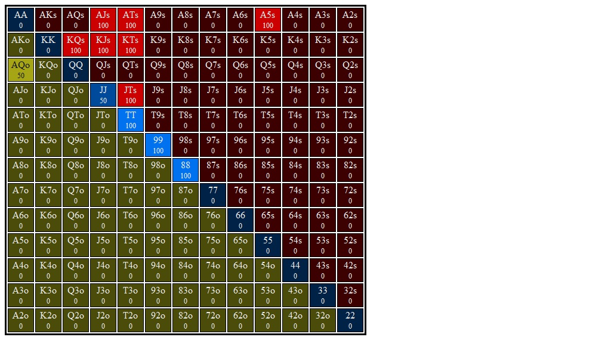

# Section 1: Lojack opens, Bn 3Bets, and Lojack Calls

Blinds are $0.05/$0.10. Effective stacks are $10.00. You're in the LJ and you open for $0.30 (3bb). Action folds to the BN who 3Bets you to $0.90, a 3x raise. SB and BB both fold, and action is back to you. You call from out of position and go to the flop with $9.10 behind and a pot of $1.95. Action is on you.
### Player Ranges

#### Hero's Lojack OOP 3Bet Call Range Range

#### Villain's Button 3Bet Range vs Lojack Open Range

### Flop 1: <b>A&spades;T&diams;5&clubs;</b>

1. **Approximate each player's equity. Who has the equity advantage?**

   The BN has very strong equity advantage. They have double to triple
   our Ax, and must stronger Ax to boot. They also have more strong
   pocket pairs (JJ-KK, plus AA for top set). Our range has a lot
   of KXs and JTs.

   I'd say villain has a 58% equity advantage.

2. **What are the weakest hands that could go all in on the flop? Go for three streets of value on blank turns?**

    SPR is 9x, and top pair probably doesn't want to get in here, especially
    since our strongest, AQo, is dominated by a LOT of their range, and might
    just be fighting to split.

    A&clubs;T&clubs; and A&hearts;T&hearts; both are ready to go all in.
    We might be willing to shove (but not call off) with K&spades;Q&spades;
    since we have a backdoor nut flush draw, a gutter, and some fold equity.

    I think that hands like AT and TT play as a x/r, and if villain
    reraises we are happy to get it in. I also think that some KQs and KJs with
    a strong flush draw get it in here as well, as long as we can shove w/
    some fold equity.

3. **Which player has the nuts advantage?**

    Bn has the clear nut advantage. They have AA, TT, AT, AK.

4. **How static or dynamic is this flop? What aspects of this flop make it more static or dynamic?  How do these aspects interact with one another?**

    This is a very static flop. Some turn cards make straights, but I think
    that AK can play for stacks on most runouts, as can AT (for the LJ)

5. **On this flop do you prefer to bet small or large?  With what frequencies would you check and bet?**

    If I have to choose a betsize, I'm betting small. We can't polarize because
    we are just dominated so much (maybe with AT, but even then we are up
    against a lot of sets).

6. **What are some hands that prefer to check/fold?**

    Very infrequently. I think I should be mixing in some small cbets across
    the board (some bluffs, some AQ, some AT, some TT), but I think I'm mainly
    checking, and I can x/r some of the stronger hands and balance with
    hands like KQs KJs with a back door flush draw.

7. **What are some hands that prefer to check/call?**

    I think that KTs with a backdoor flush draw wants to call.
    Any top pair wants to call. 88-99, JJ probably want to call,
    but we _could_ add 88 as a bluff sometimes.

8. **What are some hands that prefer to check/raise?**

    TT, AT, A5, KQs or KJs w/ a backdoor flush draw (but mixed, not pure).

9. **Do any hands ever donk? If so, which ones?**

    We check full range here.

10. **Suppose you check and villain checks behind. What are the best and worst turn cards for your range? Do any give you an equity advantage? A nuts advantage? Uncap your range?**

    I think maybe a J? We are checking a lot of KQ, KJ, JT. We also
    have 88, which BN doesn't, so seeing an 8 might give us bottom
    set, but I don't think that this is enough to benefit us too too much.

    If they are checkign at all they are probably checking some weaker Ax or
    KT, made hands that don't want to grow the pot. Therefore random low cards
    (7, 5, 4, 3) that connect with their suited aces, as well as K, might be
    bad for our range. They are checking KK and QQ sometimes as well, I assume,
    so any K or Q is probably bad for our range.

    No cards give us an equity or nuts advantage.

    A J uncaps our range somewhat by allowing straights, some 2p, and some sets.

11. **Suppose you check, villain bets 1/3 pot, and you call. What are the best and worst turn cards for your range? Do any give you an equity advantage? A nuts advantage? Uncap your range?**

    If we call we probably have some showdown value, but we might be calling
    with some stronger draws (so in our case, we might be checking back with
    like K&spades;Q&spades; or K&diams;J&diams;, etc). I think we prefer to
    x/r these, but we should be mixing x/c (maybe even 50/50), and maybe even
    some x/f.
    
    Anyway, a Q or a J that brings in the back door flush draw would be very
    nice because this will allow us to be nutty AND to have some natural bluffs.

    WRT showdown value, I think we x/c with most of our Ax and Tx, so an A or
    T should at least serve to uncap our range. villain still has the literal
    nuts (AA) when an A comes and TT when a T comes, but combos are cut down
    significantly.

#### Hands for flop A&spades;T&diams;5&clubs;
1. <b>A&hearts;Q&spades;</b>    (Flop: A&spades;T&diams;5&clubs;)

    1. **If you bet this hand should you expect better hands to fold? If so, which hands?**

    2. **If you bet this hand should you expect worse hands to call? If so, which hands?**

    3. **Does this hand benefit from a protection bet? Explain.**

    4. **Does this hand benefit from growing the pot? How so?**

    5. **How is this hand doing if you bet and get called? What parts of villain's range are you ahead of? Behind?**

    6. **How is this hand doing against a bet or raise when you check or bet respectively?**

    7. **What are this hand's incentives on this flop? Does it want to bet or check? If it wants to bet, what sizing does it prefer? Do these incentives line up with the strategy you proposed for your range above?**

    8. **Suppose you take your preferred action from the last question (check or bet the preferred size). If this is a bet, suppose villain calls. What are the best and worst turn cards for this hand?**

2. <b>8&spades;8&clubs;</b>    (Flop: A&spades;T&diams;5&clubs;)

    1. **If you bet this hand should you expect better hands to fold? If so, which hands?**

    2. **If you bet this hand should you expect worse hands to call? If so, which hands?**

    3. **Does this hand benefit from a protection bet? Explain.**

    4. **Does this hand benefit from growing the pot? How so?**

    5. **How is this hand doing if you bet and get called? What parts of villain's range are you ahead of? Behind?**

    6. **How is this hand doing against a bet or raise when you check or bet respectively?**

    7. **What are this hand's incentives on this flop? Does it want to bet or check? If it wants to bet, what sizing does it prefer? Do these incentives line up with the strategy you proposed for your range above?**

    8. **Suppose you take your preferred action from the last question (check or bet the preferred size). If this is a bet, suppose villain calls. What are the best and worst turn cards for this hand?**

3. <b>9&hearts;9&clubs;</b>    (Flop: A&spades;T&diams;5&clubs;)

    1. **If you bet this hand should you expect better hands to fold? If so, which hands?**

    2. **If you bet this hand should you expect worse hands to call? If so, which hands?**

    3. **Does this hand benefit from a protection bet? Explain.**

    4. **Does this hand benefit from growing the pot? How so?**

    5. **How is this hand doing if you bet and get called? What parts of villain's range are you ahead of? Behind?**

    6. **How is this hand doing against a bet or raise when you check or bet respectively?**

    7. **What are this hand's incentives on this flop? Does it want to bet or check? If it wants to bet, what sizing does it prefer? Do these incentives line up with the strategy you proposed for your range above?**

    8. **Suppose you take your preferred action from the last question (check or bet the preferred size). If this is a bet, suppose villain calls. What are the best and worst turn cards for this hand?**

4. <b>K&hearts;T&hearts;</b>    (Flop: A&spades;T&diams;5&clubs;)

    1. **If you bet this hand should you expect better hands to fold? If so, which hands?**

    2. **If you bet this hand should you expect worse hands to call? If so, which hands?**

    3. **Does this hand benefit from a protection bet? Explain.**

    4. **Does this hand benefit from growing the pot? How so?**

    5. **How is this hand doing if you bet and get called? What parts of villain's range are you ahead of? Behind?**

    6. **How is this hand doing against a bet or raise when you check or bet respectively?**

    7. **What are this hand's incentives on this flop? Does it want to bet or check? If it wants to bet, what sizing does it prefer? Do these incentives line up with the strategy you proposed for your range above?**

    8. **Suppose you take your preferred action from the last question (check or bet the preferred size). If this is a bet, suppose villain calls. What are the best and worst turn cards for this hand?**

5. <b>J&hearts;T&hearts;</b>    (Flop: A&spades;T&diams;5&clubs;)

    1. **If you bet this hand should you expect better hands to fold? If so, which hands?**

    2. **If you bet this hand should you expect worse hands to call? If so, which hands?**

    3. **Does this hand benefit from a protection bet? Explain.**

    4. **Does this hand benefit from growing the pot? How so?**

    5. **How is this hand doing if you bet and get called? What parts of villain's range are you ahead of? Behind?**

    6. **How is this hand doing against a bet or raise when you check or bet respectively?**

    7. **What are this hand's incentives on this flop? Does it want to bet or check? If it wants to bet, what sizing does it prefer? Do these incentives line up with the strategy you proposed for your range above?**

    8. **Suppose you take your preferred action from the last question (check or bet the preferred size). If this is a bet, suppose villain calls. What are the best and worst turn cards for this hand?**

6. <b>J&hearts;J&clubs;</b>    (Flop: A&spades;T&diams;5&clubs;)

    1. **If you bet this hand should you expect better hands to fold? If so, which hands?**

    2. **If you bet this hand should you expect worse hands to call? If so, which hands?**

    3. **Does this hand benefit from a protection bet? Explain.**

    4. **Does this hand benefit from growing the pot? How so?**

    5. **How is this hand doing if you bet and get called? What parts of villain's range are you ahead of? Behind?**

    6. **How is this hand doing against a bet or raise when you check or bet respectively?**

    7. **What are this hand's incentives on this flop? Does it want to bet or check? If it wants to bet, what sizing does it prefer? Do these incentives line up with the strategy you proposed for your range above?**

    8. **Suppose you take your preferred action from the last question (check or bet the preferred size). If this is a bet, suppose villain calls. What are the best and worst turn cards for this hand?**

7. <b>K&hearts;Q&hearts;</b>    (Flop: A&spades;T&diams;5&clubs;)

    1. **If you bet this hand should you expect better hands to fold? If so, which hands?**

    2. **If you bet this hand should you expect worse hands to call? If so, which hands?**

    3. **Does this hand benefit from a protection bet? Explain.**

    4. **Does this hand benefit from growing the pot? How so?**

    5. **How is this hand doing if you bet and get called? What parts of villain's range are you ahead of? Behind?**

    6. **How is this hand doing against a bet or raise when you check or bet respectively?**

    7. **What are this hand's incentives on this flop? Does it want to bet or check? If it wants to bet, what sizing does it prefer? Do these incentives line up with the strategy you proposed for your range above?**

    8. **Suppose you take your preferred action from the last question (check or bet the preferred size). If this is a bet, suppose villain calls. What are the best and worst turn cards for this hand?**

8. <b>T&spades;T&clubs;</b>    (Flop: A&spades;T&diams;5&clubs;)

    1. **If you bet this hand should you expect better hands to fold? If so, which hands?**

    2. **If you bet this hand should you expect worse hands to call? If so, which hands?**

    3. **Does this hand benefit from a protection bet? Explain.**

    4. **Does this hand benefit from growing the pot? How so?**

    5. **How is this hand doing if you bet and get called? What parts of villain's range are you ahead of? Behind?**

    6. **How is this hand doing against a bet or raise when you check or bet respectively?**

    7. **What are this hand's incentives on this flop? Does it want to bet or check? If it wants to bet, what sizing does it prefer? Do these incentives line up with the strategy you proposed for your range above?**

    8. **Suppose you take your preferred action from the last question (check or bet the preferred size). If this is a bet, suppose villain calls. What are the best and worst turn cards for this hand?**

9. <b>K&spades;J&spades;</b>    (Flop: A&spades;T&diams;5&clubs;)

    1. **If you bet this hand should you expect better hands to fold? If so, which hands?**

    2. **If you bet this hand should you expect worse hands to call? If so, which hands?**

    3. **Does this hand benefit from a protection bet? Explain.**

    4. **Does this hand benefit from growing the pot? How so?**

    5. **How is this hand doing if you bet and get called? What parts of villain's range are you ahead of? Behind?**

    6. **How is this hand doing against a bet or raise when you check or bet respectively?**

    7. **What are this hand's incentives on this flop? Does it want to bet or check? If it wants to bet, what sizing does it prefer? Do these incentives line up with the strategy you proposed for your range above?**

    8. **Suppose you take your preferred action from the last question (check or bet the preferred size). If this is a bet, suppose villain calls. What are the best and worst turn cards for this hand?**

10. <b>A&diams;5&diams;</b>    (Flop: A&spades;T&diams;5&clubs;)

    1. **If you bet this hand should you expect better hands to fold? If so, which hands?**

    2. **If you bet this hand should you expect worse hands to call? If so, which hands?**

    3. **Does this hand benefit from a protection bet? Explain.**

    4. **Does this hand benefit from growing the pot? How so?**

    5. **How is this hand doing if you bet and get called? What parts of villain's range are you ahead of? Behind?**

    6. **How is this hand doing against a bet or raise when you check or bet respectively?**

    7. **What are this hand's incentives on this flop? Does it want to bet or check? If it wants to bet, what sizing does it prefer? Do these incentives line up with the strategy you proposed for your range above?**

    8. **Suppose you take your preferred action from the last question (check or bet the preferred size). If this is a bet, suppose villain calls. What are the best and worst turn cards for this hand?**

### Flop 2: <b>A&spades;8&diams;4&spades;</b>
1. **Approximate each player's equity. Who has the equity advantage?**

2. **What are the weakest hands that could go all in on the flop? Go for three streets of value on blank turns?**

3. **Which player has the nuts advantage?**

4. **How static or dynamic is this flop? What aspects of this flop make it more static or dynamic?  How do these aspects interact with one another?**

5. **On this flop do you prefer to bet small or large?  With what frequencies would you check and bet?**

6. **What are some hands that prefer to check/fold?**

7. **What are some hands that prefer to check/call?**

8. **What are some hands that prefer to check/raise?**

9. **Do any hands ever donk? If so, which ones?**

10. **Suppose you check and villain checks behind. What are the best and worst turn cards for your range? Do any give you an equity advantage? A nuts advantage? Uncap your range?**

11. **Suppose you check, villain bets 1/3 pot, and you call. What are the best and worst turn cards for your range? Do any give you an equity advantage? A nuts advantage? Uncap your range?**

#### Hands for flop A&spades;8&diams;4&spades;
1. <b>K&diams;J&diams;</b>    (Flop: A&spades;8&diams;4&spades;)

    1. **If you bet this hand should you expect better hands to fold? If so, which hands?**

    2. **If you bet this hand should you expect worse hands to call? If so, which hands?**

    3. **Does this hand benefit from a protection bet? Explain.**

    4. **Does this hand benefit from growing the pot? How so?**

    5. **How is this hand doing if you bet and get called? What parts of villain's range are you ahead of? Behind?**

    6. **How is this hand doing against a bet or raise when you check or bet respectively?**

    7. **What are this hand's incentives on this flop? Does it want to bet or check? If it wants to bet, what sizing does it prefer? Do these incentives line up with the strategy you proposed for your range above?**

    8. **Suppose you take your preferred action from the last question (check or bet the preferred size). If this is a bet, suppose villain calls. What are the best and worst turn cards for this hand?**

2. <b>K&spades;T&spades;</b>    (Flop: A&spades;8&diams;4&spades;)

    1. **If you bet this hand should you expect better hands to fold? If so, which hands?**

    2. **If you bet this hand should you expect worse hands to call? If so, which hands?**

    3. **Does this hand benefit from a protection bet? Explain.**

    4. **Does this hand benefit from growing the pot? How so?**

    5. **How is this hand doing if you bet and get called? What parts of villain's range are you ahead of? Behind?**

    6. **How is this hand doing against a bet or raise when you check or bet respectively?**

    7. **What are this hand's incentives on this flop? Does it want to bet or check? If it wants to bet, what sizing does it prefer? Do these incentives line up with the strategy you proposed for your range above?**

    8. **Suppose you take your preferred action from the last question (check or bet the preferred size). If this is a bet, suppose villain calls. What are the best and worst turn cards for this hand?**

3. <b>A&diams;Q&hearts;</b>    (Flop: A&spades;8&diams;4&spades;)

    1. **If you bet this hand should you expect better hands to fold? If so, which hands?**

    2. **If you bet this hand should you expect worse hands to call? If so, which hands?**

    3. **Does this hand benefit from a protection bet? Explain.**

    4. **Does this hand benefit from growing the pot? How so?**

    5. **How is this hand doing if you bet and get called? What parts of villain's range are you ahead of? Behind?**

    6. **How is this hand doing against a bet or raise when you check or bet respectively?**

    7. **What are this hand's incentives on this flop? Does it want to bet or check? If it wants to bet, what sizing does it prefer? Do these incentives line up with the strategy you proposed for your range above?**

    8. **Suppose you take your preferred action from the last question (check or bet the preferred size). If this is a bet, suppose villain calls. What are the best and worst turn cards for this hand?**

4. <b>8&hearts;8&spades;</b>    (Flop: A&spades;8&diams;4&spades;)

    1. **If you bet this hand should you expect better hands to fold? If so, which hands?**

    2. **If you bet this hand should you expect worse hands to call? If so, which hands?**

    3. **Does this hand benefit from a protection bet? Explain.**

    4. **Does this hand benefit from growing the pot? How so?**

    5. **How is this hand doing if you bet and get called? What parts of villain's range are you ahead of? Behind?**

    6. **How is this hand doing against a bet or raise when you check or bet respectively?**

    7. **What are this hand's incentives on this flop? Does it want to bet or check? If it wants to bet, what sizing does it prefer? Do these incentives line up with the strategy you proposed for your range above?**

    8. **Suppose you take your preferred action from the last question (check or bet the preferred size). If this is a bet, suppose villain calls. What are the best and worst turn cards for this hand?**

5. <b>J&hearts;J&spades;</b>    (Flop: A&spades;8&diams;4&spades;)

    1. **If you bet this hand should you expect better hands to fold? If so, which hands?**

    2. **If you bet this hand should you expect worse hands to call? If so, which hands?**

    3. **Does this hand benefit from a protection bet? Explain.**

    4. **Does this hand benefit from growing the pot? How so?**

    5. **How is this hand doing if you bet and get called? What parts of villain's range are you ahead of? Behind?**

    6. **How is this hand doing against a bet or raise when you check or bet respectively?**

    7. **What are this hand's incentives on this flop? Does it want to bet or check? If it wants to bet, what sizing does it prefer? Do these incentives line up with the strategy you proposed for your range above?**

    8. **Suppose you take your preferred action from the last question (check or bet the preferred size). If this is a bet, suppose villain calls. What are the best and worst turn cards for this hand?**

6. <b>A&clubs;J&clubs;</b>    (Flop: A&spades;8&diams;4&spades;)

    1. **If you bet this hand should you expect better hands to fold? If so, which hands?**

    2. **If you bet this hand should you expect worse hands to call? If so, which hands?**

    3. **Does this hand benefit from a protection bet? Explain.**

    4. **Does this hand benefit from growing the pot? How so?**

    5. **How is this hand doing if you bet and get called? What parts of villain's range are you ahead of? Behind?**

    6. **How is this hand doing against a bet or raise when you check or bet respectively?**

    7. **What are this hand's incentives on this flop? Does it want to bet or check? If it wants to bet, what sizing does it prefer? Do these incentives line up with the strategy you proposed for your range above?**

    8. **Suppose you take your preferred action from the last question (check or bet the preferred size). If this is a bet, suppose villain calls. What are the best and worst turn cards for this hand?**

7. <b>T&spades;T&diams;</b>    (Flop: A&spades;8&diams;4&spades;)

    1. **If you bet this hand should you expect better hands to fold? If so, which hands?**

    2. **If you bet this hand should you expect worse hands to call? If so, which hands?**

    3. **Does this hand benefit from a protection bet? Explain.**

    4. **Does this hand benefit from growing the pot? How so?**

    5. **How is this hand doing if you bet and get called? What parts of villain's range are you ahead of? Behind?**

    6. **How is this hand doing against a bet or raise when you check or bet respectively?**

    7. **What are this hand's incentives on this flop? Does it want to bet or check? If it wants to bet, what sizing does it prefer? Do these incentives line up with the strategy you proposed for your range above?**

    8. **Suppose you take your preferred action from the last question (check or bet the preferred size). If this is a bet, suppose villain calls. What are the best and worst turn cards for this hand?**

8. <b>A&hearts;5&hearts;</b>    (Flop: A&spades;8&diams;4&spades;)

    1. **If you bet this hand should you expect better hands to fold? If so, which hands?**

    2. **If you bet this hand should you expect worse hands to call? If so, which hands?**

    3. **Does this hand benefit from a protection bet? Explain.**

    4. **Does this hand benefit from growing the pot? How so?**

    5. **How is this hand doing if you bet and get called? What parts of villain's range are you ahead of? Behind?**

    6. **How is this hand doing against a bet or raise when you check or bet respectively?**

    7. **What are this hand's incentives on this flop? Does it want to bet or check? If it wants to bet, what sizing does it prefer? Do these incentives line up with the strategy you proposed for your range above?**

    8. **Suppose you take your preferred action from the last question (check or bet the preferred size). If this is a bet, suppose villain calls. What are the best and worst turn cards for this hand?**

9. <b>A&clubs;T&clubs;</b>    (Flop: A&spades;8&diams;4&spades;)

    1. **If you bet this hand should you expect better hands to fold? If so, which hands?**

    2. **If you bet this hand should you expect worse hands to call? If so, which hands?**

    3. **Does this hand benefit from a protection bet? Explain.**

    4. **Does this hand benefit from growing the pot? How so?**

    5. **How is this hand doing if you bet and get called? What parts of villain's range are you ahead of? Behind?**

    6. **How is this hand doing against a bet or raise when you check or bet respectively?**

    7. **What are this hand's incentives on this flop? Does it want to bet or check? If it wants to bet, what sizing does it prefer? Do these incentives line up with the strategy you proposed for your range above?**

    8. **Suppose you take your preferred action from the last question (check or bet the preferred size). If this is a bet, suppose villain calls. What are the best and worst turn cards for this hand?**

10. <b>J&diams;T&diams;</b>    (Flop: A&spades;8&diams;4&spades;)

    1. **If you bet this hand should you expect better hands to fold? If so, which hands?**

    2. **If you bet this hand should you expect worse hands to call? If so, which hands?**

    3. **Does this hand benefit from a protection bet? Explain.**

    4. **Does this hand benefit from growing the pot? How so?**

    5. **How is this hand doing if you bet and get called? What parts of villain's range are you ahead of? Behind?**

    6. **How is this hand doing against a bet or raise when you check or bet respectively?**

    7. **What are this hand's incentives on this flop? Does it want to bet or check? If it wants to bet, what sizing does it prefer? Do these incentives line up with the strategy you proposed for your range above?**

    8. **Suppose you take your preferred action from the last question (check or bet the preferred size). If this is a bet, suppose villain calls. What are the best and worst turn cards for this hand?**

### Flop 3: <b>A&spades;7&spades;2&diams;</b>
1. **Approximate each player's equity. Who has the equity advantage?**

2. **What are the weakest hands that could go all in on the flop? Go for three streets of value on blank turns?**

3. **Which player has the nuts advantage?**

4. **How static or dynamic is this flop? What aspects of this flop make it more static or dynamic?  How do these aspects interact with one another?**

5. **On this flop do you prefer to bet small or large?  With what frequencies would you check and bet?**

6. **What are some hands that prefer to check/fold?**

7. **What are some hands that prefer to check/call?**

8. **What are some hands that prefer to check/raise?**

9. **Do any hands ever donk? If so, which ones?**

10. **Suppose you check and villain checks behind. What are the best and worst turn cards for your range? Do any give you an equity advantage? A nuts advantage? Uncap your range?**

11. **Suppose you check, villain bets 1/3 pot, and you call. What are the best and worst turn cards for your range? Do any give you an equity advantage? A nuts advantage? Uncap your range?**

#### Hands for flop A&spades;7&spades;2&diams;
1. <b>8&hearts;8&diams;</b>    (Flop: A&spades;7&spades;2&diams;)

    1. **If you bet this hand should you expect better hands to fold? If so, which hands?**

    2. **If you bet this hand should you expect worse hands to call? If so, which hands?**

    3. **Does this hand benefit from a protection bet? Explain.**

    4. **Does this hand benefit from growing the pot? How so?**

    5. **How is this hand doing if you bet and get called? What parts of villain's range are you ahead of? Behind?**

    6. **How is this hand doing against a bet or raise when you check or bet respectively?**

    7. **What are this hand's incentives on this flop? Does it want to bet or check? If it wants to bet, what sizing does it prefer? Do these incentives line up with the strategy you proposed for your range above?**

    8. **Suppose you take your preferred action from the last question (check or bet the preferred size). If this is a bet, suppose villain calls. What are the best and worst turn cards for this hand?**

2. <b>J&diams;J&clubs;</b>    (Flop: A&spades;7&spades;2&diams;)

    1. **If you bet this hand should you expect better hands to fold? If so, which hands?**

    2. **If you bet this hand should you expect worse hands to call? If so, which hands?**

    3. **Does this hand benefit from a protection bet? Explain.**

    4. **Does this hand benefit from growing the pot? How so?**

    5. **How is this hand doing if you bet and get called? What parts of villain's range are you ahead of? Behind?**

    6. **How is this hand doing against a bet or raise when you check or bet respectively?**

    7. **What are this hand's incentives on this flop? Does it want to bet or check? If it wants to bet, what sizing does it prefer? Do these incentives line up with the strategy you proposed for your range above?**

    8. **Suppose you take your preferred action from the last question (check or bet the preferred size). If this is a bet, suppose villain calls. What are the best and worst turn cards for this hand?**

3. <b>K&hearts;Q&hearts;</b>    (Flop: A&spades;7&spades;2&diams;)

    1. **If you bet this hand should you expect better hands to fold? If so, which hands?**

    2. **If you bet this hand should you expect worse hands to call? If so, which hands?**

    3. **Does this hand benefit from a protection bet? Explain.**

    4. **Does this hand benefit from growing the pot? How so?**

    5. **How is this hand doing if you bet and get called? What parts of villain's range are you ahead of? Behind?**

    6. **How is this hand doing against a bet or raise when you check or bet respectively?**

    7. **What are this hand's incentives on this flop? Does it want to bet or check? If it wants to bet, what sizing does it prefer? Do these incentives line up with the strategy you proposed for your range above?**

    8. **Suppose you take your preferred action from the last question (check or bet the preferred size). If this is a bet, suppose villain calls. What are the best and worst turn cards for this hand?**

4. <b>A&clubs;J&clubs;</b>    (Flop: A&spades;7&spades;2&diams;)

    1. **If you bet this hand should you expect better hands to fold? If so, which hands?**

    2. **If you bet this hand should you expect worse hands to call? If so, which hands?**

    3. **Does this hand benefit from a protection bet? Explain.**

    4. **Does this hand benefit from growing the pot? How so?**

    5. **How is this hand doing if you bet and get called? What parts of villain's range are you ahead of? Behind?**

    6. **How is this hand doing against a bet or raise when you check or bet respectively?**

    7. **What are this hand's incentives on this flop? Does it want to bet or check? If it wants to bet, what sizing does it prefer? Do these incentives line up with the strategy you proposed for your range above?**

    8. **Suppose you take your preferred action from the last question (check or bet the preferred size). If this is a bet, suppose villain calls. What are the best and worst turn cards for this hand?**

5. <b>J&clubs;T&clubs;</b>    (Flop: A&spades;7&spades;2&diams;)

    1. **If you bet this hand should you expect better hands to fold? If so, which hands?**

    2. **If you bet this hand should you expect worse hands to call? If so, which hands?**

    3. **Does this hand benefit from a protection bet? Explain.**

    4. **Does this hand benefit from growing the pot? How so?**

    5. **How is this hand doing if you bet and get called? What parts of villain's range are you ahead of? Behind?**

    6. **How is this hand doing against a bet or raise when you check or bet respectively?**

    7. **What are this hand's incentives on this flop? Does it want to bet or check? If it wants to bet, what sizing does it prefer? Do these incentives line up with the strategy you proposed for your range above?**

    8. **Suppose you take your preferred action from the last question (check or bet the preferred size). If this is a bet, suppose villain calls. What are the best and worst turn cards for this hand?**

6. <b>K&clubs;T&clubs;</b>    (Flop: A&spades;7&spades;2&diams;)

    1. **If you bet this hand should you expect better hands to fold? If so, which hands?**

    2. **If you bet this hand should you expect worse hands to call? If so, which hands?**

    3. **Does this hand benefit from a protection bet? Explain.**

    4. **Does this hand benefit from growing the pot? How so?**

    5. **How is this hand doing if you bet and get called? What parts of villain's range are you ahead of? Behind?**

    6. **How is this hand doing against a bet or raise when you check or bet respectively?**

    7. **What are this hand's incentives on this flop? Does it want to bet or check? If it wants to bet, what sizing does it prefer? Do these incentives line up with the strategy you proposed for your range above?**

    8. **Suppose you take your preferred action from the last question (check or bet the preferred size). If this is a bet, suppose villain calls. What are the best and worst turn cards for this hand?**

7. <b>A&diams;5&diams;</b>    (Flop: A&spades;7&spades;2&diams;)

    1. **If you bet this hand should you expect better hands to fold? If so, which hands?**

    2. **If you bet this hand should you expect worse hands to call? If so, which hands?**

    3. **Does this hand benefit from a protection bet? Explain.**

    4. **Does this hand benefit from growing the pot? How so?**

    5. **How is this hand doing if you bet and get called? What parts of villain's range are you ahead of? Behind?**

    6. **How is this hand doing against a bet or raise when you check or bet respectively?**

    7. **What are this hand's incentives on this flop? Does it want to bet or check? If it wants to bet, what sizing does it prefer? Do these incentives line up with the strategy you proposed for your range above?**

    8. **Suppose you take your preferred action from the last question (check or bet the preferred size). If this is a bet, suppose villain calls. What are the best and worst turn cards for this hand?**

8. <b>A&clubs;Q&spades;</b>    (Flop: A&spades;7&spades;2&diams;)

    1. **If you bet this hand should you expect better hands to fold? If so, which hands?**

    2. **If you bet this hand should you expect worse hands to call? If so, which hands?**

    3. **Does this hand benefit from a protection bet? Explain.**

    4. **Does this hand benefit from growing the pot? How so?**

    5. **How is this hand doing if you bet and get called? What parts of villain's range are you ahead of? Behind?**

    6. **How is this hand doing against a bet or raise when you check or bet respectively?**

    7. **What are this hand's incentives on this flop? Does it want to bet or check? If it wants to bet, what sizing does it prefer? Do these incentives line up with the strategy you proposed for your range above?**

    8. **Suppose you take your preferred action from the last question (check or bet the preferred size). If this is a bet, suppose villain calls. What are the best and worst turn cards for this hand?**

9. <b>9&spades;9&clubs;</b>    (Flop: A&spades;7&spades;2&diams;)

    1. **If you bet this hand should you expect better hands to fold? If so, which hands?**

    2. **If you bet this hand should you expect worse hands to call? If so, which hands?**

    3. **Does this hand benefit from a protection bet? Explain.**

    4. **Does this hand benefit from growing the pot? How so?**

    5. **How is this hand doing if you bet and get called? What parts of villain's range are you ahead of? Behind?**

    6. **How is this hand doing against a bet or raise when you check or bet respectively?**

    7. **What are this hand's incentives on this flop? Does it want to bet or check? If it wants to bet, what sizing does it prefer? Do these incentives line up with the strategy you proposed for your range above?**

    8. **Suppose you take your preferred action from the last question (check or bet the preferred size). If this is a bet, suppose villain calls. What are the best and worst turn cards for this hand?**

10. <b>K&clubs;J&clubs;</b>    (Flop: A&spades;7&spades;2&diams;)

    1. **If you bet this hand should you expect better hands to fold? If so, which hands?**

    2. **If you bet this hand should you expect worse hands to call? If so, which hands?**

    3. **Does this hand benefit from a protection bet? Explain.**

    4. **Does this hand benefit from growing the pot? How so?**

    5. **How is this hand doing if you bet and get called? What parts of villain's range are you ahead of? Behind?**

    6. **How is this hand doing against a bet or raise when you check or bet respectively?**

    7. **What are this hand's incentives on this flop? Does it want to bet or check? If it wants to bet, what sizing does it prefer? Do these incentives line up with the strategy you proposed for your range above?**

    8. **Suppose you take your preferred action from the last question (check or bet the preferred size). If this is a bet, suppose villain calls. What are the best and worst turn cards for this hand?**

### Flop 4: <b>K&spades;J&diams;4&diams;</b>
1. **Approximate each player's equity. Who has the equity advantage?**

2. **What are the weakest hands that could go all in on the flop? Go for three streets of value on blank turns?**

3. **Which player has the nuts advantage?**

4. **How static or dynamic is this flop? What aspects of this flop make it more static or dynamic?  How do these aspects interact with one another?**

5. **On this flop do you prefer to bet small or large?  With what frequencies would you check and bet?**

6. **What are some hands that prefer to check/fold?**

7. **What are some hands that prefer to check/call?**

8. **What are some hands that prefer to check/raise?**

9. **Do any hands ever donk? If so, which ones?**

10. **Suppose you check and villain checks behind. What are the best and worst turn cards for your range? Do any give you an equity advantage? A nuts advantage? Uncap your range?**

11. **Suppose you check, villain bets 1/3 pot, and you call. What are the best and worst turn cards for your range? Do any give you an equity advantage? A nuts advantage? Uncap your range?**

#### Hands for flop K&spades;J&diams;4&diams;
1. <b>A&diams;5&diams;</b>    (Flop: K&spades;J&diams;4&diams;)

    1. **If you bet this hand should you expect better hands to fold? If so, which hands?**

    2. **If you bet this hand should you expect worse hands to call? If so, which hands?**

    3. **Does this hand benefit from a protection bet? Explain.**

    4. **Does this hand benefit from growing the pot? How so?**

    5. **How is this hand doing if you bet and get called? What parts of villain's range are you ahead of? Behind?**

    6. **How is this hand doing against a bet or raise when you check or bet respectively?**

    7. **What are this hand's incentives on this flop? Does it want to bet or check? If it wants to bet, what sizing does it prefer? Do these incentives line up with the strategy you proposed for your range above?**

    8. **Suppose you take your preferred action from the last question (check or bet the preferred size). If this is a bet, suppose villain calls. What are the best and worst turn cards for this hand?**

2. <b>A&spades;Q&diams;</b>    (Flop: K&spades;J&diams;4&diams;)

    1. **If you bet this hand should you expect better hands to fold? If so, which hands?**

    2. **If you bet this hand should you expect worse hands to call? If so, which hands?**

    3. **Does this hand benefit from a protection bet? Explain.**

    4. **Does this hand benefit from growing the pot? How so?**

    5. **How is this hand doing if you bet and get called? What parts of villain's range are you ahead of? Behind?**

    6. **How is this hand doing against a bet or raise when you check or bet respectively?**

    7. **What are this hand's incentives on this flop? Does it want to bet or check? If it wants to bet, what sizing does it prefer? Do these incentives line up with the strategy you proposed for your range above?**

    8. **Suppose you take your preferred action from the last question (check or bet the preferred size). If this is a bet, suppose villain calls. What are the best and worst turn cards for this hand?**

3. <b>K&diams;T&diams;</b>    (Flop: K&spades;J&diams;4&diams;)

    1. **If you bet this hand should you expect better hands to fold? If so, which hands?**

    2. **If you bet this hand should you expect worse hands to call? If so, which hands?**

    3. **Does this hand benefit from a protection bet? Explain.**

    4. **Does this hand benefit from growing the pot? How so?**

    5. **How is this hand doing if you bet and get called? What parts of villain's range are you ahead of? Behind?**

    6. **How is this hand doing against a bet or raise when you check or bet respectively?**

    7. **What are this hand's incentives on this flop? Does it want to bet or check? If it wants to bet, what sizing does it prefer? Do these incentives line up with the strategy you proposed for your range above?**

    8. **Suppose you take your preferred action from the last question (check or bet the preferred size). If this is a bet, suppose villain calls. What are the best and worst turn cards for this hand?**

4. <b>T&diams;T&clubs;</b>    (Flop: K&spades;J&diams;4&diams;)

    1. **If you bet this hand should you expect better hands to fold? If so, which hands?**

    2. **If you bet this hand should you expect worse hands to call? If so, which hands?**

    3. **Does this hand benefit from a protection bet? Explain.**

    4. **Does this hand benefit from growing the pot? How so?**

    5. **How is this hand doing if you bet and get called? What parts of villain's range are you ahead of? Behind?**

    6. **How is this hand doing against a bet or raise when you check or bet respectively?**

    7. **What are this hand's incentives on this flop? Does it want to bet or check? If it wants to bet, what sizing does it prefer? Do these incentives line up with the strategy you proposed for your range above?**

    8. **Suppose you take your preferred action from the last question (check or bet the preferred size). If this is a bet, suppose villain calls. What are the best and worst turn cards for this hand?**

5. <b>K&hearts;Q&hearts;</b>    (Flop: K&spades;J&diams;4&diams;)

    1. **If you bet this hand should you expect better hands to fold? If so, which hands?**

    2. **If you bet this hand should you expect worse hands to call? If so, which hands?**

    3. **Does this hand benefit from a protection bet? Explain.**

    4. **Does this hand benefit from growing the pot? How so?**

    5. **How is this hand doing if you bet and get called? What parts of villain's range are you ahead of? Behind?**

    6. **How is this hand doing against a bet or raise when you check or bet respectively?**

    7. **What are this hand's incentives on this flop? Does it want to bet or check? If it wants to bet, what sizing does it prefer? Do these incentives line up with the strategy you proposed for your range above?**

    8. **Suppose you take your preferred action from the last question (check or bet the preferred size). If this is a bet, suppose villain calls. What are the best and worst turn cards for this hand?**

6. <b>J&hearts;T&hearts;</b>    (Flop: K&spades;J&diams;4&diams;)

    1. **If you bet this hand should you expect better hands to fold? If so, which hands?**

    2. **If you bet this hand should you expect worse hands to call? If so, which hands?**

    3. **Does this hand benefit from a protection bet? Explain.**

    4. **Does this hand benefit from growing the pot? How so?**

    5. **How is this hand doing if you bet and get called? What parts of villain's range are you ahead of? Behind?**

    6. **How is this hand doing against a bet or raise when you check or bet respectively?**

    7. **What are this hand's incentives on this flop? Does it want to bet or check? If it wants to bet, what sizing does it prefer? Do these incentives line up with the strategy you proposed for your range above?**

    8. **Suppose you take your preferred action from the last question (check or bet the preferred size). If this is a bet, suppose villain calls. What are the best and worst turn cards for this hand?**

7. <b>J&hearts;J&clubs;</b>    (Flop: K&spades;J&diams;4&diams;)

    1. **If you bet this hand should you expect better hands to fold? If so, which hands?**

    2. **If you bet this hand should you expect worse hands to call? If so, which hands?**

    3. **Does this hand benefit from a protection bet? Explain.**

    4. **Does this hand benefit from growing the pot? How so?**

    5. **How is this hand doing if you bet and get called? What parts of villain's range are you ahead of? Behind?**

    6. **How is this hand doing against a bet or raise when you check or bet respectively?**

    7. **What are this hand's incentives on this flop? Does it want to bet or check? If it wants to bet, what sizing does it prefer? Do these incentives line up with the strategy you proposed for your range above?**

    8. **Suppose you take your preferred action from the last question (check or bet the preferred size). If this is a bet, suppose villain calls. What are the best and worst turn cards for this hand?**

8. <b>K&hearts;J&hearts;</b>    (Flop: K&spades;J&diams;4&diams;)

    1. **If you bet this hand should you expect better hands to fold? If so, which hands?**

    2. **If you bet this hand should you expect worse hands to call? If so, which hands?**

    3. **Does this hand benefit from a protection bet? Explain.**

    4. **Does this hand benefit from growing the pot? How so?**

    5. **How is this hand doing if you bet and get called? What parts of villain's range are you ahead of? Behind?**

    6. **How is this hand doing against a bet or raise when you check or bet respectively?**

    7. **What are this hand's incentives on this flop? Does it want to bet or check? If it wants to bet, what sizing does it prefer? Do these incentives line up with the strategy you proposed for your range above?**

    8. **Suppose you take your preferred action from the last question (check or bet the preferred size). If this is a bet, suppose villain calls. What are the best and worst turn cards for this hand?**

9. <b>8&spades;8&diams;</b>    (Flop: K&spades;J&diams;4&diams;)

    1. **If you bet this hand should you expect better hands to fold? If so, which hands?**

    2. **If you bet this hand should you expect worse hands to call? If so, which hands?**

    3. **Does this hand benefit from a protection bet? Explain.**

    4. **Does this hand benefit from growing the pot? How so?**

    5. **How is this hand doing if you bet and get called? What parts of villain's range are you ahead of? Behind?**

    6. **How is this hand doing against a bet or raise when you check or bet respectively?**

    7. **What are this hand's incentives on this flop? Does it want to bet or check? If it wants to bet, what sizing does it prefer? Do these incentives line up with the strategy you proposed for your range above?**

    8. **Suppose you take your preferred action from the last question (check or bet the preferred size). If this is a bet, suppose villain calls. What are the best and worst turn cards for this hand?**

10. <b>A&diams;T&diams;</b>    (Flop: K&spades;J&diams;4&diams;)

    1. **If you bet this hand should you expect better hands to fold? If so, which hands?**

    2. **If you bet this hand should you expect worse hands to call? If so, which hands?**

    3. **Does this hand benefit from a protection bet? Explain.**

    4. **Does this hand benefit from growing the pot? How so?**

    5. **How is this hand doing if you bet and get called? What parts of villain's range are you ahead of? Behind?**

    6. **How is this hand doing against a bet or raise when you check or bet respectively?**

    7. **What are this hand's incentives on this flop? Does it want to bet or check? If it wants to bet, what sizing does it prefer? Do these incentives line up with the strategy you proposed for your range above?**

    8. **Suppose you take your preferred action from the last question (check or bet the preferred size). If this is a bet, suppose villain calls. What are the best and worst turn cards for this hand?**

### Flop 5: <b>K&spades;9&diams;7&clubs;</b>
1. **Approximate each player's equity. Who has the equity advantage?**

2. **What are the weakest hands that could go all in on the flop? Go for three streets of value on blank turns?**

3. **Which player has the nuts advantage?**

4. **How static or dynamic is this flop? What aspects of this flop make it more static or dynamic?  How do these aspects interact with one another?**

5. **On this flop do you prefer to bet small or large?  With what frequencies would you check and bet?**

6. **What are some hands that prefer to check/fold?**

7. **What are some hands that prefer to check/call?**

8. **What are some hands that prefer to check/raise?**

9. **Do any hands ever donk? If so, which ones?**

10. **Suppose you check and villain checks behind. What are the best and worst turn cards for your range? Do any give you an equity advantage? A nuts advantage? Uncap your range?**

11. **Suppose you check, villain bets 1/3 pot, and you call. What are the best and worst turn cards for your range? Do any give you an equity advantage? A nuts advantage? Uncap your range?**

#### Hands for flop K&spades;9&diams;7&clubs;
1. <b>8&spades;8&diams;</b>    (Flop: K&spades;9&diams;7&clubs;)

    1. **If you bet this hand should you expect better hands to fold? If so, which hands?**

    2. **If you bet this hand should you expect worse hands to call? If so, which hands?**

    3. **Does this hand benefit from a protection bet? Explain.**

    4. **Does this hand benefit from growing the pot? How so?**

    5. **How is this hand doing if you bet and get called? What parts of villain's range are you ahead of? Behind?**

    6. **How is this hand doing against a bet or raise when you check or bet respectively?**

    7. **What are this hand's incentives on this flop? Does it want to bet or check? If it wants to bet, what sizing does it prefer? Do these incentives line up with the strategy you proposed for your range above?**

    8. **Suppose you take your preferred action from the last question (check or bet the preferred size). If this is a bet, suppose villain calls. What are the best and worst turn cards for this hand?**

2. <b>9&hearts;9&clubs;</b>    (Flop: K&spades;9&diams;7&clubs;)

    1. **If you bet this hand should you expect better hands to fold? If so, which hands?**

    2. **If you bet this hand should you expect worse hands to call? If so, which hands?**

    3. **Does this hand benefit from a protection bet? Explain.**

    4. **Does this hand benefit from growing the pot? How so?**

    5. **How is this hand doing if you bet and get called? What parts of villain's range are you ahead of? Behind?**

    6. **How is this hand doing against a bet or raise when you check or bet respectively?**

    7. **What are this hand's incentives on this flop? Does it want to bet or check? If it wants to bet, what sizing does it prefer? Do these incentives line up with the strategy you proposed for your range above?**

    8. **Suppose you take your preferred action from the last question (check or bet the preferred size). If this is a bet, suppose villain calls. What are the best and worst turn cards for this hand?**

3. <b>K&diams;T&diams;</b>    (Flop: K&spades;9&diams;7&clubs;)

    1. **If you bet this hand should you expect better hands to fold? If so, which hands?**

    2. **If you bet this hand should you expect worse hands to call? If so, which hands?**

    3. **Does this hand benefit from a protection bet? Explain.**

    4. **Does this hand benefit from growing the pot? How so?**

    5. **How is this hand doing if you bet and get called? What parts of villain's range are you ahead of? Behind?**

    6. **How is this hand doing against a bet or raise when you check or bet respectively?**

    7. **What are this hand's incentives on this flop? Does it want to bet or check? If it wants to bet, what sizing does it prefer? Do these incentives line up with the strategy you proposed for your range above?**

    8. **Suppose you take your preferred action from the last question (check or bet the preferred size). If this is a bet, suppose villain calls. What are the best and worst turn cards for this hand?**

4. <b>J&diams;T&diams;</b>    (Flop: K&spades;9&diams;7&clubs;)

    1. **If you bet this hand should you expect better hands to fold? If so, which hands?**

    2. **If you bet this hand should you expect worse hands to call? If so, which hands?**

    3. **Does this hand benefit from a protection bet? Explain.**

    4. **Does this hand benefit from growing the pot? How so?**

    5. **How is this hand doing if you bet and get called? What parts of villain's range are you ahead of? Behind?**

    6. **How is this hand doing against a bet or raise when you check or bet respectively?**

    7. **What are this hand's incentives on this flop? Does it want to bet or check? If it wants to bet, what sizing does it prefer? Do these incentives line up with the strategy you proposed for your range above?**

    8. **Suppose you take your preferred action from the last question (check or bet the preferred size). If this is a bet, suppose villain calls. What are the best and worst turn cards for this hand?**

5. <b>A&clubs;T&clubs;</b>    (Flop: K&spades;9&diams;7&clubs;)

    1. **If you bet this hand should you expect better hands to fold? If so, which hands?**

    2. **If you bet this hand should you expect worse hands to call? If so, which hands?**

    3. **Does this hand benefit from a protection bet? Explain.**

    4. **Does this hand benefit from growing the pot? How so?**

    5. **How is this hand doing if you bet and get called? What parts of villain's range are you ahead of? Behind?**

    6. **How is this hand doing against a bet or raise when you check or bet respectively?**

    7. **What are this hand's incentives on this flop? Does it want to bet or check? If it wants to bet, what sizing does it prefer? Do these incentives line up with the strategy you proposed for your range above?**

    8. **Suppose you take your preferred action from the last question (check or bet the preferred size). If this is a bet, suppose villain calls. What are the best and worst turn cards for this hand?**

6. <b>K&diams;J&diams;</b>    (Flop: K&spades;9&diams;7&clubs;)

    1. **If you bet this hand should you expect better hands to fold? If so, which hands?**

    2. **If you bet this hand should you expect worse hands to call? If so, which hands?**

    3. **Does this hand benefit from a protection bet? Explain.**

    4. **Does this hand benefit from growing the pot? How so?**

    5. **How is this hand doing if you bet and get called? What parts of villain's range are you ahead of? Behind?**

    6. **How is this hand doing against a bet or raise when you check or bet respectively?**

    7. **What are this hand's incentives on this flop? Does it want to bet or check? If it wants to bet, what sizing does it prefer? Do these incentives line up with the strategy you proposed for your range above?**

    8. **Suppose you take your preferred action from the last question (check or bet the preferred size). If this is a bet, suppose villain calls. What are the best and worst turn cards for this hand?**

7. <b>A&diams;J&diams;</b>    (Flop: K&spades;9&diams;7&clubs;)

    1. **If you bet this hand should you expect better hands to fold? If so, which hands?**

    2. **If you bet this hand should you expect worse hands to call? If so, which hands?**

    3. **Does this hand benefit from a protection bet? Explain.**

    4. **Does this hand benefit from growing the pot? How so?**

    5. **How is this hand doing if you bet and get called? What parts of villain's range are you ahead of? Behind?**

    6. **How is this hand doing against a bet or raise when you check or bet respectively?**

    7. **What are this hand's incentives on this flop? Does it want to bet or check? If it wants to bet, what sizing does it prefer? Do these incentives line up with the strategy you proposed for your range above?**

    8. **Suppose you take your preferred action from the last question (check or bet the preferred size). If this is a bet, suppose villain calls. What are the best and worst turn cards for this hand?**

8. <b>T&spades;T&clubs;</b>    (Flop: K&spades;9&diams;7&clubs;)

    1. **If you bet this hand should you expect better hands to fold? If so, which hands?**

    2. **If you bet this hand should you expect worse hands to call? If so, which hands?**

    3. **Does this hand benefit from a protection bet? Explain.**

    4. **Does this hand benefit from growing the pot? How so?**

    5. **How is this hand doing if you bet and get called? What parts of villain's range are you ahead of? Behind?**

    6. **How is this hand doing against a bet or raise when you check or bet respectively?**

    7. **What are this hand's incentives on this flop? Does it want to bet or check? If it wants to bet, what sizing does it prefer? Do these incentives line up with the strategy you proposed for your range above?**

    8. **Suppose you take your preferred action from the last question (check or bet the preferred size). If this is a bet, suppose villain calls. What are the best and worst turn cards for this hand?**

9. <b>K&hearts;Q&hearts;</b>    (Flop: K&spades;9&diams;7&clubs;)

    1. **If you bet this hand should you expect better hands to fold? If so, which hands?**

    2. **If you bet this hand should you expect worse hands to call? If so, which hands?**

    3. **Does this hand benefit from a protection bet? Explain.**

    4. **Does this hand benefit from growing the pot? How so?**

    5. **How is this hand doing if you bet and get called? What parts of villain's range are you ahead of? Behind?**

    6. **How is this hand doing against a bet or raise when you check or bet respectively?**

    7. **What are this hand's incentives on this flop? Does it want to bet or check? If it wants to bet, what sizing does it prefer? Do these incentives line up with the strategy you proposed for your range above?**

    8. **Suppose you take your preferred action from the last question (check or bet the preferred size). If this is a bet, suppose villain calls. What are the best and worst turn cards for this hand?**

10. <b>A&diams;5&diams;</b>    (Flop: K&spades;9&diams;7&clubs;)

    1. **If you bet this hand should you expect better hands to fold? If so, which hands?**

    2. **If you bet this hand should you expect worse hands to call? If so, which hands?**

    3. **Does this hand benefit from a protection bet? Explain.**

    4. **Does this hand benefit from growing the pot? How so?**

    5. **How is this hand doing if you bet and get called? What parts of villain's range are you ahead of? Behind?**

    6. **How is this hand doing against a bet or raise when you check or bet respectively?**

    7. **What are this hand's incentives on this flop? Does it want to bet or check? If it wants to bet, what sizing does it prefer? Do these incentives line up with the strategy you proposed for your range above?**

    8. **Suppose you take your preferred action from the last question (check or bet the preferred size). If this is a bet, suppose villain calls. What are the best and worst turn cards for this hand?**

### Flop 6: <b>K&spades;5&diams;2&spades;</b>
1. **Approximate each player's equity. Who has the equity advantage?**

2. **What are the weakest hands that could go all in on the flop? Go for three streets of value on blank turns?**

3. **Which player has the nuts advantage?**

4. **How static or dynamic is this flop? What aspects of this flop make it more static or dynamic?  How do these aspects interact with one another?**

5. **On this flop do you prefer to bet small or large?  With what frequencies would you check and bet?**

6. **What are some hands that prefer to check/fold?**

7. **What are some hands that prefer to check/call?**

8. **What are some hands that prefer to check/raise?**

9. **Do any hands ever donk? If so, which ones?**

10. **Suppose you check and villain checks behind. What are the best and worst turn cards for your range? Do any give you an equity advantage? A nuts advantage? Uncap your range?**

11. **Suppose you check, villain bets 1/3 pot, and you call. What are the best and worst turn cards for your range? Do any give you an equity advantage? A nuts advantage? Uncap your range?**

#### Hands for flop K&spades;5&diams;2&spades;
1. <b>K&clubs;Q&clubs;</b>    (Flop: K&spades;5&diams;2&spades;)

    1. **If you bet this hand should you expect better hands to fold? If so, which hands?**

    2. **If you bet this hand should you expect worse hands to call? If so, which hands?**

    3. **Does this hand benefit from a protection bet? Explain.**

    4. **Does this hand benefit from growing the pot? How so?**

    5. **How is this hand doing if you bet and get called? What parts of villain's range are you ahead of? Behind?**

    6. **How is this hand doing against a bet or raise when you check or bet respectively?**

    7. **What are this hand's incentives on this flop? Does it want to bet or check? If it wants to bet, what sizing does it prefer? Do these incentives line up with the strategy you proposed for your range above?**

    8. **Suppose you take your preferred action from the last question (check or bet the preferred size). If this is a bet, suppose villain calls. What are the best and worst turn cards for this hand?**

2. <b>A&clubs;J&clubs;</b>    (Flop: K&spades;5&diams;2&spades;)

    1. **If you bet this hand should you expect better hands to fold? If so, which hands?**

    2. **If you bet this hand should you expect worse hands to call? If so, which hands?**

    3. **Does this hand benefit from a protection bet? Explain.**

    4. **Does this hand benefit from growing the pot? How so?**

    5. **How is this hand doing if you bet and get called? What parts of villain's range are you ahead of? Behind?**

    6. **How is this hand doing against a bet or raise when you check or bet respectively?**

    7. **What are this hand's incentives on this flop? Does it want to bet or check? If it wants to bet, what sizing does it prefer? Do these incentives line up with the strategy you proposed for your range above?**

    8. **Suppose you take your preferred action from the last question (check or bet the preferred size). If this is a bet, suppose villain calls. What are the best and worst turn cards for this hand?**

3. <b>A&hearts;T&hearts;</b>    (Flop: K&spades;5&diams;2&spades;)

    1. **If you bet this hand should you expect better hands to fold? If so, which hands?**

    2. **If you bet this hand should you expect worse hands to call? If so, which hands?**

    3. **Does this hand benefit from a protection bet? Explain.**

    4. **Does this hand benefit from growing the pot? How so?**

    5. **How is this hand doing if you bet and get called? What parts of villain's range are you ahead of? Behind?**

    6. **How is this hand doing against a bet or raise when you check or bet respectively?**

    7. **What are this hand's incentives on this flop? Does it want to bet or check? If it wants to bet, what sizing does it prefer? Do these incentives line up with the strategy you proposed for your range above?**

    8. **Suppose you take your preferred action from the last question (check or bet the preferred size). If this is a bet, suppose villain calls. What are the best and worst turn cards for this hand?**

4. <b>A&spades;5&spades;</b>    (Flop: K&spades;5&diams;2&spades;)

    1. **If you bet this hand should you expect better hands to fold? If so, which hands?**

    2. **If you bet this hand should you expect worse hands to call? If so, which hands?**

    3. **Does this hand benefit from a protection bet? Explain.**

    4. **Does this hand benefit from growing the pot? How so?**

    5. **How is this hand doing if you bet and get called? What parts of villain's range are you ahead of? Behind?**

    6. **How is this hand doing against a bet or raise when you check or bet respectively?**

    7. **What are this hand's incentives on this flop? Does it want to bet or check? If it wants to bet, what sizing does it prefer? Do these incentives line up with the strategy you proposed for your range above?**

    8. **Suppose you take your preferred action from the last question (check or bet the preferred size). If this is a bet, suppose villain calls. What are the best and worst turn cards for this hand?**

5. <b>K&clubs;T&clubs;</b>    (Flop: K&spades;5&diams;2&spades;)

    1. **If you bet this hand should you expect better hands to fold? If so, which hands?**

    2. **If you bet this hand should you expect worse hands to call? If so, which hands?**

    3. **Does this hand benefit from a protection bet? Explain.**

    4. **Does this hand benefit from growing the pot? How so?**

    5. **How is this hand doing if you bet and get called? What parts of villain's range are you ahead of? Behind?**

    6. **How is this hand doing against a bet or raise when you check or bet respectively?**

    7. **What are this hand's incentives on this flop? Does it want to bet or check? If it wants to bet, what sizing does it prefer? Do these incentives line up with the strategy you proposed for your range above?**

    8. **Suppose you take your preferred action from the last question (check or bet the preferred size). If this is a bet, suppose villain calls. What are the best and worst turn cards for this hand?**

6. <b>J&spades;T&spades;</b>    (Flop: K&spades;5&diams;2&spades;)

    1. **If you bet this hand should you expect better hands to fold? If so, which hands?**

    2. **If you bet this hand should you expect worse hands to call? If so, which hands?**

    3. **Does this hand benefit from a protection bet? Explain.**

    4. **Does this hand benefit from growing the pot? How so?**

    5. **How is this hand doing if you bet and get called? What parts of villain's range are you ahead of? Behind?**

    6. **How is this hand doing against a bet or raise when you check or bet respectively?**

    7. **What are this hand's incentives on this flop? Does it want to bet or check? If it wants to bet, what sizing does it prefer? Do these incentives line up with the strategy you proposed for your range above?**

    8. **Suppose you take your preferred action from the last question (check or bet the preferred size). If this is a bet, suppose villain calls. What are the best and worst turn cards for this hand?**

7. <b>A&spades;Q&diams;</b>    (Flop: K&spades;5&diams;2&spades;)

    1. **If you bet this hand should you expect better hands to fold? If so, which hands?**

    2. **If you bet this hand should you expect worse hands to call? If so, which hands?**

    3. **Does this hand benefit from a protection bet? Explain.**

    4. **Does this hand benefit from growing the pot? How so?**

    5. **How is this hand doing if you bet and get called? What parts of villain's range are you ahead of? Behind?**

    6. **How is this hand doing against a bet or raise when you check or bet respectively?**

    7. **What are this hand's incentives on this flop? Does it want to bet or check? If it wants to bet, what sizing does it prefer? Do these incentives line up with the strategy you proposed for your range above?**

    8. **Suppose you take your preferred action from the last question (check or bet the preferred size). If this is a bet, suppose villain calls. What are the best and worst turn cards for this hand?**

8. <b>8&spades;8&diams;</b>    (Flop: K&spades;5&diams;2&spades;)

    1. **If you bet this hand should you expect better hands to fold? If so, which hands?**

    2. **If you bet this hand should you expect worse hands to call? If so, which hands?**

    3. **Does this hand benefit from a protection bet? Explain.**

    4. **Does this hand benefit from growing the pot? How so?**

    5. **How is this hand doing if you bet and get called? What parts of villain's range are you ahead of? Behind?**

    6. **How is this hand doing against a bet or raise when you check or bet respectively?**

    7. **What are this hand's incentives on this flop? Does it want to bet or check? If it wants to bet, what sizing does it prefer? Do these incentives line up with the strategy you proposed for your range above?**

    8. **Suppose you take your preferred action from the last question (check or bet the preferred size). If this is a bet, suppose villain calls. What are the best and worst turn cards for this hand?**

9. <b>K&clubs;J&clubs;</b>    (Flop: K&spades;5&diams;2&spades;)

    1. **If you bet this hand should you expect better hands to fold? If so, which hands?**

    2. **If you bet this hand should you expect worse hands to call? If so, which hands?**

    3. **Does this hand benefit from a protection bet? Explain.**

    4. **Does this hand benefit from growing the pot? How so?**

    5. **How is this hand doing if you bet and get called? What parts of villain's range are you ahead of? Behind?**

    6. **How is this hand doing against a bet or raise when you check or bet respectively?**

    7. **What are this hand's incentives on this flop? Does it want to bet or check? If it wants to bet, what sizing does it prefer? Do these incentives line up with the strategy you proposed for your range above?**

    8. **Suppose you take your preferred action from the last question (check or bet the preferred size). If this is a bet, suppose villain calls. What are the best and worst turn cards for this hand?**

10. <b>J&spades;J&diams;</b>    (Flop: K&spades;5&diams;2&spades;)

    1. **If you bet this hand should you expect better hands to fold? If so, which hands?**

    2. **If you bet this hand should you expect worse hands to call? If so, which hands?**

    3. **Does this hand benefit from a protection bet? Explain.**

    4. **Does this hand benefit from growing the pot? How so?**

    5. **How is this hand doing if you bet and get called? What parts of villain's range are you ahead of? Behind?**

    6. **How is this hand doing against a bet or raise when you check or bet respectively?**

    7. **What are this hand's incentives on this flop? Does it want to bet or check? If it wants to bet, what sizing does it prefer? Do these incentives line up with the strategy you proposed for your range above?**

    8. **Suppose you take your preferred action from the last question (check or bet the preferred size). If this is a bet, suppose villain calls. What are the best and worst turn cards for this hand?**

### Flop 7: <b>Q&spades;Q&diams;J&clubs;</b>
1. **Approximate each player's equity. Who has the equity advantage?**

2. **What are the weakest hands that could go all in on the flop? Go for three streets of value on blank turns?**

3. **Which player has the nuts advantage?**

4. **How static or dynamic is this flop? What aspects of this flop make it more static or dynamic?  How do these aspects interact with one another?**

5. **On this flop do you prefer to bet small or large?  With what frequencies would you check and bet?**

6. **What are some hands that prefer to check/fold?**

7. **What are some hands that prefer to check/call?**

8. **What are some hands that prefer to check/raise?**

9. **Do any hands ever donk? If so, which ones?**

10. **Suppose you check and villain checks behind. What are the best and worst turn cards for your range? Do any give you an equity advantage? A nuts advantage? Uncap your range?**

11. **Suppose you check, villain bets 1/3 pot, and you call. What are the best and worst turn cards for your range? Do any give you an equity advantage? A nuts advantage? Uncap your range?**

#### Hands for flop Q&spades;Q&diams;J&clubs;
1. <b>A&diams;J&diams;</b>    (Flop: Q&spades;Q&diams;J&clubs;)

    1. **If you bet this hand should you expect better hands to fold? If so, which hands?**

    2. **If you bet this hand should you expect worse hands to call? If so, which hands?**

    3. **Does this hand benefit from a protection bet? Explain.**

    4. **Does this hand benefit from growing the pot? How so?**

    5. **How is this hand doing if you bet and get called? What parts of villain's range are you ahead of? Behind?**

    6. **How is this hand doing against a bet or raise when you check or bet respectively?**

    7. **What are this hand's incentives on this flop? Does it want to bet or check? If it wants to bet, what sizing does it prefer? Do these incentives line up with the strategy you proposed for your range above?**

    8. **Suppose you take your preferred action from the last question (check or bet the preferred size). If this is a bet, suppose villain calls. What are the best and worst turn cards for this hand?**

2. <b>9&diams;9&clubs;</b>    (Flop: Q&spades;Q&diams;J&clubs;)

    1. **If you bet this hand should you expect better hands to fold? If so, which hands?**

    2. **If you bet this hand should you expect worse hands to call? If so, which hands?**

    3. **Does this hand benefit from a protection bet? Explain.**

    4. **Does this hand benefit from growing the pot? How so?**

    5. **How is this hand doing if you bet and get called? What parts of villain's range are you ahead of? Behind?**

    6. **How is this hand doing against a bet or raise when you check or bet respectively?**

    7. **What are this hand's incentives on this flop? Does it want to bet or check? If it wants to bet, what sizing does it prefer? Do these incentives line up with the strategy you proposed for your range above?**

    8. **Suppose you take your preferred action from the last question (check or bet the preferred size). If this is a bet, suppose villain calls. What are the best and worst turn cards for this hand?**

3. <b>J&diams;T&diams;</b>    (Flop: Q&spades;Q&diams;J&clubs;)

    1. **If you bet this hand should you expect better hands to fold? If so, which hands?**

    2. **If you bet this hand should you expect worse hands to call? If so, which hands?**

    3. **Does this hand benefit from a protection bet? Explain.**

    4. **Does this hand benefit from growing the pot? How so?**

    5. **How is this hand doing if you bet and get called? What parts of villain's range are you ahead of? Behind?**

    6. **How is this hand doing against a bet or raise when you check or bet respectively?**

    7. **What are this hand's incentives on this flop? Does it want to bet or check? If it wants to bet, what sizing does it prefer? Do these incentives line up with the strategy you proposed for your range above?**

    8. **Suppose you take your preferred action from the last question (check or bet the preferred size). If this is a bet, suppose villain calls. What are the best and worst turn cards for this hand?**

4. <b>A&spades;T&spades;</b>    (Flop: Q&spades;Q&diams;J&clubs;)

    1. **If you bet this hand should you expect better hands to fold? If so, which hands?**

    2. **If you bet this hand should you expect worse hands to call? If so, which hands?**

    3. **Does this hand benefit from a protection bet? Explain.**

    4. **Does this hand benefit from growing the pot? How so?**

    5. **How is this hand doing if you bet and get called? What parts of villain's range are you ahead of? Behind?**

    6. **How is this hand doing against a bet or raise when you check or bet respectively?**

    7. **What are this hand's incentives on this flop? Does it want to bet or check? If it wants to bet, what sizing does it prefer? Do these incentives line up with the strategy you proposed for your range above?**

    8. **Suppose you take your preferred action from the last question (check or bet the preferred size). If this is a bet, suppose villain calls. What are the best and worst turn cards for this hand?**

5. <b>8&diams;8&clubs;</b>    (Flop: Q&spades;Q&diams;J&clubs;)

    1. **If you bet this hand should you expect better hands to fold? If so, which hands?**

    2. **If you bet this hand should you expect worse hands to call? If so, which hands?**

    3. **Does this hand benefit from a protection bet? Explain.**

    4. **Does this hand benefit from growing the pot? How so?**

    5. **How is this hand doing if you bet and get called? What parts of villain's range are you ahead of? Behind?**

    6. **How is this hand doing against a bet or raise when you check or bet respectively?**

    7. **What are this hand's incentives on this flop? Does it want to bet or check? If it wants to bet, what sizing does it prefer? Do these incentives line up with the strategy you proposed for your range above?**

    8. **Suppose you take your preferred action from the last question (check or bet the preferred size). If this is a bet, suppose villain calls. What are the best and worst turn cards for this hand?**

6. <b>K&hearts;J&hearts;</b>    (Flop: Q&spades;Q&diams;J&clubs;)

    1. **If you bet this hand should you expect better hands to fold? If so, which hands?**

    2. **If you bet this hand should you expect worse hands to call? If so, which hands?**

    3. **Does this hand benefit from a protection bet? Explain.**

    4. **Does this hand benefit from growing the pot? How so?**

    5. **How is this hand doing if you bet and get called? What parts of villain's range are you ahead of? Behind?**

    6. **How is this hand doing against a bet or raise when you check or bet respectively?**

    7. **What are this hand's incentives on this flop? Does it want to bet or check? If it wants to bet, what sizing does it prefer? Do these incentives line up with the strategy you proposed for your range above?**

    8. **Suppose you take your preferred action from the last question (check or bet the preferred size). If this is a bet, suppose villain calls. What are the best and worst turn cards for this hand?**

7. <b>T&spades;T&clubs;</b>    (Flop: Q&spades;Q&diams;J&clubs;)

    1. **If you bet this hand should you expect better hands to fold? If so, which hands?**

    2. **If you bet this hand should you expect worse hands to call? If so, which hands?**

    3. **Does this hand benefit from a protection bet? Explain.**

    4. **Does this hand benefit from growing the pot? How so?**

    5. **How is this hand doing if you bet and get called? What parts of villain's range are you ahead of? Behind?**

    6. **How is this hand doing against a bet or raise when you check or bet respectively?**

    7. **What are this hand's incentives on this flop? Does it want to bet or check? If it wants to bet, what sizing does it prefer? Do these incentives line up with the strategy you proposed for your range above?**

    8. **Suppose you take your preferred action from the last question (check or bet the preferred size). If this is a bet, suppose villain calls. What are the best and worst turn cards for this hand?**

8. <b>K&hearts;T&hearts;</b>    (Flop: Q&spades;Q&diams;J&clubs;)

    1. **If you bet this hand should you expect better hands to fold? If so, which hands?**

    2. **If you bet this hand should you expect worse hands to call? If so, which hands?**

    3. **Does this hand benefit from a protection bet? Explain.**

    4. **Does this hand benefit from growing the pot? How so?**

    5. **How is this hand doing if you bet and get called? What parts of villain's range are you ahead of? Behind?**

    6. **How is this hand doing against a bet or raise when you check or bet respectively?**

    7. **What are this hand's incentives on this flop? Does it want to bet or check? If it wants to bet, what sizing does it prefer? Do these incentives line up with the strategy you proposed for your range above?**

    8. **Suppose you take your preferred action from the last question (check or bet the preferred size). If this is a bet, suppose villain calls. What are the best and worst turn cards for this hand?**

9. <b>A&spades;Q&clubs;</b>    (Flop: Q&spades;Q&diams;J&clubs;)

    1. **If you bet this hand should you expect better hands to fold? If so, which hands?**

    2. **If you bet this hand should you expect worse hands to call? If so, which hands?**

    3. **Does this hand benefit from a protection bet? Explain.**

    4. **Does this hand benefit from growing the pot? How so?**

    5. **How is this hand doing if you bet and get called? What parts of villain's range are you ahead of? Behind?**

    6. **How is this hand doing against a bet or raise when you check or bet respectively?**

    7. **What are this hand's incentives on this flop? Does it want to bet or check? If it wants to bet, what sizing does it prefer? Do these incentives line up with the strategy you proposed for your range above?**

    8. **Suppose you take your preferred action from the last question (check or bet the preferred size). If this is a bet, suppose villain calls. What are the best and worst turn cards for this hand?**

10. <b>A&hearts;5&hearts;</b>    (Flop: Q&spades;Q&diams;J&clubs;)

    1. **If you bet this hand should you expect better hands to fold? If so, which hands?**

    2. **If you bet this hand should you expect worse hands to call? If so, which hands?**

    3. **Does this hand benefit from a protection bet? Explain.**

    4. **Does this hand benefit from growing the pot? How so?**

    5. **How is this hand doing if you bet and get called? What parts of villain's range are you ahead of? Behind?**

    6. **How is this hand doing against a bet or raise when you check or bet respectively?**

    7. **What are this hand's incentives on this flop? Does it want to bet or check? If it wants to bet, what sizing does it prefer? Do these incentives line up with the strategy you proposed for your range above?**

    8. **Suppose you take your preferred action from the last question (check or bet the preferred size). If this is a bet, suppose villain calls. What are the best and worst turn cards for this hand?**

### Flop 8: <b>Q&spades;T&diams;7&spades;</b>
1. **Approximate each player's equity. Who has the equity advantage?**

2. **What are the weakest hands that could go all in on the flop? Go for three streets of value on blank turns?**

3. **Which player has the nuts advantage?**

4. **How static or dynamic is this flop? What aspects of this flop make it more static or dynamic?  How do these aspects interact with one another?**

5. **On this flop do you prefer to bet small or large?  With what frequencies would you check and bet?**

6. **What are some hands that prefer to check/fold?**

7. **What are some hands that prefer to check/call?**

8. **What are some hands that prefer to check/raise?**

9. **Do any hands ever donk? If so, which ones?**

10. **Suppose you check and villain checks behind. What are the best and worst turn cards for your range? Do any give you an equity advantage? A nuts advantage? Uncap your range?**

11. **Suppose you check, villain bets 1/3 pot, and you call. What are the best and worst turn cards for your range? Do any give you an equity advantage? A nuts advantage? Uncap your range?**

#### Hands for flop Q&spades;T&diams;7&spades;
1. <b>T&hearts;T&clubs;</b>    (Flop: Q&spades;T&diams;7&spades;)

    1. **If you bet this hand should you expect better hands to fold? If so, which hands?**

    2. **If you bet this hand should you expect worse hands to call? If so, which hands?**

    3. **Does this hand benefit from a protection bet? Explain.**

    4. **Does this hand benefit from growing the pot? How so?**

    5. **How is this hand doing if you bet and get called? What parts of villain's range are you ahead of? Behind?**

    6. **How is this hand doing against a bet or raise when you check or bet respectively?**

    7. **What are this hand's incentives on this flop? Does it want to bet or check? If it wants to bet, what sizing does it prefer? Do these incentives line up with the strategy you proposed for your range above?**

    8. **Suppose you take your preferred action from the last question (check or bet the preferred size). If this is a bet, suppose villain calls. What are the best and worst turn cards for this hand?**

2. <b>K&spades;J&spades;</b>    (Flop: Q&spades;T&diams;7&spades;)

    1. **If you bet this hand should you expect better hands to fold? If so, which hands?**

    2. **If you bet this hand should you expect worse hands to call? If so, which hands?**

    3. **Does this hand benefit from a protection bet? Explain.**

    4. **Does this hand benefit from growing the pot? How so?**

    5. **How is this hand doing if you bet and get called? What parts of villain's range are you ahead of? Behind?**

    6. **How is this hand doing against a bet or raise when you check or bet respectively?**

    7. **What are this hand's incentives on this flop? Does it want to bet or check? If it wants to bet, what sizing does it prefer? Do these incentives line up with the strategy you proposed for your range above?**

    8. **Suppose you take your preferred action from the last question (check or bet the preferred size). If this is a bet, suppose villain calls. What are the best and worst turn cards for this hand?**

3. <b>J&hearts;T&hearts;</b>    (Flop: Q&spades;T&diams;7&spades;)

    1. **If you bet this hand should you expect better hands to fold? If so, which hands?**

    2. **If you bet this hand should you expect worse hands to call? If so, which hands?**

    3. **Does this hand benefit from a protection bet? Explain.**

    4. **Does this hand benefit from growing the pot? How so?**

    5. **How is this hand doing if you bet and get called? What parts of villain's range are you ahead of? Behind?**

    6. **How is this hand doing against a bet or raise when you check or bet respectively?**

    7. **What are this hand's incentives on this flop? Does it want to bet or check? If it wants to bet, what sizing does it prefer? Do these incentives line up with the strategy you proposed for your range above?**

    8. **Suppose you take your preferred action from the last question (check or bet the preferred size). If this is a bet, suppose villain calls. What are the best and worst turn cards for this hand?**

4. <b>A&clubs;5&clubs;</b>    (Flop: Q&spades;T&diams;7&spades;)

    1. **If you bet this hand should you expect better hands to fold? If so, which hands?**

    2. **If you bet this hand should you expect worse hands to call? If so, which hands?**

    3. **Does this hand benefit from a protection bet? Explain.**

    4. **Does this hand benefit from growing the pot? How so?**

    5. **How is this hand doing if you bet and get called? What parts of villain's range are you ahead of? Behind?**

    6. **How is this hand doing against a bet or raise when you check or bet respectively?**

    7. **What are this hand's incentives on this flop? Does it want to bet or check? If it wants to bet, what sizing does it prefer? Do these incentives line up with the strategy you proposed for your range above?**

    8. **Suppose you take your preferred action from the last question (check or bet the preferred size). If this is a bet, suppose villain calls. What are the best and worst turn cards for this hand?**

5. <b>8&hearts;8&diams;</b>    (Flop: Q&spades;T&diams;7&spades;)

    1. **If you bet this hand should you expect better hands to fold? If so, which hands?**

    2. **If you bet this hand should you expect worse hands to call? If so, which hands?**

    3. **Does this hand benefit from a protection bet? Explain.**

    4. **Does this hand benefit from growing the pot? How so?**

    5. **How is this hand doing if you bet and get called? What parts of villain's range are you ahead of? Behind?**

    6. **How is this hand doing against a bet or raise when you check or bet respectively?**

    7. **What are this hand's incentives on this flop? Does it want to bet or check? If it wants to bet, what sizing does it prefer? Do these incentives line up with the strategy you proposed for your range above?**

    8. **Suppose you take your preferred action from the last question (check or bet the preferred size). If this is a bet, suppose villain calls. What are the best and worst turn cards for this hand?**

6. <b>A&spades;Q&hearts;</b>    (Flop: Q&spades;T&diams;7&spades;)

    1. **If you bet this hand should you expect better hands to fold? If so, which hands?**

    2. **If you bet this hand should you expect worse hands to call? If so, which hands?**

    3. **Does this hand benefit from a protection bet? Explain.**

    4. **Does this hand benefit from growing the pot? How so?**

    5. **How is this hand doing if you bet and get called? What parts of villain's range are you ahead of? Behind?**

    6. **How is this hand doing against a bet or raise when you check or bet respectively?**

    7. **What are this hand's incentives on this flop? Does it want to bet or check? If it wants to bet, what sizing does it prefer? Do these incentives line up with the strategy you proposed for your range above?**

    8. **Suppose you take your preferred action from the last question (check or bet the preferred size). If this is a bet, suppose villain calls. What are the best and worst turn cards for this hand?**

7. <b>K&clubs;Q&clubs;</b>    (Flop: Q&spades;T&diams;7&spades;)

    1. **If you bet this hand should you expect better hands to fold? If so, which hands?**

    2. **If you bet this hand should you expect worse hands to call? If so, which hands?**

    3. **Does this hand benefit from a protection bet? Explain.**

    4. **Does this hand benefit from growing the pot? How so?**

    5. **How is this hand doing if you bet and get called? What parts of villain's range are you ahead of? Behind?**

    6. **How is this hand doing against a bet or raise when you check or bet respectively?**

    7. **What are this hand's incentives on this flop? Does it want to bet or check? If it wants to bet, what sizing does it prefer? Do these incentives line up with the strategy you proposed for your range above?**

    8. **Suppose you take your preferred action from the last question (check or bet the preferred size). If this is a bet, suppose villain calls. What are the best and worst turn cards for this hand?**

8. <b>A&spades;J&spades;</b>    (Flop: Q&spades;T&diams;7&spades;)

    1. **If you bet this hand should you expect better hands to fold? If so, which hands?**

    2. **If you bet this hand should you expect worse hands to call? If so, which hands?**

    3. **Does this hand benefit from a protection bet? Explain.**

    4. **Does this hand benefit from growing the pot? How so?**

    5. **How is this hand doing if you bet and get called? What parts of villain's range are you ahead of? Behind?**

    6. **How is this hand doing against a bet or raise when you check or bet respectively?**

    7. **What are this hand's incentives on this flop? Does it want to bet or check? If it wants to bet, what sizing does it prefer? Do these incentives line up with the strategy you proposed for your range above?**

    8. **Suppose you take your preferred action from the last question (check or bet the preferred size). If this is a bet, suppose villain calls. What are the best and worst turn cards for this hand?**

9. <b>J&hearts;J&diams;</b>    (Flop: Q&spades;T&diams;7&spades;)

    1. **If you bet this hand should you expect better hands to fold? If so, which hands?**

    2. **If you bet this hand should you expect worse hands to call? If so, which hands?**

    3. **Does this hand benefit from a protection bet? Explain.**

    4. **Does this hand benefit from growing the pot? How so?**

    5. **How is this hand doing if you bet and get called? What parts of villain's range are you ahead of? Behind?**

    6. **How is this hand doing against a bet or raise when you check or bet respectively?**

    7. **What are this hand's incentives on this flop? Does it want to bet or check? If it wants to bet, what sizing does it prefer? Do these incentives line up with the strategy you proposed for your range above?**

    8. **Suppose you take your preferred action from the last question (check or bet the preferred size). If this is a bet, suppose villain calls. What are the best and worst turn cards for this hand?**

10. <b>9&hearts;9&spades;</b>    (Flop: Q&spades;T&diams;7&spades;)

    1. **If you bet this hand should you expect better hands to fold? If so, which hands?**

    2. **If you bet this hand should you expect worse hands to call? If so, which hands?**

    3. **Does this hand benefit from a protection bet? Explain.**

    4. **Does this hand benefit from growing the pot? How so?**

    5. **How is this hand doing if you bet and get called? What parts of villain's range are you ahead of? Behind?**

    6. **How is this hand doing against a bet or raise when you check or bet respectively?**

    7. **What are this hand's incentives on this flop? Does it want to bet or check? If it wants to bet, what sizing does it prefer? Do these incentives line up with the strategy you proposed for your range above?**

    8. **Suppose you take your preferred action from the last question (check or bet the preferred size). If this is a bet, suppose villain calls. What are the best and worst turn cards for this hand?**

### Flop 9: <b>Q&spades;8&diams;6&spades;</b>
1. **Approximate each player's equity. Who has the equity advantage?**

2. **What are the weakest hands that could go all in on the flop? Go for three streets of value on blank turns?**

3. **Which player has the nuts advantage?**

4. **How static or dynamic is this flop? What aspects of this flop make it more static or dynamic?  How do these aspects interact with one another?**

5. **On this flop do you prefer to bet small or large?  With what frequencies would you check and bet?**

6. **What are some hands that prefer to check/fold?**

7. **What are some hands that prefer to check/call?**

8. **What are some hands that prefer to check/raise?**

9. **Do any hands ever donk? If so, which ones?**

10. **Suppose you check and villain checks behind. What are the best and worst turn cards for your range? Do any give you an equity advantage? A nuts advantage? Uncap your range?**

11. **Suppose you check, villain bets 1/3 pot, and you call. What are the best and worst turn cards for your range? Do any give you an equity advantage? A nuts advantage? Uncap your range?**

#### Hands for flop Q&spades;8&diams;6&spades;
1. <b>A&diams;Q&clubs;</b>    (Flop: Q&spades;8&diams;6&spades;)

    1. **If you bet this hand should you expect better hands to fold? If so, which hands?**

    2. **If you bet this hand should you expect worse hands to call? If so, which hands?**

    3. **Does this hand benefit from a protection bet? Explain.**

    4. **Does this hand benefit from growing the pot? How so?**

    5. **How is this hand doing if you bet and get called? What parts of villain's range are you ahead of? Behind?**

    6. **How is this hand doing against a bet or raise when you check or bet respectively?**

    7. **What are this hand's incentives on this flop? Does it want to bet or check? If it wants to bet, what sizing does it prefer? Do these incentives line up with the strategy you proposed for your range above?**

    8. **Suppose you take your preferred action from the last question (check or bet the preferred size). If this is a bet, suppose villain calls. What are the best and worst turn cards for this hand?**

2. <b>K&diams;J&diams;</b>    (Flop: Q&spades;8&diams;6&spades;)

    1. **If you bet this hand should you expect better hands to fold? If so, which hands?**

    2. **If you bet this hand should you expect worse hands to call? If so, which hands?**

    3. **Does this hand benefit from a protection bet? Explain.**

    4. **Does this hand benefit from growing the pot? How so?**

    5. **How is this hand doing if you bet and get called? What parts of villain's range are you ahead of? Behind?**

    6. **How is this hand doing against a bet or raise when you check or bet respectively?**

    7. **What are this hand's incentives on this flop? Does it want to bet or check? If it wants to bet, what sizing does it prefer? Do these incentives line up with the strategy you proposed for your range above?**

    8. **Suppose you take your preferred action from the last question (check or bet the preferred size). If this is a bet, suppose villain calls. What are the best and worst turn cards for this hand?**

3. <b>A&clubs;J&clubs;</b>    (Flop: Q&spades;8&diams;6&spades;)

    1. **If you bet this hand should you expect better hands to fold? If so, which hands?**

    2. **If you bet this hand should you expect worse hands to call? If so, which hands?**

    3. **Does this hand benefit from a protection bet? Explain.**

    4. **Does this hand benefit from growing the pot? How so?**

    5. **How is this hand doing if you bet and get called? What parts of villain's range are you ahead of? Behind?**

    6. **How is this hand doing against a bet or raise when you check or bet respectively?**

    7. **What are this hand's incentives on this flop? Does it want to bet or check? If it wants to bet, what sizing does it prefer? Do these incentives line up with the strategy you proposed for your range above?**

    8. **Suppose you take your preferred action from the last question (check or bet the preferred size). If this is a bet, suppose villain calls. What are the best and worst turn cards for this hand?**

4. <b>A&diams;5&diams;</b>    (Flop: Q&spades;8&diams;6&spades;)

    1. **If you bet this hand should you expect better hands to fold? If so, which hands?**

    2. **If you bet this hand should you expect worse hands to call? If so, which hands?**

    3. **Does this hand benefit from a protection bet? Explain.**

    4. **Does this hand benefit from growing the pot? How so?**

    5. **How is this hand doing if you bet and get called? What parts of villain's range are you ahead of? Behind?**

    6. **How is this hand doing against a bet or raise when you check or bet respectively?**

    7. **What are this hand's incentives on this flop? Does it want to bet or check? If it wants to bet, what sizing does it prefer? Do these incentives line up with the strategy you proposed for your range above?**

    8. **Suppose you take your preferred action from the last question (check or bet the preferred size). If this is a bet, suppose villain calls. What are the best and worst turn cards for this hand?**

5. <b>J&hearts;J&clubs;</b>    (Flop: Q&spades;8&diams;6&spades;)

    1. **If you bet this hand should you expect better hands to fold? If so, which hands?**

    2. **If you bet this hand should you expect worse hands to call? If so, which hands?**

    3. **Does this hand benefit from a protection bet? Explain.**

    4. **Does this hand benefit from growing the pot? How so?**

    5. **How is this hand doing if you bet and get called? What parts of villain's range are you ahead of? Behind?**

    6. **How is this hand doing against a bet or raise when you check or bet respectively?**

    7. **What are this hand's incentives on this flop? Does it want to bet or check? If it wants to bet, what sizing does it prefer? Do these incentives line up with the strategy you proposed for your range above?**

    8. **Suppose you take your preferred action from the last question (check or bet the preferred size). If this is a bet, suppose villain calls. What are the best and worst turn cards for this hand?**

6. <b>K&hearts;Q&hearts;</b>    (Flop: Q&spades;8&diams;6&spades;)

    1. **If you bet this hand should you expect better hands to fold? If so, which hands?**

    2. **If you bet this hand should you expect worse hands to call? If so, which hands?**

    3. **Does this hand benefit from a protection bet? Explain.**

    4. **Does this hand benefit from growing the pot? How so?**

    5. **How is this hand doing if you bet and get called? What parts of villain's range are you ahead of? Behind?**

    6. **How is this hand doing against a bet or raise when you check or bet respectively?**

    7. **What are this hand's incentives on this flop? Does it want to bet or check? If it wants to bet, what sizing does it prefer? Do these incentives line up with the strategy you proposed for your range above?**

    8. **Suppose you take your preferred action from the last question (check or bet the preferred size). If this is a bet, suppose villain calls. What are the best and worst turn cards for this hand?**

7. <b>T&spades;T&diams;</b>    (Flop: Q&spades;8&diams;6&spades;)

    1. **If you bet this hand should you expect better hands to fold? If so, which hands?**

    2. **If you bet this hand should you expect worse hands to call? If so, which hands?**

    3. **Does this hand benefit from a protection bet? Explain.**

    4. **Does this hand benefit from growing the pot? How so?**

    5. **How is this hand doing if you bet and get called? What parts of villain's range are you ahead of? Behind?**

    6. **How is this hand doing against a bet or raise when you check or bet respectively?**

    7. **What are this hand's incentives on this flop? Does it want to bet or check? If it wants to bet, what sizing does it prefer? Do these incentives line up with the strategy you proposed for your range above?**

    8. **Suppose you take your preferred action from the last question (check or bet the preferred size). If this is a bet, suppose villain calls. What are the best and worst turn cards for this hand?**

8. <b>8&hearts;8&clubs;</b>    (Flop: Q&spades;8&diams;6&spades;)

    1. **If you bet this hand should you expect better hands to fold? If so, which hands?**

    2. **If you bet this hand should you expect worse hands to call? If so, which hands?**

    3. **Does this hand benefit from a protection bet? Explain.**

    4. **Does this hand benefit from growing the pot? How so?**

    5. **How is this hand doing if you bet and get called? What parts of villain's range are you ahead of? Behind?**

    6. **How is this hand doing against a bet or raise when you check or bet respectively?**

    7. **What are this hand's incentives on this flop? Does it want to bet or check? If it wants to bet, what sizing does it prefer? Do these incentives line up with the strategy you proposed for your range above?**

    8. **Suppose you take your preferred action from the last question (check or bet the preferred size). If this is a bet, suppose villain calls. What are the best and worst turn cards for this hand?**

9. <b>J&clubs;T&clubs;</b>    (Flop: Q&spades;8&diams;6&spades;)

    1. **If you bet this hand should you expect better hands to fold? If so, which hands?**

    2. **If you bet this hand should you expect worse hands to call? If so, which hands?**

    3. **Does this hand benefit from a protection bet? Explain.**

    4. **Does this hand benefit from growing the pot? How so?**

    5. **How is this hand doing if you bet and get called? What parts of villain's range are you ahead of? Behind?**

    6. **How is this hand doing against a bet or raise when you check or bet respectively?**

    7. **What are this hand's incentives on this flop? Does it want to bet or check? If it wants to bet, what sizing does it prefer? Do these incentives line up with the strategy you proposed for your range above?**

    8. **Suppose you take your preferred action from the last question (check or bet the preferred size). If this is a bet, suppose villain calls. What are the best and worst turn cards for this hand?**

10. <b>9&hearts;9&clubs;</b>    (Flop: Q&spades;8&diams;6&spades;)

    1. **If you bet this hand should you expect better hands to fold? If so, which hands?**

    2. **If you bet this hand should you expect worse hands to call? If so, which hands?**

    3. **Does this hand benefit from a protection bet? Explain.**

    4. **Does this hand benefit from growing the pot? How so?**

    5. **How is this hand doing if you bet and get called? What parts of villain's range are you ahead of? Behind?**

    6. **How is this hand doing against a bet or raise when you check or bet respectively?**

    7. **What are this hand's incentives on this flop? Does it want to bet or check? If it wants to bet, what sizing does it prefer? Do these incentives line up with the strategy you proposed for your range above?**

    8. **Suppose you take your preferred action from the last question (check or bet the preferred size). If this is a bet, suppose villain calls. What are the best and worst turn cards for this hand?**

### Flop 10: <b>J&spades;3&diams;2&clubs;</b>
1. **Approximate each player's equity. Who has the equity advantage?**

2. **What are the weakest hands that could go all in on the flop? Go for three streets of value on blank turns?**

3. **Which player has the nuts advantage?**

4. **How static or dynamic is this flop? What aspects of this flop make it more static or dynamic?  How do these aspects interact with one another?**

5. **On this flop do you prefer to bet small or large?  With what frequencies would you check and bet?**

6. **What are some hands that prefer to check/fold?**

7. **What are some hands that prefer to check/call?**

8. **What are some hands that prefer to check/raise?**

9. **Do any hands ever donk? If so, which ones?**

10. **Suppose you check and villain checks behind. What are the best and worst turn cards for your range? Do any give you an equity advantage? A nuts advantage? Uncap your range?**

11. **Suppose you check, villain bets 1/3 pot, and you call. What are the best and worst turn cards for your range? Do any give you an equity advantage? A nuts advantage? Uncap your range?**

#### Hands for flop J&spades;3&diams;2&clubs;
1. <b>A&hearts;T&hearts;</b>    (Flop: J&spades;3&diams;2&clubs;)

    1. **If you bet this hand should you expect better hands to fold? If so, which hands?**

    2. **If you bet this hand should you expect worse hands to call? If so, which hands?**

    3. **Does this hand benefit from a protection bet? Explain.**

    4. **Does this hand benefit from growing the pot? How so?**

    5. **How is this hand doing if you bet and get called? What parts of villain's range are you ahead of? Behind?**

    6. **How is this hand doing against a bet or raise when you check or bet respectively?**

    7. **What are this hand's incentives on this flop? Does it want to bet or check? If it wants to bet, what sizing does it prefer? Do these incentives line up with the strategy you proposed for your range above?**

    8. **Suppose you take your preferred action from the last question (check or bet the preferred size). If this is a bet, suppose villain calls. What are the best and worst turn cards for this hand?**

2. <b>K&hearts;J&hearts;</b>    (Flop: J&spades;3&diams;2&clubs;)

    1. **If you bet this hand should you expect better hands to fold? If so, which hands?**

    2. **If you bet this hand should you expect worse hands to call? If so, which hands?**

    3. **Does this hand benefit from a protection bet? Explain.**

    4. **Does this hand benefit from growing the pot? How so?**

    5. **How is this hand doing if you bet and get called? What parts of villain's range are you ahead of? Behind?**

    6. **How is this hand doing against a bet or raise when you check or bet respectively?**

    7. **What are this hand's incentives on this flop? Does it want to bet or check? If it wants to bet, what sizing does it prefer? Do these incentives line up with the strategy you proposed for your range above?**

    8. **Suppose you take your preferred action from the last question (check or bet the preferred size). If this is a bet, suppose villain calls. What are the best and worst turn cards for this hand?**

3. <b>K&clubs;T&clubs;</b>    (Flop: J&spades;3&diams;2&clubs;)

    1. **If you bet this hand should you expect better hands to fold? If so, which hands?**

    2. **If you bet this hand should you expect worse hands to call? If so, which hands?**

    3. **Does this hand benefit from a protection bet? Explain.**

    4. **Does this hand benefit from growing the pot? How so?**

    5. **How is this hand doing if you bet and get called? What parts of villain's range are you ahead of? Behind?**

    6. **How is this hand doing against a bet or raise when you check or bet respectively?**

    7. **What are this hand's incentives on this flop? Does it want to bet or check? If it wants to bet, what sizing does it prefer? Do these incentives line up with the strategy you proposed for your range above?**

    8. **Suppose you take your preferred action from the last question (check or bet the preferred size). If this is a bet, suppose villain calls. What are the best and worst turn cards for this hand?**

4. <b>8&hearts;8&spades;</b>    (Flop: J&spades;3&diams;2&clubs;)

    1. **If you bet this hand should you expect better hands to fold? If so, which hands?**

    2. **If you bet this hand should you expect worse hands to call? If so, which hands?**

    3. **Does this hand benefit from a protection bet? Explain.**

    4. **Does this hand benefit from growing the pot? How so?**

    5. **How is this hand doing if you bet and get called? What parts of villain's range are you ahead of? Behind?**

    6. **How is this hand doing against a bet or raise when you check or bet respectively?**

    7. **What are this hand's incentives on this flop? Does it want to bet or check? If it wants to bet, what sizing does it prefer? Do these incentives line up with the strategy you proposed for your range above?**

    8. **Suppose you take your preferred action from the last question (check or bet the preferred size). If this is a bet, suppose villain calls. What are the best and worst turn cards for this hand?**

5. <b>A&clubs;Q&spades;</b>    (Flop: J&spades;3&diams;2&clubs;)

    1. **If you bet this hand should you expect better hands to fold? If so, which hands?**

    2. **If you bet this hand should you expect worse hands to call? If so, which hands?**

    3. **Does this hand benefit from a protection bet? Explain.**

    4. **Does this hand benefit from growing the pot? How so?**

    5. **How is this hand doing if you bet and get called? What parts of villain's range are you ahead of? Behind?**

    6. **How is this hand doing against a bet or raise when you check or bet respectively?**

    7. **What are this hand's incentives on this flop? Does it want to bet or check? If it wants to bet, what sizing does it prefer? Do these incentives line up with the strategy you proposed for your range above?**

    8. **Suppose you take your preferred action from the last question (check or bet the preferred size). If this is a bet, suppose villain calls. What are the best and worst turn cards for this hand?**

6. <b>J&hearts;J&clubs;</b>    (Flop: J&spades;3&diams;2&clubs;)

    1. **If you bet this hand should you expect better hands to fold? If so, which hands?**

    2. **If you bet this hand should you expect worse hands to call? If so, which hands?**

    3. **Does this hand benefit from a protection bet? Explain.**

    4. **Does this hand benefit from growing the pot? How so?**

    5. **How is this hand doing if you bet and get called? What parts of villain's range are you ahead of? Behind?**

    6. **How is this hand doing against a bet or raise when you check or bet respectively?**

    7. **What are this hand's incentives on this flop? Does it want to bet or check? If it wants to bet, what sizing does it prefer? Do these incentives line up with the strategy you proposed for your range above?**

    8. **Suppose you take your preferred action from the last question (check or bet the preferred size). If this is a bet, suppose villain calls. What are the best and worst turn cards for this hand?**

7. <b>9&hearts;9&diams;</b>    (Flop: J&spades;3&diams;2&clubs;)

    1. **If you bet this hand should you expect better hands to fold? If so, which hands?**

    2. **If you bet this hand should you expect worse hands to call? If so, which hands?**

    3. **Does this hand benefit from a protection bet? Explain.**

    4. **Does this hand benefit from growing the pot? How so?**

    5. **How is this hand doing if you bet and get called? What parts of villain's range are you ahead of? Behind?**

    6. **How is this hand doing against a bet or raise when you check or bet respectively?**

    7. **What are this hand's incentives on this flop? Does it want to bet or check? If it wants to bet, what sizing does it prefer? Do these incentives line up with the strategy you proposed for your range above?**

    8. **Suppose you take your preferred action from the last question (check or bet the preferred size). If this is a bet, suppose villain calls. What are the best and worst turn cards for this hand?**

8. <b>A&clubs;5&clubs;</b>    (Flop: J&spades;3&diams;2&clubs;)

    1. **If you bet this hand should you expect better hands to fold? If so, which hands?**

    2. **If you bet this hand should you expect worse hands to call? If so, which hands?**

    3. **Does this hand benefit from a protection bet? Explain.**

    4. **Does this hand benefit from growing the pot? How so?**

    5. **How is this hand doing if you bet and get called? What parts of villain's range are you ahead of? Behind?**

    6. **How is this hand doing against a bet or raise when you check or bet respectively?**

    7. **What are this hand's incentives on this flop? Does it want to bet or check? If it wants to bet, what sizing does it prefer? Do these incentives line up with the strategy you proposed for your range above?**

    8. **Suppose you take your preferred action from the last question (check or bet the preferred size). If this is a bet, suppose villain calls. What are the best and worst turn cards for this hand?**

9. <b>T&hearts;T&clubs;</b>    (Flop: J&spades;3&diams;2&clubs;)

    1. **If you bet this hand should you expect better hands to fold? If so, which hands?**

    2. **If you bet this hand should you expect worse hands to call? If so, which hands?**

    3. **Does this hand benefit from a protection bet? Explain.**

    4. **Does this hand benefit from growing the pot? How so?**

    5. **How is this hand doing if you bet and get called? What parts of villain's range are you ahead of? Behind?**

    6. **How is this hand doing against a bet or raise when you check or bet respectively?**

    7. **What are this hand's incentives on this flop? Does it want to bet or check? If it wants to bet, what sizing does it prefer? Do these incentives line up with the strategy you proposed for your range above?**

    8. **Suppose you take your preferred action from the last question (check or bet the preferred size). If this is a bet, suppose villain calls. What are the best and worst turn cards for this hand?**

10. <b>K&spades;Q&spades;</b>    (Flop: J&spades;3&diams;2&clubs;)

    1. **If you bet this hand should you expect better hands to fold? If so, which hands?**

    2. **If you bet this hand should you expect worse hands to call? If so, which hands?**

    3. **Does this hand benefit from a protection bet? Explain.**

    4. **Does this hand benefit from growing the pot? How so?**

    5. **How is this hand doing if you bet and get called? What parts of villain's range are you ahead of? Behind?**

    6. **How is this hand doing against a bet or raise when you check or bet respectively?**

    7. **What are this hand's incentives on this flop? Does it want to bet or check? If it wants to bet, what sizing does it prefer? Do these incentives line up with the strategy you proposed for your range above?**

    8. **Suppose you take your preferred action from the last question (check or bet the preferred size). If this is a bet, suppose villain calls. What are the best and worst turn cards for this hand?**

### Flop 11: <b>T&spades;9&diams;6&diams;</b>
1. **Approximate each player's equity. Who has the equity advantage?**

2. **What are the weakest hands that could go all in on the flop? Go for three streets of value on blank turns?**

3. **Which player has the nuts advantage?**

4. **How static or dynamic is this flop? What aspects of this flop make it more static or dynamic?  How do these aspects interact with one another?**

5. **On this flop do you prefer to bet small or large?  With what frequencies would you check and bet?**

6. **What are some hands that prefer to check/fold?**

7. **What are some hands that prefer to check/call?**

8. **What are some hands that prefer to check/raise?**

9. **Do any hands ever donk? If so, which ones?**

10. **Suppose you check and villain checks behind. What are the best and worst turn cards for your range? Do any give you an equity advantage? A nuts advantage? Uncap your range?**

11. **Suppose you check, villain bets 1/3 pot, and you call. What are the best and worst turn cards for your range? Do any give you an equity advantage? A nuts advantage? Uncap your range?**

#### Hands for flop T&spades;9&diams;6&diams;
1. <b>A&hearts;J&hearts;</b>    (Flop: T&spades;9&diams;6&diams;)

    1. **If you bet this hand should you expect better hands to fold? If so, which hands?**

    2. **If you bet this hand should you expect worse hands to call? If so, which hands?**

    3. **Does this hand benefit from a protection bet? Explain.**

    4. **Does this hand benefit from growing the pot? How so?**

    5. **How is this hand doing if you bet and get called? What parts of villain's range are you ahead of? Behind?**

    6. **How is this hand doing against a bet or raise when you check or bet respectively?**

    7. **What are this hand's incentives on this flop? Does it want to bet or check? If it wants to bet, what sizing does it prefer? Do these incentives line up with the strategy you proposed for your range above?**

    8. **Suppose you take your preferred action from the last question (check or bet the preferred size). If this is a bet, suppose villain calls. What are the best and worst turn cards for this hand?**

2. <b>K&spades;Q&spades;</b>    (Flop: T&spades;9&diams;6&diams;)

    1. **If you bet this hand should you expect better hands to fold? If so, which hands?**

    2. **If you bet this hand should you expect worse hands to call? If so, which hands?**

    3. **Does this hand benefit from a protection bet? Explain.**

    4. **Does this hand benefit from growing the pot? How so?**

    5. **How is this hand doing if you bet and get called? What parts of villain's range are you ahead of? Behind?**

    6. **How is this hand doing against a bet or raise when you check or bet respectively?**

    7. **What are this hand's incentives on this flop? Does it want to bet or check? If it wants to bet, what sizing does it prefer? Do these incentives line up with the strategy you proposed for your range above?**

    8. **Suppose you take your preferred action from the last question (check or bet the preferred size). If this is a bet, suppose villain calls. What are the best and worst turn cards for this hand?**

3. <b>A&diams;5&diams;</b>    (Flop: T&spades;9&diams;6&diams;)

    1. **If you bet this hand should you expect better hands to fold? If so, which hands?**

    2. **If you bet this hand should you expect worse hands to call? If so, which hands?**

    3. **Does this hand benefit from a protection bet? Explain.**

    4. **Does this hand benefit from growing the pot? How so?**

    5. **How is this hand doing if you bet and get called? What parts of villain's range are you ahead of? Behind?**

    6. **How is this hand doing against a bet or raise when you check or bet respectively?**

    7. **What are this hand's incentives on this flop? Does it want to bet or check? If it wants to bet, what sizing does it prefer? Do these incentives line up with the strategy you proposed for your range above?**

    8. **Suppose you take your preferred action from the last question (check or bet the preferred size). If this is a bet, suppose villain calls. What are the best and worst turn cards for this hand?**

4. <b>8&spades;8&clubs;</b>    (Flop: T&spades;9&diams;6&diams;)

    1. **If you bet this hand should you expect better hands to fold? If so, which hands?**

    2. **If you bet this hand should you expect worse hands to call? If so, which hands?**

    3. **Does this hand benefit from a protection bet? Explain.**

    4. **Does this hand benefit from growing the pot? How so?**

    5. **How is this hand doing if you bet and get called? What parts of villain's range are you ahead of? Behind?**

    6. **How is this hand doing against a bet or raise when you check or bet respectively?**

    7. **What are this hand's incentives on this flop? Does it want to bet or check? If it wants to bet, what sizing does it prefer? Do these incentives line up with the strategy you proposed for your range above?**

    8. **Suppose you take your preferred action from the last question (check or bet the preferred size). If this is a bet, suppose villain calls. What are the best and worst turn cards for this hand?**

5. <b>K&hearts;J&hearts;</b>    (Flop: T&spades;9&diams;6&diams;)

    1. **If you bet this hand should you expect better hands to fold? If so, which hands?**

    2. **If you bet this hand should you expect worse hands to call? If so, which hands?**

    3. **Does this hand benefit from a protection bet? Explain.**

    4. **Does this hand benefit from growing the pot? How so?**

    5. **How is this hand doing if you bet and get called? What parts of villain's range are you ahead of? Behind?**

    6. **How is this hand doing against a bet or raise when you check or bet respectively?**

    7. **What are this hand's incentives on this flop? Does it want to bet or check? If it wants to bet, what sizing does it prefer? Do these incentives line up with the strategy you proposed for your range above?**

    8. **Suppose you take your preferred action from the last question (check or bet the preferred size). If this is a bet, suppose villain calls. What are the best and worst turn cards for this hand?**

6. <b>J&spades;J&diams;</b>    (Flop: T&spades;9&diams;6&diams;)

    1. **If you bet this hand should you expect better hands to fold? If so, which hands?**

    2. **If you bet this hand should you expect worse hands to call? If so, which hands?**

    3. **Does this hand benefit from a protection bet? Explain.**

    4. **Does this hand benefit from growing the pot? How so?**

    5. **How is this hand doing if you bet and get called? What parts of villain's range are you ahead of? Behind?**

    6. **How is this hand doing against a bet or raise when you check or bet respectively?**

    7. **What are this hand's incentives on this flop? Does it want to bet or check? If it wants to bet, what sizing does it prefer? Do these incentives line up with the strategy you proposed for your range above?**

    8. **Suppose you take your preferred action from the last question (check or bet the preferred size). If this is a bet, suppose villain calls. What are the best and worst turn cards for this hand?**

7. <b>K&hearts;T&hearts;</b>    (Flop: T&spades;9&diams;6&diams;)

    1. **If you bet this hand should you expect better hands to fold? If so, which hands?**

    2. **If you bet this hand should you expect worse hands to call? If so, which hands?**

    3. **Does this hand benefit from a protection bet? Explain.**

    4. **Does this hand benefit from growing the pot? How so?**

    5. **How is this hand doing if you bet and get called? What parts of villain's range are you ahead of? Behind?**

    6. **How is this hand doing against a bet or raise when you check or bet respectively?**

    7. **What are this hand's incentives on this flop? Does it want to bet or check? If it wants to bet, what sizing does it prefer? Do these incentives line up with the strategy you proposed for your range above?**

    8. **Suppose you take your preferred action from the last question (check or bet the preferred size). If this is a bet, suppose villain calls. What are the best and worst turn cards for this hand?**

8. <b>J&hearts;T&hearts;</b>    (Flop: T&spades;9&diams;6&diams;)

    1. **If you bet this hand should you expect better hands to fold? If so, which hands?**

    2. **If you bet this hand should you expect worse hands to call? If so, which hands?**

    3. **Does this hand benefit from a protection bet? Explain.**

    4. **Does this hand benefit from growing the pot? How so?**

    5. **How is this hand doing if you bet and get called? What parts of villain's range are you ahead of? Behind?**

    6. **How is this hand doing against a bet or raise when you check or bet respectively?**

    7. **What are this hand's incentives on this flop? Does it want to bet or check? If it wants to bet, what sizing does it prefer? Do these incentives line up with the strategy you proposed for your range above?**

    8. **Suppose you take your preferred action from the last question (check or bet the preferred size). If this is a bet, suppose villain calls. What are the best and worst turn cards for this hand?**

9. <b>T&hearts;T&clubs;</b>    (Flop: T&spades;9&diams;6&diams;)

    1. **If you bet this hand should you expect better hands to fold? If so, which hands?**

    2. **If you bet this hand should you expect worse hands to call? If so, which hands?**

    3. **Does this hand benefit from a protection bet? Explain.**

    4. **Does this hand benefit from growing the pot? How so?**

    5. **How is this hand doing if you bet and get called? What parts of villain's range are you ahead of? Behind?**

    6. **How is this hand doing against a bet or raise when you check or bet respectively?**

    7. **What are this hand's incentives on this flop? Does it want to bet or check? If it wants to bet, what sizing does it prefer? Do these incentives line up with the strategy you proposed for your range above?**

    8. **Suppose you take your preferred action from the last question (check or bet the preferred size). If this is a bet, suppose villain calls. What are the best and worst turn cards for this hand?**

10. <b>9&hearts;9&clubs;</b>    (Flop: T&spades;9&diams;6&diams;)

    1. **If you bet this hand should you expect better hands to fold? If so, which hands?**

    2. **If you bet this hand should you expect worse hands to call? If so, which hands?**

    3. **Does this hand benefit from a protection bet? Explain.**

    4. **Does this hand benefit from growing the pot? How so?**

    5. **How is this hand doing if you bet and get called? What parts of villain's range are you ahead of? Behind?**

    6. **How is this hand doing against a bet or raise when you check or bet respectively?**

    7. **What are this hand's incentives on this flop? Does it want to bet or check? If it wants to bet, what sizing does it prefer? Do these incentives line up with the strategy you proposed for your range above?**

    8. **Suppose you take your preferred action from the last question (check or bet the preferred size). If this is a bet, suppose villain calls. What are the best and worst turn cards for this hand?**

### Flop 12: <b>T&spades;4&spades;2&spades;</b>
1. **Approximate each player's equity. Who has the equity advantage?**

2. **What are the weakest hands that could go all in on the flop? Go for three streets of value on blank turns?**

3. **Which player has the nuts advantage?**

4. **How static or dynamic is this flop? What aspects of this flop make it more static or dynamic?  How do these aspects interact with one another?**

5. **On this flop do you prefer to bet small or large?  With what frequencies would you check and bet?**

6. **What are some hands that prefer to check/fold?**

7. **What are some hands that prefer to check/call?**

8. **What are some hands that prefer to check/raise?**

9. **Do any hands ever donk? If so, which ones?**

10. **Suppose you check and villain checks behind. What are the best and worst turn cards for your range? Do any give you an equity advantage? A nuts advantage? Uncap your range?**

11. **Suppose you check, villain bets 1/3 pot, and you call. What are the best and worst turn cards for your range? Do any give you an equity advantage? A nuts advantage? Uncap your range?**

#### Hands for flop T&spades;4&spades;2&spades;
1. <b>A&spades;Q&clubs;</b>    (Flop: T&spades;4&spades;2&spades;)

    1. **If you bet this hand should you expect better hands to fold? If so, which hands?**

    2. **If you bet this hand should you expect worse hands to call? If so, which hands?**

    3. **Does this hand benefit from a protection bet? Explain.**

    4. **Does this hand benefit from growing the pot? How so?**

    5. **How is this hand doing if you bet and get called? What parts of villain's range are you ahead of? Behind?**

    6. **How is this hand doing against a bet or raise when you check or bet respectively?**

    7. **What are this hand's incentives on this flop? Does it want to bet or check? If it wants to bet, what sizing does it prefer? Do these incentives line up with the strategy you proposed for your range above?**

    8. **Suppose you take your preferred action from the last question (check or bet the preferred size). If this is a bet, suppose villain calls. What are the best and worst turn cards for this hand?**

2. <b>K&clubs;T&clubs;</b>    (Flop: T&spades;4&spades;2&spades;)

    1. **If you bet this hand should you expect better hands to fold? If so, which hands?**

    2. **If you bet this hand should you expect worse hands to call? If so, which hands?**

    3. **Does this hand benefit from a protection bet? Explain.**

    4. **Does this hand benefit from growing the pot? How so?**

    5. **How is this hand doing if you bet and get called? What parts of villain's range are you ahead of? Behind?**

    6. **How is this hand doing against a bet or raise when you check or bet respectively?**

    7. **What are this hand's incentives on this flop? Does it want to bet or check? If it wants to bet, what sizing does it prefer? Do these incentives line up with the strategy you proposed for your range above?**

    8. **Suppose you take your preferred action from the last question (check or bet the preferred size). If this is a bet, suppose villain calls. What are the best and worst turn cards for this hand?**

3. <b>A&diams;5&diams;</b>    (Flop: T&spades;4&spades;2&spades;)

    1. **If you bet this hand should you expect better hands to fold? If so, which hands?**

    2. **If you bet this hand should you expect worse hands to call? If so, which hands?**

    3. **Does this hand benefit from a protection bet? Explain.**

    4. **Does this hand benefit from growing the pot? How so?**

    5. **How is this hand doing if you bet and get called? What parts of villain's range are you ahead of? Behind?**

    6. **How is this hand doing against a bet or raise when you check or bet respectively?**

    7. **What are this hand's incentives on this flop? Does it want to bet or check? If it wants to bet, what sizing does it prefer? Do these incentives line up with the strategy you proposed for your range above?**

    8. **Suppose you take your preferred action from the last question (check or bet the preferred size). If this is a bet, suppose villain calls. What are the best and worst turn cards for this hand?**

4. <b>T&hearts;T&diams;</b>    (Flop: T&spades;4&spades;2&spades;)

    1. **If you bet this hand should you expect better hands to fold? If so, which hands?**

    2. **If you bet this hand should you expect worse hands to call? If so, which hands?**

    3. **Does this hand benefit from a protection bet? Explain.**

    4. **Does this hand benefit from growing the pot? How so?**

    5. **How is this hand doing if you bet and get called? What parts of villain's range are you ahead of? Behind?**

    6. **How is this hand doing against a bet or raise when you check or bet respectively?**

    7. **What are this hand's incentives on this flop? Does it want to bet or check? If it wants to bet, what sizing does it prefer? Do these incentives line up with the strategy you proposed for your range above?**

    8. **Suppose you take your preferred action from the last question (check or bet the preferred size). If this is a bet, suppose villain calls. What are the best and worst turn cards for this hand?**

5. <b>K&clubs;J&clubs;</b>    (Flop: T&spades;4&spades;2&spades;)

    1. **If you bet this hand should you expect better hands to fold? If so, which hands?**

    2. **If you bet this hand should you expect worse hands to call? If so, which hands?**

    3. **Does this hand benefit from a protection bet? Explain.**

    4. **Does this hand benefit from growing the pot? How so?**

    5. **How is this hand doing if you bet and get called? What parts of villain's range are you ahead of? Behind?**

    6. **How is this hand doing against a bet or raise when you check or bet respectively?**

    7. **What are this hand's incentives on this flop? Does it want to bet or check? If it wants to bet, what sizing does it prefer? Do these incentives line up with the strategy you proposed for your range above?**

    8. **Suppose you take your preferred action from the last question (check or bet the preferred size). If this is a bet, suppose villain calls. What are the best and worst turn cards for this hand?**

6. <b>9&hearts;9&clubs;</b>    (Flop: T&spades;4&spades;2&spades;)

    1. **If you bet this hand should you expect better hands to fold? If so, which hands?**

    2. **If you bet this hand should you expect worse hands to call? If so, which hands?**

    3. **Does this hand benefit from a protection bet? Explain.**

    4. **Does this hand benefit from growing the pot? How so?**

    5. **How is this hand doing if you bet and get called? What parts of villain's range are you ahead of? Behind?**

    6. **How is this hand doing against a bet or raise when you check or bet respectively?**

    7. **What are this hand's incentives on this flop? Does it want to bet or check? If it wants to bet, what sizing does it prefer? Do these incentives line up with the strategy you proposed for your range above?**

    8. **Suppose you take your preferred action from the last question (check or bet the preferred size). If this is a bet, suppose villain calls. What are the best and worst turn cards for this hand?**

7. <b>8&spades;8&diams;</b>    (Flop: T&spades;4&spades;2&spades;)

    1. **If you bet this hand should you expect better hands to fold? If so, which hands?**

    2. **If you bet this hand should you expect worse hands to call? If so, which hands?**

    3. **Does this hand benefit from a protection bet? Explain.**

    4. **Does this hand benefit from growing the pot? How so?**

    5. **How is this hand doing if you bet and get called? What parts of villain's range are you ahead of? Behind?**

    6. **How is this hand doing against a bet or raise when you check or bet respectively?**

    7. **What are this hand's incentives on this flop? Does it want to bet or check? If it wants to bet, what sizing does it prefer? Do these incentives line up with the strategy you proposed for your range above?**

    8. **Suppose you take your preferred action from the last question (check or bet the preferred size). If this is a bet, suppose villain calls. What are the best and worst turn cards for this hand?**

8. <b>J&diams;T&diams;</b>    (Flop: T&spades;4&spades;2&spades;)

    1. **If you bet this hand should you expect better hands to fold? If so, which hands?**

    2. **If you bet this hand should you expect worse hands to call? If so, which hands?**

    3. **Does this hand benefit from a protection bet? Explain.**

    4. **Does this hand benefit from growing the pot? How so?**

    5. **How is this hand doing if you bet and get called? What parts of villain's range are you ahead of? Behind?**

    6. **How is this hand doing against a bet or raise when you check or bet respectively?**

    7. **What are this hand's incentives on this flop? Does it want to bet or check? If it wants to bet, what sizing does it prefer? Do these incentives line up with the strategy you proposed for your range above?**

    8. **Suppose you take your preferred action from the last question (check or bet the preferred size). If this is a bet, suppose villain calls. What are the best and worst turn cards for this hand?**

9. <b>K&diams;Q&diams;</b>    (Flop: T&spades;4&spades;2&spades;)

    1. **If you bet this hand should you expect better hands to fold? If so, which hands?**

    2. **If you bet this hand should you expect worse hands to call? If so, which hands?**

    3. **Does this hand benefit from a protection bet? Explain.**

    4. **Does this hand benefit from growing the pot? How so?**

    5. **How is this hand doing if you bet and get called? What parts of villain's range are you ahead of? Behind?**

    6. **How is this hand doing against a bet or raise when you check or bet respectively?**

    7. **What are this hand's incentives on this flop? Does it want to bet or check? If it wants to bet, what sizing does it prefer? Do these incentives line up with the strategy you proposed for your range above?**

    8. **Suppose you take your preferred action from the last question (check or bet the preferred size). If this is a bet, suppose villain calls. What are the best and worst turn cards for this hand?**

10. <b>A&hearts;T&hearts;</b>    (Flop: T&spades;4&spades;2&spades;)

    1. **If you bet this hand should you expect better hands to fold? If so, which hands?**

    2. **If you bet this hand should you expect worse hands to call? If so, which hands?**

    3. **Does this hand benefit from a protection bet? Explain.**

    4. **Does this hand benefit from growing the pot? How so?**

    5. **How is this hand doing if you bet and get called? What parts of villain's range are you ahead of? Behind?**

    6. **How is this hand doing against a bet or raise when you check or bet respectively?**

    7. **What are this hand's incentives on this flop? Does it want to bet or check? If it wants to bet, what sizing does it prefer? Do these incentives line up with the strategy you proposed for your range above?**

    8. **Suppose you take your preferred action from the last question (check or bet the preferred size). If this is a bet, suppose villain calls. What are the best and worst turn cards for this hand?**

### Flop 13: <b>9&spades;4&diams;3&clubs;</b>
1. **Approximate each player's equity. Who has the equity advantage?**

2. **What are the weakest hands that could go all in on the flop? Go for three streets of value on blank turns?**

3. **Which player has the nuts advantage?**

4. **How static or dynamic is this flop? What aspects of this flop make it more static or dynamic?  How do these aspects interact with one another?**

5. **On this flop do you prefer to bet small or large?  With what frequencies would you check and bet?**

6. **What are some hands that prefer to check/fold?**

7. **What are some hands that prefer to check/call?**

8. **What are some hands that prefer to check/raise?**

9. **Do any hands ever donk? If so, which ones?**

10. **Suppose you check and villain checks behind. What are the best and worst turn cards for your range? Do any give you an equity advantage? A nuts advantage? Uncap your range?**

11. **Suppose you check, villain bets 1/3 pot, and you call. What are the best and worst turn cards for your range? Do any give you an equity advantage? A nuts advantage? Uncap your range?**

#### Hands for flop 9&spades;4&diams;3&clubs;
1. <b>J&hearts;J&diams;</b>    (Flop: 9&spades;4&diams;3&clubs;)

    1. **If you bet this hand should you expect better hands to fold? If so, which hands?**

    2. **If you bet this hand should you expect worse hands to call? If so, which hands?**

    3. **Does this hand benefit from a protection bet? Explain.**

    4. **Does this hand benefit from growing the pot? How so?**

    5. **How is this hand doing if you bet and get called? What parts of villain's range are you ahead of? Behind?**

    6. **How is this hand doing against a bet or raise when you check or bet respectively?**

    7. **What are this hand's incentives on this flop? Does it want to bet or check? If it wants to bet, what sizing does it prefer? Do these incentives line up with the strategy you proposed for your range above?**

    8. **Suppose you take your preferred action from the last question (check or bet the preferred size). If this is a bet, suppose villain calls. What are the best and worst turn cards for this hand?**

2. <b>K&diams;T&diams;</b>    (Flop: 9&spades;4&diams;3&clubs;)

    1. **If you bet this hand should you expect better hands to fold? If so, which hands?**

    2. **If you bet this hand should you expect worse hands to call? If so, which hands?**

    3. **Does this hand benefit from a protection bet? Explain.**

    4. **Does this hand benefit from growing the pot? How so?**

    5. **How is this hand doing if you bet and get called? What parts of villain's range are you ahead of? Behind?**

    6. **How is this hand doing against a bet or raise when you check or bet respectively?**

    7. **What are this hand's incentives on this flop? Does it want to bet or check? If it wants to bet, what sizing does it prefer? Do these incentives line up with the strategy you proposed for your range above?**

    8. **Suppose you take your preferred action from the last question (check or bet the preferred size). If this is a bet, suppose villain calls. What are the best and worst turn cards for this hand?**

3. <b>A&spades;J&spades;</b>    (Flop: 9&spades;4&diams;3&clubs;)

    1. **If you bet this hand should you expect better hands to fold? If so, which hands?**

    2. **If you bet this hand should you expect worse hands to call? If so, which hands?**

    3. **Does this hand benefit from a protection bet? Explain.**

    4. **Does this hand benefit from growing the pot? How so?**

    5. **How is this hand doing if you bet and get called? What parts of villain's range are you ahead of? Behind?**

    6. **How is this hand doing against a bet or raise when you check or bet respectively?**

    7. **What are this hand's incentives on this flop? Does it want to bet or check? If it wants to bet, what sizing does it prefer? Do these incentives line up with the strategy you proposed for your range above?**

    8. **Suppose you take your preferred action from the last question (check or bet the preferred size). If this is a bet, suppose villain calls. What are the best and worst turn cards for this hand?**

4. <b>A&hearts;5&hearts;</b>    (Flop: 9&spades;4&diams;3&clubs;)

    1. **If you bet this hand should you expect better hands to fold? If so, which hands?**

    2. **If you bet this hand should you expect worse hands to call? If so, which hands?**

    3. **Does this hand benefit from a protection bet? Explain.**

    4. **Does this hand benefit from growing the pot? How so?**

    5. **How is this hand doing if you bet and get called? What parts of villain's range are you ahead of? Behind?**

    6. **How is this hand doing against a bet or raise when you check or bet respectively?**

    7. **What are this hand's incentives on this flop? Does it want to bet or check? If it wants to bet, what sizing does it prefer? Do these incentives line up with the strategy you proposed for your range above?**

    8. **Suppose you take your preferred action from the last question (check or bet the preferred size). If this is a bet, suppose villain calls. What are the best and worst turn cards for this hand?**

5. <b>8&hearts;8&clubs;</b>    (Flop: 9&spades;4&diams;3&clubs;)

    1. **If you bet this hand should you expect better hands to fold? If so, which hands?**

    2. **If you bet this hand should you expect worse hands to call? If so, which hands?**

    3. **Does this hand benefit from a protection bet? Explain.**

    4. **Does this hand benefit from growing the pot? How so?**

    5. **How is this hand doing if you bet and get called? What parts of villain's range are you ahead of? Behind?**

    6. **How is this hand doing against a bet or raise when you check or bet respectively?**

    7. **What are this hand's incentives on this flop? Does it want to bet or check? If it wants to bet, what sizing does it prefer? Do these incentives line up with the strategy you proposed for your range above?**

    8. **Suppose you take your preferred action from the last question (check or bet the preferred size). If this is a bet, suppose villain calls. What are the best and worst turn cards for this hand?**

6. <b>K&spades;J&spades;</b>    (Flop: 9&spades;4&diams;3&clubs;)

    1. **If you bet this hand should you expect better hands to fold? If so, which hands?**

    2. **If you bet this hand should you expect worse hands to call? If so, which hands?**

    3. **Does this hand benefit from a protection bet? Explain.**

    4. **Does this hand benefit from growing the pot? How so?**

    5. **How is this hand doing if you bet and get called? What parts of villain's range are you ahead of? Behind?**

    6. **How is this hand doing against a bet or raise when you check or bet respectively?**

    7. **What are this hand's incentives on this flop? Does it want to bet or check? If it wants to bet, what sizing does it prefer? Do these incentives line up with the strategy you proposed for your range above?**

    8. **Suppose you take your preferred action from the last question (check or bet the preferred size). If this is a bet, suppose villain calls. What are the best and worst turn cards for this hand?**

7. <b>T&diams;T&clubs;</b>    (Flop: 9&spades;4&diams;3&clubs;)

    1. **If you bet this hand should you expect better hands to fold? If so, which hands?**

    2. **If you bet this hand should you expect worse hands to call? If so, which hands?**

    3. **Does this hand benefit from a protection bet? Explain.**

    4. **Does this hand benefit from growing the pot? How so?**

    5. **How is this hand doing if you bet and get called? What parts of villain's range are you ahead of? Behind?**

    6. **How is this hand doing against a bet or raise when you check or bet respectively?**

    7. **What are this hand's incentives on this flop? Does it want to bet or check? If it wants to bet, what sizing does it prefer? Do these incentives line up with the strategy you proposed for your range above?**

    8. **Suppose you take your preferred action from the last question (check or bet the preferred size). If this is a bet, suppose villain calls. What are the best and worst turn cards for this hand?**

8. <b>A&diams;Q&spades;</b>    (Flop: 9&spades;4&diams;3&clubs;)

    1. **If you bet this hand should you expect better hands to fold? If so, which hands?**

    2. **If you bet this hand should you expect worse hands to call? If so, which hands?**

    3. **Does this hand benefit from a protection bet? Explain.**

    4. **Does this hand benefit from growing the pot? How so?**

    5. **How is this hand doing if you bet and get called? What parts of villain's range are you ahead of? Behind?**

    6. **How is this hand doing against a bet or raise when you check or bet respectively?**

    7. **What are this hand's incentives on this flop? Does it want to bet or check? If it wants to bet, what sizing does it prefer? Do these incentives line up with the strategy you proposed for your range above?**

    8. **Suppose you take your preferred action from the last question (check or bet the preferred size). If this is a bet, suppose villain calls. What are the best and worst turn cards for this hand?**

9. <b>J&spades;T&spades;</b>    (Flop: 9&spades;4&diams;3&clubs;)

    1. **If you bet this hand should you expect better hands to fold? If so, which hands?**

    2. **If you bet this hand should you expect worse hands to call? If so, which hands?**

    3. **Does this hand benefit from a protection bet? Explain.**

    4. **Does this hand benefit from growing the pot? How so?**

    5. **How is this hand doing if you bet and get called? What parts of villain's range are you ahead of? Behind?**

    6. **How is this hand doing against a bet or raise when you check or bet respectively?**

    7. **What are this hand's incentives on this flop? Does it want to bet or check? If it wants to bet, what sizing does it prefer? Do these incentives line up with the strategy you proposed for your range above?**

    8. **Suppose you take your preferred action from the last question (check or bet the preferred size). If this is a bet, suppose villain calls. What are the best and worst turn cards for this hand?**

10. <b>K&clubs;Q&clubs;</b>    (Flop: 9&spades;4&diams;3&clubs;)

    1. **If you bet this hand should you expect better hands to fold? If so, which hands?**

    2. **If you bet this hand should you expect worse hands to call? If so, which hands?**

    3. **Does this hand benefit from a protection bet? Explain.**

    4. **Does this hand benefit from growing the pot? How so?**

    5. **How is this hand doing if you bet and get called? What parts of villain's range are you ahead of? Behind?**

    6. **How is this hand doing against a bet or raise when you check or bet respectively?**

    7. **What are this hand's incentives on this flop? Does it want to bet or check? If it wants to bet, what sizing does it prefer? Do these incentives line up with the strategy you proposed for your range above?**

    8. **Suppose you take your preferred action from the last question (check or bet the preferred size). If this is a bet, suppose villain calls. What are the best and worst turn cards for this hand?**

### Flop 14: <b>8&spades;5&diams;3&diams;</b>
1. **Approximate each player's equity. Who has the equity advantage?**

2. **What are the weakest hands that could go all in on the flop? Go for three streets of value on blank turns?**

3. **Which player has the nuts advantage?**

4. **How static or dynamic is this flop? What aspects of this flop make it more static or dynamic?  How do these aspects interact with one another?**

5. **On this flop do you prefer to bet small or large?  With what frequencies would you check and bet?**

6. **What are some hands that prefer to check/fold?**

7. **What are some hands that prefer to check/call?**

8. **What are some hands that prefer to check/raise?**

9. **Do any hands ever donk? If so, which ones?**

10. **Suppose you check and villain checks behind. What are the best and worst turn cards for your range? Do any give you an equity advantage? A nuts advantage? Uncap your range?**

11. **Suppose you check, villain bets 1/3 pot, and you call. What are the best and worst turn cards for your range? Do any give you an equity advantage? A nuts advantage? Uncap your range?**

#### Hands for flop 8&spades;5&diams;3&diams;
1. <b>K&hearts;T&hearts;</b>    (Flop: 8&spades;5&diams;3&diams;)

    1. **If you bet this hand should you expect better hands to fold? If so, which hands?**

    2. **If you bet this hand should you expect worse hands to call? If so, which hands?**

    3. **Does this hand benefit from a protection bet? Explain.**

    4. **Does this hand benefit from growing the pot? How so?**

    5. **How is this hand doing if you bet and get called? What parts of villain's range are you ahead of? Behind?**

    6. **How is this hand doing against a bet or raise when you check or bet respectively?**

    7. **What are this hand's incentives on this flop? Does it want to bet or check? If it wants to bet, what sizing does it prefer? Do these incentives line up with the strategy you proposed for your range above?**

    8. **Suppose you take your preferred action from the last question (check or bet the preferred size). If this is a bet, suppose villain calls. What are the best and worst turn cards for this hand?**

2. <b>A&diams;T&diams;</b>    (Flop: 8&spades;5&diams;3&diams;)

    1. **If you bet this hand should you expect better hands to fold? If so, which hands?**

    2. **If you bet this hand should you expect worse hands to call? If so, which hands?**

    3. **Does this hand benefit from a protection bet? Explain.**

    4. **Does this hand benefit from growing the pot? How so?**

    5. **How is this hand doing if you bet and get called? What parts of villain's range are you ahead of? Behind?**

    6. **How is this hand doing against a bet or raise when you check or bet respectively?**

    7. **What are this hand's incentives on this flop? Does it want to bet or check? If it wants to bet, what sizing does it prefer? Do these incentives line up with the strategy you proposed for your range above?**

    8. **Suppose you take your preferred action from the last question (check or bet the preferred size). If this is a bet, suppose villain calls. What are the best and worst turn cards for this hand?**

3. <b>K&spades;Q&spades;</b>    (Flop: 8&spades;5&diams;3&diams;)

    1. **If you bet this hand should you expect better hands to fold? If so, which hands?**

    2. **If you bet this hand should you expect worse hands to call? If so, which hands?**

    3. **Does this hand benefit from a protection bet? Explain.**

    4. **Does this hand benefit from growing the pot? How so?**

    5. **How is this hand doing if you bet and get called? What parts of villain's range are you ahead of? Behind?**

    6. **How is this hand doing against a bet or raise when you check or bet respectively?**

    7. **What are this hand's incentives on this flop? Does it want to bet or check? If it wants to bet, what sizing does it prefer? Do these incentives line up with the strategy you proposed for your range above?**

    8. **Suppose you take your preferred action from the last question (check or bet the preferred size). If this is a bet, suppose villain calls. What are the best and worst turn cards for this hand?**

4. <b>A&hearts;J&hearts;</b>    (Flop: 8&spades;5&diams;3&diams;)

    1. **If you bet this hand should you expect better hands to fold? If so, which hands?**

    2. **If you bet this hand should you expect worse hands to call? If so, which hands?**

    3. **Does this hand benefit from a protection bet? Explain.**

    4. **Does this hand benefit from growing the pot? How so?**

    5. **How is this hand doing if you bet and get called? What parts of villain's range are you ahead of? Behind?**

    6. **How is this hand doing against a bet or raise when you check or bet respectively?**

    7. **What are this hand's incentives on this flop? Does it want to bet or check? If it wants to bet, what sizing does it prefer? Do these incentives line up with the strategy you proposed for your range above?**

    8. **Suppose you take your preferred action from the last question (check or bet the preferred size). If this is a bet, suppose villain calls. What are the best and worst turn cards for this hand?**

5. <b>9&hearts;9&clubs;</b>    (Flop: 8&spades;5&diams;3&diams;)

    1. **If you bet this hand should you expect better hands to fold? If so, which hands?**

    2. **If you bet this hand should you expect worse hands to call? If so, which hands?**

    3. **Does this hand benefit from a protection bet? Explain.**

    4. **Does this hand benefit from growing the pot? How so?**

    5. **How is this hand doing if you bet and get called? What parts of villain's range are you ahead of? Behind?**

    6. **How is this hand doing against a bet or raise when you check or bet respectively?**

    7. **What are this hand's incentives on this flop? Does it want to bet or check? If it wants to bet, what sizing does it prefer? Do these incentives line up with the strategy you proposed for your range above?**

    8. **Suppose you take your preferred action from the last question (check or bet the preferred size). If this is a bet, suppose villain calls. What are the best and worst turn cards for this hand?**

6. <b>A&spades;5&spades;</b>    (Flop: 8&spades;5&diams;3&diams;)

    1. **If you bet this hand should you expect better hands to fold? If so, which hands?**

    2. **If you bet this hand should you expect worse hands to call? If so, which hands?**

    3. **Does this hand benefit from a protection bet? Explain.**

    4. **Does this hand benefit from growing the pot? How so?**

    5. **How is this hand doing if you bet and get called? What parts of villain's range are you ahead of? Behind?**

    6. **How is this hand doing against a bet or raise when you check or bet respectively?**

    7. **What are this hand's incentives on this flop? Does it want to bet or check? If it wants to bet, what sizing does it prefer? Do these incentives line up with the strategy you proposed for your range above?**

    8. **Suppose you take your preferred action from the last question (check or bet the preferred size). If this is a bet, suppose villain calls. What are the best and worst turn cards for this hand?**

7. <b>K&hearts;J&hearts;</b>    (Flop: 8&spades;5&diams;3&diams;)

    1. **If you bet this hand should you expect better hands to fold? If so, which hands?**

    2. **If you bet this hand should you expect worse hands to call? If so, which hands?**

    3. **Does this hand benefit from a protection bet? Explain.**

    4. **Does this hand benefit from growing the pot? How so?**

    5. **How is this hand doing if you bet and get called? What parts of villain's range are you ahead of? Behind?**

    6. **How is this hand doing against a bet or raise when you check or bet respectively?**

    7. **What are this hand's incentives on this flop? Does it want to bet or check? If it wants to bet, what sizing does it prefer? Do these incentives line up with the strategy you proposed for your range above?**

    8. **Suppose you take your preferred action from the last question (check or bet the preferred size). If this is a bet, suppose villain calls. What are the best and worst turn cards for this hand?**

8. <b>J&hearts;T&hearts;</b>    (Flop: 8&spades;5&diams;3&diams;)

    1. **If you bet this hand should you expect better hands to fold? If so, which hands?**

    2. **If you bet this hand should you expect worse hands to call? If so, which hands?**

    3. **Does this hand benefit from a protection bet? Explain.**

    4. **Does this hand benefit from growing the pot? How so?**

    5. **How is this hand doing if you bet and get called? What parts of villain's range are you ahead of? Behind?**

    6. **How is this hand doing against a bet or raise when you check or bet respectively?**

    7. **What are this hand's incentives on this flop? Does it want to bet or check? If it wants to bet, what sizing does it prefer? Do these incentives line up with the strategy you proposed for your range above?**

    8. **Suppose you take your preferred action from the last question (check or bet the preferred size). If this is a bet, suppose villain calls. What are the best and worst turn cards for this hand?**

9. <b>8&hearts;8&clubs;</b>    (Flop: 8&spades;5&diams;3&diams;)

    1. **If you bet this hand should you expect better hands to fold? If so, which hands?**

    2. **If you bet this hand should you expect worse hands to call? If so, which hands?**

    3. **Does this hand benefit from a protection bet? Explain.**

    4. **Does this hand benefit from growing the pot? How so?**

    5. **How is this hand doing if you bet and get called? What parts of villain's range are you ahead of? Behind?**

    6. **How is this hand doing against a bet or raise when you check or bet respectively?**

    7. **What are this hand's incentives on this flop? Does it want to bet or check? If it wants to bet, what sizing does it prefer? Do these incentives line up with the strategy you proposed for your range above?**

    8. **Suppose you take your preferred action from the last question (check or bet the preferred size). If this is a bet, suppose villain calls. What are the best and worst turn cards for this hand?**

10. <b>T&spades;T&diams;</b>    (Flop: 8&spades;5&diams;3&diams;)

    1. **If you bet this hand should you expect better hands to fold? If so, which hands?**

    2. **If you bet this hand should you expect worse hands to call? If so, which hands?**

    3. **Does this hand benefit from a protection bet? Explain.**

    4. **Does this hand benefit from growing the pot? How so?**

    5. **How is this hand doing if you bet and get called? What parts of villain's range are you ahead of? Behind?**

    6. **How is this hand doing against a bet or raise when you check or bet respectively?**

    7. **What are this hand's incentives on this flop? Does it want to bet or check? If it wants to bet, what sizing does it prefer? Do these incentives line up with the strategy you proposed for your range above?**

    8. **Suppose you take your preferred action from the last question (check or bet the preferred size). If this is a bet, suppose villain calls. What are the best and worst turn cards for this hand?**

### Flop 15: <b>7&spades;6&spades;6&diams;</b>
1. **Approximate each player's equity. Who has the equity advantage?**

2. **What are the weakest hands that could go all in on the flop? Go for three streets of value on blank turns?**

3. **Which player has the nuts advantage?**

4. **How static or dynamic is this flop? What aspects of this flop make it more static or dynamic?  How do these aspects interact with one another?**

5. **On this flop do you prefer to bet small or large?  With what frequencies would you check and bet?**

6. **What are some hands that prefer to check/fold?**

7. **What are some hands that prefer to check/call?**

8. **What are some hands that prefer to check/raise?**

9. **Do any hands ever donk? If so, which ones?**

10. **Suppose you check and villain checks behind. What are the best and worst turn cards for your range? Do any give you an equity advantage? A nuts advantage? Uncap your range?**

11. **Suppose you check, villain bets 1/3 pot, and you call. What are the best and worst turn cards for your range? Do any give you an equity advantage? A nuts advantage? Uncap your range?**

#### Hands for flop 7&spades;6&spades;6&diams;
1. <b>J&hearts;J&clubs;</b>    (Flop: 7&spades;6&spades;6&diams;)

    1. **If you bet this hand should you expect better hands to fold? If so, which hands?**

    2. **If you bet this hand should you expect worse hands to call? If so, which hands?**

    3. **Does this hand benefit from a protection bet? Explain.**

    4. **Does this hand benefit from growing the pot? How so?**

    5. **How is this hand doing if you bet and get called? What parts of villain's range are you ahead of? Behind?**

    6. **How is this hand doing against a bet or raise when you check or bet respectively?**

    7. **What are this hand's incentives on this flop? Does it want to bet or check? If it wants to bet, what sizing does it prefer? Do these incentives line up with the strategy you proposed for your range above?**

    8. **Suppose you take your preferred action from the last question (check or bet the preferred size). If this is a bet, suppose villain calls. What are the best and worst turn cards for this hand?**

2. <b>9&hearts;9&diams;</b>    (Flop: 7&spades;6&spades;6&diams;)

    1. **If you bet this hand should you expect better hands to fold? If so, which hands?**

    2. **If you bet this hand should you expect worse hands to call? If so, which hands?**

    3. **Does this hand benefit from a protection bet? Explain.**

    4. **Does this hand benefit from growing the pot? How so?**

    5. **How is this hand doing if you bet and get called? What parts of villain's range are you ahead of? Behind?**

    6. **How is this hand doing against a bet or raise when you check or bet respectively?**

    7. **What are this hand's incentives on this flop? Does it want to bet or check? If it wants to bet, what sizing does it prefer? Do these incentives line up with the strategy you proposed for your range above?**

    8. **Suppose you take your preferred action from the last question (check or bet the preferred size). If this is a bet, suppose villain calls. What are the best and worst turn cards for this hand?**

3. <b>8&spades;8&diams;</b>    (Flop: 7&spades;6&spades;6&diams;)

    1. **If you bet this hand should you expect better hands to fold? If so, which hands?**

    2. **If you bet this hand should you expect worse hands to call? If so, which hands?**

    3. **Does this hand benefit from a protection bet? Explain.**

    4. **Does this hand benefit from growing the pot? How so?**

    5. **How is this hand doing if you bet and get called? What parts of villain's range are you ahead of? Behind?**

    6. **How is this hand doing against a bet or raise when you check or bet respectively?**

    7. **What are this hand's incentives on this flop? Does it want to bet or check? If it wants to bet, what sizing does it prefer? Do these incentives line up with the strategy you proposed for your range above?**

    8. **Suppose you take your preferred action from the last question (check or bet the preferred size). If this is a bet, suppose villain calls. What are the best and worst turn cards for this hand?**

4. <b>T&diams;T&clubs;</b>    (Flop: 7&spades;6&spades;6&diams;)

    1. **If you bet this hand should you expect better hands to fold? If so, which hands?**

    2. **If you bet this hand should you expect worse hands to call? If so, which hands?**

    3. **Does this hand benefit from a protection bet? Explain.**

    4. **Does this hand benefit from growing the pot? How so?**

    5. **How is this hand doing if you bet and get called? What parts of villain's range are you ahead of? Behind?**

    6. **How is this hand doing against a bet or raise when you check or bet respectively?**

    7. **What are this hand's incentives on this flop? Does it want to bet or check? If it wants to bet, what sizing does it prefer? Do these incentives line up with the strategy you proposed for your range above?**

    8. **Suppose you take your preferred action from the last question (check or bet the preferred size). If this is a bet, suppose villain calls. What are the best and worst turn cards for this hand?**

5. <b>K&diams;T&diams;</b>    (Flop: 7&spades;6&spades;6&diams;)

    1. **If you bet this hand should you expect better hands to fold? If so, which hands?**

    2. **If you bet this hand should you expect worse hands to call? If so, which hands?**

    3. **Does this hand benefit from a protection bet? Explain.**

    4. **Does this hand benefit from growing the pot? How so?**

    5. **How is this hand doing if you bet and get called? What parts of villain's range are you ahead of? Behind?**

    6. **How is this hand doing against a bet or raise when you check or bet respectively?**

    7. **What are this hand's incentives on this flop? Does it want to bet or check? If it wants to bet, what sizing does it prefer? Do these incentives line up with the strategy you proposed for your range above?**

    8. **Suppose you take your preferred action from the last question (check or bet the preferred size). If this is a bet, suppose villain calls. What are the best and worst turn cards for this hand?**

6. <b>A&diams;5&diams;</b>    (Flop: 7&spades;6&spades;6&diams;)

    1. **If you bet this hand should you expect better hands to fold? If so, which hands?**

    2. **If you bet this hand should you expect worse hands to call? If so, which hands?**

    3. **Does this hand benefit from a protection bet? Explain.**

    4. **Does this hand benefit from growing the pot? How so?**

    5. **How is this hand doing if you bet and get called? What parts of villain's range are you ahead of? Behind?**

    6. **How is this hand doing against a bet or raise when you check or bet respectively?**

    7. **What are this hand's incentives on this flop? Does it want to bet or check? If it wants to bet, what sizing does it prefer? Do these incentives line up with the strategy you proposed for your range above?**

    8. **Suppose you take your preferred action from the last question (check or bet the preferred size). If this is a bet, suppose villain calls. What are the best and worst turn cards for this hand?**

7. <b>K&hearts;J&hearts;</b>    (Flop: 7&spades;6&spades;6&diams;)

    1. **If you bet this hand should you expect better hands to fold? If so, which hands?**

    2. **If you bet this hand should you expect worse hands to call? If so, which hands?**

    3. **Does this hand benefit from a protection bet? Explain.**

    4. **Does this hand benefit from growing the pot? How so?**

    5. **How is this hand doing if you bet and get called? What parts of villain's range are you ahead of? Behind?**

    6. **How is this hand doing against a bet or raise when you check or bet respectively?**

    7. **What are this hand's incentives on this flop? Does it want to bet or check? If it wants to bet, what sizing does it prefer? Do these incentives line up with the strategy you proposed for your range above?**

    8. **Suppose you take your preferred action from the last question (check or bet the preferred size). If this is a bet, suppose villain calls. What are the best and worst turn cards for this hand?**

8. <b>K&clubs;Q&clubs;</b>    (Flop: 7&spades;6&spades;6&diams;)

    1. **If you bet this hand should you expect better hands to fold? If so, which hands?**

    2. **If you bet this hand should you expect worse hands to call? If so, which hands?**

    3. **Does this hand benefit from a protection bet? Explain.**

    4. **Does this hand benefit from growing the pot? How so?**

    5. **How is this hand doing if you bet and get called? What parts of villain's range are you ahead of? Behind?**

    6. **How is this hand doing against a bet or raise when you check or bet respectively?**

    7. **What are this hand's incentives on this flop? Does it want to bet or check? If it wants to bet, what sizing does it prefer? Do these incentives line up with the strategy you proposed for your range above?**

    8. **Suppose you take your preferred action from the last question (check or bet the preferred size). If this is a bet, suppose villain calls. What are the best and worst turn cards for this hand?**

9. <b>J&hearts;T&hearts;</b>    (Flop: 7&spades;6&spades;6&diams;)

    1. **If you bet this hand should you expect better hands to fold? If so, which hands?**

    2. **If you bet this hand should you expect worse hands to call? If so, which hands?**

    3. **Does this hand benefit from a protection bet? Explain.**

    4. **Does this hand benefit from growing the pot? How so?**

    5. **How is this hand doing if you bet and get called? What parts of villain's range are you ahead of? Behind?**

    6. **How is this hand doing against a bet or raise when you check or bet respectively?**

    7. **What are this hand's incentives on this flop? Does it want to bet or check? If it wants to bet, what sizing does it prefer? Do these incentives line up with the strategy you proposed for your range above?**

    8. **Suppose you take your preferred action from the last question (check or bet the preferred size). If this is a bet, suppose villain calls. What are the best and worst turn cards for this hand?**

10. <b>A&spades;J&spades;</b>    (Flop: 7&spades;6&spades;6&diams;)

    1. **If you bet this hand should you expect better hands to fold? If so, which hands?**

    2. **If you bet this hand should you expect worse hands to call? If so, which hands?**

    3. **Does this hand benefit from a protection bet? Explain.**

    4. **Does this hand benefit from growing the pot? How so?**

    5. **How is this hand doing if you bet and get called? What parts of villain's range are you ahead of? Behind?**

    6. **How is this hand doing against a bet or raise when you check or bet respectively?**

    7. **What are this hand's incentives on this flop? Does it want to bet or check? If it wants to bet, what sizing does it prefer? Do these incentives line up with the strategy you proposed for your range above?**

    8. **Suppose you take your preferred action from the last question (check or bet the preferred size). If this is a bet, suppose villain calls. What are the best and worst turn cards for this hand?**

