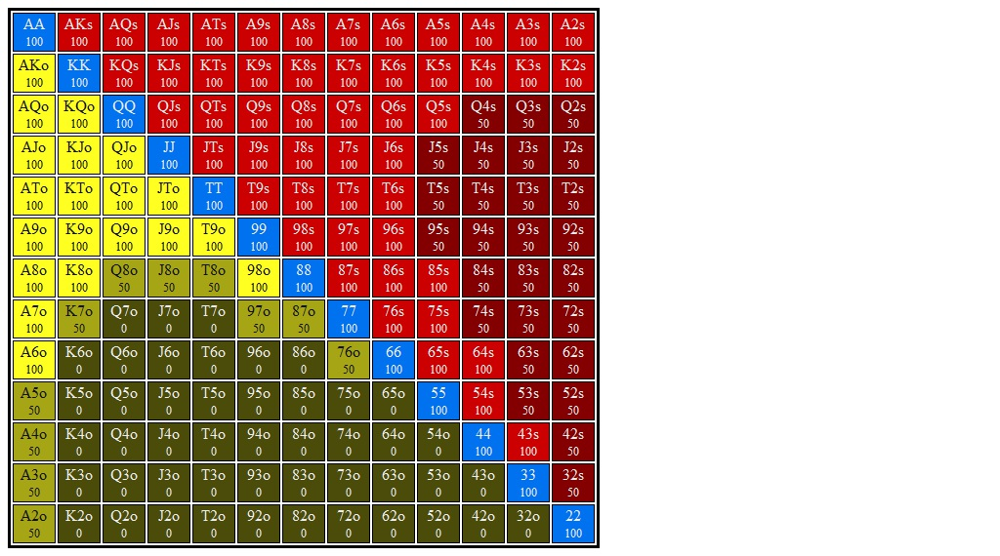

# Section 1: BB Calls BN Open

Blinds are $0.05/$0.10. Effective stacks are $10.00. You're on the button and action folds to you. You open for $0.30 (3bb), SB folds, and BB calls. You go to the flop with $9.70 behind and a pot of $0.65, and BB checks to you.
### Player Ranges

#### Hero's Button Opening Range Range

#### Villain's Big Blind Calling Range vs Button Range

### Flop 1: <b>A&spades;T&diams;5&clubs;</b>
1. **Approximate each player's equity. Who has the equity advantage?**

   The button has a significant equity advantage on this flop, probably about
   55%.

2. **What are the weakest hands that could go all in on the flop? Go for three streets of value on blank turns?**

   The some two pair like AT, A5, and maybe even T5, should be willing to go all
   in on this flop.

   Top pair top kicker can go for three streets, and maybe get all in on this flop?

3. **Which player has the nuts advantage?**

   The button has a clear nuts advantage.

4. **How static or dynamic is this flop? What aspects of this flop make it more static or dynamic?  How do these aspects interact with one another?**

   This is a very static flop. It is rainbow with a high card and no straights
   on board. There are some gutshots but most of these belong to the button who
   already has the equity and nuts advantage, so turns like a KQJ won't change
   benefit the big blind's range.

5. **On this flop do you prefer to bet small or large?  With what frequencies would you check and bet?**

   If we cbet small and BB calls we are happy to see any KQJ. Worst cards are a
   ten or a 5.

6. **Say you adopt a strategy where you either bet with your preferred sizing or check. You choose to bet and villain calls. What are the best and worst turn cards for your range?**

   I prefer a small cbet with 100% frequency.

#### Hands for flop A&spades;T&diams;5&clubs;
1. <b>J&diams;8&diams;</b>    (Flop: A&spades;T&diams;5&clubs;)

    1. **If you bet this hand should you expect better hands to fold? If so, which hands?**

        Some random K-high/Q-high will fold. Maybe a J9? We can barrel on a lot
        of turns and maybe force some random 5x out of the pot too.

        + **From the solver:** Yeah, we get some folds from hands that have us
          beat, not to mention clearing out a ton of equity.

          On a 9 turn we can barrel and get a lot of folds from 5x and Tx.

    2. **If you bet this hand should you expect worse hands to call? If so, which hands?**

        Worse shouldn't be calling very often, but some random drawing hands
        will sometimes call (64, 42, J8, 98 (though these last two are
        infrequent), and the first wo have very good equity against us).
        

    3. **Does this hand benefit from a protection bet? Explain.**

        No.

    4. **Does this hand benefit from growing the pot? How so?**

        No.

    5. **How is this hand doing if you bet and get called? What parts of villain's range are you ahead of? Behind?**

        We are behind most of their range, but this hand improves on a lot of
        turns allowing us to barrel, or try to get to showdown with some equity.

        + **From the solver:** We can barrel Q, K, 9, and some 7 turns. Interestingly,
            on a &diams; turn we aren't barreling that often. I'm assuming this is
            because we are protecting our checking range, and that we have other
            turned flush draws that prefer to bet.

    6. **How is this hand doing against a check-raise?**

        Not great, I think we should just fold.

        + **From the solver:** Yeah, fold 80% and reraise 20%.

    7. **What are this hand's incentives on this flop? Does it want to bet or check? If it wants to bet, what sizing does it prefer? Do these incentives line up with the strategy you proposed for your range above?**

        This hand has no showdown value but can become a nutty draw on the turn.
        This hand wants to fold out a lot of villain's weaker holdings and serve
        as a bluff on some turns.

        This hand is planning to check/give up on many turns.

        This hand does not want to see showdown.

        This hand want's to bet to get folds, and possibly barrel on some
        turns that bring in some backdoor equity. Since this is a combo
        backdoor draw I think this hand wants to bet a polarized if we
        are including a polarized sizing in our range. However, given
        that I'm opting for a small sizing on this board to push equity
        I'm going to say this hand wants to bet small with the intention
        of barrelling some turns.

    8. **Suppose you take your preferred action from the last question (check or bet the preferred size). If this is a bet, suppose villain calls. What are the best and worst turn cards for this hand?**

        + **Best Turns:** Any J or 8 give us some showdown value. A 9, Q, or K
          let us start betting with a polarized range. 

        + **Worst Turns:** We have no showdown value and are planning to give
          up on most turns that we don't connect with. Since we are betting
          this as a semibluff we want to keep villain's range as capped as
          possible.
          
          Thus, cards that hurt our EV the most will be cards that pair the
          board, especially a 5 or a T. We also don't want to see a 2, 3, or 4.
          A 2 brings in the wheel straight for their 43s, and a 3 or 4 makes
          some random 2pair. A 6 can give them some 2pair or some straight
          draws as well.

          What's more, random low cards can give them sets.

          Overall I think the worst cards are the following (no diamonds):
          + 5
          + T
          + 2, 3, 4, 6

        + **From the solver:** Our average EV is $0.25. Median EV is 0.19. Pot
          is $1.07
          + **Best Turns:**
            + 9&diams; ($0.69)
            + Q&diams; ($0.63)
            + Any J ($0.56)
            + 7&diams;
            + K&diams;

            These cards all give us a combo draw or 2nd pair. In addition to
            these cards, we are also happy to see any Q, K, 9, or 8, as well as
            any diamond

          + **Worst Turns:** 
            + Any non-diamond 6, 2, 3, 4, 5, T are all very bad for our EV ($0.06ish)
            + A non-diamond A ($0.09)

2. <b>K&spades;K&clubs;</b>    (Flop: A&spades;T&diams;5&clubs;)

    1. **If you bet this hand should you expect better hands to fold? If so, which hands?**

        Nope.

    2. **If you bet this hand should you expect worse hands to call? If so, which hands?**

        Yeah, any non-pair A is calling, as well as some draws.

    3. **Does this hand benefit from a protection bet? Explain.**

        Maybe a bit, but not really. We can get some backdoor equity to fold
        out, but there are no pairs villain can make on the turn that scare
        us. In practice villain might be folding out 22, 33, 44, 66, 77 some
        too often, so we can get protection from the odd turned set, but
        I think that at equilibrium villain should be calling these.

    4. **Does this hand benefit from growing the pot? How so?**

        No. It's a strong hand but doesn't want to play for stacks. Villain has
        plenty of Ax in their range, and we don't block any of it.

    5. **How is this hand doing if you bet and get called? What parts of villain's range are you ahead of? Behind?**

        We are doing fine. We are ahead of their Tx, 5x, and some draws. We are
        behind some Ax and some 2pair and some sets.

        + **From the Solver:** We should be ahead of about 73% of villain's
          calling range and behind about 27% of their range (24% top pair, 3%
          2 pair)

    6. **How is this hand doing against a check-raise?**

        It's in a tough spot. At equilibrium Villain should be polarized around
        our holding, and this means they can apply leverage over 3 streets. We
        do best by calling and evaluating on the turn.

        In practice I see a some players (and I myself will sometimes) x/r
        from OOP with 2nd pair for protection here. This is not GTO but we can
        get players off off stuff like QJo sometimes that has a fair amount of
        equity against us. In this particular spot I probably wouldn't since I
        don't think there are a ton of overs that will fold out (because they
        have a gutter and position they are unlikely to), but I think some
        players do this exploitatively (there is a redchip video on this kind
        of spot exactly, maybe they are going off of that?) and if I think a
        player is capable of this line it makes calling a lot more lucrative.
        They should be giving up on turns, so this doesn't _really_ make any
        difference (I'm calling here 100%, so while my actions probably don't
        change too much, my EV should be going up for this particular holding).

        + **From the solver:** 

            Yeah, we're in a tough spot. We are offered the choice to risk
            $0.54 to win a pot of $1.62, with an EV of $0.20 before the
            call and $0.64 of a $2.16 pot after the call.

            Our hand is strong (58% equity) but we are facing a polarized
            range and we severely under-realize equity (0.64 / 2.16 ~= 0.30 pot,
            realizing about half of our equity share of the pot).

            I said that villain should be polarized around our holding, but that's
            not true. Villain is raising hands like 54s, 53s, 75s, 65s, which I
            believe is a combination of betting low pairs for protection,
            uncapping range on 2, 3, 4, 5 runouts and adding some potential
            bluffs on later streets.

    7. **What are this hand's incentives on this flop? Does it want to bet or check? If it wants to bet, what sizing does it prefer? Do these incentives line up with the strategy you proposed for your range above?**

        This hand is strong and probably won't change in strength on most runouts.
        I think this hand is strong enough to bet for value, but it's also happy
        to pad out a checking range. It doesn't benefit much from protection and
        is strong enough to do well at showdown, so it also makes a natural check.
        I think  this is a pure check.

        + **From the solver:**  This hand bets almost 100% when we use only a
          small sizing. This is because we don't have a big checking range. If
          we chose a larger sizing (2/3 pot) then we are checking KK. When using
          both 1/3 and 2/3 we mix small cbet and check evenly.

    8. **Suppose you take your preferred action from the last question (check or bet the preferred size). If this is a bet, suppose villain calls. What are the best and worst turn cards for this hand?**

        + **Best Turns:**
          + K&hearts; (trips, no BDFD)
          + K&diams;
          + A&hearts;
          + Any other A
          + Q&hearts;, J&hearts;
          + Q&clubs;, Q&diams;, Q&spades;
          + J&clubs;, J&diams;, J&spades;
          + 9&spades; (blocks 3 combos A9o, which were beating us already)
        + **Worst Turns:** 
          + we don't want to see villain's range uncapped. Any low board
            pairing card (5, T) is bad news for us, as are cards that make
            2pair and straights. Potential backdoor flush draws and straight
            draws coming in on the turn are bad as well, because villain now
            has their choice of bluffs, putting us in a tough position.

            + Any 5, T
            + Any 6, 2, 3, 4, 7

3. <b>T&spades;4&spades;</b>    (Flop: A&spades;T&diams;5&clubs;)

    1. **If you bet this hand should you expect better hands to fold? If so, which hands?**

    2. **If you bet this hand should you expect worse hands to call? If so, which hands?**

    3. **Does this hand benefit from a protection bet? Explain.**

    4. **Does this hand benefit from growing the pot? How so?**

    5. **How is this hand doing if you bet and get called? What parts of villain's range are you ahead of? Behind?**

    6. **How is this hand doing against a check-raise?**

    7. **What are this hand's incentives on this flop? Does it want to bet or check? If it wants to bet, what sizing does it prefer? Do these incentives line up with the strategy you proposed for your range above?**

    8. **Suppose you take your preferred action from the last question (check or bet the preferred size). If this is a bet, suppose villain calls. What are the best and worst turn cards for this hand?**

4. <b>7&spades;5&spades;</b>    (Flop: A&spades;T&diams;5&clubs;)

    1. **If you bet this hand should you expect better hands to fold? If so, which hands?**

    2. **If you bet this hand should you expect worse hands to call? If so, which hands?**

    3. **Does this hand benefit from a protection bet? Explain.**

    4. **Does this hand benefit from growing the pot? How so?**

    5. **How is this hand doing if you bet and get called? What parts of villain's range are you ahead of? Behind?**

    6. **How is this hand doing against a check-raise?**

    7. **What are this hand's incentives on this flop? Does it want to bet or check? If it wants to bet, what sizing does it prefer? Do these incentives line up with the strategy you proposed for your range above?**

    8. **Suppose you take your preferred action from the last question (check or bet the preferred size). If this is a bet, suppose villain calls. What are the best and worst turn cards for this hand?**

5. <b>A&hearts;A&clubs;</b>    (Flop: A&spades;T&diams;5&clubs;)

    1. **If you bet this hand should you expect better hands to fold? If so, which hands?**

    2. **If you bet this hand should you expect worse hands to call? If so, which hands?**

    3. **Does this hand benefit from a protection bet? Explain.**

    4. **Does this hand benefit from growing the pot? How so?**

    5. **How is this hand doing if you bet and get called? What parts of villain's range are you ahead of? Behind?**

    6. **How is this hand doing against a check-raise?**

    7. **What are this hand's incentives on this flop? Does it want to bet or check? If it wants to bet, what sizing does it prefer? Do these incentives line up with the strategy you proposed for your range above?**

    8. **Suppose you take your preferred action from the last question (check or bet the preferred size). If this is a bet, suppose villain calls. What are the best and worst turn cards for this hand?**

6. <b>5&hearts;3&hearts;</b>    (Flop: A&spades;T&diams;5&clubs;)

    1. **If you bet this hand should you expect better hands to fold? If so, which hands?**

    2. **If you bet this hand should you expect worse hands to call? If so, which hands?**

    3. **Does this hand benefit from a protection bet? Explain.**

    4. **Does this hand benefit from growing the pot? How so?**

    5. **How is this hand doing if you bet and get called? What parts of villain's range are you ahead of? Behind?**

    6. **How is this hand doing against a check-raise?**

    7. **What are this hand's incentives on this flop? Does it want to bet or check? If it wants to bet, what sizing does it prefer? Do these incentives line up with the strategy you proposed for your range above?**

    8. **Suppose you take your preferred action from the last question (check or bet the preferred size). If this is a bet, suppose villain calls. What are the best and worst turn cards for this hand?**

7. <b>9&spades;4&spades;</b>    (Flop: A&spades;T&diams;5&clubs;)

    1. **If you bet this hand should you expect better hands to fold? If so, which hands?**

    2. **If you bet this hand should you expect worse hands to call? If so, which hands?**

    3. **Does this hand benefit from a protection bet? Explain.**

    4. **Does this hand benefit from growing the pot? How so?**

    5. **How is this hand doing if you bet and get called? What parts of villain's range are you ahead of? Behind?**

    6. **How is this hand doing against a check-raise?**

    7. **What are this hand's incentives on this flop? Does it want to bet or check? If it wants to bet, what sizing does it prefer? Do these incentives line up with the strategy you proposed for your range above?**

    8. **Suppose you take your preferred action from the last question (check or bet the preferred size). If this is a bet, suppose villain calls. What are the best and worst turn cards for this hand?**

8. <b>T&hearts;8&hearts;</b>    (Flop: A&spades;T&diams;5&clubs;)

    1. **If you bet this hand should you expect better hands to fold? If so, which hands?**

    2. **If you bet this hand should you expect worse hands to call? If so, which hands?**

    3. **Does this hand benefit from a protection bet? Explain.**

    4. **Does this hand benefit from growing the pot? How so?**

    5. **How is this hand doing if you bet and get called? What parts of villain's range are you ahead of? Behind?**

    6. **How is this hand doing against a check-raise?**

    7. **What are this hand's incentives on this flop? Does it want to bet or check? If it wants to bet, what sizing does it prefer? Do these incentives line up with the strategy you proposed for your range above?**

    8. **Suppose you take your preferred action from the last question (check or bet the preferred size). If this is a bet, suppose villain calls. What are the best and worst turn cards for this hand?**

9. <b>7&clubs;6&spades;</b>    (Flop: A&spades;T&diams;5&clubs;)

    1. **If you bet this hand should you expect better hands to fold? If so, which hands?**

    2. **If you bet this hand should you expect worse hands to call? If so, which hands?**

    3. **Does this hand benefit from a protection bet? Explain.**

    4. **Does this hand benefit from growing the pot? How so?**

    5. **How is this hand doing if you bet and get called? What parts of villain's range are you ahead of? Behind?**

    6. **How is this hand doing against a check-raise?**

    7. **What are this hand's incentives on this flop? Does it want to bet or check? If it wants to bet, what sizing does it prefer? Do these incentives line up with the strategy you proposed for your range above?**

    8. **Suppose you take your preferred action from the last question (check or bet the preferred size). If this is a bet, suppose villain calls. What are the best and worst turn cards for this hand?**

10. <b>7&hearts;2&hearts;</b>    (Flop: A&spades;T&diams;5&clubs;)

    1. **If you bet this hand should you expect better hands to fold? If so, which hands?**

    2. **If you bet this hand should you expect worse hands to call? If so, which hands?**

    3. **Does this hand benefit from a protection bet? Explain.**

    4. **Does this hand benefit from growing the pot? How so?**

    5. **How is this hand doing if you bet and get called? What parts of villain's range are you ahead of? Behind?**

    6. **How is this hand doing against a check-raise?**

    7. **What are this hand's incentives on this flop? Does it want to bet or check? If it wants to bet, what sizing does it prefer? Do these incentives line up with the strategy you proposed for your range above?**

    8. **Suppose you take your preferred action from the last question (check or bet the preferred size). If this is a bet, suppose villain calls. What are the best and worst turn cards for this hand?**

### Flop 2: <b>T&spades;4&spades;2&spades;</b>
1. **Approximate each player's equity. Who has the equity advantage?**

2. **What are the weakest hands that could go all in on the flop? Go for three streets of value on blank turns?**

3. **Which player has the nuts advantage?**

4. **How static or dynamic is this flop? What aspects of this flop make it more static or dynamic?  How do these aspects interact with one another?**

5. **On this flop do you prefer to bet small or large?  With what frequencies would you check and bet?**

6. **Say you adopt a strategy where you either bet with your preferred sizing or check. You choose to bet and villain calls. What are the best and worst turn cards for your range?**

#### Hands for flop T&spades;4&spades;2&spades;
1. <b>3&diams;2&diams;</b>    (Flop: T&spades;4&spades;2&spades;)

    1. **If you bet this hand should you expect better hands to fold? If so, which hands?**

    2. **If you bet this hand should you expect worse hands to call? If so, which hands?**

    3. **Does this hand benefit from a protection bet? Explain.**

    4. **Does this hand benefit from growing the pot? How so?**

    5. **How is this hand doing if you bet and get called? What parts of villain's range are you ahead of? Behind?**

    6. **How is this hand doing against a check-raise?**

    7. **What are this hand's incentives on this flop? Does it want to bet or check? If it wants to bet, what sizing does it prefer? Do these incentives line up with the strategy you proposed for your range above?**

    8. **Suppose you take your preferred action from the last question (check or bet the preferred size). If this is a bet, suppose villain calls. What are the best and worst turn cards for this hand?**

2. <b>K&spades;9&hearts;</b>    (Flop: T&spades;4&spades;2&spades;)

    1. **If you bet this hand should you expect better hands to fold? If so, which hands?**

    2. **If you bet this hand should you expect worse hands to call? If so, which hands?**

    3. **Does this hand benefit from a protection bet? Explain.**

    4. **Does this hand benefit from growing the pot? How so?**

    5. **How is this hand doing if you bet and get called? What parts of villain's range are you ahead of? Behind?**

    6. **How is this hand doing against a check-raise?**

    7. **What are this hand's incentives on this flop? Does it want to bet or check? If it wants to bet, what sizing does it prefer? Do these incentives line up with the strategy you proposed for your range above?**

    8. **Suppose you take your preferred action from the last question (check or bet the preferred size). If this is a bet, suppose villain calls. What are the best and worst turn cards for this hand?**

3. <b>A&hearts;7&clubs;</b>    (Flop: T&spades;4&spades;2&spades;)

    1. **If you bet this hand should you expect better hands to fold? If so, which hands?**

    2. **If you bet this hand should you expect worse hands to call? If so, which hands?**

    3. **Does this hand benefit from a protection bet? Explain.**

    4. **Does this hand benefit from growing the pot? How so?**

    5. **How is this hand doing if you bet and get called? What parts of villain's range are you ahead of? Behind?**

    6. **How is this hand doing against a check-raise?**

    7. **What are this hand's incentives on this flop? Does it want to bet or check? If it wants to bet, what sizing does it prefer? Do these incentives line up with the strategy you proposed for your range above?**

    8. **Suppose you take your preferred action from the last question (check or bet the preferred size). If this is a bet, suppose villain calls. What are the best and worst turn cards for this hand?**

4. <b>T&hearts;6&hearts;</b>    (Flop: T&spades;4&spades;2&spades;)

    1. **If you bet this hand should you expect better hands to fold? If so, which hands?**

    2. **If you bet this hand should you expect worse hands to call? If so, which hands?**

    3. **Does this hand benefit from a protection bet? Explain.**

    4. **Does this hand benefit from growing the pot? How so?**

    5. **How is this hand doing if you bet and get called? What parts of villain's range are you ahead of? Behind?**

    6. **How is this hand doing against a check-raise?**

    7. **What are this hand's incentives on this flop? Does it want to bet or check? If it wants to bet, what sizing does it prefer? Do these incentives line up with the strategy you proposed for your range above?**

    8. **Suppose you take your preferred action from the last question (check or bet the preferred size). If this is a bet, suppose villain calls. What are the best and worst turn cards for this hand?**

5. <b>6&hearts;4&hearts;</b>    (Flop: T&spades;4&spades;2&spades;)

    1. **If you bet this hand should you expect better hands to fold? If so, which hands?**

    2. **If you bet this hand should you expect worse hands to call? If so, which hands?**

    3. **Does this hand benefit from a protection bet? Explain.**

    4. **Does this hand benefit from growing the pot? How so?**

    5. **How is this hand doing if you bet and get called? What parts of villain's range are you ahead of? Behind?**

    6. **How is this hand doing against a check-raise?**

    7. **What are this hand's incentives on this flop? Does it want to bet or check? If it wants to bet, what sizing does it prefer? Do these incentives line up with the strategy you proposed for your range above?**

    8. **Suppose you take your preferred action from the last question (check or bet the preferred size). If this is a bet, suppose villain calls. What are the best and worst turn cards for this hand?**

6. <b>T&clubs;5&clubs;</b>    (Flop: T&spades;4&spades;2&spades;)

    1. **If you bet this hand should you expect better hands to fold? If so, which hands?**

    2. **If you bet this hand should you expect worse hands to call? If so, which hands?**

    3. **Does this hand benefit from a protection bet? Explain.**

    4. **Does this hand benefit from growing the pot? How so?**

    5. **How is this hand doing if you bet and get called? What parts of villain's range are you ahead of? Behind?**

    6. **How is this hand doing against a check-raise?**

    7. **What are this hand's incentives on this flop? Does it want to bet or check? If it wants to bet, what sizing does it prefer? Do these incentives line up with the strategy you proposed for your range above?**

    8. **Suppose you take your preferred action from the last question (check or bet the preferred size). If this is a bet, suppose villain calls. What are the best and worst turn cards for this hand?**

7. <b>K&clubs;Q&clubs;</b>    (Flop: T&spades;4&spades;2&spades;)

    1. **If you bet this hand should you expect better hands to fold? If so, which hands?**

    2. **If you bet this hand should you expect worse hands to call? If so, which hands?**

    3. **Does this hand benefit from a protection bet? Explain.**

    4. **Does this hand benefit from growing the pot? How so?**

    5. **How is this hand doing if you bet and get called? What parts of villain's range are you ahead of? Behind?**

    6. **How is this hand doing against a check-raise?**

    7. **What are this hand's incentives on this flop? Does it want to bet or check? If it wants to bet, what sizing does it prefer? Do these incentives line up with the strategy you proposed for your range above?**

    8. **Suppose you take your preferred action from the last question (check or bet the preferred size). If this is a bet, suppose villain calls. What are the best and worst turn cards for this hand?**

8. <b>K&spades;8&spades;</b>    (Flop: T&spades;4&spades;2&spades;)

    1. **If you bet this hand should you expect better hands to fold? If so, which hands?**

    2. **If you bet this hand should you expect worse hands to call? If so, which hands?**

    3. **Does this hand benefit from a protection bet? Explain.**

    4. **Does this hand benefit from growing the pot? How so?**

    5. **How is this hand doing if you bet and get called? What parts of villain's range are you ahead of? Behind?**

    6. **How is this hand doing against a check-raise?**

    7. **What are this hand's incentives on this flop? Does it want to bet or check? If it wants to bet, what sizing does it prefer? Do these incentives line up with the strategy you proposed for your range above?**

    8. **Suppose you take your preferred action from the last question (check or bet the preferred size). If this is a bet, suppose villain calls. What are the best and worst turn cards for this hand?**

9. <b>K&hearts;4&hearts;</b>    (Flop: T&spades;4&spades;2&spades;)

    1. **If you bet this hand should you expect better hands to fold? If so, which hands?**

    2. **If you bet this hand should you expect worse hands to call? If so, which hands?**

    3. **Does this hand benefit from a protection bet? Explain.**

    4. **Does this hand benefit from growing the pot? How so?**

    5. **How is this hand doing if you bet and get called? What parts of villain's range are you ahead of? Behind?**

    6. **How is this hand doing against a check-raise?**

    7. **What are this hand's incentives on this flop? Does it want to bet or check? If it wants to bet, what sizing does it prefer? Do these incentives line up with the strategy you proposed for your range above?**

    8. **Suppose you take your preferred action from the last question (check or bet the preferred size). If this is a bet, suppose villain calls. What are the best and worst turn cards for this hand?**

10. <b>A&diams;Q&hearts;</b>    (Flop: T&spades;4&spades;2&spades;)

    1. **If you bet this hand should you expect better hands to fold? If so, which hands?**

    2. **If you bet this hand should you expect worse hands to call? If so, which hands?**

    3. **Does this hand benefit from a protection bet? Explain.**

    4. **Does this hand benefit from growing the pot? How so?**

    5. **How is this hand doing if you bet and get called? What parts of villain's range are you ahead of? Behind?**

    6. **How is this hand doing against a check-raise?**

    7. **What are this hand's incentives on this flop? Does it want to bet or check? If it wants to bet, what sizing does it prefer? Do these incentives line up with the strategy you proposed for your range above?**

    8. **Suppose you take your preferred action from the last question (check or bet the preferred size). If this is a bet, suppose villain calls. What are the best and worst turn cards for this hand?**

### Flop 3: <b>7&spades;6&spades;6&diams;</b>
1. **Approximate each player's equity. Who has the equity advantage?**

2. **What are the weakest hands that could go all in on the flop? Go for three streets of value on blank turns?**

3. **Which player has the nuts advantage?**

4. **How static or dynamic is this flop? What aspects of this flop make it more static or dynamic?  How do these aspects interact with one another?**

5. **On this flop do you prefer to bet small or large?  With what frequencies would you check and bet?**

6. **Say you adopt a strategy where you either bet with your preferred sizing or check. You choose to bet and villain calls. What are the best and worst turn cards for your range?**

#### Hands for flop 7&spades;6&spades;6&diams;
1. <b>A&clubs;K&hearts;</b>    (Flop: 7&spades;6&spades;6&diams;)

    1. **If you bet this hand should you expect better hands to fold? If so, which hands?**

    2. **If you bet this hand should you expect worse hands to call? If so, which hands?**

    3. **Does this hand benefit from a protection bet? Explain.**

    4. **Does this hand benefit from growing the pot? How so?**

    5. **How is this hand doing if you bet and get called? What parts of villain's range are you ahead of? Behind?**

    6. **How is this hand doing against a check-raise?**

    7. **What are this hand's incentives on this flop? Does it want to bet or check? If it wants to bet, what sizing does it prefer? Do these incentives line up with the strategy you proposed for your range above?**

    8. **Suppose you take your preferred action from the last question (check or bet the preferred size). If this is a bet, suppose villain calls. What are the best and worst turn cards for this hand?**

2. <b>7&hearts;6&hearts;</b>    (Flop: 7&spades;6&spades;6&diams;)

    1. **If you bet this hand should you expect better hands to fold? If so, which hands?**

    2. **If you bet this hand should you expect worse hands to call? If so, which hands?**

    3. **Does this hand benefit from a protection bet? Explain.**

    4. **Does this hand benefit from growing the pot? How so?**

    5. **How is this hand doing if you bet and get called? What parts of villain's range are you ahead of? Behind?**

    6. **How is this hand doing against a check-raise?**

    7. **What are this hand's incentives on this flop? Does it want to bet or check? If it wants to bet, what sizing does it prefer? Do these incentives line up with the strategy you proposed for your range above?**

    8. **Suppose you take your preferred action from the last question (check or bet the preferred size). If this is a bet, suppose villain calls. What are the best and worst turn cards for this hand?**

3. <b>A&clubs;4&clubs;</b>    (Flop: 7&spades;6&spades;6&diams;)

    1. **If you bet this hand should you expect better hands to fold? If so, which hands?**

    2. **If you bet this hand should you expect worse hands to call? If so, which hands?**

    3. **Does this hand benefit from a protection bet? Explain.**

    4. **Does this hand benefit from growing the pot? How so?**

    5. **How is this hand doing if you bet and get called? What parts of villain's range are you ahead of? Behind?**

    6. **How is this hand doing against a check-raise?**

    7. **What are this hand's incentives on this flop? Does it want to bet or check? If it wants to bet, what sizing does it prefer? Do these incentives line up with the strategy you proposed for your range above?**

    8. **Suppose you take your preferred action from the last question (check or bet the preferred size). If this is a bet, suppose villain calls. What are the best and worst turn cards for this hand?**

4. <b>T&spades;5&spades;</b>    (Flop: 7&spades;6&spades;6&diams;)

    1. **If you bet this hand should you expect better hands to fold? If so, which hands?**

    2. **If you bet this hand should you expect worse hands to call? If so, which hands?**

    3. **Does this hand benefit from a protection bet? Explain.**

    4. **Does this hand benefit from growing the pot? How so?**

    5. **How is this hand doing if you bet and get called? What parts of villain's range are you ahead of? Behind?**

    6. **How is this hand doing against a check-raise?**

    7. **What are this hand's incentives on this flop? Does it want to bet or check? If it wants to bet, what sizing does it prefer? Do these incentives line up with the strategy you proposed for your range above?**

    8. **Suppose you take your preferred action from the last question (check or bet the preferred size). If this is a bet, suppose villain calls. What are the best and worst turn cards for this hand?**

5. <b>A&hearts;3&hearts;</b>    (Flop: 7&spades;6&spades;6&diams;)

    1. **If you bet this hand should you expect better hands to fold? If so, which hands?**

    2. **If you bet this hand should you expect worse hands to call? If so, which hands?**

    3. **Does this hand benefit from a protection bet? Explain.**

    4. **Does this hand benefit from growing the pot? How so?**

    5. **How is this hand doing if you bet and get called? What parts of villain's range are you ahead of? Behind?**

    6. **How is this hand doing against a check-raise?**

    7. **What are this hand's incentives on this flop? Does it want to bet or check? If it wants to bet, what sizing does it prefer? Do these incentives line up with the strategy you proposed for your range above?**

    8. **Suppose you take your preferred action from the last question (check or bet the preferred size). If this is a bet, suppose villain calls. What are the best and worst turn cards for this hand?**

6. <b>A&diams;A&clubs;</b>    (Flop: 7&spades;6&spades;6&diams;)

    1. **If you bet this hand should you expect better hands to fold? If so, which hands?**

    2. **If you bet this hand should you expect worse hands to call? If so, which hands?**

    3. **Does this hand benefit from a protection bet? Explain.**

    4. **Does this hand benefit from growing the pot? How so?**

    5. **How is this hand doing if you bet and get called? What parts of villain's range are you ahead of? Behind?**

    6. **How is this hand doing against a check-raise?**

    7. **What are this hand's incentives on this flop? Does it want to bet or check? If it wants to bet, what sizing does it prefer? Do these incentives line up with the strategy you proposed for your range above?**

    8. **Suppose you take your preferred action from the last question (check or bet the preferred size). If this is a bet, suppose villain calls. What are the best and worst turn cards for this hand?**

7. <b>K&diams;3&diams;</b>    (Flop: 7&spades;6&spades;6&diams;)

    1. **If you bet this hand should you expect better hands to fold? If so, which hands?**

    2. **If you bet this hand should you expect worse hands to call? If so, which hands?**

    3. **Does this hand benefit from a protection bet? Explain.**

    4. **Does this hand benefit from growing the pot? How so?**

    5. **How is this hand doing if you bet and get called? What parts of villain's range are you ahead of? Behind?**

    6. **How is this hand doing against a check-raise?**

    7. **What are this hand's incentives on this flop? Does it want to bet or check? If it wants to bet, what sizing does it prefer? Do these incentives line up with the strategy you proposed for your range above?**

    8. **Suppose you take your preferred action from the last question (check or bet the preferred size). If this is a bet, suppose villain calls. What are the best and worst turn cards for this hand?**

8. <b>7&clubs;2&clubs;</b>    (Flop: 7&spades;6&spades;6&diams;)

    1. **If you bet this hand should you expect better hands to fold? If so, which hands?**

    2. **If you bet this hand should you expect worse hands to call? If so, which hands?**

    3. **Does this hand benefit from a protection bet? Explain.**

    4. **Does this hand benefit from growing the pot? How so?**

    5. **How is this hand doing if you bet and get called? What parts of villain's range are you ahead of? Behind?**

    6. **How is this hand doing against a check-raise?**

    7. **What are this hand's incentives on this flop? Does it want to bet or check? If it wants to bet, what sizing does it prefer? Do these incentives line up with the strategy you proposed for your range above?**

    8. **Suppose you take your preferred action from the last question (check or bet the preferred size). If this is a bet, suppose villain calls. What are the best and worst turn cards for this hand?**

9. <b>K&spades;7&hearts;</b>    (Flop: 7&spades;6&spades;6&diams;)

    1. **If you bet this hand should you expect better hands to fold? If so, which hands?**

    2. **If you bet this hand should you expect worse hands to call? If so, which hands?**

    3. **Does this hand benefit from a protection bet? Explain.**

    4. **Does this hand benefit from growing the pot? How so?**

    5. **How is this hand doing if you bet and get called? What parts of villain's range are you ahead of? Behind?**

    6. **How is this hand doing against a check-raise?**

    7. **What are this hand's incentives on this flop? Does it want to bet or check? If it wants to bet, what sizing does it prefer? Do these incentives line up with the strategy you proposed for your range above?**

    8. **Suppose you take your preferred action from the last question (check or bet the preferred size). If this is a bet, suppose villain calls. What are the best and worst turn cards for this hand?**

10. <b>K&clubs;J&hearts;</b>    (Flop: 7&spades;6&spades;6&diams;)

    1. **If you bet this hand should you expect better hands to fold? If so, which hands?**

    2. **If you bet this hand should you expect worse hands to call? If so, which hands?**

    3. **Does this hand benefit from a protection bet? Explain.**

    4. **Does this hand benefit from growing the pot? How so?**

    5. **How is this hand doing if you bet and get called? What parts of villain's range are you ahead of? Behind?**

    6. **How is this hand doing against a check-raise?**

    7. **What are this hand's incentives on this flop? Does it want to bet or check? If it wants to bet, what sizing does it prefer? Do these incentives line up with the strategy you proposed for your range above?**

    8. **Suppose you take your preferred action from the last question (check or bet the preferred size). If this is a bet, suppose villain calls. What are the best and worst turn cards for this hand?**

### Flop 4: <b>Q&spades;8&diams;6&spades;</b>
1. **Approximate each player's equity. Who has the equity advantage?**

2. **What are the weakest hands that could go all in on the flop? Go for three streets of value on blank turns?**

3. **Which player has the nuts advantage?**

4. **How static or dynamic is this flop? What aspects of this flop make it more static or dynamic?  How do these aspects interact with one another?**

5. **On this flop do you prefer to bet small or large?  With what frequencies would you check and bet?**

6. **Say you adopt a strategy where you either bet with your preferred sizing or check. You choose to bet and villain calls. What are the best and worst turn cards for your range?**

#### Hands for flop Q&spades;8&diams;6&spades;
1. <b>J&spades;T&hearts;</b>    (Flop: Q&spades;8&diams;6&spades;)

    1. **If you bet this hand should you expect better hands to fold? If so, which hands?**

    2. **If you bet this hand should you expect worse hands to call? If so, which hands?**

    3. **Does this hand benefit from a protection bet? Explain.**

    4. **Does this hand benefit from growing the pot? How so?**

    5. **How is this hand doing if you bet and get called? What parts of villain's range are you ahead of? Behind?**

    6. **How is this hand doing against a check-raise?**

    7. **What are this hand's incentives on this flop? Does it want to bet or check? If it wants to bet, what sizing does it prefer? Do these incentives line up with the strategy you proposed for your range above?**

    8. **Suppose you take your preferred action from the last question (check or bet the preferred size). If this is a bet, suppose villain calls. What are the best and worst turn cards for this hand?**

2. <b>7&spades;2&spades;</b>    (Flop: Q&spades;8&diams;6&spades;)

    1. **If you bet this hand should you expect better hands to fold? If so, which hands?**

    2. **If you bet this hand should you expect worse hands to call? If so, which hands?**

    3. **Does this hand benefit from a protection bet? Explain.**

    4. **Does this hand benefit from growing the pot? How so?**

    5. **How is this hand doing if you bet and get called? What parts of villain's range are you ahead of? Behind?**

    6. **How is this hand doing against a check-raise?**

    7. **What are this hand's incentives on this flop? Does it want to bet or check? If it wants to bet, what sizing does it prefer? Do these incentives line up with the strategy you proposed for your range above?**

    8. **Suppose you take your preferred action from the last question (check or bet the preferred size). If this is a bet, suppose villain calls. What are the best and worst turn cards for this hand?**

3. <b>8&clubs;7&clubs;</b>    (Flop: Q&spades;8&diams;6&spades;)

    1. **If you bet this hand should you expect better hands to fold? If so, which hands?**

    2. **If you bet this hand should you expect worse hands to call? If so, which hands?**

    3. **Does this hand benefit from a protection bet? Explain.**

    4. **Does this hand benefit from growing the pot? How so?**

    5. **How is this hand doing if you bet and get called? What parts of villain's range are you ahead of? Behind?**

    6. **How is this hand doing against a check-raise?**

    7. **What are this hand's incentives on this flop? Does it want to bet or check? If it wants to bet, what sizing does it prefer? Do these incentives line up with the strategy you proposed for your range above?**

    8. **Suppose you take your preferred action from the last question (check or bet the preferred size). If this is a bet, suppose villain calls. What are the best and worst turn cards for this hand?**

4. <b>A&clubs;4&clubs;</b>    (Flop: Q&spades;8&diams;6&spades;)

    1. **If you bet this hand should you expect better hands to fold? If so, which hands?**

    2. **If you bet this hand should you expect worse hands to call? If so, which hands?**

    3. **Does this hand benefit from a protection bet? Explain.**

    4. **Does this hand benefit from growing the pot? How so?**

    5. **How is this hand doing if you bet and get called? What parts of villain's range are you ahead of? Behind?**

    6. **How is this hand doing against a check-raise?**

    7. **What are this hand's incentives on this flop? Does it want to bet or check? If it wants to bet, what sizing does it prefer? Do these incentives line up with the strategy you proposed for your range above?**

    8. **Suppose you take your preferred action from the last question (check or bet the preferred size). If this is a bet, suppose villain calls. What are the best and worst turn cards for this hand?**

5. <b>3&hearts;2&hearts;</b>    (Flop: Q&spades;8&diams;6&spades;)

    1. **If you bet this hand should you expect better hands to fold? If so, which hands?**

    2. **If you bet this hand should you expect worse hands to call? If so, which hands?**

    3. **Does this hand benefit from a protection bet? Explain.**

    4. **Does this hand benefit from growing the pot? How so?**

    5. **How is this hand doing if you bet and get called? What parts of villain's range are you ahead of? Behind?**

    6. **How is this hand doing against a check-raise?**

    7. **What are this hand's incentives on this flop? Does it want to bet or check? If it wants to bet, what sizing does it prefer? Do these incentives line up with the strategy you proposed for your range above?**

    8. **Suppose you take your preferred action from the last question (check or bet the preferred size). If this is a bet, suppose villain calls. What are the best and worst turn cards for this hand?**

6. <b>J&spades;5&spades;</b>    (Flop: Q&spades;8&diams;6&spades;)

    1. **If you bet this hand should you expect better hands to fold? If so, which hands?**

    2. **If you bet this hand should you expect worse hands to call? If so, which hands?**

    3. **Does this hand benefit from a protection bet? Explain.**

    4. **Does this hand benefit from growing the pot? How so?**

    5. **How is this hand doing if you bet and get called? What parts of villain's range are you ahead of? Behind?**

    6. **How is this hand doing against a check-raise?**

    7. **What are this hand's incentives on this flop? Does it want to bet or check? If it wants to bet, what sizing does it prefer? Do these incentives line up with the strategy you proposed for your range above?**

    8. **Suppose you take your preferred action from the last question (check or bet the preferred size). If this is a bet, suppose villain calls. What are the best and worst turn cards for this hand?**

7. <b>Q&diams;9&clubs;</b>    (Flop: Q&spades;8&diams;6&spades;)

    1. **If you bet this hand should you expect better hands to fold? If so, which hands?**

    2. **If you bet this hand should you expect worse hands to call? If so, which hands?**

    3. **Does this hand benefit from a protection bet? Explain.**

    4. **Does this hand benefit from growing the pot? How so?**

    5. **How is this hand doing if you bet and get called? What parts of villain's range are you ahead of? Behind?**

    6. **How is this hand doing against a check-raise?**

    7. **What are this hand's incentives on this flop? Does it want to bet or check? If it wants to bet, what sizing does it prefer? Do these incentives line up with the strategy you proposed for your range above?**

    8. **Suppose you take your preferred action from the last question (check or bet the preferred size). If this is a bet, suppose villain calls. What are the best and worst turn cards for this hand?**

8. <b>Q&hearts;5&hearts;</b>    (Flop: Q&spades;8&diams;6&spades;)

    1. **If you bet this hand should you expect better hands to fold? If so, which hands?**

    2. **If you bet this hand should you expect worse hands to call? If so, which hands?**

    3. **Does this hand benefit from a protection bet? Explain.**

    4. **Does this hand benefit from growing the pot? How so?**

    5. **How is this hand doing if you bet and get called? What parts of villain's range are you ahead of? Behind?**

    6. **How is this hand doing against a check-raise?**

    7. **What are this hand's incentives on this flop? Does it want to bet or check? If it wants to bet, what sizing does it prefer? Do these incentives line up with the strategy you proposed for your range above?**

    8. **Suppose you take your preferred action from the last question (check or bet the preferred size). If this is a bet, suppose villain calls. What are the best and worst turn cards for this hand?**

9. <b>9&clubs;2&clubs;</b>    (Flop: Q&spades;8&diams;6&spades;)

    1. **If you bet this hand should you expect better hands to fold? If so, which hands?**

    2. **If you bet this hand should you expect worse hands to call? If so, which hands?**

    3. **Does this hand benefit from a protection bet? Explain.**

    4. **Does this hand benefit from growing the pot? How so?**

    5. **How is this hand doing if you bet and get called? What parts of villain's range are you ahead of? Behind?**

    6. **How is this hand doing against a check-raise?**

    7. **What are this hand's incentives on this flop? Does it want to bet or check? If it wants to bet, what sizing does it prefer? Do these incentives line up with the strategy you proposed for your range above?**

    8. **Suppose you take your preferred action from the last question (check or bet the preferred size). If this is a bet, suppose villain calls. What are the best and worst turn cards for this hand?**

10. <b>T&spades;9&clubs;</b>    (Flop: Q&spades;8&diams;6&spades;)

    1. **If you bet this hand should you expect better hands to fold? If so, which hands?**

    2. **If you bet this hand should you expect worse hands to call? If so, which hands?**

    3. **Does this hand benefit from a protection bet? Explain.**

    4. **Does this hand benefit from growing the pot? How so?**

    5. **How is this hand doing if you bet and get called? What parts of villain's range are you ahead of? Behind?**

    6. **How is this hand doing against a check-raise?**

    7. **What are this hand's incentives on this flop? Does it want to bet or check? If it wants to bet, what sizing does it prefer? Do these incentives line up with the strategy you proposed for your range above?**

    8. **Suppose you take your preferred action from the last question (check or bet the preferred size). If this is a bet, suppose villain calls. What are the best and worst turn cards for this hand?**

### Flop 5: <b>8&spades;5&diams;3&diams;</b>
1. **Approximate each player's equity. Who has the equity advantage?**

2. **What are the weakest hands that could go all in on the flop? Go for three streets of value on blank turns?**

3. **Which player has the nuts advantage?**

4. **How static or dynamic is this flop? What aspects of this flop make it more static or dynamic?  How do these aspects interact with one another?**

5. **On this flop do you prefer to bet small or large?  With what frequencies would you check and bet?**

6. **Say you adopt a strategy where you either bet with your preferred sizing or check. You choose to bet and villain calls. What are the best and worst turn cards for your range?**

#### Hands for flop 8&spades;5&diams;3&diams;
1. <b>Q&diams;9&clubs;</b>    (Flop: 8&spades;5&diams;3&diams;)

    1. **If you bet this hand should you expect better hands to fold? If so, which hands?**

    2. **If you bet this hand should you expect worse hands to call? If so, which hands?**

    3. **Does this hand benefit from a protection bet? Explain.**

    4. **Does this hand benefit from growing the pot? How so?**

    5. **How is this hand doing if you bet and get called? What parts of villain's range are you ahead of? Behind?**

    6. **How is this hand doing against a check-raise?**

    7. **What are this hand's incentives on this flop? Does it want to bet or check? If it wants to bet, what sizing does it prefer? Do these incentives line up with the strategy you proposed for your range above?**

    8. **Suppose you take your preferred action from the last question (check or bet the preferred size). If this is a bet, suppose villain calls. What are the best and worst turn cards for this hand?**

2. <b>9&hearts;4&hearts;</b>    (Flop: 8&spades;5&diams;3&diams;)

    1. **If you bet this hand should you expect better hands to fold? If so, which hands?**

    2. **If you bet this hand should you expect worse hands to call? If so, which hands?**

    3. **Does this hand benefit from a protection bet? Explain.**

    4. **Does this hand benefit from growing the pot? How so?**

    5. **How is this hand doing if you bet and get called? What parts of villain's range are you ahead of? Behind?**

    6. **How is this hand doing against a check-raise?**

    7. **What are this hand's incentives on this flop? Does it want to bet or check? If it wants to bet, what sizing does it prefer? Do these incentives line up with the strategy you proposed for your range above?**

    8. **Suppose you take your preferred action from the last question (check or bet the preferred size). If this is a bet, suppose villain calls. What are the best and worst turn cards for this hand?**

3. <b>A&clubs;8&diams;</b>    (Flop: 8&spades;5&diams;3&diams;)

    1. **If you bet this hand should you expect better hands to fold? If so, which hands?**

    2. **If you bet this hand should you expect worse hands to call? If so, which hands?**

    3. **Does this hand benefit from a protection bet? Explain.**

    4. **Does this hand benefit from growing the pot? How so?**

    5. **How is this hand doing if you bet and get called? What parts of villain's range are you ahead of? Behind?**

    6. **How is this hand doing against a check-raise?**

    7. **What are this hand's incentives on this flop? Does it want to bet or check? If it wants to bet, what sizing does it prefer? Do these incentives line up with the strategy you proposed for your range above?**

    8. **Suppose you take your preferred action from the last question (check or bet the preferred size). If this is a bet, suppose villain calls. What are the best and worst turn cards for this hand?**

4. <b>3&hearts;2&hearts;</b>    (Flop: 8&spades;5&diams;3&diams;)

    1. **If you bet this hand should you expect better hands to fold? If so, which hands?**

    2. **If you bet this hand should you expect worse hands to call? If so, which hands?**

    3. **Does this hand benefit from a protection bet? Explain.**

    4. **Does this hand benefit from growing the pot? How so?**

    5. **How is this hand doing if you bet and get called? What parts of villain's range are you ahead of? Behind?**

    6. **How is this hand doing against a check-raise?**

    7. **What are this hand's incentives on this flop? Does it want to bet or check? If it wants to bet, what sizing does it prefer? Do these incentives line up with the strategy you proposed for your range above?**

    8. **Suppose you take your preferred action from the last question (check or bet the preferred size). If this is a bet, suppose villain calls. What are the best and worst turn cards for this hand?**

5. <b>4&hearts;2&hearts;</b>    (Flop: 8&spades;5&diams;3&diams;)

    1. **If you bet this hand should you expect better hands to fold? If so, which hands?**

    2. **If you bet this hand should you expect worse hands to call? If so, which hands?**

    3. **Does this hand benefit from a protection bet? Explain.**

    4. **Does this hand benefit from growing the pot? How so?**

    5. **How is this hand doing if you bet and get called? What parts of villain's range are you ahead of? Behind?**

    6. **How is this hand doing against a check-raise?**

    7. **What are this hand's incentives on this flop? Does it want to bet or check? If it wants to bet, what sizing does it prefer? Do these incentives line up with the strategy you proposed for your range above?**

    8. **Suppose you take your preferred action from the last question (check or bet the preferred size). If this is a bet, suppose villain calls. What are the best and worst turn cards for this hand?**

6. <b>8&clubs;7&clubs;</b>    (Flop: 8&spades;5&diams;3&diams;)

    1. **If you bet this hand should you expect better hands to fold? If so, which hands?**

    2. **If you bet this hand should you expect worse hands to call? If so, which hands?**

    3. **Does this hand benefit from a protection bet? Explain.**

    4. **Does this hand benefit from growing the pot? How so?**

    5. **How is this hand doing if you bet and get called? What parts of villain's range are you ahead of? Behind?**

    6. **How is this hand doing against a check-raise?**

    7. **What are this hand's incentives on this flop? Does it want to bet or check? If it wants to bet, what sizing does it prefer? Do these incentives line up with the strategy you proposed for your range above?**

    8. **Suppose you take your preferred action from the last question (check or bet the preferred size). If this is a bet, suppose villain calls. What are the best and worst turn cards for this hand?**

7. <b>Q&diams;8&diams;</b>    (Flop: 8&spades;5&diams;3&diams;)

    1. **If you bet this hand should you expect better hands to fold? If so, which hands?**

    2. **If you bet this hand should you expect worse hands to call? If so, which hands?**

    3. **Does this hand benefit from a protection bet? Explain.**

    4. **Does this hand benefit from growing the pot? How so?**

    5. **How is this hand doing if you bet and get called? What parts of villain's range are you ahead of? Behind?**

    6. **How is this hand doing against a check-raise?**

    7. **What are this hand's incentives on this flop? Does it want to bet or check? If it wants to bet, what sizing does it prefer? Do these incentives line up with the strategy you proposed for your range above?**

    8. **Suppose you take your preferred action from the last question (check or bet the preferred size). If this is a bet, suppose villain calls. What are the best and worst turn cards for this hand?**

8. <b>9&hearts;3&hearts;</b>    (Flop: 8&spades;5&diams;3&diams;)

    1. **If you bet this hand should you expect better hands to fold? If so, which hands?**

    2. **If you bet this hand should you expect worse hands to call? If so, which hands?**

    3. **Does this hand benefit from a protection bet? Explain.**

    4. **Does this hand benefit from growing the pot? How so?**

    5. **How is this hand doing if you bet and get called? What parts of villain's range are you ahead of? Behind?**

    6. **How is this hand doing against a check-raise?**

    7. **What are this hand's incentives on this flop? Does it want to bet or check? If it wants to bet, what sizing does it prefer? Do these incentives line up with the strategy you proposed for your range above?**

    8. **Suppose you take your preferred action from the last question (check or bet the preferred size). If this is a bet, suppose villain calls. What are the best and worst turn cards for this hand?**

9. <b>T&clubs;3&clubs;</b>    (Flop: 8&spades;5&diams;3&diams;)

    1. **If you bet this hand should you expect better hands to fold? If so, which hands?**

    2. **If you bet this hand should you expect worse hands to call? If so, which hands?**

    3. **Does this hand benefit from a protection bet? Explain.**

    4. **Does this hand benefit from growing the pot? How so?**

    5. **How is this hand doing if you bet and get called? What parts of villain's range are you ahead of? Behind?**

    6. **How is this hand doing against a check-raise?**

    7. **What are this hand's incentives on this flop? Does it want to bet or check? If it wants to bet, what sizing does it prefer? Do these incentives line up with the strategy you proposed for your range above?**

    8. **Suppose you take your preferred action from the last question (check or bet the preferred size). If this is a bet, suppose villain calls. What are the best and worst turn cards for this hand?**

10. <b>9&clubs;7&spades;</b>    (Flop: 8&spades;5&diams;3&diams;)

    1. **If you bet this hand should you expect better hands to fold? If so, which hands?**

    2. **If you bet this hand should you expect worse hands to call? If so, which hands?**

    3. **Does this hand benefit from a protection bet? Explain.**

    4. **Does this hand benefit from growing the pot? How so?**

    5. **How is this hand doing if you bet and get called? What parts of villain's range are you ahead of? Behind?**

    6. **How is this hand doing against a check-raise?**

    7. **What are this hand's incentives on this flop? Does it want to bet or check? If it wants to bet, what sizing does it prefer? Do these incentives line up with the strategy you proposed for your range above?**

    8. **Suppose you take your preferred action from the last question (check or bet the preferred size). If this is a bet, suppose villain calls. What are the best and worst turn cards for this hand?**

### Flop 6: <b>K&spades;5&diams;2&spades;</b>
1. **Approximate each player's equity. Who has the equity advantage?**

2. **What are the weakest hands that could go all in on the flop? Go for three streets of value on blank turns?**

3. **Which player has the nuts advantage?**

4. **How static or dynamic is this flop? What aspects of this flop make it more static or dynamic?  How do these aspects interact with one another?**

5. **On this flop do you prefer to bet small or large?  With what frequencies would you check and bet?**

6. **Say you adopt a strategy where you either bet with your preferred sizing or check. You choose to bet and villain calls. What are the best and worst turn cards for your range?**

#### Hands for flop K&spades;5&diams;2&spades;
1. <b>Q&clubs;9&hearts;</b>    (Flop: K&spades;5&diams;2&spades;)

    1. **If you bet this hand should you expect better hands to fold? If so, which hands?**

    2. **If you bet this hand should you expect worse hands to call? If so, which hands?**

    3. **Does this hand benefit from a protection bet? Explain.**

    4. **Does this hand benefit from growing the pot? How so?**

    5. **How is this hand doing if you bet and get called? What parts of villain's range are you ahead of? Behind?**

    6. **How is this hand doing against a check-raise?**

    7. **What are this hand's incentives on this flop? Does it want to bet or check? If it wants to bet, what sizing does it prefer? Do these incentives line up with the strategy you proposed for your range above?**

    8. **Suppose you take your preferred action from the last question (check or bet the preferred size). If this is a bet, suppose villain calls. What are the best and worst turn cards for this hand?**

2. <b>3&hearts;3&spades;</b>    (Flop: K&spades;5&diams;2&spades;)

    1. **If you bet this hand should you expect better hands to fold? If so, which hands?**

    2. **If you bet this hand should you expect worse hands to call? If so, which hands?**

    3. **Does this hand benefit from a protection bet? Explain.**

    4. **Does this hand benefit from growing the pot? How so?**

    5. **How is this hand doing if you bet and get called? What parts of villain's range are you ahead of? Behind?**

    6. **How is this hand doing against a check-raise?**

    7. **What are this hand's incentives on this flop? Does it want to bet or check? If it wants to bet, what sizing does it prefer? Do these incentives line up with the strategy you proposed for your range above?**

    8. **Suppose you take your preferred action from the last question (check or bet the preferred size). If this is a bet, suppose villain calls. What are the best and worst turn cards for this hand?**

3. <b>7&spades;7&clubs;</b>    (Flop: K&spades;5&diams;2&spades;)

    1. **If you bet this hand should you expect better hands to fold? If so, which hands?**

    2. **If you bet this hand should you expect worse hands to call? If so, which hands?**

    3. **Does this hand benefit from a protection bet? Explain.**

    4. **Does this hand benefit from growing the pot? How so?**

    5. **How is this hand doing if you bet and get called? What parts of villain's range are you ahead of? Behind?**

    6. **How is this hand doing against a check-raise?**

    7. **What are this hand's incentives on this flop? Does it want to bet or check? If it wants to bet, what sizing does it prefer? Do these incentives line up with the strategy you proposed for your range above?**

    8. **Suppose you take your preferred action from the last question (check or bet the preferred size). If this is a bet, suppose villain calls. What are the best and worst turn cards for this hand?**

4. <b>9&clubs;2&clubs;</b>    (Flop: K&spades;5&diams;2&spades;)

    1. **If you bet this hand should you expect better hands to fold? If so, which hands?**

    2. **If you bet this hand should you expect worse hands to call? If so, which hands?**

    3. **Does this hand benefit from a protection bet? Explain.**

    4. **Does this hand benefit from growing the pot? How so?**

    5. **How is this hand doing if you bet and get called? What parts of villain's range are you ahead of? Behind?**

    6. **How is this hand doing against a check-raise?**

    7. **What are this hand's incentives on this flop? Does it want to bet or check? If it wants to bet, what sizing does it prefer? Do these incentives line up with the strategy you proposed for your range above?**

    8. **Suppose you take your preferred action from the last question (check or bet the preferred size). If this is a bet, suppose villain calls. What are the best and worst turn cards for this hand?**

5. <b>A&hearts;2&hearts;</b>    (Flop: K&spades;5&diams;2&spades;)

    1. **If you bet this hand should you expect better hands to fold? If so, which hands?**

    2. **If you bet this hand should you expect worse hands to call? If so, which hands?**

    3. **Does this hand benefit from a protection bet? Explain.**

    4. **Does this hand benefit from growing the pot? How so?**

    5. **How is this hand doing if you bet and get called? What parts of villain's range are you ahead of? Behind?**

    6. **How is this hand doing against a check-raise?**

    7. **What are this hand's incentives on this flop? Does it want to bet or check? If it wants to bet, what sizing does it prefer? Do these incentives line up with the strategy you proposed for your range above?**

    8. **Suppose you take your preferred action from the last question (check or bet the preferred size). If this is a bet, suppose villain calls. What are the best and worst turn cards for this hand?**

6. <b>A&hearts;6&hearts;</b>    (Flop: K&spades;5&diams;2&spades;)

    1. **If you bet this hand should you expect better hands to fold? If so, which hands?**

    2. **If you bet this hand should you expect worse hands to call? If so, which hands?**

    3. **Does this hand benefit from a protection bet? Explain.**

    4. **Does this hand benefit from growing the pot? How so?**

    5. **How is this hand doing if you bet and get called? What parts of villain's range are you ahead of? Behind?**

    6. **How is this hand doing against a check-raise?**

    7. **What are this hand's incentives on this flop? Does it want to bet or check? If it wants to bet, what sizing does it prefer? Do these incentives line up with the strategy you proposed for your range above?**

    8. **Suppose you take your preferred action from the last question (check or bet the preferred size). If this is a bet, suppose villain calls. What are the best and worst turn cards for this hand?**

7. <b>A&clubs;5&hearts;</b>    (Flop: K&spades;5&diams;2&spades;)

    1. **If you bet this hand should you expect better hands to fold? If so, which hands?**

    2. **If you bet this hand should you expect worse hands to call? If so, which hands?**

    3. **Does this hand benefit from a protection bet? Explain.**

    4. **Does this hand benefit from growing the pot? How so?**

    5. **How is this hand doing if you bet and get called? What parts of villain's range are you ahead of? Behind?**

    6. **How is this hand doing against a check-raise?**

    7. **What are this hand's incentives on this flop? Does it want to bet or check? If it wants to bet, what sizing does it prefer? Do these incentives line up with the strategy you proposed for your range above?**

    8. **Suppose you take your preferred action from the last question (check or bet the preferred size). If this is a bet, suppose villain calls. What are the best and worst turn cards for this hand?**

8. <b>Q&spades;4&spades;</b>    (Flop: K&spades;5&diams;2&spades;)

    1. **If you bet this hand should you expect better hands to fold? If so, which hands?**

    2. **If you bet this hand should you expect worse hands to call? If so, which hands?**

    3. **Does this hand benefit from a protection bet? Explain.**

    4. **Does this hand benefit from growing the pot? How so?**

    5. **How is this hand doing if you bet and get called? What parts of villain's range are you ahead of? Behind?**

    6. **How is this hand doing against a check-raise?**

    7. **What are this hand's incentives on this flop? Does it want to bet or check? If it wants to bet, what sizing does it prefer? Do these incentives line up with the strategy you proposed for your range above?**

    8. **Suppose you take your preferred action from the last question (check or bet the preferred size). If this is a bet, suppose villain calls. What are the best and worst turn cards for this hand?**

9. <b>6&diams;3&diams;</b>    (Flop: K&spades;5&diams;2&spades;)

    1. **If you bet this hand should you expect better hands to fold? If so, which hands?**

    2. **If you bet this hand should you expect worse hands to call? If so, which hands?**

    3. **Does this hand benefit from a protection bet? Explain.**

    4. **Does this hand benefit from growing the pot? How so?**

    5. **How is this hand doing if you bet and get called? What parts of villain's range are you ahead of? Behind?**

    6. **How is this hand doing against a check-raise?**

    7. **What are this hand's incentives on this flop? Does it want to bet or check? If it wants to bet, what sizing does it prefer? Do these incentives line up with the strategy you proposed for your range above?**

    8. **Suppose you take your preferred action from the last question (check or bet the preferred size). If this is a bet, suppose villain calls. What are the best and worst turn cards for this hand?**

10. <b>K&clubs;9&hearts;</b>    (Flop: K&spades;5&diams;2&spades;)

    1. **If you bet this hand should you expect better hands to fold? If so, which hands?**

    2. **If you bet this hand should you expect worse hands to call? If so, which hands?**

    3. **Does this hand benefit from a protection bet? Explain.**

    4. **Does this hand benefit from growing the pot? How so?**

    5. **How is this hand doing if you bet and get called? What parts of villain's range are you ahead of? Behind?**

    6. **How is this hand doing against a check-raise?**

    7. **What are this hand's incentives on this flop? Does it want to bet or check? If it wants to bet, what sizing does it prefer? Do these incentives line up with the strategy you proposed for your range above?**

    8. **Suppose you take your preferred action from the last question (check or bet the preferred size). If this is a bet, suppose villain calls. What are the best and worst turn cards for this hand?**

### Flop 7: <b>Q&spades;Q&diams;J&clubs;</b>
1. **Approximate each player's equity. Who has the equity advantage?**

2. **What are the weakest hands that could go all in on the flop? Go for three streets of value on blank turns?**

3. **Which player has the nuts advantage?**

4. **How static or dynamic is this flop? What aspects of this flop make it more static or dynamic?  How do these aspects interact with one another?**

5. **On this flop do you prefer to bet small or large?  With what frequencies would you check and bet?**

6. **Say you adopt a strategy where you either bet with your preferred sizing or check. You choose to bet and villain calls. What are the best and worst turn cards for your range?**

#### Hands for flop Q&spades;Q&diams;J&clubs;
1. <b>K&clubs;3&clubs;</b>    (Flop: Q&spades;Q&diams;J&clubs;)

    1. **If you bet this hand should you expect better hands to fold? If so, which hands?**

    2. **If you bet this hand should you expect worse hands to call? If so, which hands?**

    3. **Does this hand benefit from a protection bet? Explain.**

    4. **Does this hand benefit from growing the pot? How so?**

    5. **How is this hand doing if you bet and get called? What parts of villain's range are you ahead of? Behind?**

    6. **How is this hand doing against a check-raise?**

    7. **What are this hand's incentives on this flop? Does it want to bet or check? If it wants to bet, what sizing does it prefer? Do these incentives line up with the strategy you proposed for your range above?**

    8. **Suppose you take your preferred action from the last question (check or bet the preferred size). If this is a bet, suppose villain calls. What are the best and worst turn cards for this hand?**

2. <b>A&clubs;T&hearts;</b>    (Flop: Q&spades;Q&diams;J&clubs;)

    1. **If you bet this hand should you expect better hands to fold? If so, which hands?**

    2. **If you bet this hand should you expect worse hands to call? If so, which hands?**

    3. **Does this hand benefit from a protection bet? Explain.**

    4. **Does this hand benefit from growing the pot? How so?**

    5. **How is this hand doing if you bet and get called? What parts of villain's range are you ahead of? Behind?**

    6. **How is this hand doing against a check-raise?**

    7. **What are this hand's incentives on this flop? Does it want to bet or check? If it wants to bet, what sizing does it prefer? Do these incentives line up with the strategy you proposed for your range above?**

    8. **Suppose you take your preferred action from the last question (check or bet the preferred size). If this is a bet, suppose villain calls. What are the best and worst turn cards for this hand?**

3. <b>7&clubs;4&clubs;</b>    (Flop: Q&spades;Q&diams;J&clubs;)

    1. **If you bet this hand should you expect better hands to fold? If so, which hands?**

    2. **If you bet this hand should you expect worse hands to call? If so, which hands?**

    3. **Does this hand benefit from a protection bet? Explain.**

    4. **Does this hand benefit from growing the pot? How so?**

    5. **How is this hand doing if you bet and get called? What parts of villain's range are you ahead of? Behind?**

    6. **How is this hand doing against a check-raise?**

    7. **What are this hand's incentives on this flop? Does it want to bet or check? If it wants to bet, what sizing does it prefer? Do these incentives line up with the strategy you proposed for your range above?**

    8. **Suppose you take your preferred action from the last question (check or bet the preferred size). If this is a bet, suppose villain calls. What are the best and worst turn cards for this hand?**

4. <b>A&clubs;Q&clubs;</b>    (Flop: Q&spades;Q&diams;J&clubs;)

    1. **If you bet this hand should you expect better hands to fold? If so, which hands?**

    2. **If you bet this hand should you expect worse hands to call? If so, which hands?**

    3. **Does this hand benefit from a protection bet? Explain.**

    4. **Does this hand benefit from growing the pot? How so?**

    5. **How is this hand doing if you bet and get called? What parts of villain's range are you ahead of? Behind?**

    6. **How is this hand doing against a check-raise?**

    7. **What are this hand's incentives on this flop? Does it want to bet or check? If it wants to bet, what sizing does it prefer? Do these incentives line up with the strategy you proposed for your range above?**

    8. **Suppose you take your preferred action from the last question (check or bet the preferred size). If this is a bet, suppose villain calls. What are the best and worst turn cards for this hand?**

5. <b>T&spades;4&spades;</b>    (Flop: Q&spades;Q&diams;J&clubs;)

    1. **If you bet this hand should you expect better hands to fold? If so, which hands?**

    2. **If you bet this hand should you expect worse hands to call? If so, which hands?**

    3. **Does this hand benefit from a protection bet? Explain.**

    4. **Does this hand benefit from growing the pot? How so?**

    5. **How is this hand doing if you bet and get called? What parts of villain's range are you ahead of? Behind?**

    6. **How is this hand doing against a check-raise?**

    7. **What are this hand's incentives on this flop? Does it want to bet or check? If it wants to bet, what sizing does it prefer? Do these incentives line up with the strategy you proposed for your range above?**

    8. **Suppose you take your preferred action from the last question (check or bet the preferred size). If this is a bet, suppose villain calls. What are the best and worst turn cards for this hand?**

6. <b>Q&hearts;8&hearts;</b>    (Flop: Q&spades;Q&diams;J&clubs;)

    1. **If you bet this hand should you expect better hands to fold? If so, which hands?**

    2. **If you bet this hand should you expect worse hands to call? If so, which hands?**

    3. **Does this hand benefit from a protection bet? Explain.**

    4. **Does this hand benefit from growing the pot? How so?**

    5. **How is this hand doing if you bet and get called? What parts of villain's range are you ahead of? Behind?**

    6. **How is this hand doing against a check-raise?**

    7. **What are this hand's incentives on this flop? Does it want to bet or check? If it wants to bet, what sizing does it prefer? Do these incentives line up with the strategy you proposed for your range above?**

    8. **Suppose you take your preferred action from the last question (check or bet the preferred size). If this is a bet, suppose villain calls. What are the best and worst turn cards for this hand?**

7. <b>6&clubs;2&clubs;</b>    (Flop: Q&spades;Q&diams;J&clubs;)

    1. **If you bet this hand should you expect better hands to fold? If so, which hands?**

    2. **If you bet this hand should you expect worse hands to call? If so, which hands?**

    3. **Does this hand benefit from a protection bet? Explain.**

    4. **Does this hand benefit from growing the pot? How so?**

    5. **How is this hand doing if you bet and get called? What parts of villain's range are you ahead of? Behind?**

    6. **How is this hand doing against a check-raise?**

    7. **What are this hand's incentives on this flop? Does it want to bet or check? If it wants to bet, what sizing does it prefer? Do these incentives line up with the strategy you proposed for your range above?**

    8. **Suppose you take your preferred action from the last question (check or bet the preferred size). If this is a bet, suppose villain calls. What are the best and worst turn cards for this hand?**

8. <b>A&diams;4&diams;</b>    (Flop: Q&spades;Q&diams;J&clubs;)

    1. **If you bet this hand should you expect better hands to fold? If so, which hands?**

    2. **If you bet this hand should you expect worse hands to call? If so, which hands?**

    3. **Does this hand benefit from a protection bet? Explain.**

    4. **Does this hand benefit from growing the pot? How so?**

    5. **How is this hand doing if you bet and get called? What parts of villain's range are you ahead of? Behind?**

    6. **How is this hand doing against a check-raise?**

    7. **What are this hand's incentives on this flop? Does it want to bet or check? If it wants to bet, what sizing does it prefer? Do these incentives line up with the strategy you proposed for your range above?**

    8. **Suppose you take your preferred action from the last question (check or bet the preferred size). If this is a bet, suppose villain calls. What are the best and worst turn cards for this hand?**

9. <b>A&diams;K&diams;</b>    (Flop: Q&spades;Q&diams;J&clubs;)

    1. **If you bet this hand should you expect better hands to fold? If so, which hands?**

    2. **If you bet this hand should you expect worse hands to call? If so, which hands?**

    3. **Does this hand benefit from a protection bet? Explain.**

    4. **Does this hand benefit from growing the pot? How so?**

    5. **How is this hand doing if you bet and get called? What parts of villain's range are you ahead of? Behind?**

    6. **How is this hand doing against a check-raise?**

    7. **What are this hand's incentives on this flop? Does it want to bet or check? If it wants to bet, what sizing does it prefer? Do these incentives line up with the strategy you proposed for your range above?**

    8. **Suppose you take your preferred action from the last question (check or bet the preferred size). If this is a bet, suppose villain calls. What are the best and worst turn cards for this hand?**

10. <b>J&hearts;4&hearts;</b>    (Flop: Q&spades;Q&diams;J&clubs;)

    1. **If you bet this hand should you expect better hands to fold? If so, which hands?**

    2. **If you bet this hand should you expect worse hands to call? If so, which hands?**

    3. **Does this hand benefit from a protection bet? Explain.**

    4. **Does this hand benefit from growing the pot? How so?**

    5. **How is this hand doing if you bet and get called? What parts of villain's range are you ahead of? Behind?**

    6. **How is this hand doing against a check-raise?**

    7. **What are this hand's incentives on this flop? Does it want to bet or check? If it wants to bet, what sizing does it prefer? Do these incentives line up with the strategy you proposed for your range above?**

    8. **Suppose you take your preferred action from the last question (check or bet the preferred size). If this is a bet, suppose villain calls. What are the best and worst turn cards for this hand?**

### Flop 8: <b>J&spades;3&diams;2&clubs;</b>
1. **Approximate each player's equity. Who has the equity advantage?**

2. **What are the weakest hands that could go all in on the flop? Go for three streets of value on blank turns?**

3. **Which player has the nuts advantage?**

4. **How static or dynamic is this flop? What aspects of this flop make it more static or dynamic?  How do these aspects interact with one another?**

5. **On this flop do you prefer to bet small or large?  With what frequencies would you check and bet?**

6. **Say you adopt a strategy where you either bet with your preferred sizing or check. You choose to bet and villain calls. What are the best and worst turn cards for your range?**

#### Hands for flop J&spades;3&diams;2&clubs;
1. <b>T&hearts;6&hearts;</b>    (Flop: J&spades;3&diams;2&clubs;)

    1. **If you bet this hand should you expect better hands to fold? If so, which hands?**

    2. **If you bet this hand should you expect worse hands to call? If so, which hands?**

    3. **Does this hand benefit from a protection bet? Explain.**

    4. **Does this hand benefit from growing the pot? How so?**

    5. **How is this hand doing if you bet and get called? What parts of villain's range are you ahead of? Behind?**

    6. **How is this hand doing against a check-raise?**

    7. **What are this hand's incentives on this flop? Does it want to bet or check? If it wants to bet, what sizing does it prefer? Do these incentives line up with the strategy you proposed for your range above?**

    8. **Suppose you take your preferred action from the last question (check or bet the preferred size). If this is a bet, suppose villain calls. What are the best and worst turn cards for this hand?**

2. <b>A&clubs;T&clubs;</b>    (Flop: J&spades;3&diams;2&clubs;)

    1. **If you bet this hand should you expect better hands to fold? If so, which hands?**

    2. **If you bet this hand should you expect worse hands to call? If so, which hands?**

    3. **Does this hand benefit from a protection bet? Explain.**

    4. **Does this hand benefit from growing the pot? How so?**

    5. **How is this hand doing if you bet and get called? What parts of villain's range are you ahead of? Behind?**

    6. **How is this hand doing against a check-raise?**

    7. **What are this hand's incentives on this flop? Does it want to bet or check? If it wants to bet, what sizing does it prefer? Do these incentives line up with the strategy you proposed for your range above?**

    8. **Suppose you take your preferred action from the last question (check or bet the preferred size). If this is a bet, suppose villain calls. What are the best and worst turn cards for this hand?**

3. <b>K&clubs;9&diams;</b>    (Flop: J&spades;3&diams;2&clubs;)

    1. **If you bet this hand should you expect better hands to fold? If so, which hands?**

    2. **If you bet this hand should you expect worse hands to call? If so, which hands?**

    3. **Does this hand benefit from a protection bet? Explain.**

    4. **Does this hand benefit from growing the pot? How so?**

    5. **How is this hand doing if you bet and get called? What parts of villain's range are you ahead of? Behind?**

    6. **How is this hand doing against a check-raise?**

    7. **What are this hand's incentives on this flop? Does it want to bet or check? If it wants to bet, what sizing does it prefer? Do these incentives line up with the strategy you proposed for your range above?**

    8. **Suppose you take your preferred action from the last question (check or bet the preferred size). If this is a bet, suppose villain calls. What are the best and worst turn cards for this hand?**

4. <b>Q&hearts;4&hearts;</b>    (Flop: J&spades;3&diams;2&clubs;)

    1. **If you bet this hand should you expect better hands to fold? If so, which hands?**

    2. **If you bet this hand should you expect worse hands to call? If so, which hands?**

    3. **Does this hand benefit from a protection bet? Explain.**

    4. **Does this hand benefit from growing the pot? How so?**

    5. **How is this hand doing if you bet and get called? What parts of villain's range are you ahead of? Behind?**

    6. **How is this hand doing against a check-raise?**

    7. **What are this hand's incentives on this flop? Does it want to bet or check? If it wants to bet, what sizing does it prefer? Do these incentives line up with the strategy you proposed for your range above?**

    8. **Suppose you take your preferred action from the last question (check or bet the preferred size). If this is a bet, suppose villain calls. What are the best and worst turn cards for this hand?**

5. <b>4&hearts;2&hearts;</b>    (Flop: J&spades;3&diams;2&clubs;)

    1. **If you bet this hand should you expect better hands to fold? If so, which hands?**

    2. **If you bet this hand should you expect worse hands to call? If so, which hands?**

    3. **Does this hand benefit from a protection bet? Explain.**

    4. **Does this hand benefit from growing the pot? How so?**

    5. **How is this hand doing if you bet and get called? What parts of villain's range are you ahead of? Behind?**

    6. **How is this hand doing against a check-raise?**

    7. **What are this hand's incentives on this flop? Does it want to bet or check? If it wants to bet, what sizing does it prefer? Do these incentives line up with the strategy you proposed for your range above?**

    8. **Suppose you take your preferred action from the last question (check or bet the preferred size). If this is a bet, suppose villain calls. What are the best and worst turn cards for this hand?**

6. <b>6&spades;2&spades;</b>    (Flop: J&spades;3&diams;2&clubs;)

    1. **If you bet this hand should you expect better hands to fold? If so, which hands?**

    2. **If you bet this hand should you expect worse hands to call? If so, which hands?**

    3. **Does this hand benefit from a protection bet? Explain.**

    4. **Does this hand benefit from growing the pot? How so?**

    5. **How is this hand doing if you bet and get called? What parts of villain's range are you ahead of? Behind?**

    6. **How is this hand doing against a check-raise?**

    7. **What are this hand's incentives on this flop? Does it want to bet or check? If it wants to bet, what sizing does it prefer? Do these incentives line up with the strategy you proposed for your range above?**

    8. **Suppose you take your preferred action from the last question (check or bet the preferred size). If this is a bet, suppose villain calls. What are the best and worst turn cards for this hand?**

7. <b>6&hearts;4&hearts;</b>    (Flop: J&spades;3&diams;2&clubs;)

    1. **If you bet this hand should you expect better hands to fold? If so, which hands?**

    2. **If you bet this hand should you expect worse hands to call? If so, which hands?**

    3. **Does this hand benefit from a protection bet? Explain.**

    4. **Does this hand benefit from growing the pot? How so?**

    5. **How is this hand doing if you bet and get called? What parts of villain's range are you ahead of? Behind?**

    6. **How is this hand doing against a check-raise?**

    7. **What are this hand's incentives on this flop? Does it want to bet or check? If it wants to bet, what sizing does it prefer? Do these incentives line up with the strategy you proposed for your range above?**

    8. **Suppose you take your preferred action from the last question (check or bet the preferred size). If this is a bet, suppose villain calls. What are the best and worst turn cards for this hand?**

8. <b>K&spades;9&spades;</b>    (Flop: J&spades;3&diams;2&clubs;)

    1. **If you bet this hand should you expect better hands to fold? If so, which hands?**

    2. **If you bet this hand should you expect worse hands to call? If so, which hands?**

    3. **Does this hand benefit from a protection bet? Explain.**

    4. **Does this hand benefit from growing the pot? How so?**

    5. **How is this hand doing if you bet and get called? What parts of villain's range are you ahead of? Behind?**

    6. **How is this hand doing against a check-raise?**

    7. **What are this hand's incentives on this flop? Does it want to bet or check? If it wants to bet, what sizing does it prefer? Do these incentives line up with the strategy you proposed for your range above?**

    8. **Suppose you take your preferred action from the last question (check or bet the preferred size). If this is a bet, suppose villain calls. What are the best and worst turn cards for this hand?**

9. <b>Q&hearts;T&hearts;</b>    (Flop: J&spades;3&diams;2&clubs;)

    1. **If you bet this hand should you expect better hands to fold? If so, which hands?**

    2. **If you bet this hand should you expect worse hands to call? If so, which hands?**

    3. **Does this hand benefit from a protection bet? Explain.**

    4. **Does this hand benefit from growing the pot? How so?**

    5. **How is this hand doing if you bet and get called? What parts of villain's range are you ahead of? Behind?**

    6. **How is this hand doing against a check-raise?**

    7. **What are this hand's incentives on this flop? Does it want to bet or check? If it wants to bet, what sizing does it prefer? Do these incentives line up with the strategy you proposed for your range above?**

    8. **Suppose you take your preferred action from the last question (check or bet the preferred size). If this is a bet, suppose villain calls. What are the best and worst turn cards for this hand?**

10. <b>K&clubs;3&clubs;</b>    (Flop: J&spades;3&diams;2&clubs;)

    1. **If you bet this hand should you expect better hands to fold? If so, which hands?**

    2. **If you bet this hand should you expect worse hands to call? If so, which hands?**

    3. **Does this hand benefit from a protection bet? Explain.**

    4. **Does this hand benefit from growing the pot? How so?**

    5. **How is this hand doing if you bet and get called? What parts of villain's range are you ahead of? Behind?**

    6. **How is this hand doing against a check-raise?**

    7. **What are this hand's incentives on this flop? Does it want to bet or check? If it wants to bet, what sizing does it prefer? Do these incentives line up with the strategy you proposed for your range above?**

    8. **Suppose you take your preferred action from the last question (check or bet the preferred size). If this is a bet, suppose villain calls. What are the best and worst turn cards for this hand?**

### Flop 9: <b>Q&spades;T&diams;7&spades;</b>
1. **Approximate each player's equity. Who has the equity advantage?**

2. **What are the weakest hands that could go all in on the flop? Go for three streets of value on blank turns?**

3. **Which player has the nuts advantage?**

4. **How static or dynamic is this flop? What aspects of this flop make it more static or dynamic?  How do these aspects interact with one another?**

5. **On this flop do you prefer to bet small or large?  With what frequencies would you check and bet?**

6. **Say you adopt a strategy where you either bet with your preferred sizing or check. You choose to bet and villain calls. What are the best and worst turn cards for your range?**

#### Hands for flop Q&spades;T&diams;7&spades;
1. <b>A&clubs;9&spades;</b>    (Flop: Q&spades;T&diams;7&spades;)

    1. **If you bet this hand should you expect better hands to fold? If so, which hands?**

    2. **If you bet this hand should you expect worse hands to call? If so, which hands?**

    3. **Does this hand benefit from a protection bet? Explain.**

    4. **Does this hand benefit from growing the pot? How so?**

    5. **How is this hand doing if you bet and get called? What parts of villain's range are you ahead of? Behind?**

    6. **How is this hand doing against a check-raise?**

    7. **What are this hand's incentives on this flop? Does it want to bet or check? If it wants to bet, what sizing does it prefer? Do these incentives line up with the strategy you proposed for your range above?**

    8. **Suppose you take your preferred action from the last question (check or bet the preferred size). If this is a bet, suppose villain calls. What are the best and worst turn cards for this hand?**

2. <b>A&spades;9&spades;</b>    (Flop: Q&spades;T&diams;7&spades;)

    1. **If you bet this hand should you expect better hands to fold? If so, which hands?**

    2. **If you bet this hand should you expect worse hands to call? If so, which hands?**

    3. **Does this hand benefit from a protection bet? Explain.**

    4. **Does this hand benefit from growing the pot? How so?**

    5. **How is this hand doing if you bet and get called? What parts of villain's range are you ahead of? Behind?**

    6. **How is this hand doing against a check-raise?**

    7. **What are this hand's incentives on this flop? Does it want to bet or check? If it wants to bet, what sizing does it prefer? Do these incentives line up with the strategy you proposed for your range above?**

    8. **Suppose you take your preferred action from the last question (check or bet the preferred size). If this is a bet, suppose villain calls. What are the best and worst turn cards for this hand?**

3. <b>K&clubs;8&clubs;</b>    (Flop: Q&spades;T&diams;7&spades;)

    1. **If you bet this hand should you expect better hands to fold? If so, which hands?**

    2. **If you bet this hand should you expect worse hands to call? If so, which hands?**

    3. **Does this hand benefit from a protection bet? Explain.**

    4. **Does this hand benefit from growing the pot? How so?**

    5. **How is this hand doing if you bet and get called? What parts of villain's range are you ahead of? Behind?**

    6. **How is this hand doing against a check-raise?**

    7. **What are this hand's incentives on this flop? Does it want to bet or check? If it wants to bet, what sizing does it prefer? Do these incentives line up with the strategy you proposed for your range above?**

    8. **Suppose you take your preferred action from the last question (check or bet the preferred size). If this is a bet, suppose villain calls. What are the best and worst turn cards for this hand?**

4. <b>K&clubs;7&clubs;</b>    (Flop: Q&spades;T&diams;7&spades;)

    1. **If you bet this hand should you expect better hands to fold? If so, which hands?**

    2. **If you bet this hand should you expect worse hands to call? If so, which hands?**

    3. **Does this hand benefit from a protection bet? Explain.**

    4. **Does this hand benefit from growing the pot? How so?**

    5. **How is this hand doing if you bet and get called? What parts of villain's range are you ahead of? Behind?**

    6. **How is this hand doing against a check-raise?**

    7. **What are this hand's incentives on this flop? Does it want to bet or check? If it wants to bet, what sizing does it prefer? Do these incentives line up with the strategy you proposed for your range above?**

    8. **Suppose you take your preferred action from the last question (check or bet the preferred size). If this is a bet, suppose villain calls. What are the best and worst turn cards for this hand?**

5. <b>4&hearts;3&hearts;</b>    (Flop: Q&spades;T&diams;7&spades;)

    1. **If you bet this hand should you expect better hands to fold? If so, which hands?**

    2. **If you bet this hand should you expect worse hands to call? If so, which hands?**

    3. **Does this hand benefit from a protection bet? Explain.**

    4. **Does this hand benefit from growing the pot? How so?**

    5. **How is this hand doing if you bet and get called? What parts of villain's range are you ahead of? Behind?**

    6. **How is this hand doing against a check-raise?**

    7. **What are this hand's incentives on this flop? Does it want to bet or check? If it wants to bet, what sizing does it prefer? Do these incentives line up with the strategy you proposed for your range above?**

    8. **Suppose you take your preferred action from the last question (check or bet the preferred size). If this is a bet, suppose villain calls. What are the best and worst turn cards for this hand?**

6. <b>A&hearts;5&spades;</b>    (Flop: Q&spades;T&diams;7&spades;)

    1. **If you bet this hand should you expect better hands to fold? If so, which hands?**

    2. **If you bet this hand should you expect worse hands to call? If so, which hands?**

    3. **Does this hand benefit from a protection bet? Explain.**

    4. **Does this hand benefit from growing the pot? How so?**

    5. **How is this hand doing if you bet and get called? What parts of villain's range are you ahead of? Behind?**

    6. **How is this hand doing against a check-raise?**

    7. **What are this hand's incentives on this flop? Does it want to bet or check? If it wants to bet, what sizing does it prefer? Do these incentives line up with the strategy you proposed for your range above?**

    8. **Suppose you take your preferred action from the last question (check or bet the preferred size). If this is a bet, suppose villain calls. What are the best and worst turn cards for this hand?**

7. <b>3&hearts;3&clubs;</b>    (Flop: Q&spades;T&diams;7&spades;)

    1. **If you bet this hand should you expect better hands to fold? If so, which hands?**

    2. **If you bet this hand should you expect worse hands to call? If so, which hands?**

    3. **Does this hand benefit from a protection bet? Explain.**

    4. **Does this hand benefit from growing the pot? How so?**

    5. **How is this hand doing if you bet and get called? What parts of villain's range are you ahead of? Behind?**

    6. **How is this hand doing against a check-raise?**

    7. **What are this hand's incentives on this flop? Does it want to bet or check? If it wants to bet, what sizing does it prefer? Do these incentives line up with the strategy you proposed for your range above?**

    8. **Suppose you take your preferred action from the last question (check or bet the preferred size). If this is a bet, suppose villain calls. What are the best and worst turn cards for this hand?**

8. <b>T&hearts;8&clubs;</b>    (Flop: Q&spades;T&diams;7&spades;)

    1. **If you bet this hand should you expect better hands to fold? If so, which hands?**

    2. **If you bet this hand should you expect worse hands to call? If so, which hands?**

    3. **Does this hand benefit from a protection bet? Explain.**

    4. **Does this hand benefit from growing the pot? How so?**

    5. **How is this hand doing if you bet and get called? What parts of villain's range are you ahead of? Behind?**

    6. **How is this hand doing against a check-raise?**

    7. **What are this hand's incentives on this flop? Does it want to bet or check? If it wants to bet, what sizing does it prefer? Do these incentives line up with the strategy you proposed for your range above?**

    8. **Suppose you take your preferred action from the last question (check or bet the preferred size). If this is a bet, suppose villain calls. What are the best and worst turn cards for this hand?**

9. <b>A&clubs;7&hearts;</b>    (Flop: Q&spades;T&diams;7&spades;)

    1. **If you bet this hand should you expect better hands to fold? If so, which hands?**

    2. **If you bet this hand should you expect worse hands to call? If so, which hands?**

    3. **Does this hand benefit from a protection bet? Explain.**

    4. **Does this hand benefit from growing the pot? How so?**

    5. **How is this hand doing if you bet and get called? What parts of villain's range are you ahead of? Behind?**

    6. **How is this hand doing against a check-raise?**

    7. **What are this hand's incentives on this flop? Does it want to bet or check? If it wants to bet, what sizing does it prefer? Do these incentives line up with the strategy you proposed for your range above?**

    8. **Suppose you take your preferred action from the last question (check or bet the preferred size). If this is a bet, suppose villain calls. What are the best and worst turn cards for this hand?**

10. <b>J&diams;9&diams;</b>    (Flop: Q&spades;T&diams;7&spades;)

    1. **If you bet this hand should you expect better hands to fold? If so, which hands?**

    2. **If you bet this hand should you expect worse hands to call? If so, which hands?**

    3. **Does this hand benefit from a protection bet? Explain.**

    4. **Does this hand benefit from growing the pot? How so?**

    5. **How is this hand doing if you bet and get called? What parts of villain's range are you ahead of? Behind?**

    6. **How is this hand doing against a check-raise?**

    7. **What are this hand's incentives on this flop? Does it want to bet or check? If it wants to bet, what sizing does it prefer? Do these incentives line up with the strategy you proposed for your range above?**

    8. **Suppose you take your preferred action from the last question (check or bet the preferred size). If this is a bet, suppose villain calls. What are the best and worst turn cards for this hand?**

### Flop 10: <b>T&spades;9&diams;6&diams;</b>
1. **Approximate each player's equity. Who has the equity advantage?**

    Bn should have a significant equity advantage. I'm estimating:
    + bn: 57%
    + bb: 43%

    + **From the solver:**
      + bn: 53%
      + bb: 47%

    This is a pretty big discrepancy from what I guessed.

2. **What are the weakest hands that could go all in on the flop? Go for three streets of value on blank turns?**

    + **Call a shove**: We call w/ a linear range. We'll be calling 2-pair like
      96s, and _maybe_ some AT? AA should be calling a shove, and I think that
      BB's shoving range should be pretty well polarized around TT-AA (AA
      doesn't get drawn out on as much, so it should be a bit happier to call
      than AT...also we don't want to call too much, so mixing in folds on
      AT, KT, etc is good).

      + **From the solver:**
        It's a little tricky to tell: if we bet 0.44, bb raises to 1.2, we call with
        all of our 2pair and only reraise 1/2 pot with 4% of range, and reraise shove
        with 2% of range. This means we don't have a chance to call a shove. We are
        calling shoves with sets and with flush draws (depending on line, we fold some flush draws).

    + **Shove:** 

        + **Value:** if we want to have a shoving line (say
            check/bet/raise/all-in), we probably want to have a flopped straight
            or a top set, especially w/ a diamond. We _may_ be shoving some AA w/
            a diamond?

            + **From the solver:** we are shoving straights (especially w/ no
            diamond), some sets, flush draws and combo draws. We prefer to shove
            straights when we unblock diamonds (we don't need as much protection
            when we hold diamonds, PLUS we want to ask suited diamond hands a
            touch question).

        + **Bluff:** if we are shoving we have to have some bluffs. Obvious bluffs
            are strong combo draws like 7&diams;5&diams;, J&diams;8&diams;, Q&diams;J&diams;, as well as some nut flush draws and 2nd nut flush draws. QJ also
            values some fold equity.

            I'm unsure about hands like 77, 88. These block any flopped straights,
            but also have some amount of showdown equity (at least until bb
            raises). These hands have showdown value, value protection, and rather
            than calling just to see 2 more streets of aggression, it might be better
            to get fold equity with them. 
            
            Question: when raising  w/ 77,88 would I rather have a diamond in
            hand, or no? **Pro of holding &diams;:** back door to flush.
            **Cons of holding &diams;:** block some flush draws they raise with,
            and thus some bluffs. Then again, if they have 8&diams; they have a
            combo draw (gutter + flushdraw or gutter + backdoor flushdraw). If
            they have a strong combo draw they aren't folding anyway. However,
            hands like A&diams;8&diams; will have a hard time calling.

            When called we are up against some sets, some straights, and maybe
            some top pair. Against a flopped straight (they have 2 combos) we have
            3 outs to chop (so like 6% equity, plus some runner-runner boats).
            Against sets (3 combos) we have 6 outs to win outright (2 if board
            pairs), giving us around 25% equity. Against their 2pair (12 combos: 7
            combos T9o, 2 combos T6s, 3combos 96s ) we have 6 good outs, but again
            hoping board doesn't pair (so about 25%).

            If pot is $0.65, we bet $0.44, they raise 1/2 pot to $1.21 (I think?)
            we don't want to shove for 7x pot with 88. Instead, this might make a
            good raise to like $3 and fold to a shove (or maybe even a call...w/
            $6.50 behind to see around $13 we are getting 2:1, and if they are
            bluffing enough and our 88 get there, we _might_ just be able to call
            off at a slight profit...but exploitatively I think we fold against
            most rec players.)
        
          + **From the solver:** Seems like the main semibluffs we are making
            are flush draws and some straight draws. Interesting: gutshots with
            a diamond and a pair are shoving a good amount after BB raises to
            1.2. I think this may be interpreted as follows:

            + **My interpretation:** 30% of villain's calling range is made up
              of flush draws/combo draws with no made hand, and by holding a
              little bit of showdown (say pair of 7s) and blocking a diamond we
              dampen their probability of drawing out and beat them unimproved.
              We also have the opportunity to improve so we are often not
              drawing dead. What's more, by this point bottom pair's showdown
              value after we take leverage into account, so we don't lose much
              EV when we turn them into a bluff (and again, we still get some
              showdown value here)

3. **Which player has the nuts advantage?**

    Bn has a nut advantage. Bn has all the sets, all the 2-pair, over pairs,
    while Bb has all 2-pair and bottom set.

    + **From the solver:** Bn has slightly more straights and sets, but Bb has
      more 2 pair (4.25% v 2.5% of range). However, Bn has all the over pairs,
      making up 4.25% of range. I'd say that Bn has a slight nut advantage, but
      we have this interesting layering effect.

4. **How static or dynamic is this flop? What aspects of this flop make it more static or dynamic?  How do these aspects interact with one another?**

    This is a very dynamic flop. The flop is connected, T-high (top pair will not
    be top by river most likely), and two-tone. 

5. **On this flop do you prefer to bet small or large?  With what frequencies would you check and bet?**

    I want to bet larger. I want to develop a checking range as well, especially
    since I'm betting larger. I think I should add some top pair w/ medium kicker
    (JT-) and mix middle and bottom pair into my checking range (though  these also
    value protection, so I should be betting  them at some frequency as well).

    I will also want to mix some flush draws and straight draws into my checking
    range, so maybe some Axdd, Kxdd, as well as some bdfds.

    I'm not sure what to do with low pocket pairs: they value protection, but
    there are a few things that work against this: (1) BB's range hits this
    board pretty hard, so we might not get a lot of fold equity; (2) we are
    betting bigger which isn't ideal for a protection bet; (3) betting low
    pocket pairs can make for a nutty hand when they turn a set, but on this
    board a set isn't that good. Maybe low PP w/ a diamond, so that we have 2
    clean outs instead of 1.

    Big pocket pairs: JJ+: these can bet for value, and JJ-KK benefit from
    protection as well. Again, they should be mixing some calls in.

    + **Frequencies:** I think that we should be betting big with between
    60% and 70% of our range. Since we will have a relatively large
    checking range, I think that hands like

    + **From the solver:** Solver also likes betting larger, choosing to bet
      large 28% and small 19% when given the option. When using only the larger
      size the solver chooses to bet 41% of the time.

      Since I overestimated Bn's equity advantage (and somewhat the nut
      advantage) I think this lead to my overestimating the bet frequency.

6. **Say you adopt a strategy where you either bet with your preferred sizing or check. You choose to bet and villain calls. What are the best and worst turn cards for your range?**

    I'm choosing a more polarized range. This means I have strong hands (sets,
    straights), some top pairs, and a number of draws. Since they called a
    larger more polarized bet I _think_ they should be calling with a more
    linear range? I'm not sure how much they check-raise versus check-call, and
    I don't know how this changes between our small bets and large bets. 

    + **Question:** at equilibrium, does raising against larger bet sizes mean a more
      linear range? The reason I think this might be the case is that raising is
      a polarized action, but since IP already polarized OOP doesn't want to
      polarize as well, right? Obviously we aren't 100% polar, so the effect
      won't be absolute.

      + **From the solver:** BB's raising range certainly linearizes, but
        it's not linear. It has plenty of bluffs, but tends to fold out
        weaker draws. It raises more of its straights (91% vs 79%), fewer 2-pair
        (18% vs 28%).
        
        Hands like A7o and A8o w/ a &diams; are still raised frequently: they
        have a high card, a gutter, and a backdoor nut flush draw/straight flush
        draw, not to mention blocker value against Bn's straight, and this makes
        for a nice raising candidate. These hands are raised at 22% frequency
        against a small bet but only 18% frequency against a large bet.

        The main difference for A8o comes when the combo has no &diams;: while
        BB calls pure against a small bet, it folds pure against a large bet

        + **BB Raise vs Small Bet:**

          | Hand | Raise   | Call   | Fold    |
          |------|---------|--------|---------|
          | Ad8h | 51.693  | 48.307 | 0       |
          | Ad8c | 51.693  | 48.307 | 0       |
          | Ad8s | 52.597  | 47.403 | 0       |
          | As8d | 51.560  | 48.44  | 0       |
          | Ac8d | 32.830  | 67.17  | 0       |
          | Ah8d | 32.830  | 67.17  | 0       |
          | As8c | 0       | 100    | 0       |
          | As8h | 0       | 100    | 0       |
          | Ac8h | 0       | 100    | 0       |
          | Ah8c | 0       | 100    | 0       |
          | Ah8s | 0       | 100    | 0       |
          | Ac8s | 0       | 100    | 0       |

          | Stat   | Total | Raise | Call | Fold|
          |--------|-------|-------|------|-----|
          | Combos | 1.81  | 2.636 | 9.17 |  0  |
          | Percent| 100   | 22.1  | 77.9 |  0  |
          | Equity | 44.11 | 45.7  | 43.7 | NA  |
          | EV     | 0.05  | 0.08  | 0.04 | NA  |

        + **BB Raise vs Large Bet:**

            | Hand | Raise   | Call   | Fold    |
            |------|---------|--------|---------|
            | Ad8s | 39.709 | 60.291 | 0       |
            | Ad8c | 46.201 | 53.799 | 0       |
            | Ad8h | 46.201 | 53.799 | 0       |
            | As8d | 46.510 | 53.490 | 0       |
            | Ah8d | 29.804 | 70.196 | 0       |
            | Ac8d | 29.804 | 70.196 | 0       |
            | Ac8s | 0      | 0      | 100     |
            | Ah8s | 0      | 0      | 100     |
            | As8h | 0      | 0      | 100     |
            | As8c | 0      | 0      | 100     |
            | Ac8h | 0      | 0      | 100     |
            | Ah8c | 0      | 0      | 100     |

    

    Since we bet and they call we are uncapped and they should be relatively
    capped, though I imagine they are protecting their calling range with some
    strong hands. Thus, we want to think about turns that don't uncap their range.

    + **Best turns:** High cards will often give me top pair, and should improve
      my equity quite a bit, and J-K gives me some straights, though the K uncaps
      their range due to the full QJo they have in their range.

      Low cards should also miss both of our ranges, so we don't mind seeing a
      non-diamond 2-5.

      1. A no diamond
      2. Q, J no diamond
      3. K no diamond
      4. 2, 3, 4, 5 no diamond

    + **Worst turns:** We don't want to see the board pair, and we'd prefer to
      not see a diamond, a 7, or an 8. While these all help many of our hands,
      they also serve to uncap BB's range which loses us the
      polarized-vs-condensed advantage that we have. It also makes it easier
      for them to fold some medium strength hands that we could get value from
      or bluff off of on the river.

      1. T&diams;
      2. 7&diams;, 8&diams;
      3. any 9 or 6
      
    + **From the solver:**
        
        The solver largely agrees with me. It likes K less than I do, due I'm
        sure to the QJo in their range. Also a 7 is better than I thought. We
        are pretty happy to see 2-5.

        Any 9, T, 8, or 6 is pretty bad news for us.

        |Hand      | Eq     | EV    |
        |----------|--------|-------|
        |Ac	       |48.845	|0.897	|
        |Ah	       |48.845	|0.897	|
        |As	       |49.572	|0.896	|
        |Qc	       |46.900	|0.880	|
        |Qh	       |46.900	|0.880	|
        |Jc	       |46.662	|0.870	|
        |Jh	       |46.662	|0.870	|
        |Qs	       |47.231	|0.869	|
        |Js	       |46.763	|0.858	|
        |2h	       |44.034	|0.810	|
        |2c	       |44.034	|0.810	|
        |3h	       |43.168	|0.788	|
        |3c	       |43.168	|0.788	|
        |2s	       |44.132	|0.787	|
        |7h	       |47.457	|0.773	|
        |7c	       |47.457	|0.773	|
        |7s	       |47.551	|0.771	|
        |3s	       |43.368	|0.770	|
        |Qd	       |46.424	|0.767	|
        |4h	       |42.364	|0.766	|
        |4c	       |42.364	|0.766	|
        |5c	       |41.889	|0.761	|
        |5h	       |41.889	|0.761	|
        |4s	       |42.839	|0.758	|
        |5s	       |42.469	|0.755	|
        |Jd	       |45.956	|0.748	|
        |7d	       |45.698	|0.721	|
        |3d	       |43.643	|0.721	|
        |2d	       |43.427	|0.715	|
        |5d	       |43.137	|0.714	|
        |4d	       |43.332	|0.709	|
        |Ad	       |45.883	|0.708	|
        |Ks	       |45.143	|0.698	|
        |Kh	       |44.529	|0.694	|
        |Kc	       |44.529	|0.694	|
        |Kd	       |44.068	|0.688	|
        |6s	       |42.277	|0.688	|
        |8d	       |41.714	|0.661	|
        |6c	       |41.028	|0.660	|
        |6h	       |41.028	|0.660	|
        |8s	       |43.151	|0.659	|
        |8h	       |42.794	|0.644	|
        |8c	       |42.794	|0.644	|
        |Th	       |40.053	|0.583	|
        |Tc	       |40.053	|0.583	|
        |Td	       |38.889	|0.582	|
        |9s	       |39.956	|0.559	|
        |9h	       |39.506	|0.548	|
        |9c	       |39.506	|0.548	|
        |49 items  |43.98%	|0.74	|

#### Hands for flop T&spades;9&diams;6&diams;
1. <b>8&diams;5&diams;</b>    (Flop: T&spades;9&diams;6&diams;)

    1. **If you bet this hand should you expect better hands to fold? If so, which hands?**
        This is a tricky one. Should I expect better hands to fold? Certainly
        not hands with more equity, but possibly hands with more showdown
        value (better high cards, weak pairs, middle and bottom pair when I'm
        using the larger sizing). We have >60% equity against 22, so is 22 a
        better hand than us?

    2. **If you bet this hand should you expect worse hands to call? If so, which hands?**

        By showdown value? No, we have 8-high. By equity? Not really, maybe
        4&diams;3&diams;.

    3. **Does this hand benefit from a protection bet? Explain.**

        No: no showdown value to protect

    4. **Does this hand benefit from growing the pot? How so?**

        Not so much from growing the pot, but from _threatening_ to grow the pot.
        It wins by applying gaining leverage through betting in a polarized
        fashion, and it sometimes makes the nuts (in this case it does want to
        play a bigger pot).

    5. **How is this hand doing if you bet and get called? What parts of villain's range are you ahead of? Behind?**

        We are behind most of villain's calling range WRT showdown, but we are
        ahead in EV against a lot of stuff like K9o, etc. Middle and bottom
        pairs without a diamond are going to have a hard time facing aggression.
        K&spades;9&clubs;, for instance, folds after a turn cbet on most turns.

    6. **How is this hand doing against a check-raise?**

        We are blocking some straights, and we have good outs against the straight,
        either to tie or to win outright. We have some outs against better flush
        draws: we will have to either win by making a pair (assuming we are against
        an unpaired flush draw) or make a straight. Depending on the stack sizes and
        how much we have behind this is a hand that might benefit from jamming over a
        x/r? I'm not sure...we value fold equity, and we might be able to keep out
        better flush draws if the odds are right.

        + **From the solver:** Nope, pure call. We are doing okay but not great;
          when calling $0.76 to see a pot of $2.28 we have EV=$0.56. This makes
          sense, actually, now that I think about it. 
          + This is a hand that benefits from seeing more cards before making a
            decision
          + We would be bluffing into a relatively polarized range
          + Shoving would take away our positional advantage

    7. **What are this hand's incentives on this flop? Does it want to bet or check? If it wants to bet, what sizing does it prefer? Do these incentives line up with the strategy you proposed for your range above?**

        + This hand wants to bet, and it prefers to bet large.

    8. **Suppose you take your preferred action from the last question (check or bet the preferred size). If this is a bet, suppose villain calls. What are the best and worst turn cards for this hand?**

2. <b>A&hearts;T&hearts;</b>    (Flop: T&spades;9&diams;6&diams;)

    1. **If you bet this hand should you expect better hands to fold? If so, which hands?**

        No

    2. **If you bet this hand should you expect worse hands to call? If so, which hands?**

        Yes.

    3. **Does this hand benefit from a protection bet? Explain.**
        
        Somewhat. We aren't getting flush draws or strong straight draws like QJ
        to fold, but if we can force out some backdoor equity or some random Kx,
        Qx we benefit on some turns. However, since we have the A we benefit less
        from protection.

    4. **Does this hand benefit from growing the pot? How so?**

        Somewhat. It definitely wants to put _some_ money in because it is
        usually best and is often best against villain's calling range. 
        However, after 3 bets go in we are not doing very well.

    5. **How is this hand doing if you bet and get called? What parts of villain's range are you ahead of? Behind?**

        We ahead of all of their pairs. They will be calling w/ some 2-pair, sets,
        and straights, though those are x/r a lot. We are mainly against worse top
        pairs and lower.

    6. **How is this hand doing against a check-raise?**

        We don't love to see it. Most of their straights and sets x/r, as well
        as some of their 2pair. They also will have a fair number of draws, and
        I'd imagine a low frequency of random pocket pairs that can become
        nutty on random turns/rivers depending on runouts.

        We def call an x/r, but our EV will drop.

    7. **What are this hand's incentives on this flop? Does it want to bet or check? If it wants to bet, what sizing does it prefer? Do these incentives line up with the strategy you proposed for your range above?**

        It wants to bet

    8. **Suppose you take your preferred action from the last question (check or bet the preferred size). If this is a bet, suppose villain calls. What are the best and worst turn cards for this hand?**

3. <b>T&clubs;7&clubs;</b>    (Flop: T&spades;9&diams;6&diams;)

    1. **If you bet this hand should you expect better hands to fold? If so, which hands?**

    2. **If you bet this hand should you expect worse hands to call? If so, which hands?**

    3. **Does this hand benefit from a protection bet? Explain.**

    4. **Does this hand benefit from growing the pot? How so?**

    5. **How is this hand doing if you bet and get called? What parts of villain's range are you ahead of? Behind?**

    6. **How is this hand doing against a check-raise?**

    7. **What are this hand's incentives on this flop? Does it want to bet or check? If it wants to bet, what sizing does it prefer? Do these incentives line up with the strategy you proposed for your range above?**

    8. **Suppose you take your preferred action from the last question (check or bet the preferred size). If this is a bet, suppose villain calls. What are the best and worst turn cards for this hand?**

4. <b>Q&clubs;7&clubs;</b>    (Flop: T&spades;9&diams;6&diams;)

    1. **If you bet this hand should you expect better hands to fold? If so, which hands?**

    2. **If you bet this hand should you expect worse hands to call? If so, which hands?**

    3. **Does this hand benefit from a protection bet? Explain.**

    4. **Does this hand benefit from growing the pot? How so?**

    5. **How is this hand doing if you bet and get called? What parts of villain's range are you ahead of? Behind?**

    6. **How is this hand doing against a check-raise?**

    7. **What are this hand's incentives on this flop? Does it want to bet or check? If it wants to bet, what sizing does it prefer? Do these incentives line up with the strategy you proposed for your range above?**

    8. **Suppose you take your preferred action from the last question (check or bet the preferred size). If this is a bet, suppose villain calls. What are the best and worst turn cards for this hand?**

5. <b>9&clubs;8&diams;</b>    (Flop: T&spades;9&diams;6&diams;)

    1. **If you bet this hand should you expect better hands to fold? If so, which hands?**

    2. **If you bet this hand should you expect worse hands to call? If so, which hands?**

    3. **Does this hand benefit from a protection bet? Explain.**

    4. **Does this hand benefit from growing the pot? How so?**

    5. **How is this hand doing if you bet and get called? What parts of villain's range are you ahead of? Behind?**

    6. **How is this hand doing against a check-raise?**

    7. **What are this hand's incentives on this flop? Does it want to bet or check? If it wants to bet, what sizing does it prefer? Do these incentives line up with the strategy you proposed for your range above?**

    8. **Suppose you take your preferred action from the last question (check or bet the preferred size). If this is a bet, suppose villain calls. What are the best and worst turn cards for this hand?**

6. <b>K&spades;8&spades;</b>    (Flop: T&spades;9&diams;6&diams;)

    1. **If you bet this hand should you expect better hands to fold? If so, which hands?**

    2. **If you bet this hand should you expect worse hands to call? If so, which hands?**

    3. **Does this hand benefit from a protection bet? Explain.**

    4. **Does this hand benefit from growing the pot? How so?**

    5. **How is this hand doing if you bet and get called? What parts of villain's range are you ahead of? Behind?**

    6. **How is this hand doing against a check-raise?**

    7. **What are this hand's incentives on this flop? Does it want to bet or check? If it wants to bet, what sizing does it prefer? Do these incentives line up with the strategy you proposed for your range above?**

    8. **Suppose you take your preferred action from the last question (check or bet the preferred size). If this is a bet, suppose villain calls. What are the best and worst turn cards for this hand?**

7. <b>A&spades;5&hearts;</b>    (Flop: T&spades;9&diams;6&diams;)

    1. **If you bet this hand should you expect better hands to fold? If so, which hands?**

    2. **If you bet this hand should you expect worse hands to call? If so, which hands?**

    3. **Does this hand benefit from a protection bet? Explain.**

    4. **Does this hand benefit from growing the pot? How so?**

    5. **How is this hand doing if you bet and get called? What parts of villain's range are you ahead of? Behind?**

    6. **How is this hand doing against a check-raise?**

    7. **What are this hand's incentives on this flop? Does it want to bet or check? If it wants to bet, what sizing does it prefer? Do these incentives line up with the strategy you proposed for your range above?**

    8. **Suppose you take your preferred action from the last question (check or bet the preferred size). If this is a bet, suppose villain calls. What are the best and worst turn cards for this hand?**

8. <b>T&clubs;8&clubs;</b>    (Flop: T&spades;9&diams;6&diams;)

    1. **If you bet this hand should you expect better hands to fold? If so, which hands?**

    2. **If you bet this hand should you expect worse hands to call? If so, which hands?**

    3. **Does this hand benefit from a protection bet? Explain.**

    4. **Does this hand benefit from growing the pot? How so?**

    5. **How is this hand doing if you bet and get called? What parts of villain's range are you ahead of? Behind?**

    6. **How is this hand doing against a check-raise?**

    7. **What are this hand's incentives on this flop? Does it want to bet or check? If it wants to bet, what sizing does it prefer? Do these incentives line up with the strategy you proposed for your range above?**

    8. **Suppose you take your preferred action from the last question (check or bet the preferred size). If this is a bet, suppose villain calls. What are the best and worst turn cards for this hand?**

9. <b>K&diams;Q&hearts;</b>    (Flop: T&spades;9&diams;6&diams;)

    1. **If you bet this hand should you expect better hands to fold? If so, which hands?**

    2. **If you bet this hand should you expect worse hands to call? If so, which hands?**

    3. **Does this hand benefit from a protection bet? Explain.**

    4. **Does this hand benefit from growing the pot? How so?**

    5. **How is this hand doing if you bet and get called? What parts of villain's range are you ahead of? Behind?**

    6. **How is this hand doing against a check-raise?**

    7. **What are this hand's incentives on this flop? Does it want to bet or check? If it wants to bet, what sizing does it prefer? Do these incentives line up with the strategy you proposed for your range above?**

    8. **Suppose you take your preferred action from the last question (check or bet the preferred size). If this is a bet, suppose villain calls. What are the best and worst turn cards for this hand?**

10. <b>A&spades;5&spades;</b>    (Flop: T&spades;9&diams;6&diams;)

    1. **If you bet this hand should you expect better hands to fold? If so, which hands?**

    2. **If you bet this hand should you expect worse hands to call? If so, which hands?**

    3. **Does this hand benefit from a protection bet? Explain.**

    4. **Does this hand benefit from growing the pot? How so?**

    5. **How is this hand doing if you bet and get called? What parts of villain's range are you ahead of? Behind?**

    6. **How is this hand doing against a check-raise?**

    7. **What are this hand's incentives on this flop? Does it want to bet or check? If it wants to bet, what sizing does it prefer? Do these incentives line up with the strategy you proposed for your range above?**

    8. **Suppose you take your preferred action from the last question (check or bet the preferred size). If this is a bet, suppose villain calls. What are the best and worst turn cards for this hand?**

### Flop 11: <b>A&spades;8&diams;4&spades;</b>
1. **Approximate each player's equity. Who has the equity advantage?**

2. **What are the weakest hands that could go all in on the flop? Go for three streets of value on blank turns?**

3. **Which player has the nuts advantage?**

4. **How static or dynamic is this flop? What aspects of this flop make it more static or dynamic?  How do these aspects interact with one another?**

5. **On this flop do you prefer to bet small or large?  With what frequencies would you check and bet?**

6. **Say you adopt a strategy where you either bet with your preferred sizing or check. You choose to bet and villain calls. What are the best and worst turn cards for your range?**

#### Hands for flop A&spades;8&diams;4&spades;
1. <b>K&diams;6&diams;</b>    (Flop: A&spades;8&diams;4&spades;)

    1. **If you bet this hand should you expect better hands to fold? If so, which hands?**

    2. **If you bet this hand should you expect worse hands to call? If so, which hands?**

    3. **Does this hand benefit from a protection bet? Explain.**

    4. **Does this hand benefit from growing the pot? How so?**

    5. **How is this hand doing if you bet and get called? What parts of villain's range are you ahead of? Behind?**

    6. **How is this hand doing against a check-raise?**

    7. **What are this hand's incentives on this flop? Does it want to bet or check? If it wants to bet, what sizing does it prefer? Do these incentives line up with the strategy you proposed for your range above?**

    8. **Suppose you take your preferred action from the last question (check or bet the preferred size). If this is a bet, suppose villain calls. What are the best and worst turn cards for this hand?**

2. <b>A&clubs;Q&clubs;</b>    (Flop: A&spades;8&diams;4&spades;)

    1. **If you bet this hand should you expect better hands to fold? If so, which hands?**

    2. **If you bet this hand should you expect worse hands to call? If so, which hands?**

    3. **Does this hand benefit from a protection bet? Explain.**

    4. **Does this hand benefit from growing the pot? How so?**

    5. **How is this hand doing if you bet and get called? What parts of villain's range are you ahead of? Behind?**

    6. **How is this hand doing against a check-raise?**

    7. **What are this hand's incentives on this flop? Does it want to bet or check? If it wants to bet, what sizing does it prefer? Do these incentives line up with the strategy you proposed for your range above?**

    8. **Suppose you take your preferred action from the last question (check or bet the preferred size). If this is a bet, suppose villain calls. What are the best and worst turn cards for this hand?**

3. <b>A&clubs;4&clubs;</b>    (Flop: A&spades;8&diams;4&spades;)

    1. **If you bet this hand should you expect better hands to fold? If so, which hands?**

    2. **If you bet this hand should you expect worse hands to call? If so, which hands?**

    3. **Does this hand benefit from a protection bet? Explain.**

    4. **Does this hand benefit from growing the pot? How so?**

    5. **How is this hand doing if you bet and get called? What parts of villain's range are you ahead of? Behind?**

    6. **How is this hand doing against a check-raise?**

    7. **What are this hand's incentives on this flop? Does it want to bet or check? If it wants to bet, what sizing does it prefer? Do these incentives line up with the strategy you proposed for your range above?**

    8. **Suppose you take your preferred action from the last question (check or bet the preferred size). If this is a bet, suppose villain calls. What are the best and worst turn cards for this hand?**

4. <b>8&clubs;4&clubs;</b>    (Flop: A&spades;8&diams;4&spades;)

    1. **If you bet this hand should you expect better hands to fold? If so, which hands?**

    2. **If you bet this hand should you expect worse hands to call? If so, which hands?**

    3. **Does this hand benefit from a protection bet? Explain.**

    4. **Does this hand benefit from growing the pot? How so?**

    5. **How is this hand doing if you bet and get called? What parts of villain's range are you ahead of? Behind?**

    6. **How is this hand doing against a check-raise?**

    7. **What are this hand's incentives on this flop? Does it want to bet or check? If it wants to bet, what sizing does it prefer? Do these incentives line up with the strategy you proposed for your range above?**

    8. **Suppose you take your preferred action from the last question (check or bet the preferred size). If this is a bet, suppose villain calls. What are the best and worst turn cards for this hand?**

5. <b>8&hearts;6&hearts;</b>    (Flop: A&spades;8&diams;4&spades;)

    1. **If you bet this hand should you expect better hands to fold? If so, which hands?**

    2. **If you bet this hand should you expect worse hands to call? If so, which hands?**

    3. **Does this hand benefit from a protection bet? Explain.**

    4. **Does this hand benefit from growing the pot? How so?**

    5. **How is this hand doing if you bet and get called? What parts of villain's range are you ahead of? Behind?**

    6. **How is this hand doing against a check-raise?**

    7. **What are this hand's incentives on this flop? Does it want to bet or check? If it wants to bet, what sizing does it prefer? Do these incentives line up with the strategy you proposed for your range above?**

    8. **Suppose you take your preferred action from the last question (check or bet the preferred size). If this is a bet, suppose villain calls. What are the best and worst turn cards for this hand?**

6. <b>A&clubs;2&diams;</b>    (Flop: A&spades;8&diams;4&spades;)

    1. **If you bet this hand should you expect better hands to fold? If so, which hands?**

    2. **If you bet this hand should you expect worse hands to call? If so, which hands?**

    3. **Does this hand benefit from a protection bet? Explain.**

    4. **Does this hand benefit from growing the pot? How so?**

    5. **How is this hand doing if you bet and get called? What parts of villain's range are you ahead of? Behind?**

    6. **How is this hand doing against a check-raise?**

    7. **What are this hand's incentives on this flop? Does it want to bet or check? If it wants to bet, what sizing does it prefer? Do these incentives line up with the strategy you proposed for your range above?**

    8. **Suppose you take your preferred action from the last question (check or bet the preferred size). If this is a bet, suppose villain calls. What are the best and worst turn cards for this hand?**

7. <b>6&hearts;2&hearts;</b>    (Flop: A&spades;8&diams;4&spades;)

    1. **If you bet this hand should you expect better hands to fold? If so, which hands?**

    2. **If you bet this hand should you expect worse hands to call? If so, which hands?**

    3. **Does this hand benefit from a protection bet? Explain.**

    4. **Does this hand benefit from growing the pot? How so?**

    5. **How is this hand doing if you bet and get called? What parts of villain's range are you ahead of? Behind?**

    6. **How is this hand doing against a check-raise?**

    7. **What are this hand's incentives on this flop? Does it want to bet or check? If it wants to bet, what sizing does it prefer? Do these incentives line up with the strategy you proposed for your range above?**

    8. **Suppose you take your preferred action from the last question (check or bet the preferred size). If this is a bet, suppose villain calls. What are the best and worst turn cards for this hand?**

8. <b>J&clubs;4&clubs;</b>    (Flop: A&spades;8&diams;4&spades;)

    1. **If you bet this hand should you expect better hands to fold? If so, which hands?**

    2. **If you bet this hand should you expect worse hands to call? If so, which hands?**

    3. **Does this hand benefit from a protection bet? Explain.**

    4. **Does this hand benefit from growing the pot? How so?**

    5. **How is this hand doing if you bet and get called? What parts of villain's range are you ahead of? Behind?**

    6. **How is this hand doing against a check-raise?**

    7. **What are this hand's incentives on this flop? Does it want to bet or check? If it wants to bet, what sizing does it prefer? Do these incentives line up with the strategy you proposed for your range above?**

    8. **Suppose you take your preferred action from the last question (check or bet the preferred size). If this is a bet, suppose villain calls. What are the best and worst turn cards for this hand?**

9. <b>K&clubs;9&diams;</b>    (Flop: A&spades;8&diams;4&spades;)

    1. **If you bet this hand should you expect better hands to fold? If so, which hands?**

    2. **If you bet this hand should you expect worse hands to call? If so, which hands?**

    3. **Does this hand benefit from a protection bet? Explain.**

    4. **Does this hand benefit from growing the pot? How so?**

    5. **How is this hand doing if you bet and get called? What parts of villain's range are you ahead of? Behind?**

    6. **How is this hand doing against a check-raise?**

    7. **What are this hand's incentives on this flop? Does it want to bet or check? If it wants to bet, what sizing does it prefer? Do these incentives line up with the strategy you proposed for your range above?**

    8. **Suppose you take your preferred action from the last question (check or bet the preferred size). If this is a bet, suppose villain calls. What are the best and worst turn cards for this hand?**

10. <b>K&spades;T&spades;</b>    (Flop: A&spades;8&diams;4&spades;)

    1. **If you bet this hand should you expect better hands to fold? If so, which hands?**

    2. **If you bet this hand should you expect worse hands to call? If so, which hands?**

    3. **Does this hand benefit from a protection bet? Explain.**

    4. **Does this hand benefit from growing the pot? How so?**

    5. **How is this hand doing if you bet and get called? What parts of villain's range are you ahead of? Behind?**

    6. **How is this hand doing against a check-raise?**

    7. **What are this hand's incentives on this flop? Does it want to bet or check? If it wants to bet, what sizing does it prefer? Do these incentives line up with the strategy you proposed for your range above?**

    8. **Suppose you take your preferred action from the last question (check or bet the preferred size). If this is a bet, suppose villain calls. What are the best and worst turn cards for this hand?**

### Flop 12: <b>K&spades;J&diams;4&diams;</b>
1. **Approximate each player's equity. Who has the equity advantage?**

2. **What are the weakest hands that could go all in on the flop? Go for three streets of value on blank turns?**

3. **Which player has the nuts advantage?**

4. **How static or dynamic is this flop? What aspects of this flop make it more static or dynamic?  How do these aspects interact with one another?**

5. **On this flop do you prefer to bet small or large?  With what frequencies would you check and bet?**

6. **Say you adopt a strategy where you either bet with your preferred sizing or check. You choose to bet and villain calls. What are the best and worst turn cards for your range?**

#### Hands for flop K&spades;J&diams;4&diams;
1. <b>5&clubs;2&clubs;</b>    (Flop: K&spades;J&diams;4&diams;)

    1. **If you bet this hand should you expect better hands to fold? If so, which hands?**

    2. **If you bet this hand should you expect worse hands to call? If so, which hands?**

    3. **Does this hand benefit from a protection bet? Explain.**

    4. **Does this hand benefit from growing the pot? How so?**

    5. **How is this hand doing if you bet and get called? What parts of villain's range are you ahead of? Behind?**

    6. **How is this hand doing against a check-raise?**

    7. **What are this hand's incentives on this flop? Does it want to bet or check? If it wants to bet, what sizing does it prefer? Do these incentives line up with the strategy you proposed for your range above?**

    8. **Suppose you take your preferred action from the last question (check or bet the preferred size). If this is a bet, suppose villain calls. What are the best and worst turn cards for this hand?**

2. <b>9&spades;8&diams;</b>    (Flop: K&spades;J&diams;4&diams;)

    1. **If you bet this hand should you expect better hands to fold? If so, which hands?**

    2. **If you bet this hand should you expect worse hands to call? If so, which hands?**

    3. **Does this hand benefit from a protection bet? Explain.**

    4. **Does this hand benefit from growing the pot? How so?**

    5. **How is this hand doing if you bet and get called? What parts of villain's range are you ahead of? Behind?**

    6. **How is this hand doing against a check-raise?**

    7. **What are this hand's incentives on this flop? Does it want to bet or check? If it wants to bet, what sizing does it prefer? Do these incentives line up with the strategy you proposed for your range above?**

    8. **Suppose you take your preferred action from the last question (check or bet the preferred size). If this is a bet, suppose villain calls. What are the best and worst turn cards for this hand?**

3. <b>8&diams;7&diams;</b>    (Flop: K&spades;J&diams;4&diams;)

    1. **If you bet this hand should you expect better hands to fold? If so, which hands?**

    2. **If you bet this hand should you expect worse hands to call? If so, which hands?**

    3. **Does this hand benefit from a protection bet? Explain.**

    4. **Does this hand benefit from growing the pot? How so?**

    5. **How is this hand doing if you bet and get called? What parts of villain's range are you ahead of? Behind?**

    6. **How is this hand doing against a check-raise?**

    7. **What are this hand's incentives on this flop? Does it want to bet or check? If it wants to bet, what sizing does it prefer? Do these incentives line up with the strategy you proposed for your range above?**

    8. **Suppose you take your preferred action from the last question (check or bet the preferred size). If this is a bet, suppose villain calls. What are the best and worst turn cards for this hand?**

4. <b>J&spades;3&spades;</b>    (Flop: K&spades;J&diams;4&diams;)

    1. **If you bet this hand should you expect better hands to fold? If so, which hands?**

    2. **If you bet this hand should you expect worse hands to call? If so, which hands?**

    3. **Does this hand benefit from a protection bet? Explain.**

    4. **Does this hand benefit from growing the pot? How so?**

    5. **How is this hand doing if you bet and get called? What parts of villain's range are you ahead of? Behind?**

    6. **How is this hand doing against a check-raise?**

    7. **What are this hand's incentives on this flop? Does it want to bet or check? If it wants to bet, what sizing does it prefer? Do these incentives line up with the strategy you proposed for your range above?**

    8. **Suppose you take your preferred action from the last question (check or bet the preferred size). If this is a bet, suppose villain calls. What are the best and worst turn cards for this hand?**

5. <b>A&spades;2&spades;</b>    (Flop: K&spades;J&diams;4&diams;)

    1. **If you bet this hand should you expect better hands to fold? If so, which hands?**

    2. **If you bet this hand should you expect worse hands to call? If so, which hands?**

    3. **Does this hand benefit from a protection bet? Explain.**

    4. **Does this hand benefit from growing the pot? How so?**

    5. **How is this hand doing if you bet and get called? What parts of villain's range are you ahead of? Behind?**

    6. **How is this hand doing against a check-raise?**

    7. **What are this hand's incentives on this flop? Does it want to bet or check? If it wants to bet, what sizing does it prefer? Do these incentives line up with the strategy you proposed for your range above?**

    8. **Suppose you take your preferred action from the last question (check or bet the preferred size). If this is a bet, suppose villain calls. What are the best and worst turn cards for this hand?**

6. <b>J&clubs;8&hearts;</b>    (Flop: K&spades;J&diams;4&diams;)

    1. **If you bet this hand should you expect better hands to fold? If so, which hands?**

    2. **If you bet this hand should you expect worse hands to call? If so, which hands?**

    3. **Does this hand benefit from a protection bet? Explain.**

    4. **Does this hand benefit from growing the pot? How so?**

    5. **How is this hand doing if you bet and get called? What parts of villain's range are you ahead of? Behind?**

    6. **How is this hand doing against a check-raise?**

    7. **What are this hand's incentives on this flop? Does it want to bet or check? If it wants to bet, what sizing does it prefer? Do these incentives line up with the strategy you proposed for your range above?**

    8. **Suppose you take your preferred action from the last question (check or bet the preferred size). If this is a bet, suppose villain calls. What are the best and worst turn cards for this hand?**

7. <b>J&spades;T&spades;</b>    (Flop: K&spades;J&diams;4&diams;)

    1. **If you bet this hand should you expect better hands to fold? If so, which hands?**

    2. **If you bet this hand should you expect worse hands to call? If so, which hands?**

    3. **Does this hand benefit from a protection bet? Explain.**

    4. **Does this hand benefit from growing the pot? How so?**

    5. **How is this hand doing if you bet and get called? What parts of villain's range are you ahead of? Behind?**

    6. **How is this hand doing against a check-raise?**

    7. **What are this hand's incentives on this flop? Does it want to bet or check? If it wants to bet, what sizing does it prefer? Do these incentives line up with the strategy you proposed for your range above?**

    8. **Suppose you take your preferred action from the last question (check or bet the preferred size). If this is a bet, suppose villain calls. What are the best and worst turn cards for this hand?**

8. <b>T&hearts;2&hearts;</b>    (Flop: K&spades;J&diams;4&diams;)

    1. **If you bet this hand should you expect better hands to fold? If so, which hands?**

    2. **If you bet this hand should you expect worse hands to call? If so, which hands?**

    3. **Does this hand benefit from a protection bet? Explain.**

    4. **Does this hand benefit from growing the pot? How so?**

    5. **How is this hand doing if you bet and get called? What parts of villain's range are you ahead of? Behind?**

    6. **How is this hand doing against a check-raise?**

    7. **What are this hand's incentives on this flop? Does it want to bet or check? If it wants to bet, what sizing does it prefer? Do these incentives line up with the strategy you proposed for your range above?**

    8. **Suppose you take your preferred action from the last question (check or bet the preferred size). If this is a bet, suppose villain calls. What are the best and worst turn cards for this hand?**

9. <b>J&clubs;9&clubs;</b>    (Flop: K&spades;J&diams;4&diams;)

    1. **If you bet this hand should you expect better hands to fold? If so, which hands?**

    2. **If you bet this hand should you expect worse hands to call? If so, which hands?**

    3. **Does this hand benefit from a protection bet? Explain.**

    4. **Does this hand benefit from growing the pot? How so?**

    5. **How is this hand doing if you bet and get called? What parts of villain's range are you ahead of? Behind?**

    6. **How is this hand doing against a check-raise?**

    7. **What are this hand's incentives on this flop? Does it want to bet or check? If it wants to bet, what sizing does it prefer? Do these incentives line up with the strategy you proposed for your range above?**

    8. **Suppose you take your preferred action from the last question (check or bet the preferred size). If this is a bet, suppose villain calls. What are the best and worst turn cards for this hand?**

10. <b>7&hearts;2&hearts;</b>    (Flop: K&spades;J&diams;4&diams;)

    1. **If you bet this hand should you expect better hands to fold? If so, which hands?**

    2. **If you bet this hand should you expect worse hands to call? If so, which hands?**

    3. **Does this hand benefit from a protection bet? Explain.**

    4. **Does this hand benefit from growing the pot? How so?**

    5. **How is this hand doing if you bet and get called? What parts of villain's range are you ahead of? Behind?**

    6. **How is this hand doing against a check-raise?**

    7. **What are this hand's incentives on this flop? Does it want to bet or check? If it wants to bet, what sizing does it prefer? Do these incentives line up with the strategy you proposed for your range above?**

    8. **Suppose you take your preferred action from the last question (check or bet the preferred size). If this is a bet, suppose villain calls. What are the best and worst turn cards for this hand?**

### Flop 13: <b>A&spades;7&spades;2&diams;</b>
1. **Approximate each player's equity. Who has the equity advantage?**

2. **What are the weakest hands that could go all in on the flop? Go for three streets of value on blank turns?**

3. **Which player has the nuts advantage?**

4. **How static or dynamic is this flop? What aspects of this flop make it more static or dynamic?  How do these aspects interact with one another?**

5. **On this flop do you prefer to bet small or large?  With what frequencies would you check and bet?**

6. **Say you adopt a strategy where you either bet with your preferred sizing or check. You choose to bet and villain calls. What are the best and worst turn cards for your range?**

#### Hands for flop A&spades;7&spades;2&diams;
1. <b>2&spades;2&clubs;</b>    (Flop: A&spades;7&spades;2&diams;)

    1. **If you bet this hand should you expect better hands to fold? If so, which hands?**

    2. **If you bet this hand should you expect worse hands to call? If so, which hands?**

    3. **Does this hand benefit from a protection bet? Explain.**

    4. **Does this hand benefit from growing the pot? How so?**

    5. **How is this hand doing if you bet and get called? What parts of villain's range are you ahead of? Behind?**

    6. **How is this hand doing against a check-raise?**

    7. **What are this hand's incentives on this flop? Does it want to bet or check? If it wants to bet, what sizing does it prefer? Do these incentives line up with the strategy you proposed for your range above?**

    8. **Suppose you take your preferred action from the last question (check or bet the preferred size). If this is a bet, suppose villain calls. What are the best and worst turn cards for this hand?**

2. <b>A&hearts;3&hearts;</b>    (Flop: A&spades;7&spades;2&diams;)

    1. **If you bet this hand should you expect better hands to fold? If so, which hands?**

    2. **If you bet this hand should you expect worse hands to call? If so, which hands?**

    3. **Does this hand benefit from a protection bet? Explain.**

    4. **Does this hand benefit from growing the pot? How so?**

    5. **How is this hand doing if you bet and get called? What parts of villain's range are you ahead of? Behind?**

    6. **How is this hand doing against a check-raise?**

    7. **What are this hand's incentives on this flop? Does it want to bet or check? If it wants to bet, what sizing does it prefer? Do these incentives line up with the strategy you proposed for your range above?**

    8. **Suppose you take your preferred action from the last question (check or bet the preferred size). If this is a bet, suppose villain calls. What are the best and worst turn cards for this hand?**

3. <b>A&diams;Q&diams;</b>    (Flop: A&spades;7&spades;2&diams;)

    1. **If you bet this hand should you expect better hands to fold? If so, which hands?**

    2. **If you bet this hand should you expect worse hands to call? If so, which hands?**

    3. **Does this hand benefit from a protection bet? Explain.**

    4. **Does this hand benefit from growing the pot? How so?**

    5. **How is this hand doing if you bet and get called? What parts of villain's range are you ahead of? Behind?**

    6. **How is this hand doing against a check-raise?**

    7. **What are this hand's incentives on this flop? Does it want to bet or check? If it wants to bet, what sizing does it prefer? Do these incentives line up with the strategy you proposed for your range above?**

    8. **Suppose you take your preferred action from the last question (check or bet the preferred size). If this is a bet, suppose villain calls. What are the best and worst turn cards for this hand?**

4. <b>A&hearts;5&hearts;</b>    (Flop: A&spades;7&spades;2&diams;)

    1. **If you bet this hand should you expect better hands to fold? If so, which hands?**

    2. **If you bet this hand should you expect worse hands to call? If so, which hands?**

    3. **Does this hand benefit from a protection bet? Explain.**

    4. **Does this hand benefit from growing the pot? How so?**

    5. **How is this hand doing if you bet and get called? What parts of villain's range are you ahead of? Behind?**

    6. **How is this hand doing against a check-raise?**

    7. **What are this hand's incentives on this flop? Does it want to bet or check? If it wants to bet, what sizing does it prefer? Do these incentives line up with the strategy you proposed for your range above?**

    8. **Suppose you take your preferred action from the last question (check or bet the preferred size). If this is a bet, suppose villain calls. What are the best and worst turn cards for this hand?**

5. <b>8&diams;7&clubs;</b>    (Flop: A&spades;7&spades;2&diams;)

    1. **If you bet this hand should you expect better hands to fold? If so, which hands?**

    2. **If you bet this hand should you expect worse hands to call? If so, which hands?**

    3. **Does this hand benefit from a protection bet? Explain.**

    4. **Does this hand benefit from growing the pot? How so?**

    5. **How is this hand doing if you bet and get called? What parts of villain's range are you ahead of? Behind?**

    6. **How is this hand doing against a check-raise?**

    7. **What are this hand's incentives on this flop? Does it want to bet or check? If it wants to bet, what sizing does it prefer? Do these incentives line up with the strategy you proposed for your range above?**

    8. **Suppose you take your preferred action from the last question (check or bet the preferred size). If this is a bet, suppose villain calls. What are the best and worst turn cards for this hand?**

6. <b>7&clubs;6&clubs;</b>    (Flop: A&spades;7&spades;2&diams;)

    1. **If you bet this hand should you expect better hands to fold? If so, which hands?**

    2. **If you bet this hand should you expect worse hands to call? If so, which hands?**

    3. **Does this hand benefit from a protection bet? Explain.**

    4. **Does this hand benefit from growing the pot? How so?**

    5. **How is this hand doing if you bet and get called? What parts of villain's range are you ahead of? Behind?**

    6. **How is this hand doing against a check-raise?**

    7. **What are this hand's incentives on this flop? Does it want to bet or check? If it wants to bet, what sizing does it prefer? Do these incentives line up with the strategy you proposed for your range above?**

    8. **Suppose you take your preferred action from the last question (check or bet the preferred size). If this is a bet, suppose villain calls. What are the best and worst turn cards for this hand?**

7. <b>8&hearts;8&clubs;</b>    (Flop: A&spades;7&spades;2&diams;)

    1. **If you bet this hand should you expect better hands to fold? If so, which hands?**

    2. **If you bet this hand should you expect worse hands to call? If so, which hands?**

    3. **Does this hand benefit from a protection bet? Explain.**

    4. **Does this hand benefit from growing the pot? How so?**

    5. **How is this hand doing if you bet and get called? What parts of villain's range are you ahead of? Behind?**

    6. **How is this hand doing against a check-raise?**

    7. **What are this hand's incentives on this flop? Does it want to bet or check? If it wants to bet, what sizing does it prefer? Do these incentives line up with the strategy you proposed for your range above?**

    8. **Suppose you take your preferred action from the last question (check or bet the preferred size). If this is a bet, suppose villain calls. What are the best and worst turn cards for this hand?**

8. <b>A&clubs;9&clubs;</b>    (Flop: A&spades;7&spades;2&diams;)

    1. **If you bet this hand should you expect better hands to fold? If so, which hands?**

    2. **If you bet this hand should you expect worse hands to call? If so, which hands?**

    3. **Does this hand benefit from a protection bet? Explain.**

    4. **Does this hand benefit from growing the pot? How so?**

    5. **How is this hand doing if you bet and get called? What parts of villain's range are you ahead of? Behind?**

    6. **How is this hand doing against a check-raise?**

    7. **What are this hand's incentives on this flop? Does it want to bet or check? If it wants to bet, what sizing does it prefer? Do these incentives line up with the strategy you proposed for your range above?**

    8. **Suppose you take your preferred action from the last question (check or bet the preferred size). If this is a bet, suppose villain calls. What are the best and worst turn cards for this hand?**

9. <b>K&spades;K&clubs;</b>    (Flop: A&spades;7&spades;2&diams;)

    1. **If you bet this hand should you expect better hands to fold? If so, which hands?**

    2. **If you bet this hand should you expect worse hands to call? If so, which hands?**

    3. **Does this hand benefit from a protection bet? Explain.**

    4. **Does this hand benefit from growing the pot? How so?**

    5. **How is this hand doing if you bet and get called? What parts of villain's range are you ahead of? Behind?**

    6. **How is this hand doing against a check-raise?**

    7. **What are this hand's incentives on this flop? Does it want to bet or check? If it wants to bet, what sizing does it prefer? Do these incentives line up with the strategy you proposed for your range above?**

    8. **Suppose you take your preferred action from the last question (check or bet the preferred size). If this is a bet, suppose villain calls. What are the best and worst turn cards for this hand?**

10. <b>Q&diams;T&clubs;</b>    (Flop: A&spades;7&spades;2&diams;)

    1. **If you bet this hand should you expect better hands to fold? If so, which hands?**

    2. **If you bet this hand should you expect worse hands to call? If so, which hands?**

    3. **Does this hand benefit from a protection bet? Explain.**

    4. **Does this hand benefit from growing the pot? How so?**

    5. **How is this hand doing if you bet and get called? What parts of villain's range are you ahead of? Behind?**

    6. **How is this hand doing against a check-raise?**

    7. **What are this hand's incentives on this flop? Does it want to bet or check? If it wants to bet, what sizing does it prefer? Do these incentives line up with the strategy you proposed for your range above?**

    8. **Suppose you take your preferred action from the last question (check or bet the preferred size). If this is a bet, suppose villain calls. What are the best and worst turn cards for this hand?**

### Flop 14: <b>9&spades;4&diams;3&clubs;</b>
1. **Approximate each player's equity. Who has the equity advantage?**

2. **What are the weakest hands that could go all in on the flop? Go for three streets of value on blank turns?**

3. **Which player has the nuts advantage?**

4. **How static or dynamic is this flop? What aspects of this flop make it more static or dynamic?  How do these aspects interact with one another?**

5. **On this flop do you prefer to bet small or large?  With what frequencies would you check and bet?**

6. **Say you adopt a strategy where you either bet with your preferred sizing or check. You choose to bet and villain calls. What are the best and worst turn cards for your range?**

#### Hands for flop 9&spades;4&diams;3&clubs;
1. <b>T&diams;T&clubs;</b>    (Flop: 9&spades;4&diams;3&clubs;)

    1. **If you bet this hand should you expect better hands to fold? If so, which hands?**

    2. **If you bet this hand should you expect worse hands to call? If so, which hands?**

    3. **Does this hand benefit from a protection bet? Explain.**

    4. **Does this hand benefit from growing the pot? How so?**

    5. **How is this hand doing if you bet and get called? What parts of villain's range are you ahead of? Behind?**

    6. **How is this hand doing against a check-raise?**

    7. **What are this hand's incentives on this flop? Does it want to bet or check? If it wants to bet, what sizing does it prefer? Do these incentives line up with the strategy you proposed for your range above?**

    8. **Suppose you take your preferred action from the last question (check or bet the preferred size). If this is a bet, suppose villain calls. What are the best and worst turn cards for this hand?**

2. <b>9&clubs;4&clubs;</b>    (Flop: 9&spades;4&diams;3&clubs;)

    1. **If you bet this hand should you expect better hands to fold? If so, which hands?**

    2. **If you bet this hand should you expect worse hands to call? If so, which hands?**

    3. **Does this hand benefit from a protection bet? Explain.**

    4. **Does this hand benefit from growing the pot? How so?**

    5. **How is this hand doing if you bet and get called? What parts of villain's range are you ahead of? Behind?**

    6. **How is this hand doing against a check-raise?**

    7. **What are this hand's incentives on this flop? Does it want to bet or check? If it wants to bet, what sizing does it prefer? Do these incentives line up with the strategy you proposed for your range above?**

    8. **Suppose you take your preferred action from the last question (check or bet the preferred size). If this is a bet, suppose villain calls. What are the best and worst turn cards for this hand?**

3. <b>A&hearts;T&clubs;</b>    (Flop: 9&spades;4&diams;3&clubs;)

    1. **If you bet this hand should you expect better hands to fold? If so, which hands?**

    2. **If you bet this hand should you expect worse hands to call? If so, which hands?**

    3. **Does this hand benefit from a protection bet? Explain.**

    4. **Does this hand benefit from growing the pot? How so?**

    5. **How is this hand doing if you bet and get called? What parts of villain's range are you ahead of? Behind?**

    6. **How is this hand doing against a check-raise?**

    7. **What are this hand's incentives on this flop? Does it want to bet or check? If it wants to bet, what sizing does it prefer? Do these incentives line up with the strategy you proposed for your range above?**

    8. **Suppose you take your preferred action from the last question (check or bet the preferred size). If this is a bet, suppose villain calls. What are the best and worst turn cards for this hand?**

4. <b>J&spades;T&hearts;</b>    (Flop: 9&spades;4&diams;3&clubs;)

    1. **If you bet this hand should you expect better hands to fold? If so, which hands?**

    2. **If you bet this hand should you expect worse hands to call? If so, which hands?**

    3. **Does this hand benefit from a protection bet? Explain.**

    4. **Does this hand benefit from growing the pot? How so?**

    5. **How is this hand doing if you bet and get called? What parts of villain's range are you ahead of? Behind?**

    6. **How is this hand doing against a check-raise?**

    7. **What are this hand's incentives on this flop? Does it want to bet or check? If it wants to bet, what sizing does it prefer? Do these incentives line up with the strategy you proposed for your range above?**

    8. **Suppose you take your preferred action from the last question (check or bet the preferred size). If this is a bet, suppose villain calls. What are the best and worst turn cards for this hand?**

5. <b>J&clubs;8&hearts;</b>    (Flop: 9&spades;4&diams;3&clubs;)

    1. **If you bet this hand should you expect better hands to fold? If so, which hands?**

    2. **If you bet this hand should you expect worse hands to call? If so, which hands?**

    3. **Does this hand benefit from a protection bet? Explain.**

    4. **Does this hand benefit from growing the pot? How so?**

    5. **How is this hand doing if you bet and get called? What parts of villain's range are you ahead of? Behind?**

    6. **How is this hand doing against a check-raise?**

    7. **What are this hand's incentives on this flop? Does it want to bet or check? If it wants to bet, what sizing does it prefer? Do these incentives line up with the strategy you proposed for your range above?**

    8. **Suppose you take your preferred action from the last question (check or bet the preferred size). If this is a bet, suppose villain calls. What are the best and worst turn cards for this hand?**

6. <b>8&spades;3&spades;</b>    (Flop: 9&spades;4&diams;3&clubs;)

    1. **If you bet this hand should you expect better hands to fold? If so, which hands?**

    2. **If you bet this hand should you expect worse hands to call? If so, which hands?**

    3. **Does this hand benefit from a protection bet? Explain.**

    4. **Does this hand benefit from growing the pot? How so?**

    5. **How is this hand doing if you bet and get called? What parts of villain's range are you ahead of? Behind?**

    6. **How is this hand doing against a check-raise?**

    7. **What are this hand's incentives on this flop? Does it want to bet or check? If it wants to bet, what sizing does it prefer? Do these incentives line up with the strategy you proposed for your range above?**

    8. **Suppose you take your preferred action from the last question (check or bet the preferred size). If this is a bet, suppose villain calls. What are the best and worst turn cards for this hand?**

7. <b>T&spades;3&spades;</b>    (Flop: 9&spades;4&diams;3&clubs;)

    1. **If you bet this hand should you expect better hands to fold? If so, which hands?**

    2. **If you bet this hand should you expect worse hands to call? If so, which hands?**

    3. **Does this hand benefit from a protection bet? Explain.**

    4. **Does this hand benefit from growing the pot? How so?**

    5. **How is this hand doing if you bet and get called? What parts of villain's range are you ahead of? Behind?**

    6. **How is this hand doing against a check-raise?**

    7. **What are this hand's incentives on this flop? Does it want to bet or check? If it wants to bet, what sizing does it prefer? Do these incentives line up with the strategy you proposed for your range above?**

    8. **Suppose you take your preferred action from the last question (check or bet the preferred size). If this is a bet, suppose villain calls. What are the best and worst turn cards for this hand?**

8. <b>J&diams;T&diams;</b>    (Flop: 9&spades;4&diams;3&clubs;)

    1. **If you bet this hand should you expect better hands to fold? If so, which hands?**

    2. **If you bet this hand should you expect worse hands to call? If so, which hands?**

    3. **Does this hand benefit from a protection bet? Explain.**

    4. **Does this hand benefit from growing the pot? How so?**

    5. **How is this hand doing if you bet and get called? What parts of villain's range are you ahead of? Behind?**

    6. **How is this hand doing against a check-raise?**

    7. **What are this hand's incentives on this flop? Does it want to bet or check? If it wants to bet, what sizing does it prefer? Do these incentives line up with the strategy you proposed for your range above?**

    8. **Suppose you take your preferred action from the last question (check or bet the preferred size). If this is a bet, suppose villain calls. What are the best and worst turn cards for this hand?**

9. <b>3&diams;2&diams;</b>    (Flop: 9&spades;4&diams;3&clubs;)

    1. **If you bet this hand should you expect better hands to fold? If so, which hands?**

    2. **If you bet this hand should you expect worse hands to call? If so, which hands?**

    3. **Does this hand benefit from a protection bet? Explain.**

    4. **Does this hand benefit from growing the pot? How so?**

    5. **How is this hand doing if you bet and get called? What parts of villain's range are you ahead of? Behind?**

    6. **How is this hand doing against a check-raise?**

    7. **What are this hand's incentives on this flop? Does it want to bet or check? If it wants to bet, what sizing does it prefer? Do these incentives line up with the strategy you proposed for your range above?**

    8. **Suppose you take your preferred action from the last question (check or bet the preferred size). If this is a bet, suppose villain calls. What are the best and worst turn cards for this hand?**

10. <b>T&clubs;7&clubs;</b>    (Flop: 9&spades;4&diams;3&clubs;)

    1. **If you bet this hand should you expect better hands to fold? If so, which hands?**

    2. **If you bet this hand should you expect worse hands to call? If so, which hands?**

    3. **Does this hand benefit from a protection bet? Explain.**

    4. **Does this hand benefit from growing the pot? How so?**

    5. **How is this hand doing if you bet and get called? What parts of villain's range are you ahead of? Behind?**

    6. **How is this hand doing against a check-raise?**

    7. **What are this hand's incentives on this flop? Does it want to bet or check? If it wants to bet, what sizing does it prefer? Do these incentives line up with the strategy you proposed for your range above?**

    8. **Suppose you take your preferred action from the last question (check or bet the preferred size). If this is a bet, suppose villain calls. What are the best and worst turn cards for this hand?**

### Flop 15: <b>K&spades;9&diams;7&clubs;</b>
1. **Approximate each player's equity. Who has the equity advantage?**

2. **What are the weakest hands that could go all in on the flop? Go for three streets of value on blank turns?**

3. **Which player has the nuts advantage?**

4. **How static or dynamic is this flop? What aspects of this flop make it more static or dynamic?  How do these aspects interact with one another?**

5. **On this flop do you prefer to bet small or large?  With what frequencies would you check and bet?**

6. **Say you adopt a strategy where you either bet with your preferred sizing or check. You choose to bet and villain calls. What are the best and worst turn cards for your range?**

#### Hands for flop K&spades;9&diams;7&clubs;
1. <b>Q&diams;6&diams;</b>    (Flop: K&spades;9&diams;7&clubs;)

    1. **If you bet this hand should you expect better hands to fold? If so, which hands?**

    2. **If you bet this hand should you expect worse hands to call? If so, which hands?**

    3. **Does this hand benefit from a protection bet? Explain.**

    4. **Does this hand benefit from growing the pot? How so?**

    5. **How is this hand doing if you bet and get called? What parts of villain's range are you ahead of? Behind?**

    6. **How is this hand doing against a check-raise?**

    7. **What are this hand's incentives on this flop? Does it want to bet or check? If it wants to bet, what sizing does it prefer? Do these incentives line up with the strategy you proposed for your range above?**

    8. **Suppose you take your preferred action from the last question (check or bet the preferred size). If this is a bet, suppose villain calls. What are the best and worst turn cards for this hand?**

2. <b>9&clubs;6&clubs;</b>    (Flop: K&spades;9&diams;7&clubs;)

    1. **If you bet this hand should you expect better hands to fold? If so, which hands?**

    2. **If you bet this hand should you expect worse hands to call? If so, which hands?**

    3. **Does this hand benefit from a protection bet? Explain.**

    4. **Does this hand benefit from growing the pot? How so?**

    5. **How is this hand doing if you bet and get called? What parts of villain's range are you ahead of? Behind?**

    6. **How is this hand doing against a check-raise?**

    7. **What are this hand's incentives on this flop? Does it want to bet or check? If it wants to bet, what sizing does it prefer? Do these incentives line up with the strategy you proposed for your range above?**

    8. **Suppose you take your preferred action from the last question (check or bet the preferred size). If this is a bet, suppose villain calls. What are the best and worst turn cards for this hand?**

3. <b>A&diams;K&diams;</b>    (Flop: K&spades;9&diams;7&clubs;)

    1. **If you bet this hand should you expect better hands to fold? If so, which hands?**

    2. **If you bet this hand should you expect worse hands to call? If so, which hands?**

    3. **Does this hand benefit from a protection bet? Explain.**

    4. **Does this hand benefit from growing the pot? How so?**

    5. **How is this hand doing if you bet and get called? What parts of villain's range are you ahead of? Behind?**

    6. **How is this hand doing against a check-raise?**

    7. **What are this hand's incentives on this flop? Does it want to bet or check? If it wants to bet, what sizing does it prefer? Do these incentives line up with the strategy you proposed for your range above?**

    8. **Suppose you take your preferred action from the last question (check or bet the preferred size). If this is a bet, suppose villain calls. What are the best and worst turn cards for this hand?**

4. <b>9&spades;8&spades;</b>    (Flop: K&spades;9&diams;7&clubs;)

    1. **If you bet this hand should you expect better hands to fold? If so, which hands?**

    2. **If you bet this hand should you expect worse hands to call? If so, which hands?**

    3. **Does this hand benefit from a protection bet? Explain.**

    4. **Does this hand benefit from growing the pot? How so?**

    5. **How is this hand doing if you bet and get called? What parts of villain's range are you ahead of? Behind?**

    6. **How is this hand doing against a check-raise?**

    7. **What are this hand's incentives on this flop? Does it want to bet or check? If it wants to bet, what sizing does it prefer? Do these incentives line up with the strategy you proposed for your range above?**

    8. **Suppose you take your preferred action from the last question (check or bet the preferred size). If this is a bet, suppose villain calls. What are the best and worst turn cards for this hand?**

5. <b>K&hearts;Q&hearts;</b>    (Flop: K&spades;9&diams;7&clubs;)

    1. **If you bet this hand should you expect better hands to fold? If so, which hands?**

    2. **If you bet this hand should you expect worse hands to call? If so, which hands?**

    3. **Does this hand benefit from a protection bet? Explain.**

    4. **Does this hand benefit from growing the pot? How so?**

    5. **How is this hand doing if you bet and get called? What parts of villain's range are you ahead of? Behind?**

    6. **How is this hand doing against a check-raise?**

    7. **What are this hand's incentives on this flop? Does it want to bet or check? If it wants to bet, what sizing does it prefer? Do these incentives line up with the strategy you proposed for your range above?**

    8. **Suppose you take your preferred action from the last question (check or bet the preferred size). If this is a bet, suppose villain calls. What are the best and worst turn cards for this hand?**

6. <b>A&clubs;Q&clubs;</b>    (Flop: K&spades;9&diams;7&clubs;)

    1. **If you bet this hand should you expect better hands to fold? If so, which hands?**

    2. **If you bet this hand should you expect worse hands to call? If so, which hands?**

    3. **Does this hand benefit from a protection bet? Explain.**

    4. **Does this hand benefit from growing the pot? How so?**

    5. **How is this hand doing if you bet and get called? What parts of villain's range are you ahead of? Behind?**

    6. **How is this hand doing against a check-raise?**

    7. **What are this hand's incentives on this flop? Does it want to bet or check? If it wants to bet, what sizing does it prefer? Do these incentives line up with the strategy you proposed for your range above?**

    8. **Suppose you take your preferred action from the last question (check or bet the preferred size). If this is a bet, suppose villain calls. What are the best and worst turn cards for this hand?**

7. <b>J&clubs;T&clubs;</b>    (Flop: K&spades;9&diams;7&clubs;)

    1. **If you bet this hand should you expect better hands to fold? If so, which hands?**

    2. **If you bet this hand should you expect worse hands to call? If so, which hands?**

    3. **Does this hand benefit from a protection bet? Explain.**

    4. **Does this hand benefit from growing the pot? How so?**

    5. **How is this hand doing if you bet and get called? What parts of villain's range are you ahead of? Behind?**

    6. **How is this hand doing against a check-raise?**

    7. **What are this hand's incentives on this flop? Does it want to bet or check? If it wants to bet, what sizing does it prefer? Do these incentives line up with the strategy you proposed for your range above?**

    8. **Suppose you take your preferred action from the last question (check or bet the preferred size). If this is a bet, suppose villain calls. What are the best and worst turn cards for this hand?**

8. <b>T&diams;4&diams;</b>    (Flop: K&spades;9&diams;7&clubs;)

    1. **If you bet this hand should you expect better hands to fold? If so, which hands?**

    2. **If you bet this hand should you expect worse hands to call? If so, which hands?**

    3. **Does this hand benefit from a protection bet? Explain.**

    4. **Does this hand benefit from growing the pot? How so?**

    5. **How is this hand doing if you bet and get called? What parts of villain's range are you ahead of? Behind?**

    6. **How is this hand doing against a check-raise?**

    7. **What are this hand's incentives on this flop? Does it want to bet or check? If it wants to bet, what sizing does it prefer? Do these incentives line up with the strategy you proposed for your range above?**

    8. **Suppose you take your preferred action from the last question (check or bet the preferred size). If this is a bet, suppose villain calls. What are the best and worst turn cards for this hand?**

9. <b>A&clubs;6&spades;</b>    (Flop: K&spades;9&diams;7&clubs;)

    1. **If you bet this hand should you expect better hands to fold? If so, which hands?**

    2. **If you bet this hand should you expect worse hands to call? If so, which hands?**

    3. **Does this hand benefit from a protection bet? Explain.**

    4. **Does this hand benefit from growing the pot? How so?**

    5. **How is this hand doing if you bet and get called? What parts of villain's range are you ahead of? Behind?**

    6. **How is this hand doing against a check-raise?**

    7. **What are this hand's incentives on this flop? Does it want to bet or check? If it wants to bet, what sizing does it prefer? Do these incentives line up with the strategy you proposed for your range above?**

    8. **Suppose you take your preferred action from the last question (check or bet the preferred size). If this is a bet, suppose villain calls. What are the best and worst turn cards for this hand?**

10. <b>7&diams;2&diams;</b>    (Flop: K&spades;9&diams;7&clubs;)

    1. **If you bet this hand should you expect better hands to fold? If so, which hands?**

    2. **If you bet this hand should you expect worse hands to call? If so, which hands?**

    3. **Does this hand benefit from a protection bet? Explain.**

    4. **Does this hand benefit from growing the pot? How so?**

    5. **How is this hand doing if you bet and get called? What parts of villain's range are you ahead of? Behind?**

    6. **How is this hand doing against a check-raise?**

    7. **What are this hand's incentives on this flop? Does it want to bet or check? If it wants to bet, what sizing does it prefer? Do these incentives line up with the strategy you proposed for your range above?**

    8. **Suppose you take your preferred action from the last question (check or bet the preferred size). If this is a bet, suppose villain calls. What are the best and worst turn cards for this hand?**

